---
## Front matter
lang: ru-RU
title: Лабораторная работа №1
subtitle: Администрирование сетевых подсистем
author:
  - Иванов Сергей Владимирович, НПИбд-01-23
institute:
  - Российский университет дружбы народов, Москва, Россия
date: 6 сентября 2025

## i18n babel
babel-lang: russian
babel-otherlangs: english

## Formatting pdf
toc: false
slide_level: 2
aspectratio: 169
section-titles: true
theme: metropolis
header-includes:
 - \metroset{progressbar=frametitle,sectionpage=progressbar,numbering=fraction}
 - '\makeatletter'
 - '\beamer@ignorenonframefalse'
 - '\makeatother'

 ## Fonts
mainfont: PT Serif
romanfont: PT Serif
sansfont: PT Sans
monofont: PT Mono
mainfontoptions: Ligatures=TeX
romanfontoptions: Ligatures=TeX
sansfontoptions: Ligatures=TeX,Scale=MatchLowercase
monofontoptions: Scale=MatchLowercase,Scale=0.9
---

## Цель работы

Целью данной работы является приобретение практических навыков установки Rocky Linux на виртуальную машину с помощью инструмента Vagrant.

## Задание

1. Сформировать box-файл с дистрибутивом Rocky Linux для VirtualBox
2. Запустить виртуальные машины сервера и клиента и убедиться в их работоспособности
3. Внести изменения в настройки загрузки образов виртуальных машин server
и client, добавив пользователя с правами администратора и изменив названия хостов 
4. Скопировать необходимые для работы с Vagrant файлы и box-файлы виртуальных машин на внешний носитель. Используя эти файлы, мы можем попробовать развернуть виртуальные машины на другом компьютере. 

# Выполнение работы

## Каталог проекта

Перед началом работы с Vagrant создаю каталог для проекта. C:\\work\\user_name\\packer и C:\\work\\user_name\\vagrant. (рис. 1).

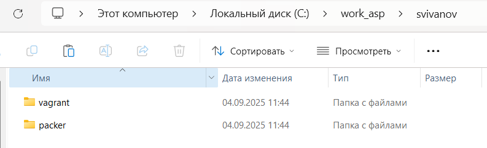{#fig:001 width=70%}

## Образ Rocky

В подкаталоге packer разместим образ Rocky Linux (Rocky-10.0-x86_64-minimal.iso) (рис. 2).

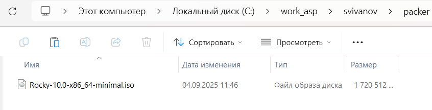{#fig:002 width=70%}

## Размещаем файлы

В этом же каталоге разместим подготовленные заранее для работы с Vagrant файлы: в подкаталоге packer файл vagrant-rocky.pkr.hcl (рис. 3)

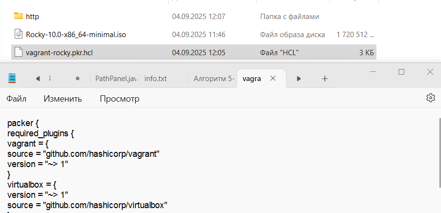{#fig:003 width=70%}

## Размещаем файлы

В подкаталоге packer подкаталог http с файлом ks.cfg (рис. 4)

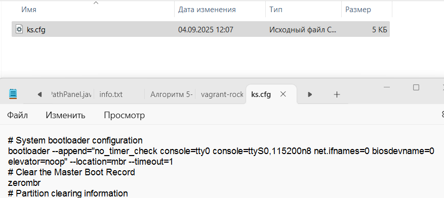{#fig:004 width=70%}

## Размещаем файлы

В подкаталоге vagrant файл Vagrantfile (рис. 5)

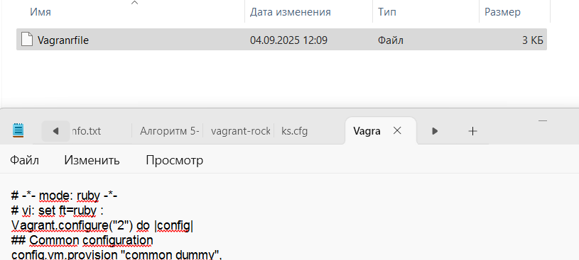{#fig:005 width=70%}

## Размещаем файлы

В подкаталоге vagrant файл Makefile (рис. 6)

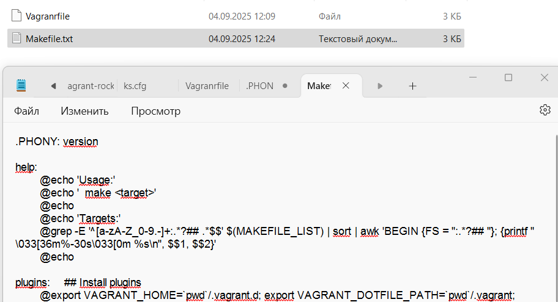{#fig:006 width=70%}

## Создание подкаталогов

В подкаталоге vagrant создадим каталог provision
с подкаталогами default, server и client, в которых будут размещаться скрипты, изменяющие различные настройки. (рис. 7)

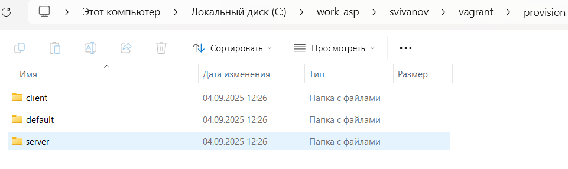{#fig:007 width=70%}

## Скрипт заглушка

В каталогах default, server и client разместим заранее подготовленный скрипт-заглушку 01-dummy.sh (рис. 8)

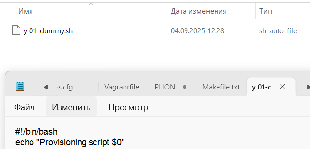{#fig:008 width=70%}

## Скрипт изменения названия

В каталоге default разместим заранее подготовленный скрипт 01-user.sh по изменению названия виртуальной машины. (рис. 9)

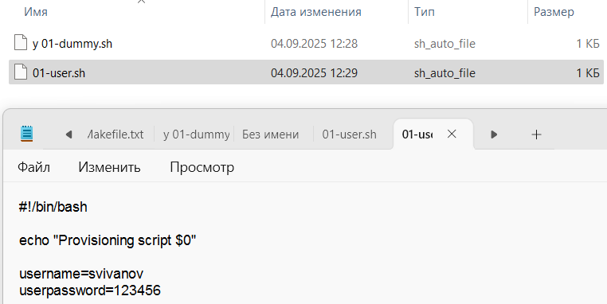{#fig:009 width=70%}

## Скрипт изменения названия

В каталоге default разместим заранее подготовленный скрипт 01-hostname.sh поизменению названия виртуальной машины. (рис. 10)

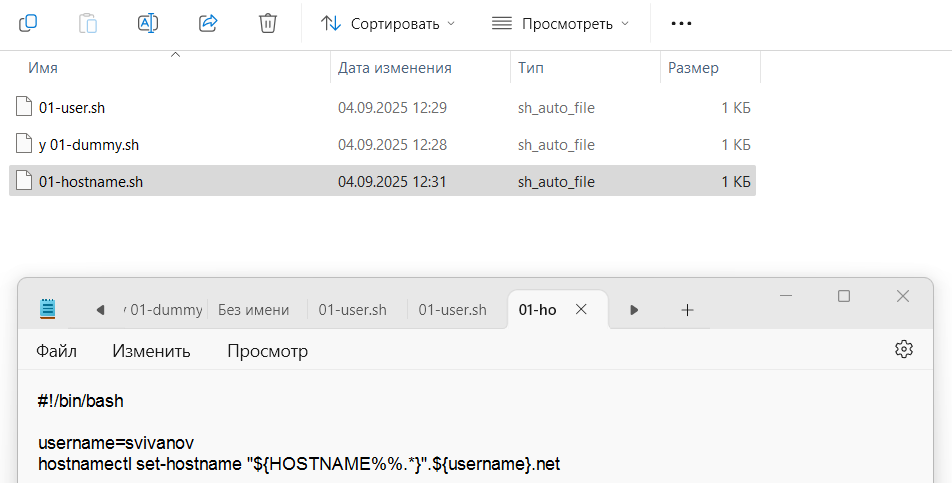{#fig:010 width=70%}

## Скрипт маршрутизации

В каталоге server разместим заранее подготовленный скрипт 02-forward.sh. (обеспечивает корректную маршрутизацию ip-адресов между сервером
и клиентом) (рис. 11)

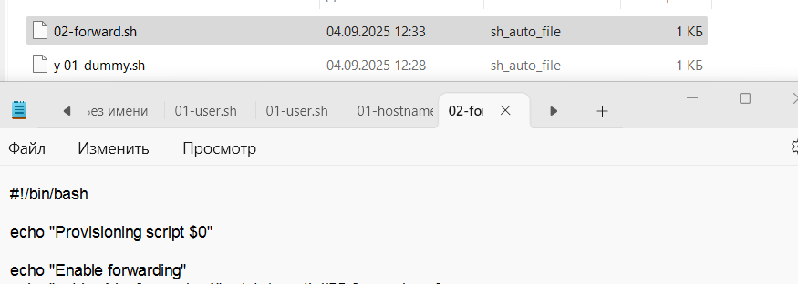{#fig:011 width=70%}

## Скрипт сетевых интерфейсов

В каталоге client разместим заранее подготовленный скрипт 01-routing.sh. (обеспечивает корректную работу сетевых интерфейсов клиента) (рис. 12)

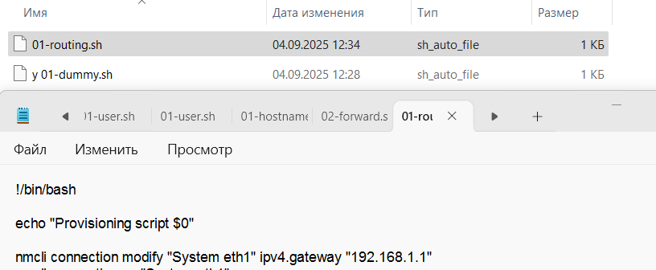{#fig:012 width=70%}

## Создание box-файла

Перейдем в созданный рабочий каталог с проектом. Запускаем формирование box-файла. По окончании процесса в рабочем каталоге сформировался box-файл. (рис. 13, 14)

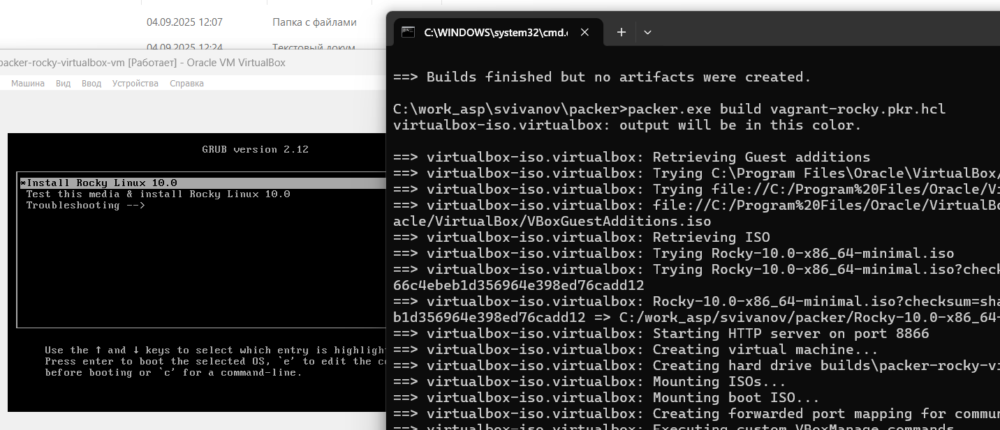{#fig:013 width=70%}

## box-файл

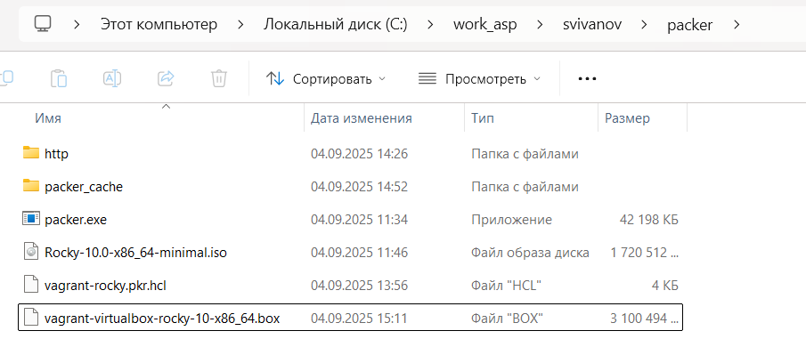{#fig:014 width=70%}

## Регистрация образа

Введем команду для регистрации образа виртуальной машины в vagrant (рис. 15)

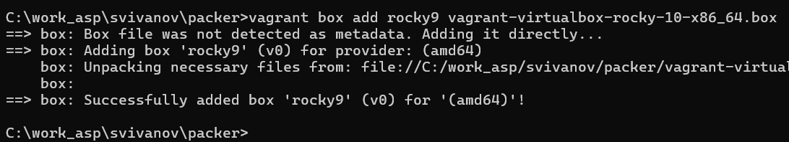{#fig:015 width=70%}

## Запуск Server

Запустим виртуальную машину Server (рис. 16)

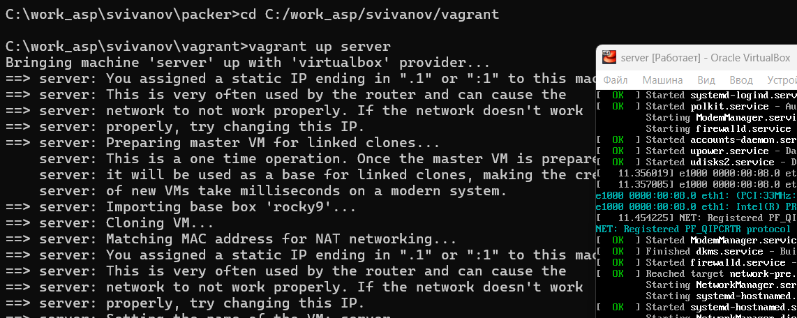{#fig:016 width=70%}

## Запуск Client

Запустим виртуальную машину Client (рис. 17)

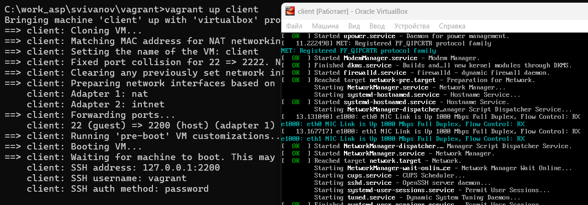{#fig:017 width=70%}

## Подключение из консоли

Подключимся к серверу из консоли и введем пароль vagrant. (рис. 18)

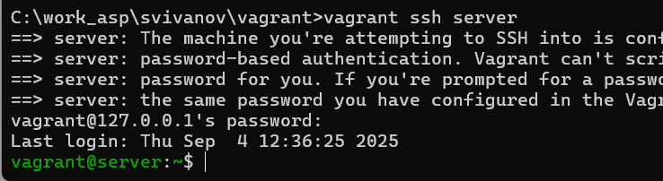{#fig:018 width=70%}

## Пользователь svivanov

Перейдем к пользователю svivanov (рис. 19)

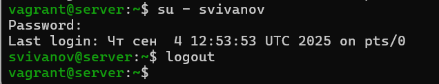{#fig:019 width=70%}

## Пользователь svivanov

Отлогинимся и выполним тоже самое для клиента. (рис. 20)

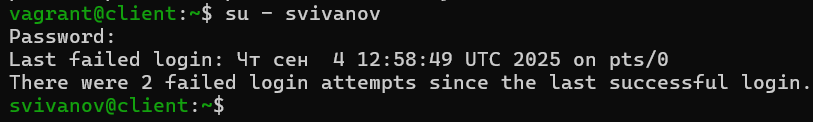{#fig:020 width=70%}

## Выключение машин

Выключим обе виртуальные машины (рис. 21)

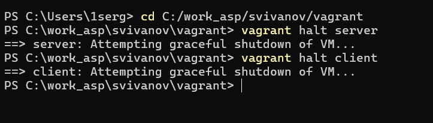{#fig:021 width=70%}

## Фиксация изменений и логин

Зафиксируем внесённые изменения для внутренних настроек виртуальных машин, залогинимся на сервере и клиенте под созданным пользователем. (рис. 22, 23)

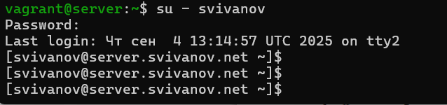{#fig:022 width=70%}

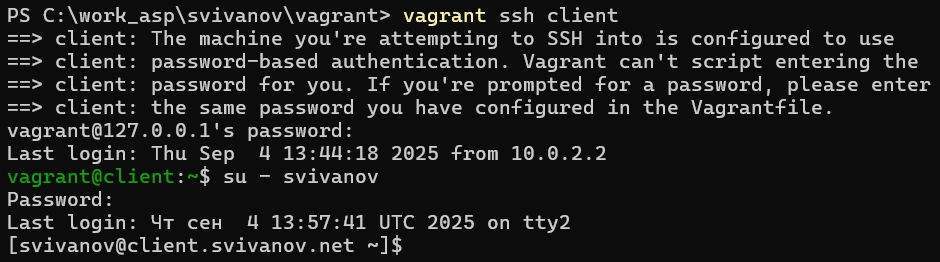{#fig:023 width=70%}

## Фиксация изменений и логин

После выключения виртуальных машин скопировал необходимые для работы с Vagrant файлы и box-файлы виртуальных машин на внешний носитель.

# Вывод

## Вывод 

В рамках лабораторной работы познакомились с интструментом Vagrant и подготовили лабораторный стенд.

 
