---
## Front matter
title: "Отчет по лабораторной работе №1"
subtitle: "Дисциплина: Администрирование сетевых подсистем"
author: "Иванов Сергей Владимирович"

## Generic otions
lang: ru-RU
toc-title: "Содержание"

## Bibliography
bibliography: bib/cite.bib
csl: pandoc/csl/gost-r-7-0-5-2008-numeric.csl

## Pdf output format
toc: true # Table of contents
toc-depth: 2
lof: true # List of figures
fontsize: 12pt
linestretch: 1.5
papersize: a4
documentclass: scrreprt
## I18n polyglossia
polyglossia-lang:
  name: russian
  options:
	- spelling=modern
	- babelshorthands=true
polyglossia-otherlangs:
  name: english
## I18n babel
babel-lang: russian
babel-otherlangs: english
## Fonts
mainfont: PT Serif
romanfont: PT Serif
sansfont: PT Sans
monofont: PT Mono
mainfontoptions: Ligatures=TeX
romanfontoptions: Ligatures=TeX
sansfontoptions: Ligatures=TeX,Scale=MatchLowercase
monofontoptions: Scale=MatchLowercase,Scale=0.9
## Biblatex
biblatex: true
biblio-style: "gost-numeric"
biblatexoptions:
  - parentracker=true
  - backend=biber
  - hyperref=auto
  - language=auto
  - autolang=other*
  - citestyle=gost-numeric
## Pandoc-crossref LaTeX customization
figureTitle: "Рис."
listingTitle: "Листинг"
lofTitle: "Список иллюстраций"
lolTitle: "Листинги"
## Misc options
indent: true
header-includes:
  - \usepackage{indentfirst}
  - \usepackage{float} # keep figures where there are in the text
  - \floatplacement{figure}{H} # keep figures where there are in the text
---

# Цель работы

Целью данной работы является приобретение практических навыков установки Rocky Linux на виртуальную машину с помощью инструмента Vagrant.

# Задание

1. Сформировать box-файл с дистрибутивом Rocky Linux для VirtualBox
2. Запустить виртуальные машины сервера и клиента и убедиться в их работоспособности
3. Внести изменения в настройки загрузки образов виртуальных машин server
и client, добавив пользователя с правами администратора и изменив названия хостов 
4. Скопировать необходимые для работы с Vagrant файлы и box-файлы виртуальных машин на внешний носитель. Используя эти файлы, мы можем попробовать развернуть виртуальные машины на другом компьютере. 

# Выполнение лабораторной работы

## Подготовка рабочего каталога

Я выполнял работу в ОС Windows. Предварительно были установлены последние версии Packer, Vagrant и был обновлен VirtualBox. 

Перед началом работы с Vagrant создаю каталог для проекта. C:\\work\\user_name\\packer и C:\\work\\user_name\\vagrant,
где user_name — имя пользователя. (рис. 1).

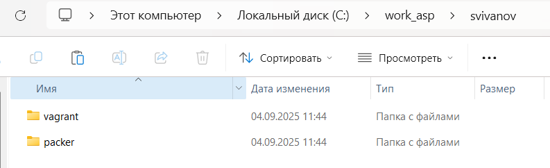{#fig:001 width=70%}

В созданном рабочем каталоге в подкаталоге packer разместим образ варианта операционной системы Rocky Linux (Rocky-10.0-x86_64-minimal.iso) (рис. 2).

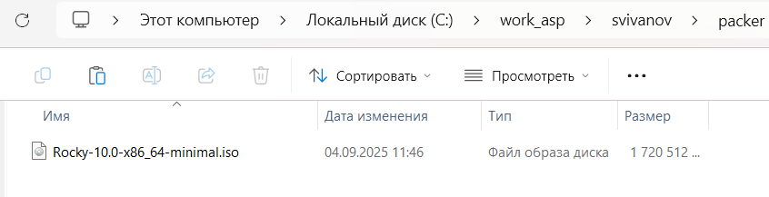{#fig:002 width=70%}

В этом же рабочем каталоге разместим подготовленные заранее для работы с Vagrant файлы: в подкаталоге packer файл vagrant-rocky.pkr.hcl (рис. 3)

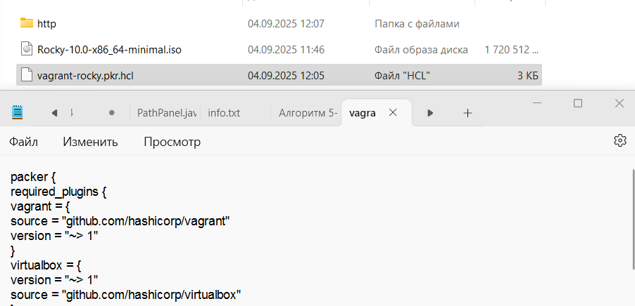{#fig:003 width=70%}

В подкаталоге packer подкаталог http с файлом ks.cfg (рис. 4)

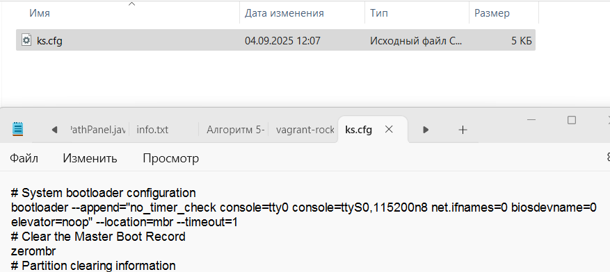{#fig:004 width=70%}

В подкаталоге vagrant файл Vagrantfile (рис. 5)

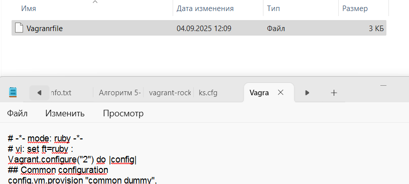{#fig:005 width=70%}

В подкаталоге vagrant файл Makefile (рис. 6)

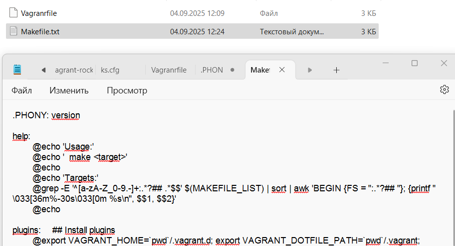{#fig:006 width=70%}

В этом же рабочем каталоге в подкаталоге vagrant создадим каталог provision
с подкаталогами default, server и client, в которых будут размещаться скрипты,
изменяющие настройки внутреннего окружения базового образа виртуальной машины, сервера или клиента соответственно. (рис. 7)

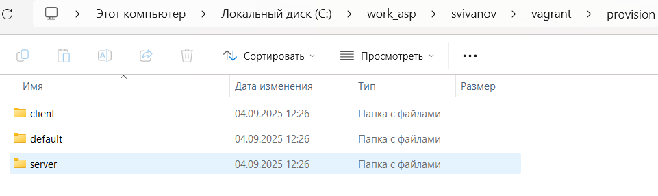{#fig:007 width=70%}

В каталогах default, server и client разместим заранее подготовленный скрипт-заглушку 01-dummy.sh (рис. 8)

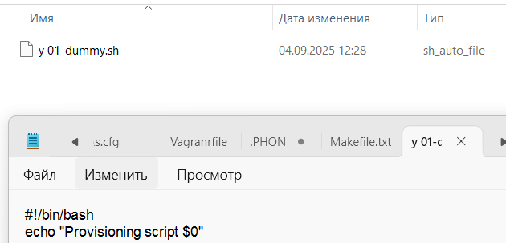{#fig:008 width=70%}

В каталоге default разместим заранее подготовленный скрипт 01-user.sh по изменению названия виртуальной машины. (рис. 9)

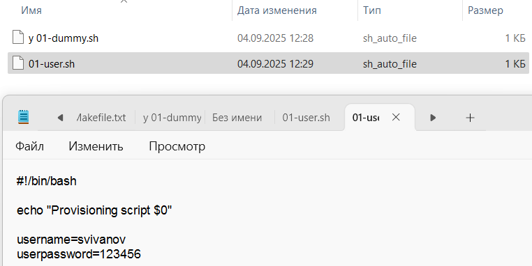{#fig:009 width=70%}

В каталоге default разместим заранее подготовленный скрипт 01-hostname.sh поизменению названия виртуальной машины. (рис. 10)

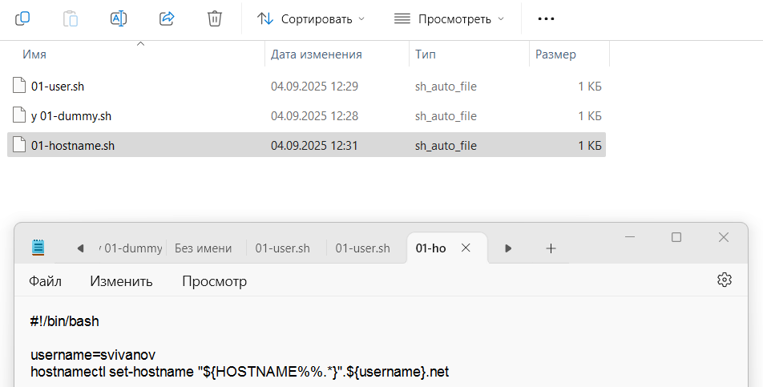{#fig:010 width=70%}

В каталоге server разместим заранее подготовленный скрипт 02-forward.sh. Этот скрипт обеспечивает корректную маршрутизацию ip-адресов между сервером
и клиентом. (рис. 11)

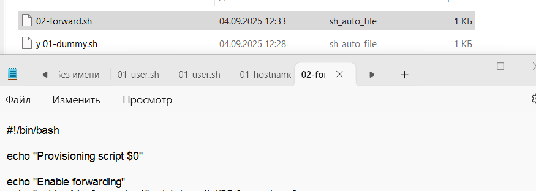{#fig:011 width=70%}

В каталоге client разместим заранее подготовленный скрипт 01-routing.sh. Этот скрипт обеспечивает корректную работу сетевых интерфейсов клиента. (рис. 12)

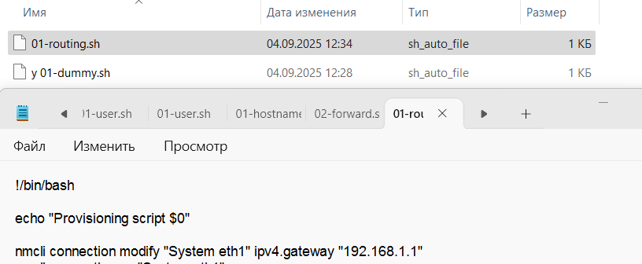{#fig:012 width=70%}

## Развёртывание лабораторного стенда на ОС Windows

Перейдем в созданный рабочий каталог с проектом. В этом же каталоге размещён файл packer.exe. В командной строке введём 
```packer.exe init vagrant-rocky.pkr.hcl```
```packer.exe build vagrant-rocky.pkr.hcl```
для начала автоматической установки образа операционной системы Rocky Linux в VirtualBox и последующего формирования box-файла с дистрибутивом Rocky Linux
для VirtualBox. По окончании процесса в рабочем каталоге сформировался box-файл с названием vagrant-virtualbox-rocky-9-x86_64.box. (рис. 13, 14)

{#fig:013 width=70%}

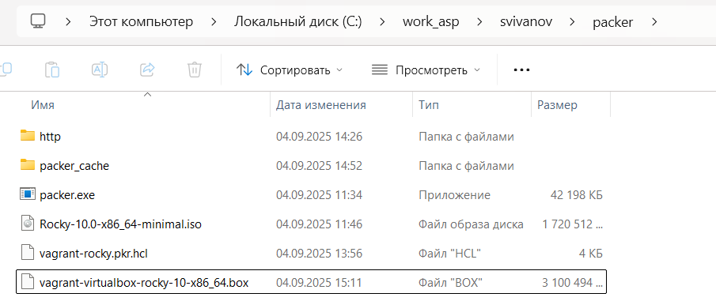{#fig:014 width=70%}

Для регистрации образа виртуальной машины в vagrant в командной строке введем 
```vagrant box add rocky9 vagrant-virtualbox-rocky-9-x86_64.box``` (рис. 15)

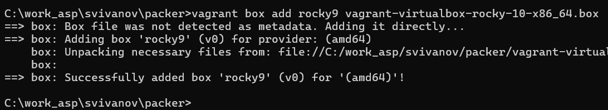{#fig:015 width=70%}

Запустим виртуальную машину Server, введя
```make server-up``` (рис. 16)

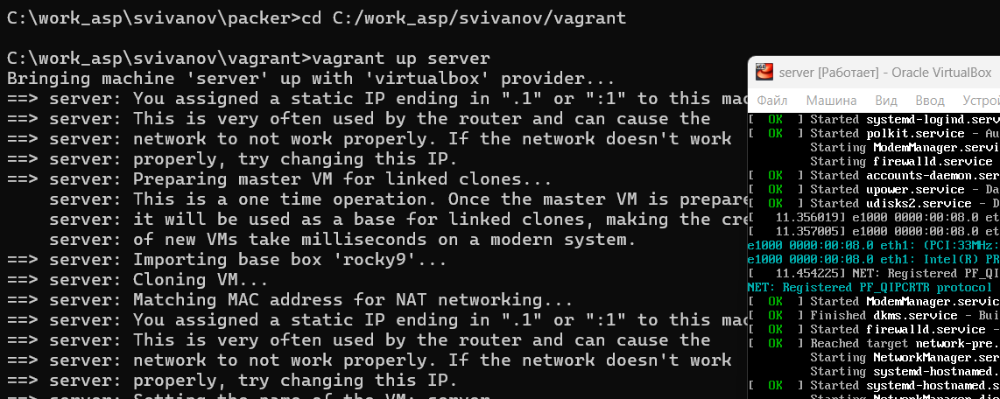{#fig:016 width=70%}

Запустим виртуальную машину Client, введя
```make client-up``` (рис. 17)

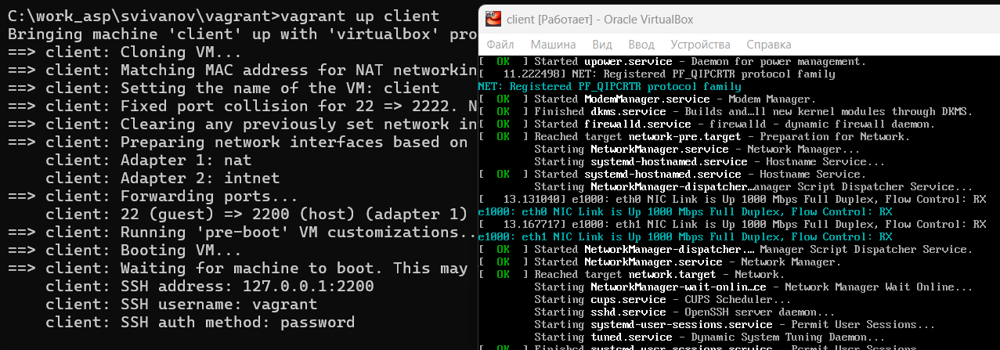{#fig:017 width=70%}

Подключимся к серверу из консоли:
```vagrant ssh server```
Введем пароль vagrant. (рис. 18)

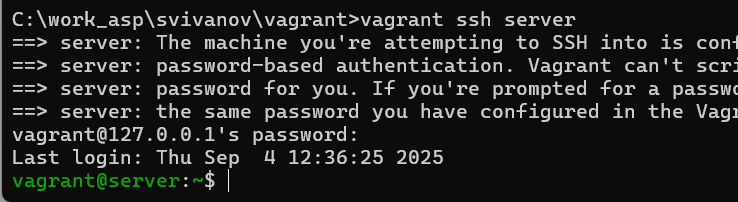{#fig:018 width=70%}

Перейдем к пользователю svivanov: (рис. 19)
```su - user```

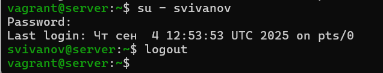{#fig:019 width=70%}

Отлогинимся и выполним тоже самое для клиента. (рис. 20)

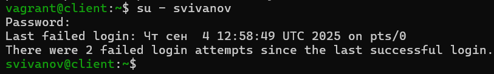{#fig:020 width=70%}

Выключим обе виртуальные машины:
```vagrant halt server```
```vagrant halt client``` (рис. 21)

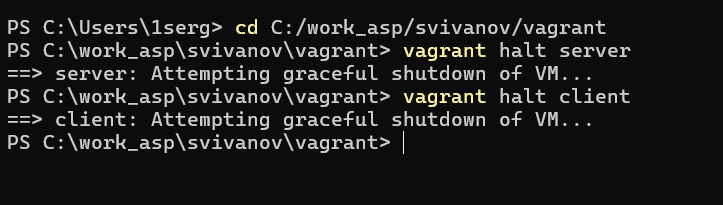{#fig:021 width=70%}

## Внесение изменений в настройки внутреннего окружения виртуальной машины

Зафиксируем внесённые изменения для внутренних настроек виртуальных машин, введя в терминале:
```vagrant up server --provision```
```vagrant up client --provision```
Залогинимся на сервере и клиенте под созданным пользователем. Убедимся, что
в терминале приглашение отображается в виде user@server.user.net на сервере
и в виде user@client.user.net на клиенте. (рис. 22, 23)

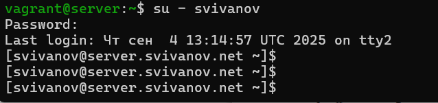{#fig:022 width=70%}

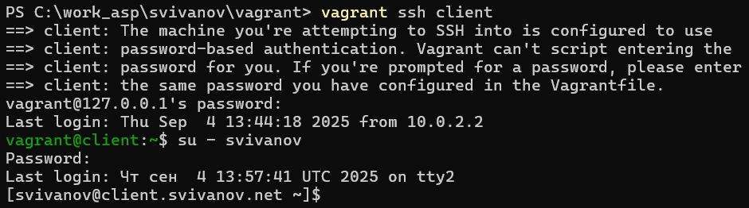{#fig:023 width=70%}

После выключения виртуальных машин скопировал необходимые для работы с Vagrant файлы и box-файлы виртуальных машин на внешний носитель.

# Ответы на контрольные вопросы

**1. Для чего предназначен Vagrant?**

Это инструмент для создания и управления средами виртуальных машин в одном рабочем процессе.

**2. Что такое box-файл? В чём назначение Vagrantfile?**

box-файл (или Vagrant Box) — сохранённый образ виртуальной машины с развёрнутой в ней операционной системой; по сути, box-файл используется как основа для клонирования виртуальных машин с теми или иными настройками;

Vagrantfile — конфигурационный файл, написанный на языке Ruby, в котором указаны настройки запуска виртуальной машины.

**3. Приведите описание и примеры вызова основных команд Vagrant.**

- vagrant help — вызов справки по командам Vagrant;
  
- vagrant box list — список подключённых к Vagrant box-файлов;
  
- vagrant box add — подключение box-файла к Vagrant;
  
- vagrant destroy— отключение box-файла отVagrant и удаление его из виртуального окружения;
  
- vagrant init — создание «шаблонного» конфигурационного файла Vagrantfile для его последующего изменения;
  
- vagrant up — запуск виртуальной машины с использованием инструкций по запуску из конфигурационного файла Vagrantfile;
  
- vagrant reload — перезагрузка виртуальной машины;
  
- vagrant halt — остановка и выключение виртуальной машины;
  
- vagrant provision — настройка внутреннего окружения имеющейся виртуальной машины (например, добавление новых инструкций (скриптов) в ранее созданную виртуальную машину);
  
- vagrant ssh — подключение к виртуальной машине через ssh.
  
**4. Дайте построчные пояснения содержания файлов vagrant-rocky.pkr.hcl, ks.cfg, Vagrantfile, Makefile.**

- vagrant-rocky.pkr.hcl - блок packer устанавливает, что для работы необходимы версии vagrant и VirtualBox не ниже 1 (version = "∼> 1").
Затем идут блоки variable, где задаются переменные, которые будут использоваться в работе скрипта, например имя ВМ, версия, размер дискового пространства, архитектура процессора и т. д. Блок source задает конфигурацию сборщики с возможностью переиспользования. В нашем случае задаются параметры сборки виртуальной машины в VirtualBox, какой образ использовать, сколько выделить оперативной памяти, ядер процессора. Последний блок build описывает сам процесс сборки. Здесь указаны скрипты, которые будут запущены: настройка каталогов, установка необходимых для работы утилит.

- config.vm.network "private_network", ip: "xxx.xxx.xxx.xxx" — адрес из
внутренней сети;

- config.vm.network "public_network", ip: "xxx.xxx.xxx.xxx" — публичный
адрес, по которому виртуальная машина будет доступна;

- config.vm.network "private_network", type: "dhcp" — адрес, назначаемый
по протоколу DHCP.

Строка config.vm.define "VM_NAME" задаёт название виртуальной машины, по которому можно обращаться к ней из Vagrant и VirtualBox.
В конце идёт конструкция, определяющая параметры провайдера, а именно запуск виртуальной машины без графического интерфейса и с выделением 1 ГБ памяти.

# Выводы

В рамках лабораторной работы познакомились с интструментом Vagrant и подготовили лабораторный стенд.
