---
## Front matter
lang: ru-RU
title: Лабораторная работа №2
subtitle: Администрирование сетевых подсистем
author:
  - Иванов Сергей Владимирович, НПИбд-01-23
institute:
  - Российский университет дружбы народов, Москва, Россия
date: 6 сентября 2025

## i18n babel
babel-lang: russian
babel-otherlangs: english

## Formatting pdf
toc: false
slide_level: 2
aspectratio: 169
section-titles: true
theme: metropolis
header-includes:
 - \metroset{progressbar=frametitle,sectionpage=progressbar,numbering=fraction}
 - '\makeatletter'
 - '\beamer@ignorenonframefalse'
 - '\makeatother'

 ## Fonts
mainfont: PT Serif
romanfont: PT Serif
sansfont: PT Sans
monofont: PT Mono
mainfontoptions: Ligatures=TeX
romanfontoptions: Ligatures=TeX
sansfontoptions: Ligatures=TeX,Scale=MatchLowercase
monofontoptions: Scale=MatchLowercase,Scale=0.9
---

## Цель работы

Целью данной работы является приобретение практических навыков по установке и конфигурированию DNSсервера, усвоение принципов работы
системы доменных имён.

## Задание

1. Установите на виртуальной машине server DNS-сервер bind и bind-utils.
2. Сконфигурируйте на виртуальной машине server кэширующий DNS-сервер.
3. Сконфигурируйте на виртуальной машине server первичный DNS-сервер.
4. При помощи утилит dig и host проанализируйте работу DNS-сервера.
5. Напишите скрипт для Vagrant, фиксирующий действия по установке и конфигурированию DNS-сервера во внутреннем окружении виртуальной машины server.
Соответствующим образом внесите изменения в Vagrantfile.

# Выполнение работы

## Установка DNS-сервера

Перейдем в рабочий каталог с проектом и запустим виртуальную машину server (рис. 1).

{#fig:001 width=70%}

## Установка DNS-сервера

На виртуальной машине server войдем под своим пользователем и откроем терминал. Перейдем в режим суперпользователя и установим bind и bind-utils (рис. 2).

{#fig:002 width=70%}

## Установка DNS-сервера

С помощью утилиты dig сделаем запрос, например, к DNSадресу www.yandex.ru:
dig www.yandex.ru.  (рис. 3)

{#fig:003 width=70%}

## Конфигурирование кэширующего DNS-сервера

Посмотрим содержание файлов */etc/resolv.conf*, */etc/named.conf*, */var/named/named.ca*, */var/named/named.localhost* и */var/named/named.loopback* (рис. 4, 5, 6, 7, 8)

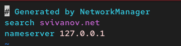{#fig:004 width=70%}

## Конфигурирование кэширующего DNS-сервера

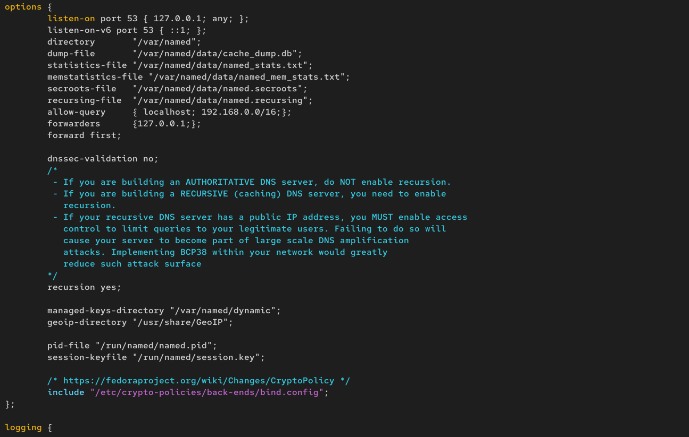{#fig:005 width=70%}

## Конфигурирование кэширующего DNS-сервера

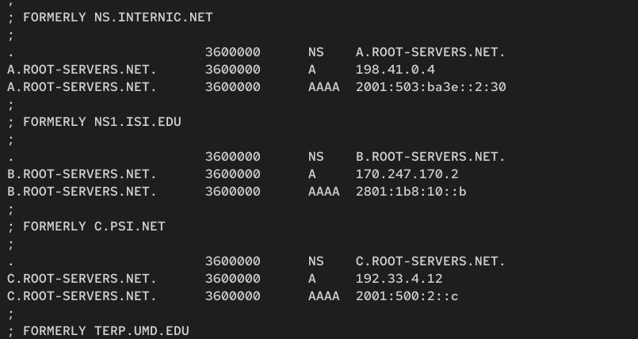{#fig:006 width=70%}

## Конфигурирование кэширующего DNS-сервера

{#fig:007 width=70%}

## Конфигурирование кэширующего DNS-сервера

{#fig:008 width=70%}

## Конфигурирование кэширующего DNS-сервера

Запускаем DNS-сервер. Включим запуск DNS-сервера в автозапуск при загрузке системы (рис. 9)

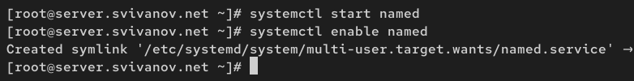{#fig:009 width=70%}

## Конфигурирование кэширующего DNS-сервера

Теперь выполним команду dig @127.0.0.1 www.yandex.ru. (рис. 10)

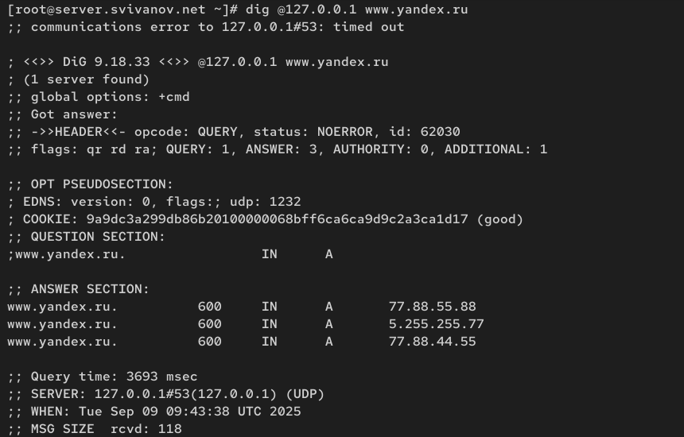{#fig:010 width=70%}

## Конфигурирование кэширующего DNS-сервера

Сделаем DNS-сервер сервером по умолчанию для хоста server и внутренней виртуальной сети. Для этого изменим настройки сетевого соединения eth0
в NetworkManager, переключив его на работу с внутренней сетью и указав для него
в качестве DNS-сервера по умолчанию адрес 127.0.0.1 (рис. 11)

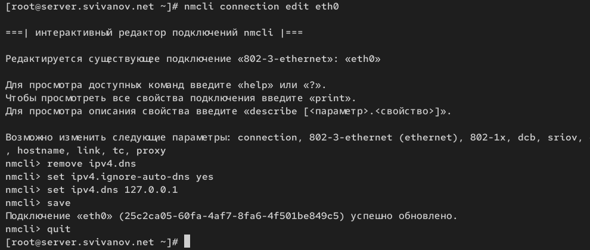{#fig:011 width=70%}

## Конфигурирование кэширующего DNS-сервера

Перезапустим NetworkManager. Проверим наличие изменений в файле /etc/resolv.conf. (рис. 12)

{#fig:012 width=70%}

## Конфигурирование кэширующего DNS-сервера

Настроим направление DNS-запросов от всех узлов внутренней сети,
включая запросы от узла server, через узел server. Для этого внесем изменения
в файл /etc/named.conf (рис. 13)

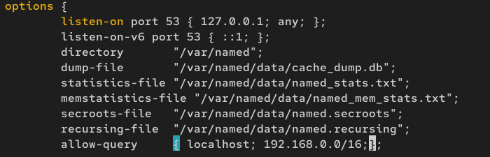{#fig:013 width=70%}

## Конфигурирование кэширующего DNS-сервера

Внесем изменения в настройки межсетевого экрана узла server, разрешив работу
с DNS: (рис. 14)

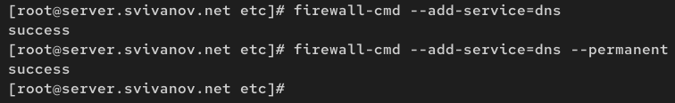{#fig:014 width=70%}

## Конфигурирование кэширующего DNS-сервера

Убедимся, что DNS-запросы идут через узел server, который прослушивает порт 53 (рис. 15)

{#fig:015 width=70%}

## Конфигурирование кэширующего DNS-сервера

Добавим перенаправление DNS-запросов
на конкретный вышестоящий DNS-сервер. Для этого в конфигурационный файл
named.conf в секцию options добавим некоторый код.

Кроме того, возможно вышестоящий DNS-сервер может не поддерживать технологию DNSSEC, тогда следует в конфигурационном файле named.conf укажем следующие
настройки: dnssec-enable no; dnssec-validation no;

## Конфигурирование кэширующего DNS-сервера

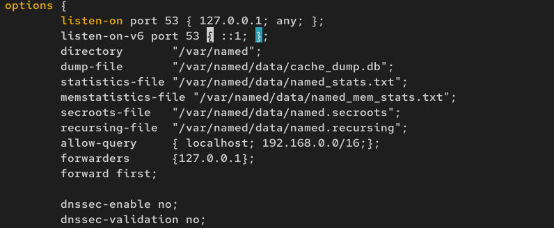{#fig:016 width=70%}

## Конфигурирование первичного DNS-сервера

Скопируем шаблон описания DNS-зон named.rfc1912.zones из каталога /etc в каталог /etc/named и переименуем его в svivanov.net (рис. 17)

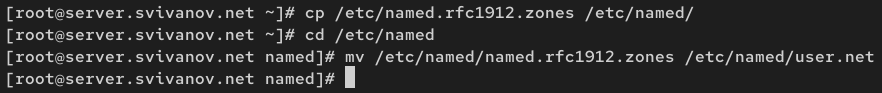{#fig:017 width=70%}

## Конфигурирование первичного DNS-сервера

Включим файл описания зоны /etc/named/svivanov.net в конфигурационном файле
DNS /etc/named.conf, добавив: include "/etc/named/svivanov.net"; (рис. 18)

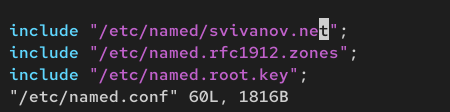{#fig:018 width=70%}

## Конфигурирование первичного DNS-сервера

Откроем файл /etc/named/svivanov.net на редактирование и пропишем свои прямую и обратные зоны. Остальные записи в файле /etc/named/user.net удалим. (рис. 19)

{#fig:019 width=70%}

## Конфигурирование первичного DNS-сервера

В каталоге /var/named создадим подкаталоги master/fz и master/rz, в которых будут
располагаться файлы прямой и обратной зоны соответственно: (рис. 20)

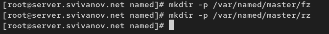{#fig:020 width=70%}

## Конфигурирование первичного DNS-сервера

Скопируем шаблон прямой DNS-зоны named.localhost из каталога
/var/named в каталог /var/named/master/fz и переименуем его в svivanov.net: (рис. 21)

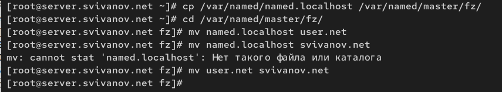{#fig:021 width=70%}

## Конфигурирование первичного DNS-сервера

Изменим файл /var/named/master/fz/svivanov.net, указав необходимые DNS-записи
для прямой зоны. (рис. 22)

{#fig:022 width=70%}

## Конфигурирование первичного DNS-сервера

Скопируем шаблон обратной DNS-зоны named.loopback из каталога
/var/named в каталог /var/named/master/rz и переименуем его в 192.168.1 (рис. 23)

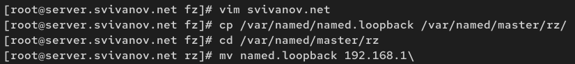{#fig:023 width=70%}

## Конфигурирование первичного DNS-сервера

Изменим файл /var/named/master/rz/192.168.1, указав необходимые DNS-записи
для обратной зоны. (рис. 24)

{#fig:024 width=70%}

## Конфигурирование первичного DNS-сервера

Далее исправим права доступа к файлам в каталогах /etc/named
и /var/named, чтобы демон named мог с ними работать (рис. 25)

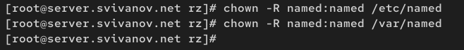{#fig:025 width=70%}

## Конфигурирование первичного DNS-сервера

Далее после изменения доступа к конфигурационным файлам named восстановили их метки в SELinux и проверим их. Дадим named разрешение на запись в файлы DNS-зоны: (рис. 26)

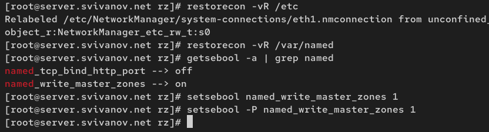{#fig:026 width=70%}

## Конфигурирование первичного DNS-сервера

В дополнительном терминале запустим в расширенный лог системных сообщений, а в первом терминале перезапустим DNS-сервер (рис. 27)

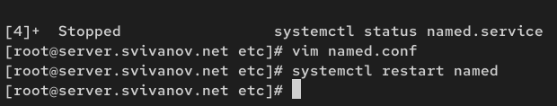{#fig:027 width=70%}

## Анализ работы DNS-сервера

При помощи утилиты dig получим описание DNS-зоны с сервера ns.svivanov.net: dig ns.user.net (рис. 28)

{#fig:028 width=70%}

## Анализ работы DNS-сервера

При помощи утилиты host проанализируем корректность работы DNS-сервера. Как видим, сервер работает корректно. (рис. 29)

{#fig:029 width=70%}

## Внесение изменений в настройки внутреннего окружения виртуальной машины

На виртуальной машине server перейдем в каталог для внесения изменений
в настройки внутреннего окружения и создадим в нём
каталог dns, в который поместим конфигурационные
файлы DNS: (рис. 30)

{#fig:030 width=70%}

## Внесение изменений в настройки внутреннего окружения виртуальной машины

В каталоге /vagrant/provision/server создадим исполняемый файл dns.sh. Пропишем в нём скрипт (рис. 31)

{#fig:031 width=70%}

## Внесение изменений в настройки внутреннего окружения виртуальной машины

Для отработки созданного скрипта во время загрузки виртуальной машины server
в конфигурационном файле Vagrantfile добавим в разделе конфигурации для сервера: (рис. 32)

{#fig:032 width=70%}

# Вывод

## Вывод 

В рамках лабораторной работы познакомились с интструментом Vagrant и подготовили лабораторный стенд.

 
