---
## Front matter
title: "Отчет по лабораторной работе №2"
subtitle: "Дисциплина: Администрирование сетевых подсистем"
author: "Иванов Сергей Владимирович"

## Generic otions
lang: ru-RU
toc-title: "Содержание"

## Bibliography
bibliography: bib/cite.bib
csl: pandoc/csl/gost-r-7-0-5-2008-numeric.csl

## Pdf output format
toc: true # Table of contents
toc-depth: 2
lof: true # List of figures
fontsize: 12pt
linestretch: 1.5
papersize: a4
documentclass: scrreprt
## I18n polyglossia
polyglossia-lang:
  name: russian
  options:
	- spelling=modern
	- babelshorthands=true
polyglossia-otherlangs:
  name: english
## I18n babel
babel-lang: russian
babel-otherlangs: english
## Fonts
mainfont: PT Serif
romanfont: PT Serif
sansfont: PT Sans
monofont: PT Mono
mainfontoptions: Ligatures=TeX
romanfontoptions: Ligatures=TeX
sansfontoptions: Ligatures=TeX,Scale=MatchLowercase
monofontoptions: Scale=MatchLowercase,Scale=0.9
## Biblatex
biblatex: true
biblio-style: "gost-numeric"
biblatexoptions:
  - parentracker=true
  - backend=biber
  - hyperref=auto
  - language=auto
  - autolang=other*
  - citestyle=gost-numeric
## Pandoc-crossref LaTeX customization
figureTitle: "Рис."
listingTitle: "Листинг"
lofTitle: "Список иллюстраций"
lolTitle: "Листинги"
## Misc options
indent: true
header-includes:
  - \usepackage{indentfirst}
  - \usepackage{float} # keep figures where there are in the text
  - \floatplacement{figure}{H} # keep figures where there are in the text
---

# Цель работы

Целью данной работы является приобретение практических навыков по установке и конфигурированию DNSсервера, усвоение принципов работы
системы доменных имён.

# Задание

1. Установите на виртуальной машине server DNS-сервер bind и bind-utils.
2. Сконфигурируйте на виртуальной машине server кэширующий DNS-сервер.
3. Сконфигурируйте на виртуальной машине server первичный DNS-сервер.
4. При помощи утилит dig и host проанализируйте работу DNS-сервера.
5. Напишите скрипт для Vagrant, фиксирующий действия по установке и конфигурированию DNS-сервера во внутреннем окружении виртуальной машины server.
Соответствующим образом внесите изменения в Vagrantfile.

# Выполнение лабораторной работы

## Установка DNS-сервера

Загрузим операционную систему и перейдем в рабочий каталог с проектом: cd /var/tmp/svivanov/vagrant
Запустим виртуальную машину server: vagrant up server (рис. 1).

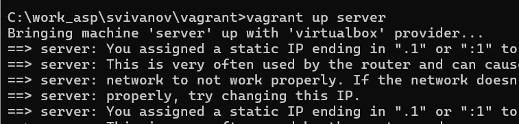{#fig:001 width=70%}

На виртуальной машине server войдем под созданным в предыдущей работе пользователем и откроем терминал. Перейдем в режим суперпользователя:
sudo -i. Установим bind и bind-utils: dnf -y install bind bind-utils (рис. 2).

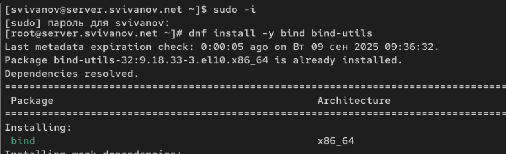{#fig:002 width=70%}

В качестве упражнения с помощью утилиты dig сделайте запрос, например, к DNSадресу www.yandex.ru:
dig www.yandex.ru.  (рис. 3)

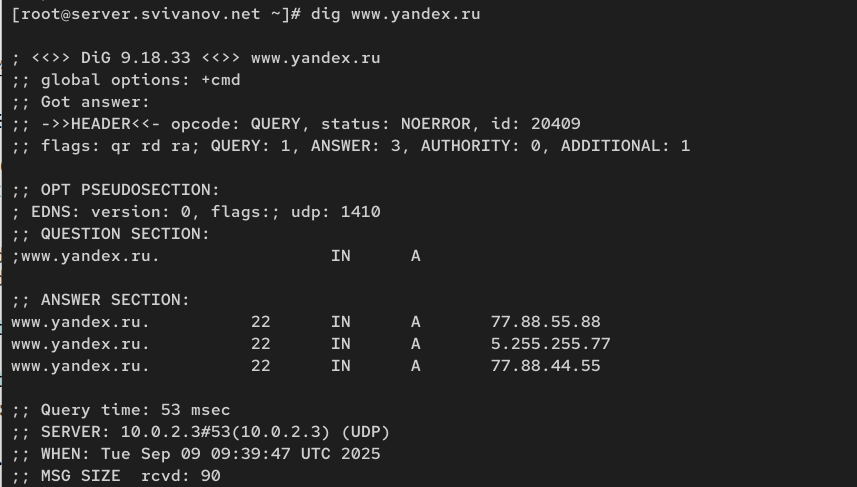{#fig:003 width=70%}

Анализ выведенной информации: 

dig - Это инструмент для запроса DNS-серверов. В данном случае она запросила у DNS-сервера IP-адреса,
связанные с доменным именем www.yandex.ru.

1. Программа отправила запрос на www.yandex.ru

2. Результат: успешный ответ с тремя IP-адресами для www.yandex.ru:

• 77.88.55.88

• 5.255.255.77

• 77.88.44.55

3. Время выполнения составило 53мс.

## Конфигурирование кэширующего DNS-сервера

### Конфигурирование кэширующего DNS-сервера при отсутствии фильтрации DNS-запросов маршрутизаторами

Посмотрим содержание файлов */etc/resolv.conf*, */etc/named.conf*, */var/named/named.ca*, */var/named/named.localhost* и */var/named/named.loopback* (рис. 4, 5, 6, 7, 8)

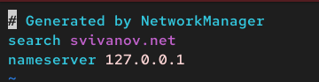{#fig:004 width=70%}

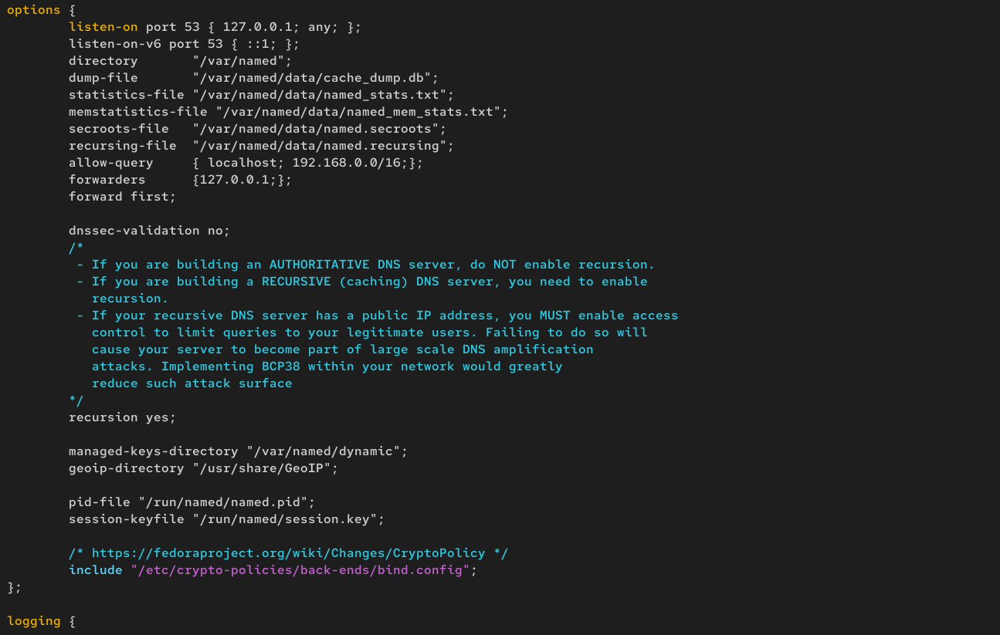{#fig:005 width=70%}

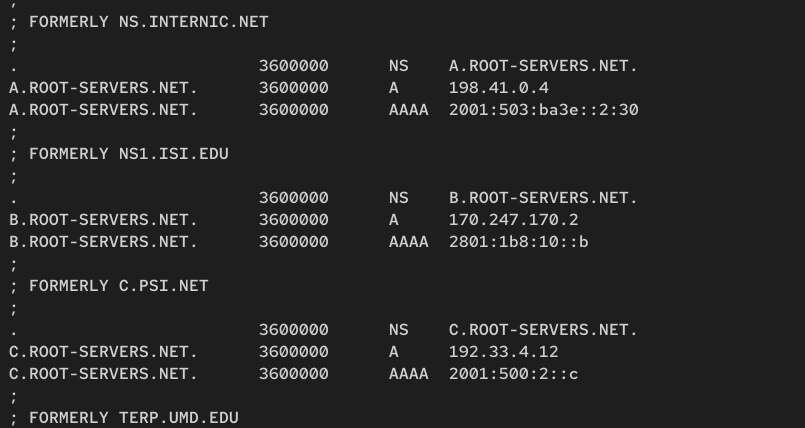{#fig:006 width=70%}

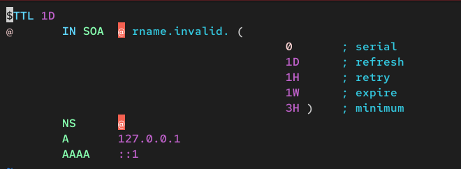{#fig:007 width=70%}

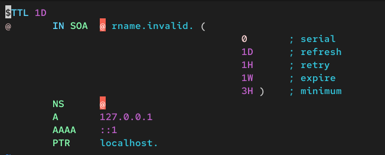{#fig:008 width=70%}

Анализ файла */etc/resolv.conf* (уже отредатирован): 

- Конфигурация DNS-клиента

- Указан DNS-сервер: 127.0.0.1

- Система использует публичные DNS-серверы

Анализ файла */etc/named.conf*:

- Основной конфигурационный файл BIND (DNS-сервер)

- Сервер настроен только для localhost (127.0.0.1)

- DNS-сервер работает только для локальных запросов

Анализ файла */var/named/named.ca*:

- Корневые DNS-серверы интернета

- Список root-серверов (A.ROOT-SERVERS.NET и т.д.)

- Кэш корневых серверов для работы DNS

Анализ файла */var/named/named.localhost*:

- Зона localhost для прямых запросов

- Настройки зоны для localhost (127.0.0.1)

- Базовая конфигурация для локальной зоны

Анализ файла */var/named/named.loopback*:

- Зона обратных запросов для localhost

- Обратная зона для 127.0.0.1

- Настройки reverse DNS для локальной сети

Запускаем DNS-сервер: systemctl start named. Включим запуск DNS-сервера в автозапуск при загрузке системы:
systemctl enable named (рис. 9)

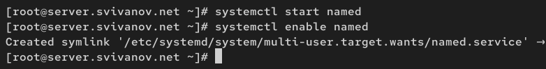{#fig:009 width=70%}

Теперь выполним команду dig @127.0.0.1 www.yandex.ru. При выполнении команды dig www.yandex.ru 1.1.1.1 (публичный DNS
Cloudflare) - использовался автоматически, а при выполнении команды
dig @127.0.0.1 www.yandex.ru 127.0.0.1 (локальный DNS-сервер) - указан
явно. (рис. 10)

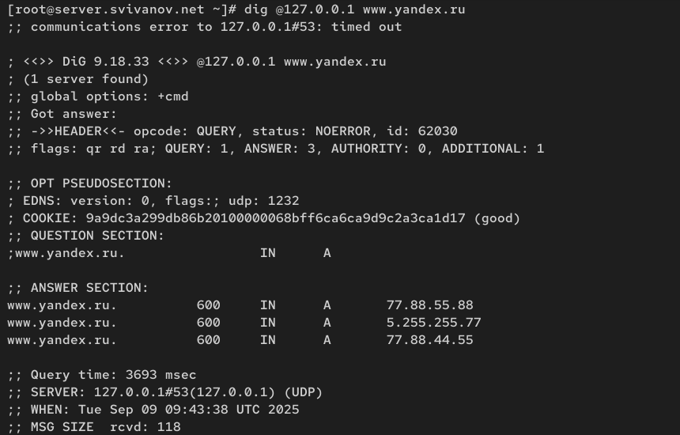{#fig:010 width=70%}

Сделаем DNS-сервер сервером по умолчанию для хоста server и внутренней виртуальной сети. Для этого требуется изменить настройки сетевого соединения eth0
в NetworkManager, переключив его на работу с внутренней сетью и указав для него
в качестве DNS-сервера по умолчанию адрес 127.0.0.1:

nmcli connection edit eth0

remove ipv4.dns

set ipv4.ignore-auto-dns yes

set ipv4.dns 127.0.0.1

save

quit (рис. 11)

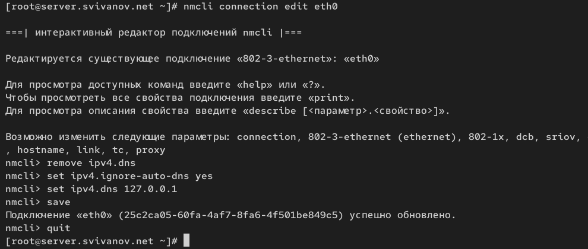{#fig:011 width=70%}

Перезапустим NetworkManager: systemctl restart NetworkManager. Проверим наличие изменений в файле /etc/resolv.conf. (рис. 12)

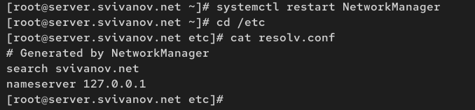{#fig:012 width=70%}

Настроим направление DNS-запросов от всех узлов внутренней сети,
включая запросы от узла server, через узел server. Для этого внесем изменения
в файл /etc/named.conf, заменив строку

listen-on port 53 { 127.0.0.1; };

на

listen-on port 53 { 127.0.0.1; any; };

и строку

allow-query { localhost; };

на

allow-query { localhost; 192.168.0.0/16; }; (рис. 13)

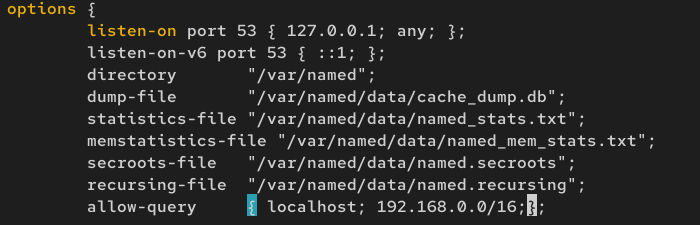{#fig:013 width=70%}

Внесем изменения в настройки межсетевого экрана узла server, разрешив работу
с DNS: (рис. 14)

firewall-cmd --add-service=dns

firewall-cmd --add-service=dns --permanent

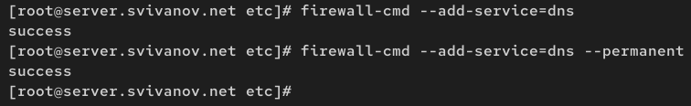{#fig:014 width=70%}

Убедимся, что DNS-запросы идут через узел server, который прослушивает порт 53. Для этого используем команду lsof:
lsof | grep UDP (рис. 15)

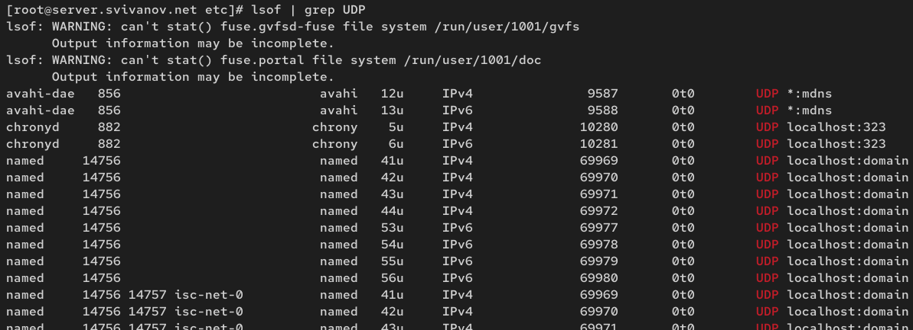{#fig:015 width=70%}

### Конфигурирование кэширующего DNS-сервера при наличии фильтрации DNS-запросов маршрутизаторами

В случае возникновения в сети ситуации, когда DNS-запросы от сервера фильтруются сетевым оборудованием, следует добавить перенаправление DNS-запросов
на конкретный вышестоящий DNS-сервер. Для этого в конфигурационный файл
named.conf в секцию options следует добавить:

forwarders { список DNS-серверов };

forward first; (рис. 16)

Кроме того, возможно вышестоящий DNS-сервер может не поддерживать технологию DNSSEC, тогда следует в конфигурационном файле named.conf укажем следующие
настройки:

dnssec-enable no;

dnssec-validation no;

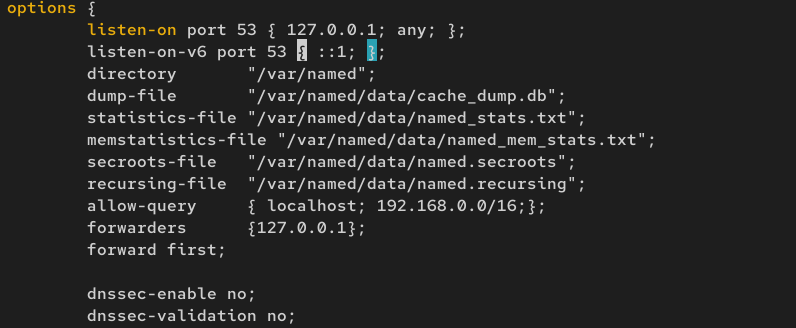{#fig:016 width=70%}

Скопируем шаблон описания DNS-зон named.rfc1912.zones из каталога /etc в каталог /etc/named и переименуем его в svivanov.net:

cp /etc/named.rfc1912.zones /etc/named/

cd /etc/named

mv /etc/named/named.rfc1912.zones /etc/named/svivanov.net (рис. 17)

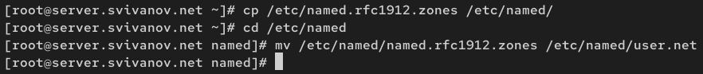{#fig:017 width=70%}

Включим файл описания зоны /etc/named/svivanov.net в конфигурационном файле
DNS /etc/named.conf, добавив в нём в конце строку: include "/etc/named/svivanov.net"; (рис. 18)

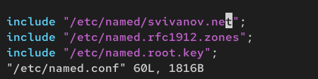{#fig:018 width=70%}

Откроем файл /etc/named/svivanov.net на редактирование и вместо зоны

zone "localhost.localdomain" IN {

type master;

file "named.localhost";

allow-update { none; };

};

пропишем свою прямую зону:

zone "user.net" IN {

type master;

file "master/fz/user.net";

allow-update { none; };

};

Далее, вместо зоны

zone "1.0.0.127.in-addr.arpa" IN {

type master;

file "named.loopback";

allow-update { none; };

};

пропишем свою обратную зону:

zone "1.168.192.in-addr.arpa" IN {

type master;

file "master/rz/192.168.1";

allow-update { none; };

}; 

Остальные записи в файле /etc/named/user.net удалим. (рис. 19)

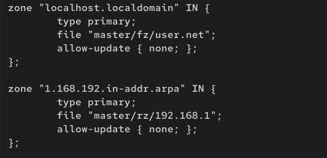{#fig:019 width=70%}

В каталоге /var/named создадим подкаталоги master/fz и master/rz, в которых будут
располагаться файлы прямой и обратной зоны соответственно:

cd /var/named

mkdir -p /var/named/master/fz

mkdir -p /var/named/master/rz (рис. 20)

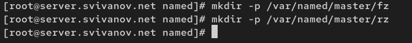{#fig:020 width=70%}

Скопируем шаблон прямой DNS-зоны named.localhost из каталога
/var/named в каталог /var/named/master/fz и переименуем его в user.net:

cp /var/named/named.localhost /var/named/master/fz/

cd /var/named/master/fz/

mv named.localhost user.net (рис. 21)

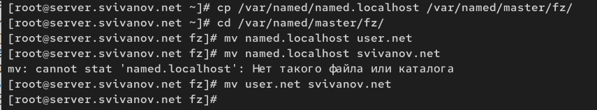{#fig:021 width=70%}

Изменим файл /var/named/master/fz/user.net, указав необходимые DNS-записи
для прямой зоны. В этом файле DNS-имя сервера @ rname.invalid. должно быть
заменено на @ server.user.net.; формат серийного номера ГГГГММДДВВ (ГГГГ — год, ММ — месяц, ДД — день, ВВ — номер
ревизии); адрес в A-записи должен быть заменён с 127.0.0.1 на 192.168.1.1; в директиве $ORIGIN должно быть задано текущее имя домена user.net. (вместо user
должен быть указан ваш логин), а затем указаны имена и адреса серверов в этом домене в виде A-записей DNS (на данном этапе должен быть прописан сервер с именем
ns и адресом 192.168.1.1).  (рис. 22)

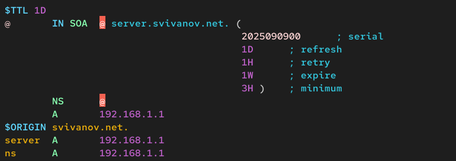{#fig:022 width=70%}

Скопируем шаблон обратной DNS-зоны named.loopback из каталога
/var/named в каталог /var/named/master/rz и переименуем его в 192.168.1:

cp /var/named/named.loopback /var/named/master/rz/

cd /var/named/master/rz/

mv named.loopback 192.168.1 (рис. 23)

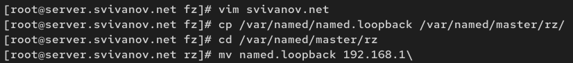{#fig:023 width=70%}

Изменим файл /var/named/master/rz/192.168.1, указав необходимые DNS-записи
для обратной зоны. В этом файле DNS-имя сервера @ rname.invalid. должно
быть заменено на @ server.user.net.; формат серийного номера ГГГГММДДВВ (ГГГГ — год, ММ — месяц, ДД —
день, ВВ — номер ревизии); адрес в A-записи должен быть заменён с 127.0.0.1 на
192.168.1.1; в директиве $ORIGIN должно быть задано название обратной зоны в виде 1.168.192.in-addr.arpa., затем заданы PTR-записи. (рис. 24)

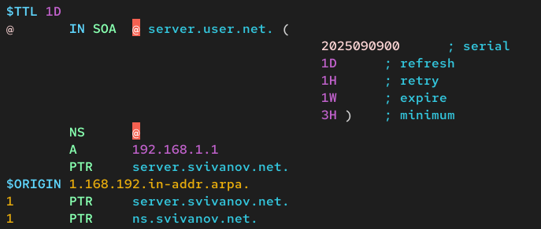{#fig:024 width=70%}

Далее требуется исправить права доступа к файлам в каталогах /etc/named
и /var/named, чтобы демон named мог с ними работать:

chown -R named:named /etc/named

chown -R named:named /var/named (рис. 25)

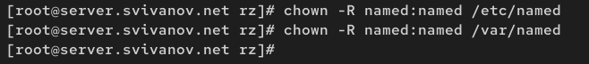{#fig:025 width=70%}

В системах с запущенным SELinux все процессы и файлы имеют специальные метки
безопасности, используемые системой
для принятия решений по доступу к этим процессам и файлам. После изменения
доступа к конфигурационным файлам named требуется корректно восстановить их
метки в SELinux:

restorecon -vR /etc

restorecon -vR /var/named

Для проверки состояния переключателей SELinux, относящихся к named, введем: getsebool -a | grep named .
Дадим named разрешение на запись в файлы DNS-зоны:

setsebool named_write_master_zones 1

setsebool -P named_write_master_zones 1 (рис. 26)

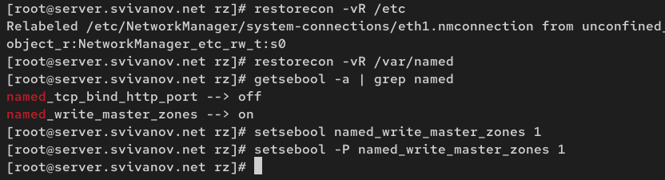{#fig:026 width=70%}

В дополнительном терминале запустим в режиме реального времени расширенный лог системных сообщений, чтобы проверить корректность работы системы:
journalctl -x -f. В первом терминале перезапустим DNS-сервер: systemctl restart named (рис. 27)

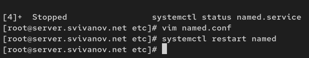{#fig:027 width=70%}

При помощи утилиты dig получим описание DNS-зоны с сервера ns.svivanov.net: dig ns.user.net (рис. 28)

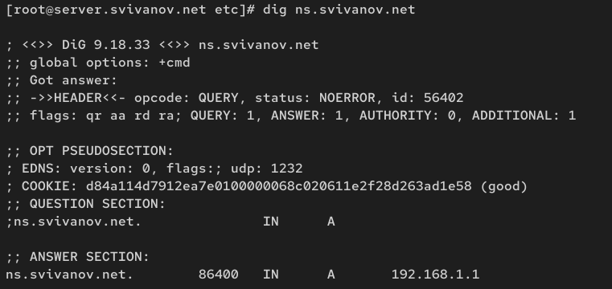{#fig:028 width=70%}

Анализ выведенной информации:
Команда dig ns.svivanov.net запросила IP-адрес DNS-сервера домена.

• Сервер: 127.0.0.1 (локальный)

• Ответ: ns.svivanov.net = 192.168.1.1

• Статус: aa (authoritative answer) - ответ авторитативный

• Время: 1 мс

Локальный DNS-сервер отвечает, что DNS-сервер домена находится по адресу 192.168.1.1.

При помощи утилиты host проанализируем корректность работы DNS-сервера:

host -l user.net

host -a user.net

host -t A user.net

host -t PTR 192.168.1.1

Как видим, сервер работает корректно. (рис. 29)

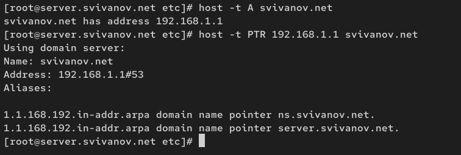{#fig:029 width=70%}

На виртуальной машине server перейдем в каталог для внесения изменений
в настройки внутреннего окружения /vagrant/provision/server/, создайте в нём
каталог dns, в который поместим в соответствующие каталоги конфигурационные
файлы DNS: (рис. 30)

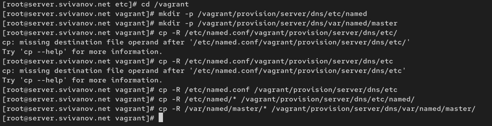{#fig:030 width=70%}

В каталоге /vagrant/provision/server создадим исполняемый файл dns.sh:

touch dns.sh

chmod +x dns.sh

Открыв его на редактирование, пропишем в нём следующий скрипт: (рис. 31)

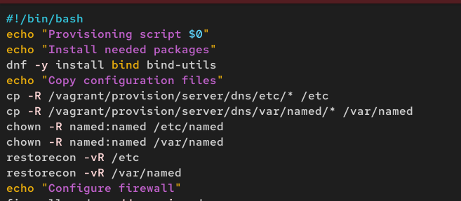{#fig:031 width=70%}

Для отработки созданного скрипта во время загрузки виртуальной машины server
в конфигурационном файле Vagrantfile добавим в разделе конфигурации для сервера: (рис. 32)

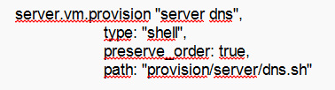{#fig:032 width=70%}

# Ответы на контрольные вопросы

**1. Что такое DNS?**

Это система, предназначенная для преобразования человекочитаемых доменных имен в IP-адреса, используемые компьютерами для распознавания друг друга в сети.

**2. Каково назначение кэширующего DNS-сервера?**

Его главная цель — ускорить получение ответа и снизить нагрузку на сеть. Он запоминает результаты предыдущих запросов на некоторое время. Если два разных пользователя запрашивают один и тот же сайт, второму ответ придет мгновенно из кэша, без повторного опроса внешних серверов.

**3. Чем отличается прямая DNS-зона от обратной?**

Прямая зона преобразует доменные имена в IP-адреса, обратная зона
выполняет обратное: преобразует IP-адреса в доменные имена.

**4. В каких каталогах и файлах располагаются настройки DNS-сервера? Кратко охарактеризуйте, за что они отвечают.**

В Linux-системах обычно используется файл /etc/named.conf для общих настроек. Зоны хранятся в файлах в каталоге /var/named/, например, /var/named/example.com.zone

**5. Что указывается в файле resolv.conf?**

В этом файле прописываются адреса DNS-серверов, которые будет использовать эта машина для преобразования имен. 

**6. Какие типы записи описания ресурсов есть в DNS и для чего они используются?**

A (IPv4-адрес), AAAA (IPv6-адрес), CNAME (каноническое имя), MX (почтовый сервер), NS (имя сервера), PTR (обратная запись), SOA (начальная запись зоны), TXT (текстовая информация).

**7. Для чего используется домен in-addr.arpa?**

Используется для обратного маппинга IP-адресов в доменные имена.

**8. Для чего нужен демон named?**

Это DNS-сервер, реализация BIND (Berkeley Internet Name Domain).

**9. В чём заключаются основные функции slave-сервера и master-сервера?**

Master-сервер хранит оригинальные записи зоны, slave-серверы получают копии данных от master-сервера

**10. Какие параметры отвечают за время обновления зоны?**

refresh, retry, expire, и minimum.

**11. Как обеспечить защиту зоны от скачивания и просмотра?**

Можно запретить трансфер зоны (операцию zone transfer) для посторонних серверов, разрешив его только для своих слейвов с помощью директивы allow-transfer в named.conf.

**12. Какая запись RR применяется при создании почтовых серверов?**

MX (Mail Exchange).

**13. Как протестировать работу сервера доменных имён?**

Использовать команды nslookup, dig, или host.

**14. Как запустить, перезапустить или остановить какую-либо службу в системе?**

systemctl start|stop|restart <service>.

**15. Как посмотреть отладочную информацию при запуске какого-либо сервиса или службы?**

Использовать опции, такие как -d или -v при запуске службы.

**16. Где храниться отладочная информация по работе системы и служб? Как её посмотреть?**

В системных журналах, доступных через journalctl

**17. Как посмотреть, какие файлы использует в своей работе тот или иной процесс?**

- lsof -p <pid> или fuser -v <file>

**18. Приведите несколько примеров по изменению сетевого соединения при помощи командного интерфейса nmcli.**

nmcli connection up|down <connection_name>.

**19. Что такое SELinux?**

Это мандатный контроль доступа для ядра Linux.

**20. Что такое контекст (метка) SELinux?**

Метка, определяющая, какие ресурсы могут быть доступны процессу или объекту.

**21. Как восстановить контекст SELinux после внесения изменений в конфигурационные файлы?**

restorecon -Rv <directory>.

**22. Как создать разрешающие правила политики SELinux из файлов журналов, содержащих сообщения о запрете операций?**

audit2allow.

**23. Что такое булевый переключатель в SELinux?**

Это параметр, который включает или отключает определенные аспекты защиты SELinux.

**24. Как посмотреть список переключателей SELinux и их состояние?**

getsebool -a.

**25. Как изменить значение переключателя SELinux?**

setsebool -P <boolean_name> <on|off>.

# Выводы

В ходе выполнения лабораторной работы мы приобрели практические
навыки по установке и конфигурированию DNSсервера, а также усвоили
принципы работы системы доменных имён.