---
## Front matter
lang: ru-RU
title: Лабораторная работа №3
subtitle: Администрирование сетевых подсистем
author:
  - Иванов Сергей Владимирович, НПИбд-01-23
institute:
  - Российский университет дружбы народов, Москва, Россия
date: 16 сентября 2025

## i18n babel
babel-lang: russian
babel-otherlangs: english

## Formatting pdf
toc: false
slide_level: 2
aspectratio: 169
section-titles: true
theme: metropolis
header-includes:
 - \metroset{progressbar=frametitle,sectionpage=progressbar,numbering=fraction}
 - '\makeatletter'
 - '\beamer@ignorenonframefalse'
 - '\makeatother'

 ## Fonts
mainfont: PT Serif
romanfont: PT Serif
sansfont: PT Sans
monofont: PT Mono
mainfontoptions: Ligatures=TeX
romanfontoptions: Ligatures=TeX
sansfontoptions: Ligatures=TeX,Scale=MatchLowercase
monofontoptions: Scale=MatchLowercase,Scale=0.9
---

## Цель работы

Целью данной работы является приобретение практических навыков по установке и конфигурированию DHCP сервера.

## Задание

1. Установите на виртуальной машине server DHCP-сервер 
2. Настройте виртуальную машину server в качестве DHCP-сервера для виртуальной внутренней сети 
3. Проверьте корректность работы DHCP-сервера в виртуальной внутренней сети
путём запуска виртуальной машины client и применения соответствующих утилит
диагностики 
4. Настройте обновление DNS-зоны при появлении в виртуальной внутренней сети
новых узлов
5. Проверьте корректность работы DHCP-сервера и обновления DNS-зоны в виртуальной внутренней сети путём запуска виртуальной машины client и применения утилит диагностики 
6. Напишите скрипт для Vagrant, фиксирующий действия по установке и настройке DHCP-сервера во внутреннем окружении виртуальной машины server. Соответствующим образом внести изменения в Vagrantfile

# Выполнение работы

## Установка DHCP-сервера

Загрузим операционную систему и перейдем в рабочий каталог с проектом. Запустим виртуальную машину server. (рис. 1).

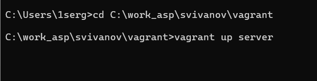{#fig:001 width=70%}

## Установка DHCP-сервера

На виртуальной машине server откроем терминал. Перейдем в режим суперпользователя. Установим dhcp (рис. 2).

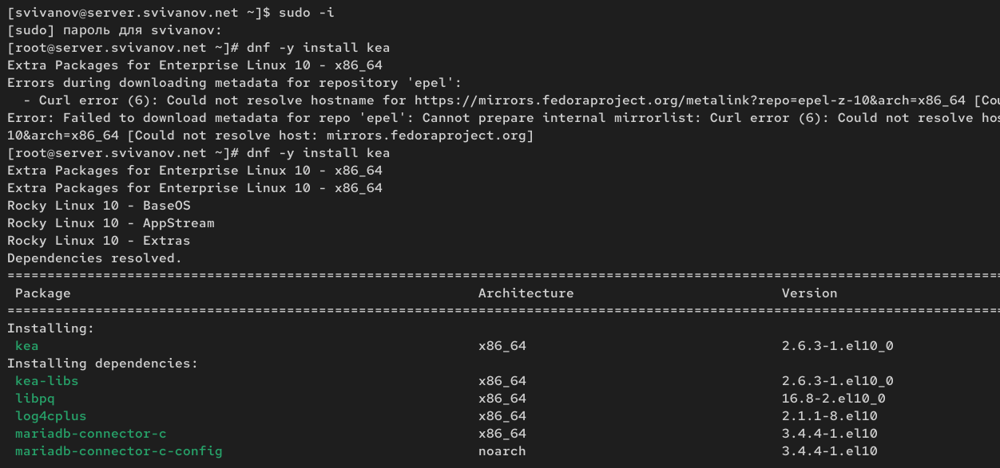{#fig:002 width=70%}

## Конфигурирование DHCP-сервера

Сохраним на всякий случай конфигурационный файл (рис. 3)

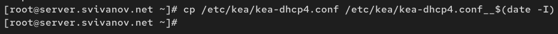{#fig:003 width=70%}

## Конфигурирование DHCP-сервера

Откроем файл /etc/kea/kea-dhcp4.conf на редактирование. Прописываем необхожимую концигурацию dhcp (рис. 4) 

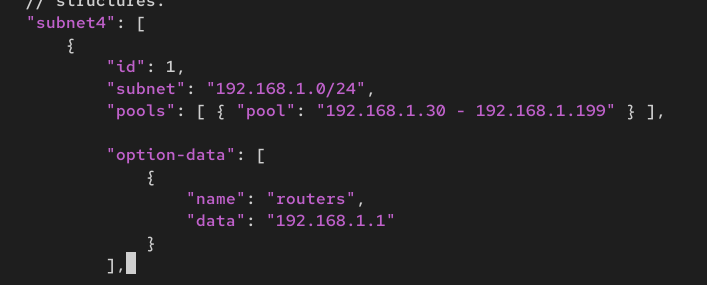{#fig:004 width=70%}

## Конфигурирование DHCP-сервера

Настроим привязку dhcpd к интерфейсу eth1 виртуальной машины server (рис. 5)

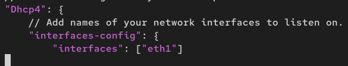{#fig:005 width=70%}

## Конфигурирование DHCP-сервера

Проверим правильность конфигурационного файла (рис. 6)

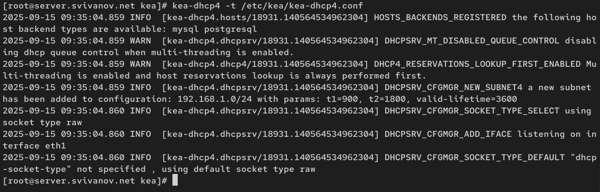{#fig:006 width=70%}

## Конфигурирование DHCP-сервера

Перезагрузим конфигурацию dhcpd и разрешим загрузку DHCP-сервера при запуске виртуальной машины server (рис. 7)

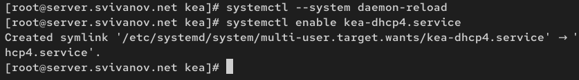{#fig:007 width=70%}

## Конфигурирование DHCP-сервера

Добавим запись для DHCP-сервера в конце файла прямой DNS-зоны и в конце файла обратной зоны: (рис. 8, 9)

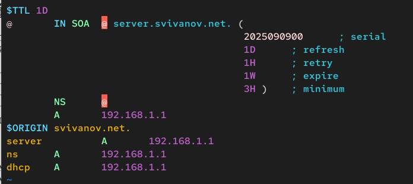{#fig:008 width=70%}

## Конфигурирование DHCP-сервера

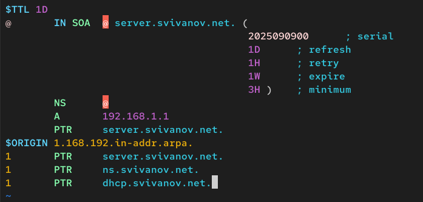{#fig:009 width=70%}

## Конфигурирование DHCP-сервера

Перезапустим named. Проверим, что можно обратиться к DHCP-серверу по имени: ping dhcp.user.net. (рис. 10)

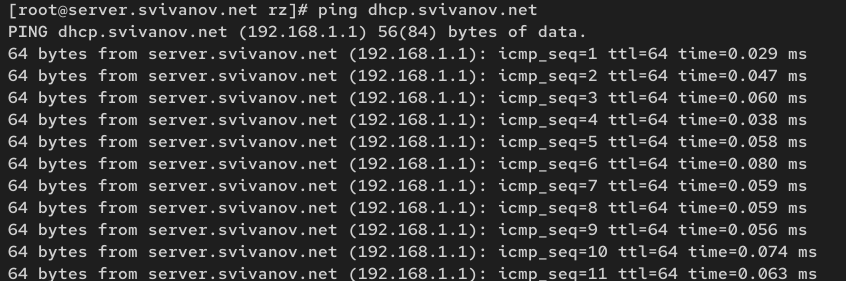{#fig:010 width=70%}

## Конфигурирование DHCP-сервера

Внесем изменения в настройки межсетевого экрана узла server, разрешив работу с DHCP (рис. 11)

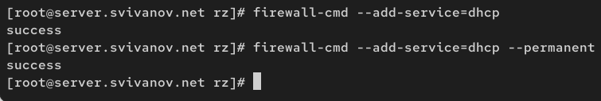{#fig:011 width=70%}

## Конфигурирование DHCP-сервера

Восстановим контекст безопасности в SELinux. (рис. 12)

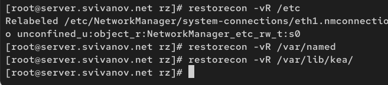{#fig:012 width=70%}

## Конфигурирование DHCP-сервера

В дополнительном терминале запустим мониторинг происходящих в системе процессов в реальном времени (рис. 13)

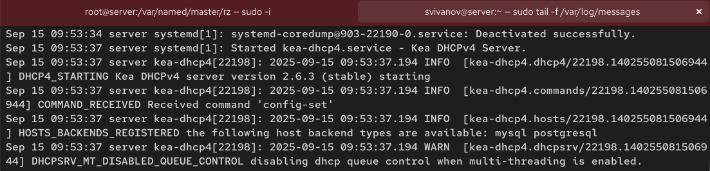{#fig:013 width=70%}
 
## Конфигурирование DHCP-сервера

В основном рабочем терминале запустим DHCP-сервер (рис. 14)

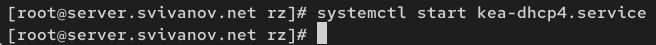{#fig:014 width=70%}

## Анализ работы DHCP-сервера

Перед запуском виртуальной машины client в каталоге с проектом в подкаталоге vagrant/provision/client отредактируем файл 01-
routing.sh чтобы весь трафик на виртуальной машине client шёл по умолчанию через интерфейс eth1. (рис. 15)

## Анализ работы DHCP-сервера

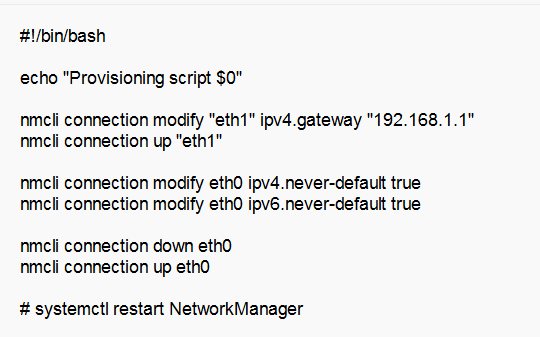{#fig:015 width=70%}

## Анализ работы DHCP-сервера

Изменения в фале Vagrantfile не требуются. Запустим виртуальную машину client (рис. 16)

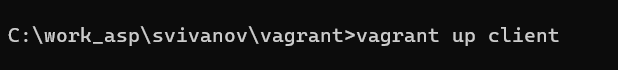{#fig:016 width=70%}

## Анализ работы DHCP-сервера

После загрузки виртуальной машины client можем увидеть на виртуальной
машине server в терминале с мониторингом процессов
записи о подключении к виртуальной внутренней сети узла client и выдачи ему
IP-адреса из заданного диапазона адресов. Также информацию о работе
DHCP-сервера можно наблюдать в файле /var/lib/kea/kea-leases4.csv. (рис. 17)

## Анализ работы DHCP-сервера

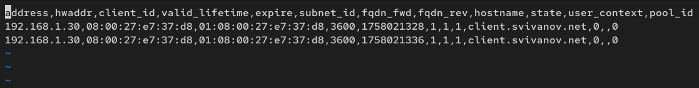{#fig:017 width=70%}

## Анализ работы DHCP-сервера

Войдем в систему виртуальной машины client под нашим пользователем и откроем терминал. В терминале введем ifconfig. (рис. 18)

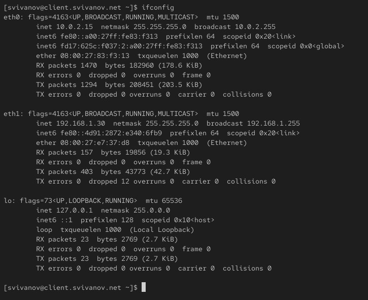{#fig:018 width=70%}

## Анализ работы DHCP-сервера

На машине server посмотрим список выданных адресов. (рис. 19)

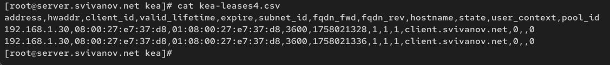{#fig:019 width=70%}

## Настройка обновления DNS-зоны

Создадим ключ на сервере с Bind9. Файл /etc/named/keys/dhcp_updater.key имеет следующий вид (рис. 20)

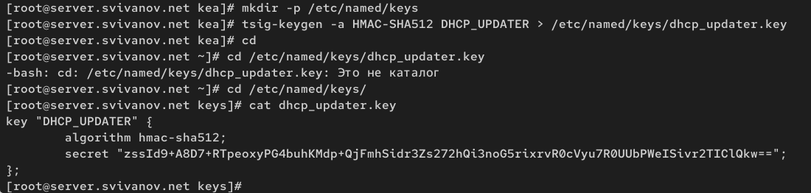{#fig:020 width=70%}

## Настройка обновления DNS-зоны

Поправим права доступа (рис. 21)

{#fig:021 width=70%}

## Настройка обновления DNS-зоны

Подключим ключ в файле /etc/named.conf (рис. 22)

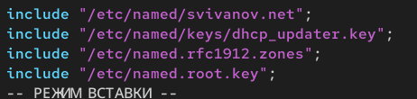{#fig:022 width=70%}

## Настройка обновления DNS-зоны

На виртуальной машине server отредактируем файл /etc/named/svivanov.net,
разрешив обновление зоны: (рис. 23)

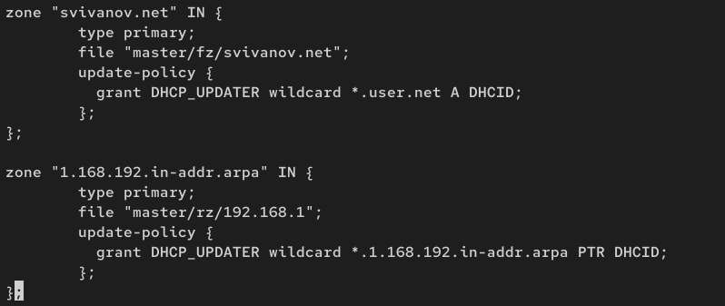{#fig:023 width=70%}

## Настройка обновления DNS-зоны

Сделаем проверку конфигурационного файла. Перезапустим DNS-сервер (рис. 24)

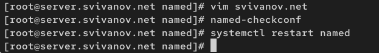{#fig:024 width=70%}

## Настройка обновления DNS-зоны

Сформируем ключ для Kea. Файл ключа назовём /etc/kea/tsig-keys.json. Перенесём ключ на сервер Kea DHCP и перепишем его в формате json (рис. 25)

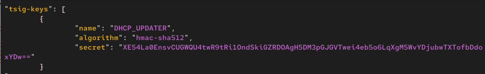{#fig:025 width=70%}

## Настройка обновления DNS-зоны

Сменим владельца. Поправим права доступа (рис. 26)

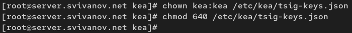{#fig:026 width=70%}

## Настройка обновления DNS-зоны

Настройка происходит в файле /etc/kea/kea-dhcp-ddns.conf: (рис. 27)

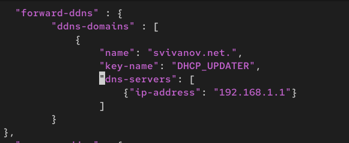{#fig:027 width=70%}

## Настройка обновления DNS-зоны

Изменим владельца файла. Проверим файл на наличие возможных синтаксических ошибок (рис. 28)

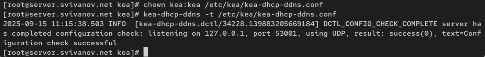{#fig:028 width=70%}

## Настройка обновления DNS-зоны

Запустим службу ddns. Проверим статус работы службы (рис. 29)

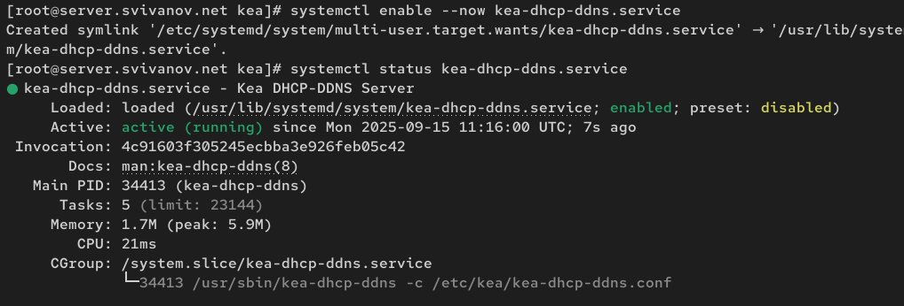{#fig:029 width=70%}

## Настройка обновления DNS-зоны

Внесем изменения в конфигурационный файл /etc/kea/kea-dhcp4.conf, добавив
в него разрешение на динамическое обновление DNS-записей (рис. 30)

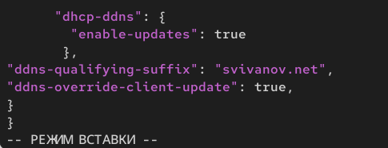{#fig:030 width=70%}

## Настройка обновления DNS-зоны

Проверим файл на наличие возможных синтаксических ошибок (рис. 31)

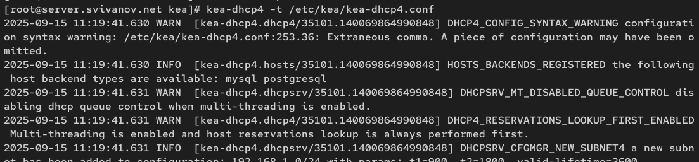{#fig:031 width=70%}

## Настройка обновления DNS-зоны

Перезапустим DHCP-сервер. Проверим статус (рис. 32)

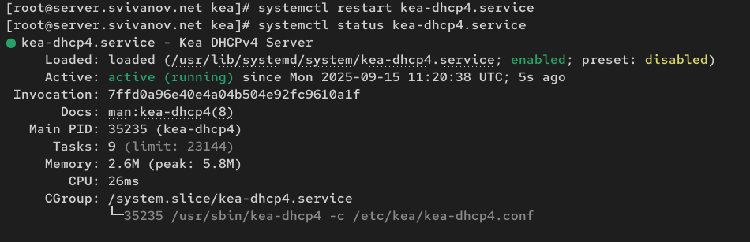{#fig:032 width=70%}

## Настройка обновления DNS-зоны

На машине client переполучим адрес (рис. 33)

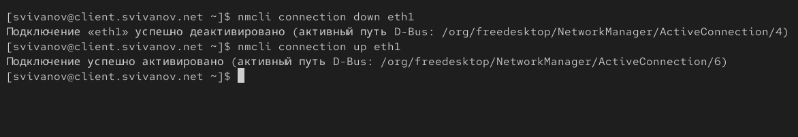{#fig:033 width=70%}

## Анализ работы DHCP-сервера после настройки обновления DNS-зоны

На виртуальной машине client откроем терминал и с помощью утилиты dig убедимся в наличии DNS-записи о клиенте в прямой DNS-зоны (рис. 34)

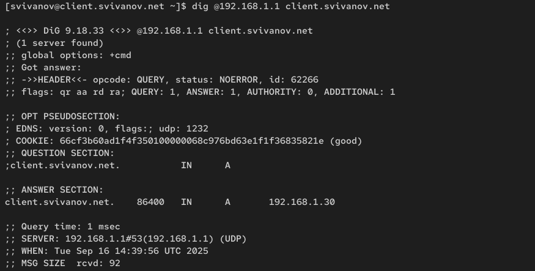{#fig:034 width=70%}

## Внесение изменений в настройки внутреннего окружения виртуальной машины

На машине server перейдем в каталог для внесения изменений
в настройки внутреннего окружения /vagrant/provision/server/, создадим в нём
каталог dhcp, в который поместим в соответствующие подкаталоги конф. файлы DHCP (рис. 35)

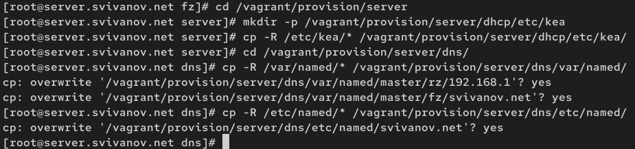{#fig:035 width=70%}

## Внесение изменений в настройки внутреннего окружения виртуальной машины

В каталоге /vagrant/provision/server создадим исполняемый файл dhcp.sh. Пропишем в нём скрипт: (рис. 36)

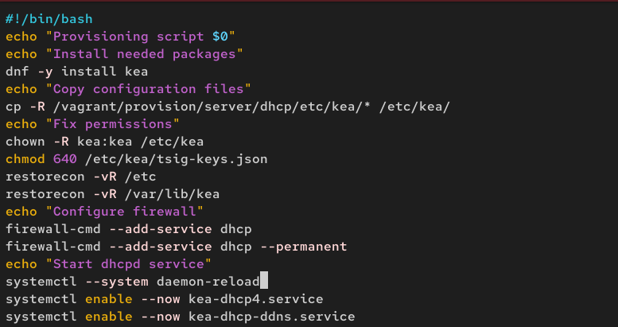{#fig:036 width=70%}

## Внесение изменений в настройки внутреннего окружения виртуальной машины

Для отработки созданного скрипта во время загрузки виртуальной машины server
в конфигурационном файле Vagrantfile добавим в разделе конфигурации для сервера: (рис. 37)

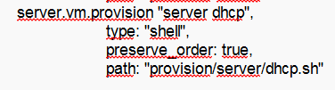{#fig:037 width=70%}

# Вывод

## Вывод 

В ходе выполнения лабораторной работы мы приобрели практические навыки по установке и конфигурированию DHCP сервера.

 
