---
## Front matter
title: "Отчет по лабораторной работе №3"
subtitle: "Дисциплина: Администрирование сетевых подсистем"
author: "Иванов Сергей Владимирович"

## Generic otions
lang: ru-RU
toc-title: "Содержание"

## Bibliography
bibliography: bib/cite.bib
csl: pandoc/csl/gost-r-7-0-5-2008-numeric.csl

## Pdf output format
toc: true # Table of contents
toc-depth: 2
lof: true # List of figures
fontsize: 12pt
linestretch: 1.5
papersize: a4
documentclass: scrreprt
## I18n polyglossia
polyglossia-lang:
  name: russian
  options:
	- spelling=modern
	- babelshorthands=true
polyglossia-otherlangs:
  name: english
## I18n babel
babel-lang: russian
babel-otherlangs: english
## Fonts
mainfont: PT Serif
romanfont: PT Serif
sansfont: PT Sans
monofont: PT Mono
mainfontoptions: Ligatures=TeX
romanfontoptions: Ligatures=TeX
sansfontoptions: Ligatures=TeX,Scale=MatchLowercase
monofontoptions: Scale=MatchLowercase,Scale=0.9
## Biblatex
biblatex: true
biblio-style: "gost-numeric"
biblatexoptions:
  - parentracker=true
  - backend=biber
  - hyperref=auto
  - language=auto
  - autolang=other*
  - citestyle=gost-numeric
## Pandoc-crossref LaTeX customization
figureTitle: "Рис."
listingTitle: "Листинг"
lofTitle: "Список иллюстраций"
lolTitle: "Листинги"
## Misc options
indent: true
header-includes:
  - \usepackage{indentfirst}
  - \usepackage{float} # keep figures where there are in the text
  - \floatplacement{figure}{H} # keep figures where there are in the text
---

# Цель работы

Целью данной работы является приобретение практических навыков по установке и конфигурированию DHCP сервера.

# Задание

1. Установите на виртуальной машине server DHCP-сервер (см. раздел 3.4.1).
2. Настройте виртуальную машину server в качестве DHCP-сервера для виртуальной
внутренней сети (см. раздел 3.4.2).
3. Проверьте корректность работы DHCP-сервера в виртуальной внутренней сети
путём запуска виртуальной машины client и применения соответствующих утилит
диагностики (см. раздел 3.4.3).
4. Настройте обновление DNS-зоны при появлении в виртуальной внутренней сети
новых узлов (см. раздел 3.4.4).
5. Проверьте корректность работы DHCP-сервера и обновления DNS-зоны в виртуальной внутренней сети путём запуска виртуальной машины client и применения
соответствующих утилит диагностики (см. раздел 3.4.5).
6. Напишите скрипт для Vagrant, фиксирующий действия по установке и настройке
DHCP-сервера во внутреннем окружении виртуальной машины server. Соответствующим образом внести изменения в Vagrantfile (см. раздел 3.4.6).

# Выполнение лабораторной работы

## Установка DHCP-сервера

Загрузим операционную систему и перейдем в рабочий каталог с проектом: cd /var/tmp/user_name/vagrant .
Запустим виртуальную машину server: vagrant up server . (рис. 1).

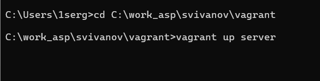{#fig:001 width=70%}

На виртуальной машине server войдем под нашим пользователем и откроем терминал. Перейдем в режим суперпользователя: sudo -i . Установим dhcp:
dnf -y install kea (рис. 2).

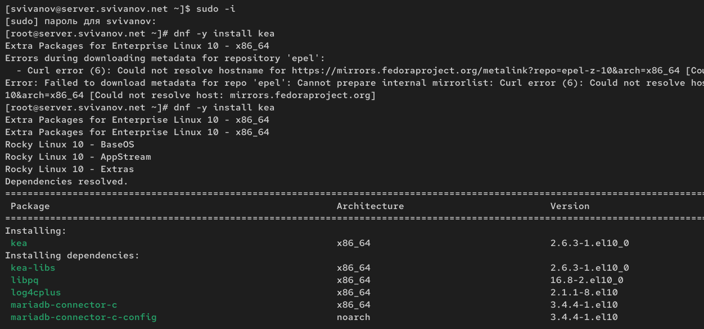{#fig:002 width=70%}

## Конфигурирование DHCP-сервера

Сохраним на всякий случай конфигурационный файл: cp /etc/kea/kea-dhcp4.conf /etc/kea/kea-dhcp4.conf__$(date -I)  (рис. 3)

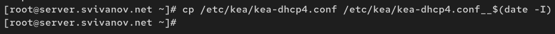{#fig:003 width=70%}

Откроем файл /etc/kea/kea-dhcp4.conf на редактирование. В этом файле:
– заменим шаблон для domain-name

{

"code": 15,

"data": "example.org"

},

{

"name": "domain-search",

"data": "srv.world"

},

на описание

{

"code": 15,

"data": "user.net"

},

{

"name": "domain-search",

"data": "user.net"

},

– заменим блок

{

"name": "domain-name-servers",

"data": "192.0.2.1, 192.0.2.2"

},

на блок

{

"name": "domain-name-servers",

"data": "192.168.1.1"

}, 

– на базе одного из приведённых в файле примеров конфигурирования подсети
зададим собственную конфигурацию dhcp-сети, задав адрес подсети, диапазон
адресов для распределения клиентам, адрес маршрутизатора и broadcast-адрес:

"subnet4": [

{

"id": 1,

// specify subnet that DHCP is used

"subnet": "192.168.1.0/24",

// specify the range of IP addresses to be leased

"pools": [ { "pool": "192.168.1.30 - 192.168.1.199" } ],

"option-data": [

{

// specify your gateway

"name": "routers",

"data": "192.168.1.1"

}

]

}

],

Остальные примеры задания конфигураций подсетей удалим. (рис. 4) 

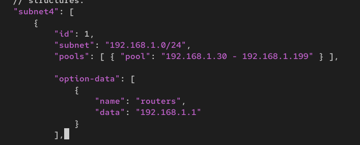{#fig:004 width=70%}

Настроим привязку dhcpd к интерфейсу eth1 виртуальной машины server: 

"interfaces-config": {

    "interfaces": [ "eth1" ]

}, (рис. 5)

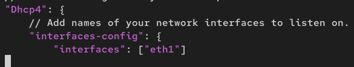{#fig:005 width=70%}

Проверим правильность конфигурационного файла:
kea-dhcp4 -t /etc/kea/kea-dhcp4.conf (рис. 6)

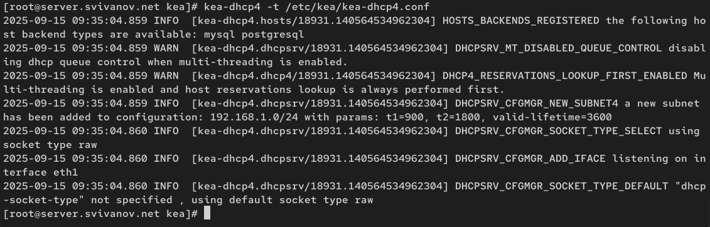{#fig:006 width=70%}

Перезагрузим конфигурацию dhcpd и разрешим загрузку DHCP-сервера при запуске виртуальной машины server:

systemctl --system daemon-reload

systemctl enable kea-dhcp4.service (рис. 7)

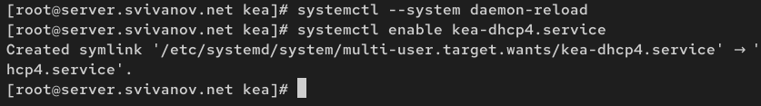{#fig:007 width=70%}

Добавим запись для DHCP-сервера в конце файла прямой DNS-зоны
/var/named/master/fz/user.net:

dhcp A 192.168.1.1

и в конце файла обратной зоны /var/named/master/rz/192.168.1:

1 PTR dhcp.user.net. (рис. 8, 9)

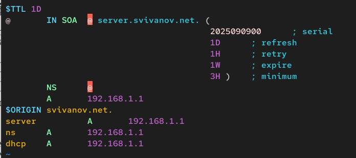{#fig:008 width=70%}

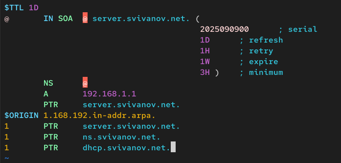{#fig:009 width=70%}

Перезапустим named: systemctl restart named . Проверим, что можно обратиться к DHCP-серверу по имени: ping dhcp.user.net. (рис. 10)

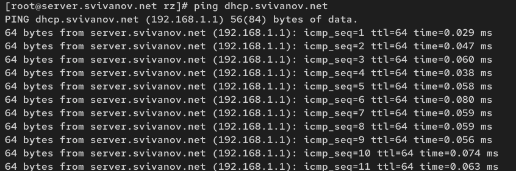{#fig:010 width=70%}

Внесем изменения в настройки межсетевого экрана узла server, разрешив работу с DHCP:

firewall-cmd --list-services

firewall-cmd --get-services

firewall-cmd --add-service=dhcp

firewall-cmd --add-service=dhcp --permanent (рис. 11)

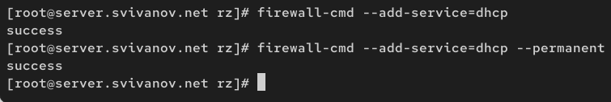{#fig:011 width=70%}

Восстановим контекст безопасности в SELinux:

restorecon -vR /etc

restorecon -vR /var/named

restorecon -vR /var/lib/kea/. (рис. 12)

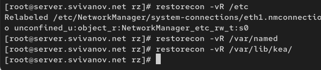{#fig:012 width=70%}

В дополнительном терминале запустим мониторинг происходящих в системе процессов в реальном времени:
tail -f /var/log/messages (рис. 13)

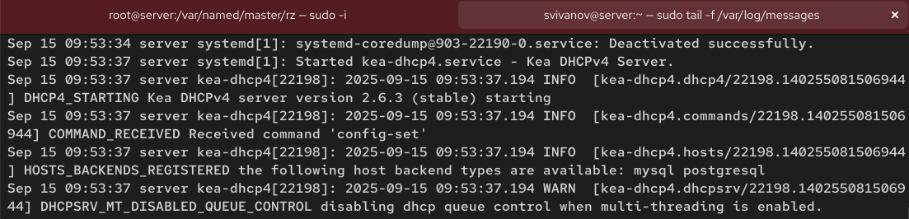{#fig:013 width=70%}
 
В основном рабочем терминале запустим DHCP-сервер:
systemctl start kea-dhcp4.service (рис. 14)

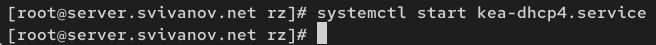{#fig:014 width=70%}

## Анализ работы DHCP-сервера

Перед запуском виртуальной машины client в каталоге с проектом в подкаталоге vagrant/provision/client отредактируем файл 01-
routing.sh. Этот скрипт изменяет настройки NetworkManager так, чтобы весь трафик на виртуальной машине client шёл по умолчанию через интерфейс eth1. (рис. 15)

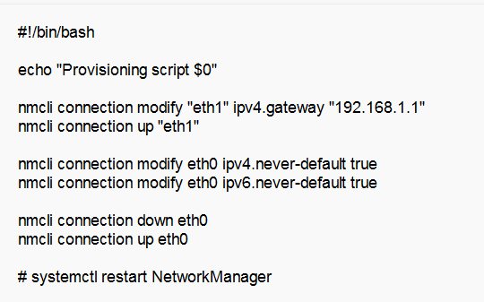{#fig:015 width=70%}

Изменения в фале Vagrantfile не требуются. 

Запустим виртуальную машину client: vagrant up client (рис. 16)

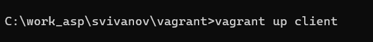{#fig:016 width=70%}

После загрузки виртуальной машины client можем увидеть на виртуальной
машине server на терминале с мониторингом происходящих в системе процессов
записи о подключении к виртуальной внутренней сети узла client и выдачи ему
IP-адреса из соответствующего диапазона адресов. Также информацию о работе
DHCP-сервера можно наблюдать в файле /var/lib/kea/kea-leases4.csv. 

Анализ файла /var/lib/kea/kea-leases4.csv :

- IP адрес: 192.168.1.30

- MAC адрес: 08:00:27:e7:37:d8

- Client ID: 01:08:00:27:e7:37:d8

- Время жизни: 3600 секунд (1 час)

- Время истечения: 1758021328

- Подсеть: 1

- FQDN: client.svivanov.net

- Состояние: 0 (активно) (рис. 17)

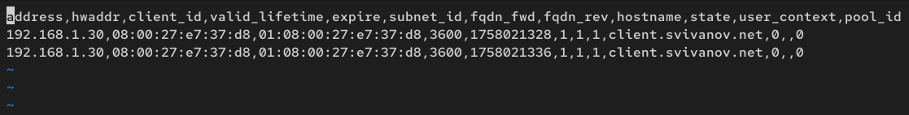{#fig:017 width=70%}

Войдем в систему виртуальной машины client под нашим пользователем и откроем терминал. В терминале введем
ifconfig.

Анализ выведенной информации:

Интерфейс eth0:

- Состояние: UP, BROADCAST, RUNNING, MULTICAST - интерфейс активен и функционирует

- MTU: 1500 байт - стандартный размер для Ethernet

- IPv4 адрес: 10.0.2.15/24 - частный адрес в сети класса A

- IPv6 адреса:

- fe80::a00:27ff.fe83:f313 - link-local адрес 

- fd17:625c:f037:2:a00:27ff.fe83:f313 - уникальный локальный IPv6 адрес 

- MAC адрес: 08:00:27:83:f3:13 - виртуальный адрес 

- Статистика: 1470 полученных, 1294 отправленных пакетов

Интерфейс eth1:

- Состояние: Аналогично eth0 - интерфейс активен

- IPv4 адрес: 192.168.1.30/24 - соответствует DHCP 

- IPv6 адрес: fe80::a00:27ff.fe83:f313 - link-local адрес

- MAC адрес: 08:00:27:87:08 

- Проблема: 12 dropped packets при передаче 

- Статистика: 157 полученных, 403 отправленных пакетов 

Интерфейс lo:

- Внутренний интерфейс для локального трафика

- IPv4: 127.0.0.1/8 - стандартный loopback адрес

- IPv6: ::1/128 - IPv6 loopback адрес

- MTU: 65536 байт - размер для локального трафика (рис. 18)

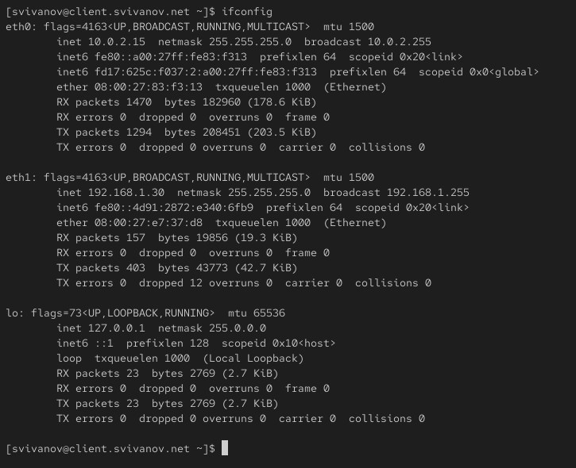{#fig:018 width=70%}

На машине server посмотрим список выданных адресов:
cat /var/lib/kea/kea-leases4.csv. Этот файл уже проанализирован. (рис. 19)

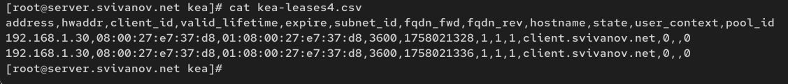{#fig:019 width=70%}

## Настройка обновления DNS-зоны

Создадим ключ на сервере с Bind9 (на виртуальной машине server):

mkdir -p /etc/named/keys

tsig-keygen -a HMAC-SHA512 DHCP_UPDATER > /etc/named/keys/dhcp_updater.key

Файл /etc/named/keys/dhcp_updater.key будет иметь следующий вид (рис. 20)

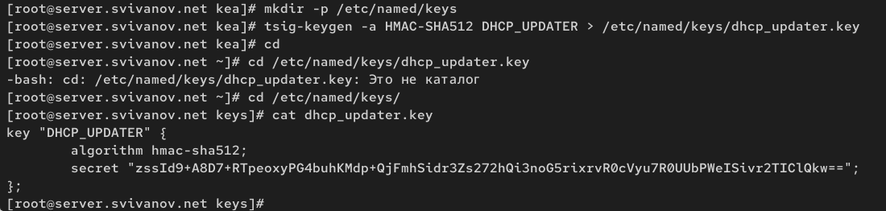{#fig:020 width=70%}

Поправим права доступа:
chown -R named:named /etc/named/keys (рис. 21)

{#fig:021 width=70%}

Подключим ключ в файле /etc/named.conf:
include "/etc/named/keys/dhcp_updater.key"; (рис. 22)

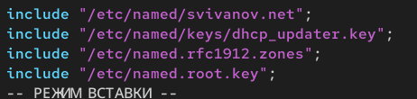{#fig:022 width=70%}

На виртуальной машине server под пользователем с правами суперпользователя отредактируем файл /etc/named/user.net,
разрешив обновление зоны: (рис. 23)

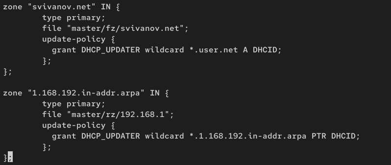{#fig:023 width=70%}

Сделаем проверку конфигурационного файла: named-checkconf. Перезапустим DNS-сервер: systemctl restart named (рис. 24)

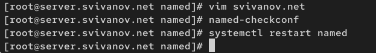{#fig:024 width=70%}

Сформируем ключ для Kea. Файл ключа назовём /etc/kea/tsig-keys.json: touch /etc/kea/tsig-keys.json. 
Перенесём ключ на сервер Kea DHCP и перепишем его в формате json (рис. 25)

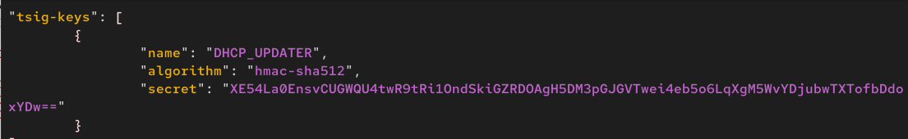{#fig:025 width=70%}

Сменим владельца: chown kea:kea /etc/kea/tsig-keys.json. Поправим права доступа: chmod 640 /etc/kea/tsig-keys.json (рис. 26)

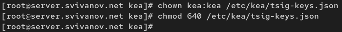{#fig:026 width=70%}

Настройка происходит в файле /etc/kea/kea-dhcp-ddns.conf: (рис. 27)

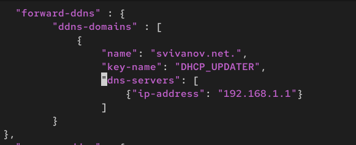{#fig:027 width=70%}

Изменим владельца файла: chown kea:kea /etc/kea/kea-dhcp-ddns.conf. Проверим файл на наличие возможных синтаксических ошибок:
kea-dhcp-ddns -t /etc/kea/kea-dhcp-ddns.conf (рис. 28)

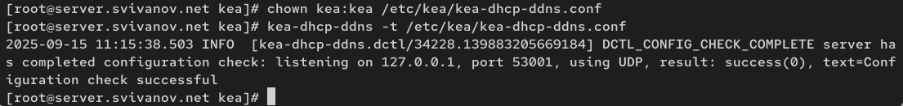{#fig:028 width=70%}

Запустим службу ddns: systemctl enable --now kea-dhcp-ddns.service. Проверим статус работы службы:
systemctl status kea-dhcp-ddns.service (рис. 29)

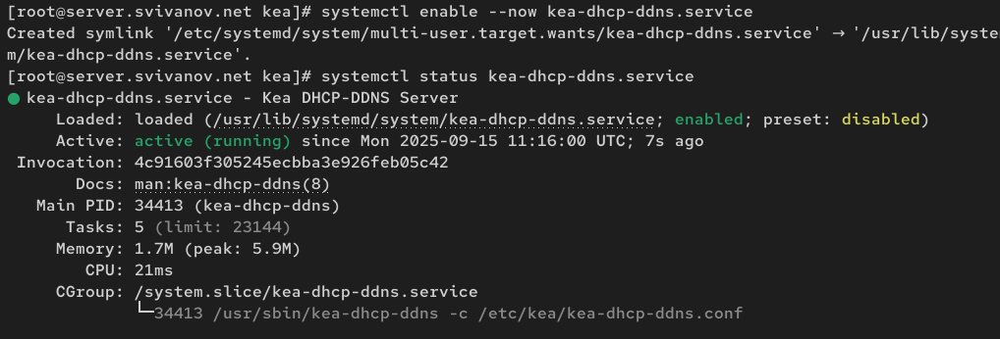{#fig:029 width=70%}

Внесем изменения в конфигурационный файл /etc/kea/kea-dhcp4.conf, добавив
в него разрешение на динамическое обновление DNS-записей с локального узла
прямой и обратной зон: (рис. 30)

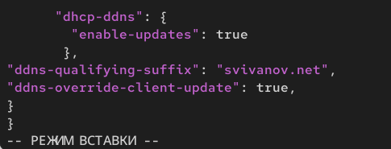{#fig:030 width=70%}

Проверим файл на наличие возможных синтаксических ошибок:
kea-dhcp4 -t /etc/kea/kea-dhcp4.conf (рис. 31)

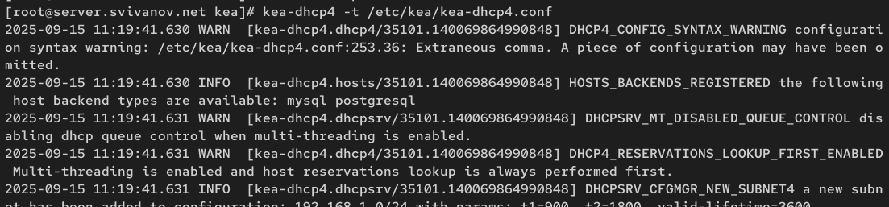{#fig:031 width=70%}

Перезапустим DHCP-сервер: systemctl restart kea-dhcp4.service. Проверим статус: systemctl status kea-dhcp4.service: (рис. 32)

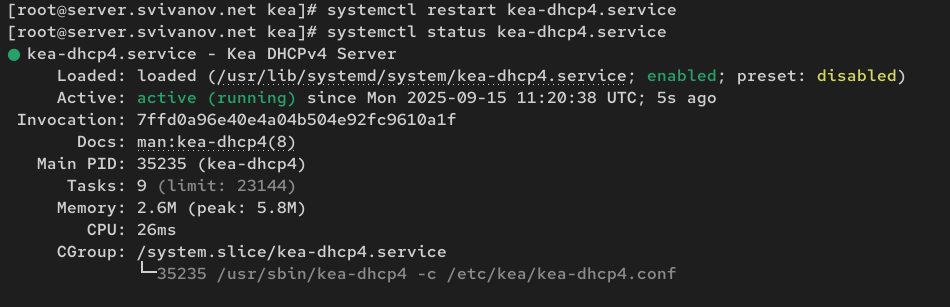{#fig:032 width=70%}

На машине client переполучим адрес:

nmcli connection down eth1

nmcli connection up eth1 (рис. 33)

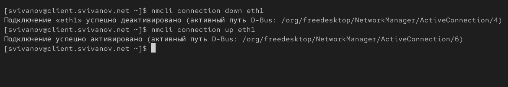{#fig:033 width=70%}

## Анализ работы DHCP-сервера после настройки обновления DNS-зоны

На виртуальной машине client откроем терминал и с помощью утилиты dig убедимся в наличии DNS-записи о клиенте в прямой DNS-зоне:

Анализ выведенной информации: запрос выполнен без ошибок

- запрос: client.svivanov.net

- Status: NOERROR - домен найден

- ANSWER: 1 - есть ответная запись

- IP адрес: 192.168.1.30 - именно тот, который нужен (рис. 34)

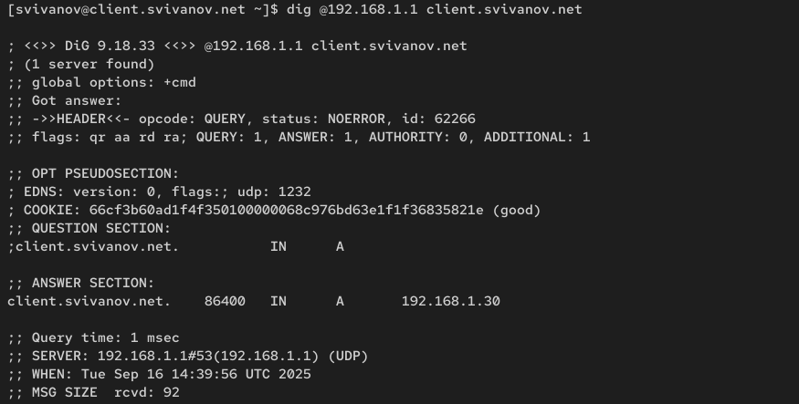{#fig:034 width=70%}

## Внесение изменений в настройки внутреннего окружения виртуальной машины

На виртуальной машине server перейдем в каталог для внесения изменений
в настройки внутреннего окружения /vagrant/provision/server/, создадим в нём
каталог dhcp, в который поместим в соответствующие подкаталоги конфигурационные файлы DHCP:

cd /vagrant/provision/server

mkdir -p /vagrant/provision/server/dhcp/etc/kea

cp -R /etc/kea/* /vagrant/provision/server/dhcp/etc/kea/

Заменим конфигурационные файлы DNS-сервера:

cd /vagrant/provision/server/dns/

cp -R /var/named/* /vagrant/provision/server/dns/var/named/

cp -R /etc/named/* /vagrant/provision/server/dns/etc/named/  (рис. 35)

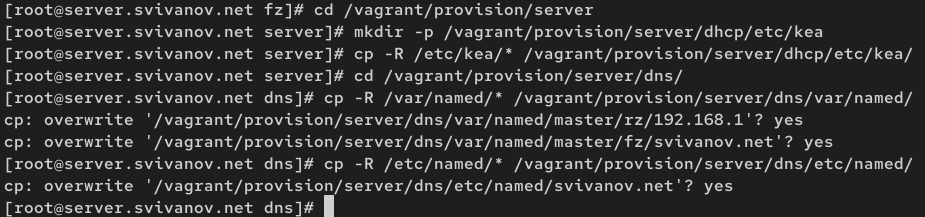{#fig:035 width=70%}

В каталоге /vagrant/provision/server создадим исполняемый файл dhcp.sh:

cd /vagrant/provision/server

touch dhcp.sh

chmod +x dhcp.sh

Открыв его на редактирование, пропишем в нём следующий скрипт: (рис. 36)

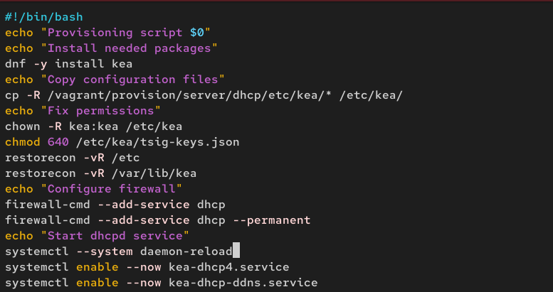{#fig:036 width=70%}

Для отработки созданного скрипта во время загрузки виртуальной машины server
в конфигурационном файле Vagrantfile необходимо добавить в разделе конфигурации для сервера: (рис. 37)

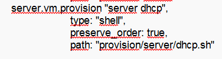{#fig:037 width=70%}

# Ответы на контрольные вопросы

**1. В каких файлах хранятся настройки сетевых подключений?**

Настройки сетевых подключений в Linux, использующих NetworkManager, хранятся в файлах по пути:

/etc/sysconfig/network-scripts/ifcfg-<имя_интерфейса>

Например: /etc/sysconfig/network-scripts/ifcfg-eth0. Также NetworkManager может хранить настройки в собственной бинарной базе данных. Для управления подключениями через NetworkManager используются утилиты nmcli или nmtui.

**2. За что отвечает протокол DHCP?**

DHCP (Dynamic Host Configuration Protocol) отвечает за автоматическую настройку сетевых параметров на клиентских устройствах. Он предоставляет:

Динамическое назначение IP-адресов из заданного пула, указание маски подсети (netmask), 
назначение шлюза по умолчанию (default gateway), указание адресов DNS-серверов, другие параметры сети

**3. Поясните принцип работы протокола DHCP. Какими сообщениями обмениваются клиент и сервер, используя протокол DHCP?**

Принцип работы DHCP:

DISCOVER - клиент широковещательно ищет доступные DHCP-серверы

OFFER - сервер предлагает клиенту IP-адрес и параметры конфигурации

REQUEST - клиент подтверждает принятие предложения

ACK - сервер подтверждает выделение адреса и параметров

Дополнительные сообщения:

NAK - отказ сервера в предоставлении адреса

RELEASE - клиент освобождает IP-адрес

DECLINE - клиент отказывается от предложенного адреса

**4. В каких файлах обычно находятся настройки DHCP-сервера? За что отвечает каждый из файлов?**

Для DHCP-сервера Kea:

/etc/kea/kea-dhcp4.conf - основной конфигурационный файл DHCPv4-сервера

/etc/kea/kea-dhcp-ddns.conf - конфигурация динамического DNS

/etc/kea/tsig-keys.json - файл ключей TSIG для безопасного обновления DNS

/var/lib/kea/kea-leases4.csv - база данных выданных аренд (lease database)

**5. Что такое DDNS? Для чего применяется DDNS?**

DDNS (Dynamic DNS) - технология, позволяющая автоматически обновлять DNS-записи при изменении IP-адресов или появлении новых узлов в сети.

Применение DDNS: Автоматическое создание DNS-записей для клиентов, получающих адреса по DHCP, обновление записей при смене IP-адресов, 
синхронизация прямой и обратной DNS-зон, упрощение администрирования сетей с динамическими адресами.

**6. Какую информацию можно получить, используя утилиту ifconfig? Приведите примеры с использованием различных опций.**

ifconfig показывает информацию о сетевых интерфейсах:

Примеры использования:

Показать все активные интерфейсы

- ifconfig

Показать конкретный интерфейс

- ifconfig eth0

Показать все интерфейсы 

- ifconfig -a

Включить интерфейс

- ifconfig eth0 up

Выключить интерфейс  

- ifconfig eth0 down

Выводимая информация: IP-адрес, маска подсети, MAC-адрес, статистика приема/передачи пакетов, флаги состояния интерфейса.

**7. Какую информацию можно получить, используя утилиту ping? Приведите примеры с использованием различных опций.**

ping используется для проверки доступности сетевых узлов и измерения задержки:

Базовая проверка доступности

- ping example.com

Ограничить количество пакетов
- ping -c 5 example.com

Указать размер пакета
- ping -s 1000 example.com

Указать интервал между пакетами (в секундах)
- ping -i 2 example.com

Непрерывный ping 
- ping -t example.com

Ping с временными метками
- ping -D example.com

# Выводы

В ходе выполнения лабораторной работы мы приобрели практические навыки по установке и конфигурированию DHCP сервера.