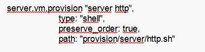

---
## Front matter
lang: ru-RU
title: Лабораторная работа №4
subtitle: Администрирование сетевых подсистем
author:
  - Иванов Сергей Владимирович, НПИбд-01-23
institute:
  - Российский университет дружбы народов, Москва, Россия
date: 23 сентября 2025

## i18n babel
babel-lang: russian
babel-otherlangs: english

## Formatting pdf
toc: false
slide_level: 2
aspectratio: 169
section-titles: true
theme: metropolis
header-includes:
 - \metroset{progressbar=frametitle,sectionpage=progressbar,numbering=fraction}
 - '\makeatletter'
 - '\beamer@ignorenonframefalse'
 - '\makeatother'

 ## Fonts
mainfont: PT Serif
romanfont: PT Serif
sansfont: PT Sans
monofont: PT Mono
mainfontoptions: Ligatures=TeX
romanfontoptions: Ligatures=TeX
sansfontoptions: Ligatures=TeX,Scale=MatchLowercase
monofontoptions: Scale=MatchLowercase,Scale=0.9
---

## Цель работы

Целью данной работы является приобретение практических навыков по установке и базовому конфигурированию
HTTP-сервера Apache.

## Задание

1. Установите необходимые для работы HTTP-сервера пакеты (см. раздел 4.4.1).
2. Запустите HTTP-сервер с базовой конфигурацией и проанализируйте его работу
(см. разделы 4.4.2 и 4.4.3).
3. Настройте виртуальный хостинг (см. раздел 4.4.4).
4. Напишите скрипт для Vagrant, фиксирующий действия по установке и настройке
HTTP-сервера во внутреннем окружении виртуальной машины server. Соответствующим образом внесите изменения в Vagrantfile (см. раздел 4.4.5).

# Выполнение работы

## Установка HTTP-сервера

Загрузим операционную систему и перейдем в рабочий каталог с проектом. Запустим виртуальную машину server. (рис. 1).

{#fig:001 width=70%}

## Установка HTTP-сервера

На виртуальной машине server откроем терминал. Перейдем в режим суперпользователя. Установим http (рис. 2).

{#fig:002 width=70%}

## Базовое конфигурирование HTTP-сервера

Просмотрим содержание конфигурационных файлов
в каталогах /etc/httpd/conf и /etc/httpd/conf.d. 

## Базовое конфигурирование HTTP-сервера

Файл httpd.conf (рис. 3)

{#fig:003 width=70%}

## Базовое конфигурирование HTTP-сервера

Файл autoindex.conf (рис. 4) 

{#fig:004 width=70%}

## Базовое конфигурирование HTTP-сервера

Файл fcgid.conf (рис. 5)

{#fig:005 width=70%}

## Базовое конфигурирование HTTP-сервера

Файл manual.conf (рис. 6)

{#fig:006 width=70%}

## Базовое конфигурирование HTTP-сервера

Файл ssl.conf (рис. 7)

{#fig:007 width=70%}

## Базовое конфигурирование HTTP-сервера

Файл userdir.conf (рис. 8)

{#fig:008 width=70%}

## Конфигурирование DHCP-сервера

Файл welcome.conf (рис. 9)

{#fig:009 width=70%}

## Конфигурирование DHCP-сервера

Внесем изменения в настройки межсетевого экрана узла server, разрешив работу
с http: (рис. 10)

{#fig:010 width=70%}

## Конфигурирование DHCP-сервера

В дополнительном терминале запустим расширенный лог сообщений, чтобы проверить корректность работы системы. В первом терминале запустим HTTP-сервер. Просмотрев расширенный лог сообщений, убедимся, что веб-сервер успешно запустился (рис. 11)

{#fig:011 width=70%}

## Анализ работы HTTP-сервера

Запустим виртуальную машину client. (рис. 12)

{#fig:012 width=70%}

## Анализ работы HTTP-сервера

На виртуальной машине server просмотрим лог ошибок работы веб-сервера (рис. 13)

{#fig:013 width=70%}
 
## Анализ работы HTTP-сервера

На виртуальной машине server запустим мониторинг доступа к веб-серверу (рис. 14)

{#fig:014 width=70%}

## Анализ работы HTTP-сервера

На виртуальной машине client запустим браузер и в адресной строке введем
192.168.1.1 (рис. 15)

{#fig:015 width=70%}

## Анализ работы HTTP-сервера

Просмотрим информацию, отобразившуюся при мониторинге (рис. 16)

{#fig:016 width=70%}

## Настройка виртуального хостинга для HTTP-сервера

Остановим работу DNS-сервера для внесения изменений в файлы описания DNSзон. Добавим запись для HTTP-сервера в конце файла прямой DNS-зоны (рис. 17)

{#fig:017 width=70%}

## Настройка виртуального хостинга для HTTP-сервера

И в конце файла обратной зоны  (рис. 18)

{#fig:018 width=70%}

## Настройка виртуального хостинга для HTTP-сервера

Перезапустим DNS-сервер. В каталоге /etc/httpd/conf.d создадим файлы server.user.net.conf и www.user.net.conf: (рис. 19)

{#fig:019 width=70%}

## Настройка виртуального хостинга для HTTP-сервера

Откроем на редактирование файл server.svivanov.net.conf и внесем следующее содержание: (рис. 20)

{#fig:020 width=70%}

## Настройка виртуального хостинга для HTTP-сервера

Откроем на редактирование файл www.svivanov.net.conf и внесем следующее содержание: (рис. 21)

{#fig:021 width=70%}

## Настройка виртуального хостинга для HTTP-сервера

Открем на редактирование файл index.html и внесем следующее содержание (рис. 22)

{#fig:022 width=70%}

## Настройка виртуального хостинга для HTTP-сервера

Для виртуального веб-сервера www.svivanov.net: (рис. 23)

{#fig:023 width=70%}

## Настройка виртуального хостинга для HTTP-сервера

Откроем на редактирование файл index.html и внесем следующее содержание:
Welcome to the www.user.net server. (рис. 24)

{#fig:024 width=70%}

## Настройка виртуального хостинга для HTTP-сервера

Скорректируем права доступа в каталог с веб-контентом. Восстановим контекст безопасности в SELinux. Перезапустим HTTP-сервер: (рис. 25)

{#fig:025 width=70%}

## Настройка виртуального хостинга для HTTP-сервера

На виртуальной машине client убедимся в корректном доступе к веб-серверу по адресам server.svivanov.net и www.svivanov.net в адресной
строке веб-браузера. (рис. 26, 27)

{#fig:026 width=70%}

## Настройка виртуального хостинга для HTTP-сервера

{#fig:027 width=70%}

## Внесение изменений в настройки внутреннего окружения виртуальной машины

На виртуальной машине server перейдем в каталог для внесения изменений
в настройки внутреннего окружения /vagrant/provision/server/, создадим в нём
каталог http, в который поместим в соответствующие подкаталоги конфигурационные файлы HTTP-сервера (рис. 28)

{#fig:028 width=70%}

## Внесение изменений в настройки внутреннего окружения виртуальной машины

Заменим конфигурационные файлы DNS-сервера (рис. 29)

{#fig:029 width=70%}

## Внесение изменений в настройки внутреннего окружения виртуальной машины

В каталоге /vagrant/provision/server создадим исполняемый файл http.sh. Открыв его на редактирование, пропишем в нём скрипт: (рис. 30)

{#fig:030 width=70%}

## Внесение изменений в настройки внутреннего окружения виртуальной машины

Для отработки созданного скрипта во время загрузки виртуальных машин в файле Vagrantfile добавим в конфигурации сервера
следующую запись: (рис. 31)

{#fig:031 width=70%}

# Вывод

## Вывод 

В ходе выполнения лабораторной работы мы приобрели практическиt навыки по установке и базовому конфигурированию
HTTP-сервера Apache.

 
