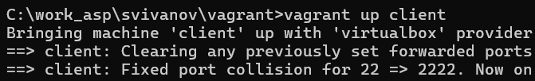

---
## Front matter
title: "Отчет по лабораторной работе №4"
subtitle: "Дисциплина: Администрирование сетевых подсистем"
author: "Иванов Сергей Владимирович"

## Generic otions
lang: ru-RU
toc-title: "Содержание"

## Bibliography
bibliography: bib/cite.bib
csl: pandoc/csl/gost-r-7-0-5-2008-numeric.csl

## Pdf output format
toc: true # Table of contents
toc-depth: 2
lof: true # List of figures
fontsize: 12pt
linestretch: 1.5
papersize: a4
documentclass: scrreprt
## I18n polyglossia
polyglossia-lang:
  name: russian
  options:
	- spelling=modern
	- babelshorthands=true
polyglossia-otherlangs:
  name: english
## I18n babel
babel-lang: russian
babel-otherlangs: english
## Fonts
mainfont: PT Serif
romanfont: PT Serif
sansfont: PT Sans
monofont: PT Mono
mainfontoptions: Ligatures=TeX
romanfontoptions: Ligatures=TeX
sansfontoptions: Ligatures=TeX,Scale=MatchLowercase
monofontoptions: Scale=MatchLowercase,Scale=0.9
## Biblatex
biblatex: true
biblio-style: "gost-numeric"
biblatexoptions:
  - parentracker=true
  - backend=biber
  - hyperref=auto
  - language=auto
  - autolang=other*
  - citestyle=gost-numeric
## Pandoc-crossref LaTeX customization
figureTitle: "Рис."
listingTitle: "Листинг"
lofTitle: "Список иллюстраций"
lolTitle: "Листинги"
## Misc options
indent: true
header-includes:
  - \usepackage{indentfirst}
  - \usepackage{float} # keep figures where there are in the text
  - \floatplacement{figure}{H} # keep figures where there are in the text
---

# Цель работы

Целью данной работы является приобретение практических навыков по установке и базовому конфигурированию
HTTP-сервера Apache.

# Задание

1. Установите необходимые для работы HTTP-сервера пакеты (см. раздел 4.4.1).
2. Запустите HTTP-сервер с базовой конфигурацией и проанализируйте его работу
(см. разделы 4.4.2 и 4.4.3).
3. Настройте виртуальный хостинг (см. раздел 4.4.4).
4. Напишите скрипт для Vagrant, фиксирующий действия по установке и настройке
HTTP-сервера во внутреннем окружении виртуальной машины server. Соответствующим образом внесите изменения в Vagrantfile (см. раздел 4.4.5).

# Выполнение лабораторной работы

## Установка HTTP-сервера

Загрузим операционную систему и перейдем в рабочий каталог с проектом: cd /var/tmp/user_name/vagrant .
Запустим виртуальную машину server: vagrant up server . (рис. 1).

{#fig:001 width=70%}

На виртуальной машине server войдем под пользователем и откроем терминал. Перейдем в режим суперпользователя. Установим из репозитория стандартный веб-сервер (HTTP-сервер и утилиты httpd, криптоутилиты и пр.):

LANG=C yum grouplist

dnf -y groupinstall "Basic Web Server" (рис. 2).

{#fig:002 width=70%}

## Базовое конфигурирование HTTP-сервера

Просмотрим и прокомментируем содержание конфигурационных файлов
в каталогах /etc/httpd/conf и /etc/httpd/conf.d. 

Файл httpd.conf - основной конфигурационный файл

- Содержит базовые директивы: порт прослушивания (80), пользователь/группа (apache), корневой каталог (/etc/httpd)

- Настройки безопасности: запрещен доступ к корневой файловой системе, разрешен только к /var/www

- DocumentRoot установлен в /var/www/html

- Настроены MIME-типы, кодировка UTF-8 по умолчанию

- Включены модули из conf.modules.d/*.conf

- Логирование: error_log и access_log в combined формате (рис. 3)

{#fig:003 width=70%}

Файл autoindex.conf - документация Apache

- Предоставляет доступ к руководству Apache по пути /manual

- Alias /manual → /usr/share/httpd/manual

- Настроено перенаправление для языковых версий документации

- Разрешен индексный просмотр каталогов (Options Indexes) (рис. 4) 

{#fig:004 width=70%}

Файл fcgid.conf - доступ к домашним каталогам пользователей

- Отключен по умолчанию (UserDir disabled) из соображений безопасности

- Если включить, будет доступ к ~user/public_html

- Требует правильных прав доступа: 711 на home, 755 на public_html

- Содержит закомментированный пример включения (UserDir public_html) (рис. 5)

{#fig:005 width=70%}

Файл manual.conf - приветственная страница

- Показывает стандартную страницу Apache при отсутствии index.html

- Срабатывает по LocationMatch "^/+$" (корневой URL)

- Использует ErrorDocument 403 для отображения страницы /.noindex.html

- Содержит aliases для иконок и изображений страницы (рис. 6)

{#fig:006 width=70%}

Файл ssl.conf - SSL/TLS конфигурация

- Настройки HTTPS на порту 443

- Глобальные SSL параметры: кэш сессий, таймауты, криптографические устройства

- Виртуальный хост по умолчанию для HTTPS

- Использует самоподписанные сертификаты (localhost.crt/key)

- Современные настройки безопасности: honor cipher order, системный профиль шифров

- Особые настройки для старых версий IE

- Отдельное логирование SSL запросов (рис. 7)

{#fig:007 width=70%}

Файл userdir.conf - доступ к домашним каталогам пользователей

- Отключен по умолчанию (UserDir disabled) из соображений безопасности

- Если включить, будет доступ к ~user/public_html

- Требует правильных прав доступа: 711 на home, 755 на public_html

- Содержит закомментированный пример включения (UserDir public_html) (рис. 8)

{#fig:008 width=70%}

Файл welcome.conf - приветственная страница

- Показывает стандартную страницу Apache при отсутствии index.html

- Срабатывает по LocationMatch "^/+$" (корневой URL)

- Использует ErrorDocument 403 для отображения страницы /.noindex.html

- Содержит aliases для иконок и изображений страницы(рис. 9)

{#fig:009 width=70%}

Внесем изменения в настройки межсетевого экрана узла server, разрешив работу
с http:

firewall-cmd --list-services

firewall-cmd --get-services

firewall-cmd --add-service=http

firewall-cmd --add-service=http --permanent (рис. 10)

{#fig:010 width=70%}

В дополнительном терминале запустим в режиме реального времени расширенный лог системных сообщений, чтобы проверить корректность работы системы:
journalctl -x -f. В первом терминале активируем и запустим HTTP-сервер:

systemctl enable httpd

systemctl start httpd

Просмотрев расширенный лог системных сообщений, убедимся, что веб-сервер
успешно запустился. Видим, что это действительно так. (рис. 11)

{#fig:011 width=70%}

## Анализ работы HTTP-сервера

Запустим виртуальную машину client: vagrant up client. (рис. 12)

{#fig:012 width=70%}

На виртуальной машине server просмотрим лог ошибок работы веб-сервера: tail -f /var/log/httpd/error_log (рис. 13)

{#fig:013 width=70%}
 
На виртуальной машине server запустим мониторинг доступа к веб-серверу: tail -f /var/log/httpd/access_log (рис. 14)

{#fig:014 width=70%}

На виртуальной машине client запустим браузер и в адресной строке введем
192.168.1.1. Видим, что открылась приветственная страница http сервера. (рис. 15)

{#fig:015 width=70%}

Проанализируем информацию, отобразившуюся при мониторинге: 

- Сервер работает: HTTP-сервер Apache запущен, принимает входящие соединения и корректно обрабатывает запросы.

- Проблема с контентом: проблема — отсутствует индексный файл index.html в корневой директории сайта, что приводит к ошибке 403 Forbidden при обращении к /.

- Доступ к статике работает: Запросы к конкретным файлам (.png) обрабатываются успешно (код 200), что подтверждает правильность работы сервера для статического контента.

- Источник запросов: Запросы поступают с IP-адреса 192.168.1.30 на адрес сервера 192.168.1.1. (рис. 16)

{#fig:016 width=70%}

## Настройка виртуального хостинга для HTTP-сервера

Остановим работу DNS-сервера для внесения изменений в файлы описания DNSзон:
systemctl stop named. Добавим запись для HTTP-сервера в конце файла прямой DNS-зоны /var/named/master/fz/user.net:
www A 192.168.1.1 (рис. 17)

{#fig:017 width=70%}

И в конце файла обратной зоны /var/named/master/rz/192.168.1:
1 PTR www.user.net.
Вместо user укажем свой логин.  (рис. 18)

{#fig:018 width=70%}

Перезапустим DNS-сервер:
systemctl start named. В каталоге /etc/httpd/conf.d создадим файлы server.user.net.conf и
www.user.net.conf:

cd /etc/httpd/conf.d

touch server.user.net.conf

touch www.user.net.conf (рис. 19)

{#fig:019 width=70%}

Откроем на редактирование файл server.svivanov.net.conf и внесем следующее содержание: (рис. 20)

{#fig:020 width=70%}

Откроем на редактирование файл www.svivanov.net.conf и внесем следующее содержание: (рис. 21)

{#fig:021 width=70%}

Открем на редактирование файл index.html и внесем следующее содержание:
Welcome to the server.svivanov.net server. (рис. 22)

{#fig:022 width=70%}

Для виртуального веб-сервера www.svivanov.net:

cd /var/www/html

mkdir www.user.net

cd /var/www/html/www.user.net

touch index.html (рис. 23)

{#fig:023 width=70%}

Откроем на редактирование файл index.html и внесем следующее содержание:
Welcome to the www.user.net server. (рис. 24)

{#fig:024 width=70%}

Скорректируем права доступа в каталог с веб-контентом: chown -R apache:apache /var/www. 
Восстановим контекст безопасности в SELinux:

restorecon -vR /etc

restorecon -vR /var/named

restorecon -vR /var/www

Перезапустим HTTP-сервер: systemctl restart httpd (рис. 25)

{#fig:025 width=70%}

На виртуальной машине client убедимся в корректном доступе к веб-серверу по адресам server.svivanov.net и www.svivanov.net в адресной
строке веб-браузера. (рис. 26, 27)

{#fig:026 width=70%}

{#fig:027 width=70%}

## Внесение изменений в настройки внутреннего окружения виртуальной машины

На виртуальной машине server перейдем в каталог для внесения изменений
в настройки внутреннего окружения /vagrant/provision/server/, создадим в нём
каталог http, в который поместим в соответствующие подкаталоги конфигурационные файлы HTTP-сервера:

cd /vagrant/provision/server

mkdir -p /vagrant/provision/server/http/etc/httpd/conf.d

mkdir -p /vagrant/provision/server/http/var/www/html

cp -R /etc/httpd/conf.d/* /vagrant/provision/server/http/etc/httpd/conf.d/

cp -R /var/www/html/* /vagrant/provision/server/http/var/www/html (рис. 28)

{#fig:028 width=70%}

Заменим конфигурационные файлы DNS-сервера:

cd /vagrant/provision/server/dns/

cp -R /var/named/* /vagrant/provision/server/dns/var/named/ (рис. 29)

{#fig:029 width=70%}

В каталоге /vagrant/provision/server создадим исполняемый файл http.sh:

cd /vagrant/provision/server

touch http.sh

chmod +x http.sh

Открыв его на редактирование, пропишем в нём следующий скрипт: (рис. 30)

{#fig:030 width=70%}

Для отработки созданного скрипта во время загрузки виртуальных машин в конфигурационном файле Vagrantfile необходимо добавить в конфигурации сервера
следующую запись: (рис. 31)

{#fig:031 width=70%}

# Ответы на контрольные вопросы

**1. Через какой порт по умолчанию работает Apache?**

- Порт 80 для HTTP-трафика (незашифрованного).

- Порт 443 для HTTPS-трафика (зашифрованного, если настроен SSL/TLS).

**2. Под каким пользователем запускается Apache и к какой группе относится этот пользователь?**

- Пользователь: apache

- Группа: apache

**3. Где располагаются лог-файлы веб-сервера? Что можно по ним отслеживать?**

Access Log (лог доступа): /var/log/httpd/access_log. Содержит: успешные и неудачные запросы к серверу.

Отслеживает:

- Источники трафика (IP-адреса).

- Запрашиваемые ресурсы (URL).

- Коды ответов (200 OK, 404 Not Found, 403 Forbidden, 500 Internal Server Error) для выявления ошибок.

- User-Agent (браузеры, боты, скрипты).

- Время обработки запросов.

- Referrer (откуда пришел посетитель).

Error Log (лог ошибок): /var/log/httpd/error_log. Содержит: сообщения об ошибках сервера, предупреждения и диагностическую информацию.

Отслеживает:

- Причины сбоев (например, ошибки в PHP-скриптах, проблемы с правами доступа к файлам).

- Предупреждения о неправильной конфигурации.

- Информацию о запуске и остановке сервера.

**4. Где по умолчанию содержится контент веб-серверов?**

По пути /var/www/html/

**5. Каким образом реализуется виртуальный хостинг? Что он даёт?**

Сервер определяет, какой сайт показывать, на основе заголовка Host: в HTTP-запросе. Например, для domain1.com и domain2.com, указывающих на один IP-адрес, сервер по этому заголовку поймёт, чей контент отдавать.

Как настроить: В директории /etc/httpd/conf.d/ создаются отдельные конфигурационные файлы для каждого сайта (например, domain1.conf, domain2.conf).

# Выводы

В ходе выполнения лабораторной работы мы приобрели практическиt навыки по установке и базовому конфигурированию
HTTP-сервера Apache.