---
## Front matter
lang: ru-RU
title: Лабораторная работа №5
subtitle: Администрирование сетевых подсистем
author:
  - Иванов Сергей Владимирович, НПИбд-01-23
institute:
  - Российский университет дружбы народов, Москва, Россия
date: 30 сентября 2025

## i18n babel
babel-lang: russian
babel-otherlangs: english

## Formatting pdf
toc: false
slide_level: 2
aspectratio: 169
section-titles: true
theme: metropolis
header-includes:
 - \metroset{progressbar=frametitle,sectionpage=progressbar,numbering=fraction}
 - '\makeatletter'
 - '\beamer@ignorenonframefalse'
 - '\makeatother'

 ## Fonts
mainfont: PT Serif
romanfont: PT Serif
sansfont: PT Sans
monofont: PT Mono
mainfontoptions: Ligatures=TeX
romanfontoptions: Ligatures=TeX
sansfontoptions: Ligatures=TeX,Scale=MatchLowercase
monofontoptions: Scale=MatchLowercase,Scale=0.9
---

## Цель работы

Целью этой работы является приобретение практических навыков по расширенному конфигурированию HTTPсервера Apache в части безопасности и возможности использования PHP.

## Задание

1. Сгенерируйте криптографический ключ и самоподписанный сертификат безопасности для возможности перехода веб-сервера от работы через протокол HTTP
к работе через протокол HTTPS (см. раздел 5.4.1).
2. Настройте веб-сервер для работы с PHP (см. раздел 5.4.2).
3. Напишите (или скорректируйте) скрипт для Vagrant, фиксирующий действия по
расширенной настройке HTTP-сервера во внутреннем окружении виртуальной
машины server (см. раздел 5.4.3).

# Выполнение работы

## Конфигурирование HTTP-сервера для работы через протокол HTTPS

Загрузим операционную систему и перейдем в рабочий каталог с проектом, запустим виртуальную машину server. (рис. 1).

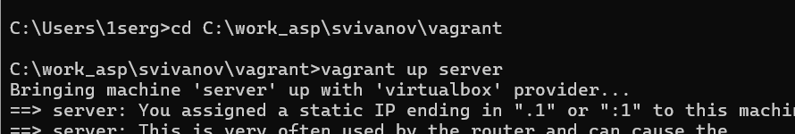{#fig:001 width=70%}

## Конфигурирование HTTP-сервера для работы через протокол HTTPS

На виртуальной машине server войдем под пользователем и откроем терминал. Перейдем в режим суперпользователя. В каталоге /etc/ssl создадим каталог private (рис. 2).

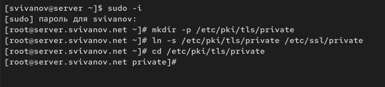{#fig:002 width=70%}

## Конфигурирование HTTP-сервера для работы через протокол HTTPS

Сгенерируем ключ и сертификат, используя команду: (рис. 3)

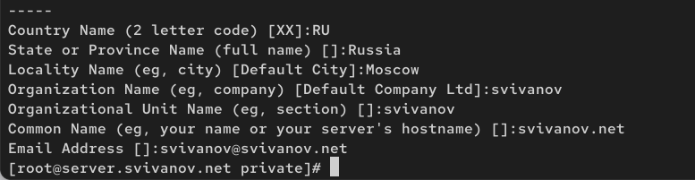{#fig:003 width=70%}

## Конфигурирование HTTP-сервера для работы через протокол HTTPS

Сгенерированные ключ и сертификат появятся в каталоге
/etc/ssl/private. Скопируем сертификат в каталог /etc/ssl/certs: (рис. 4) 

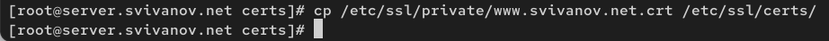{#fig:004 width=70%}

## Конфигурирование HTTP-сервера для работы через протокол HTTPS

Для перехода веб-сервера www.svivanov.net на функционирование через протокол
HTTPS нужно изменить его конфигурационный файл. Перейдем в каталог
с конфигурационными файлами: cd /etc/httpd/conf.d. Откроем на редактирование файл /etc/httpd/conf.d/www.svivanov.net.conf и заменим его содержимое на следующее: (рис. 5)

## Конфигурирование HTTP-сервера для работы через протокол HTTPS

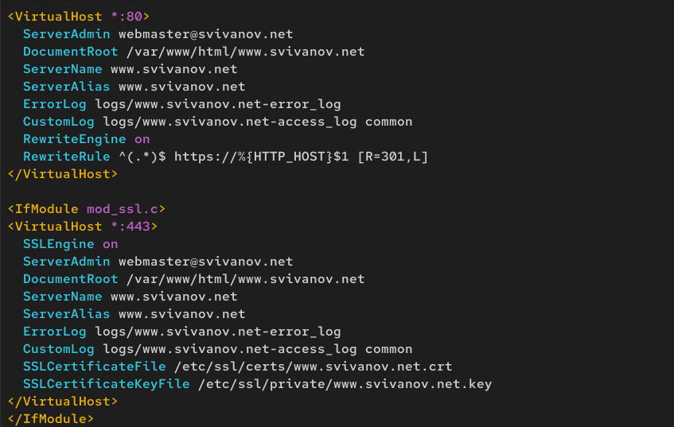{#fig:005 width=70%}

## Конфигурирование HTTP-сервера для работы через протокол HTTPS

Внесем изменения в настройки межсетевого экрана на сервере, разрешив работу
с https: (рис. 6)

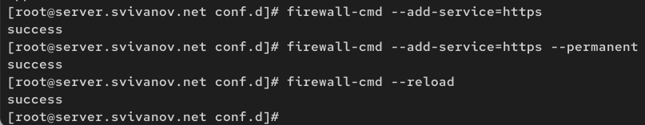{#fig:006 width=70%}

## Конфигурирование HTTP-сервера для работы через протокол HTTPS

Перезапустим веб-сервер: systemctl restart httpd (рис. 7)

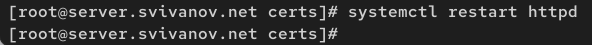{#fig:007 width=70%}

## Конфигурирование HTTP-сервера для работы через протокол HTTPS

На виртуальной машине client в строке браузера введем название веб-сервера  и убедимся, что произойдёт автоматическое переключение на работу по протоколу HTTPS. (рис. 8)

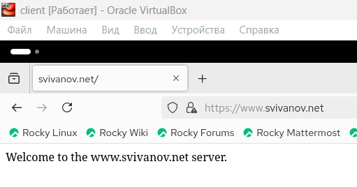{#fig:008 width=70%}

## Конфигурирование HTTP-сервера для работы через протокол HTTPS

На открывшейся странице с сообщением о незащищённости соединения нажмем кнопку «Дополнительно», добавим адрес сервера в постоянные исключения. (рис. 9)

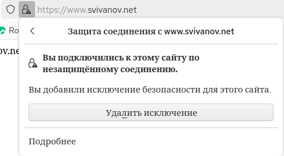{#fig:009 width=70%}

## Конфигурирование HTTP-сервера для работы через протокол HTTPS

Затем просмотрим содержание сертификата. (рис. 10)

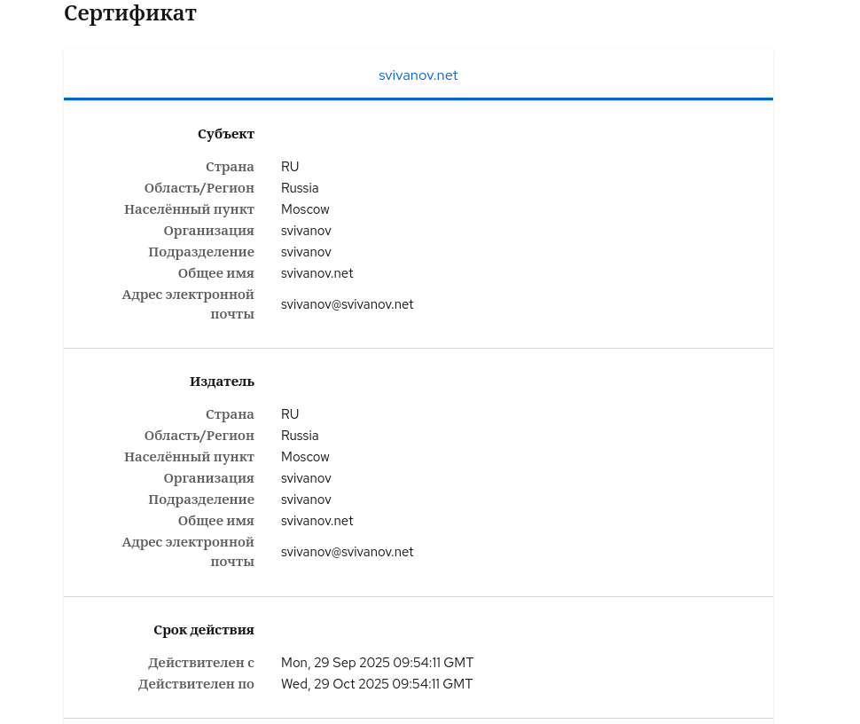{#fig:010 width=70%}

## Конфигурирование HTTP-сервера для работы с PHP

Установим пакеты для работы с PHP: dnf -y install php. (рис. 11)

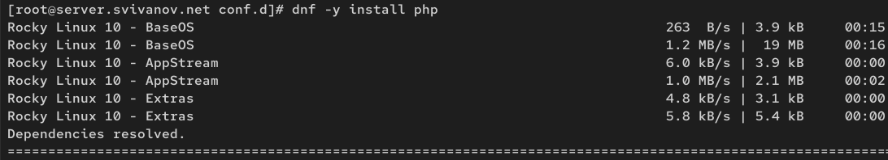{#fig:011 width=70%}

## Конфигурирование HTTP-сервера для работы с PHP

В каталоге /var/www/html/www.svivanov.net заменим файл index.html на index.php следующего содержания: (рис. 12)

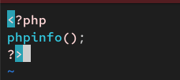{#fig:012 width=70%}

## Конфигурирование HTTP-сервера для работы с PHP

Скорректируем права доступа в каталог с веб-контентом, восстановим контекст безопасности в SELinux, перезапустим HTTP-сервер (рис. 13)

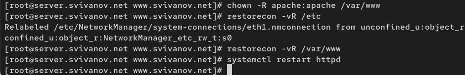{#fig:013 width=70%}
 
## Внесение изменений в настройки внутреннего окружения виртуальной машины

На виртуальной машине client в строке браузера введем название веб-сервера  и убедимся, что будет выведена
страница с информацией об используемой на веб-сервере версии PHP. (рис. 14)

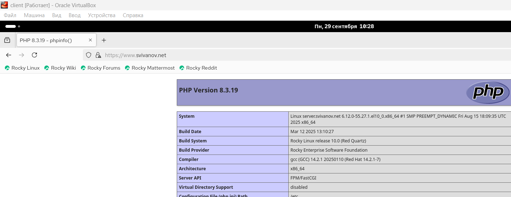{#fig:014 width=70%}

## Внесение изменений в настройки внутреннего окружения виртуальной машины

На виртуальной машине server перейдем в каталог для внесения изменений
в настройки внутреннего окружения /vagrant/provision/server/http и в соответствующие каталоги скопируем конфигурационные файлы (рис. 15)

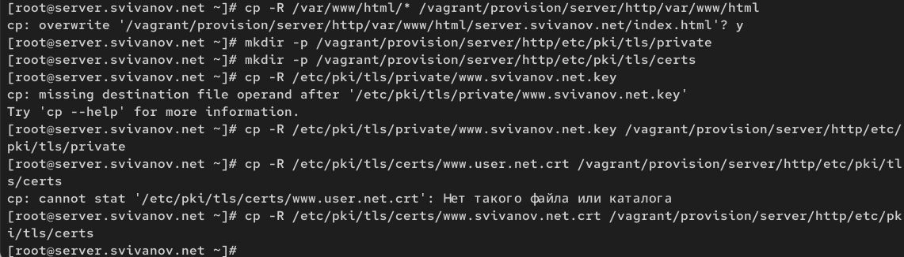{#fig:015 width=70%}

## Внесение изменений в настройки внутреннего окружения виртуальной машины

В имеющийся скрипт /vagrant/provision/server/http.sh внесем изменения, добавив установку PHP и настройку межсетевого экрана, разрешающую работать
с https. (рис. 16)

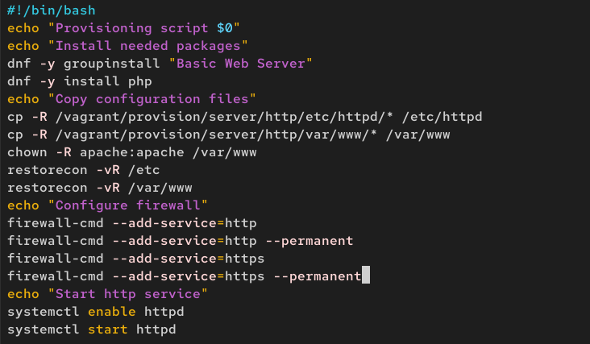{#fig:016 width=70%}

# Вывод

## Вывод 

В ходе выполнения лабораторной работы мы приобрели практические навыков по расширенному конфигурированию HTTPсервера Apache в части безопасности и возможности использования PHP.

 
