---
## Front matter
title: "Отчет по лабораторной работе №5"
subtitle: "Дисциплина: Администрирование сетевых подсистем"
author: "Иванов Сергей Владимирович"

## Generic otions
lang: ru-RU
toc-title: "Содержание"

## Bibliography
bibliography: bib/cite.bib
csl: pandoc/csl/gost-r-7-0-5-2008-numeric.csl

## Pdf output format
toc: true # Table of contents
toc-depth: 2
lof: true # List of figures
fontsize: 12pt
linestretch: 1.5
papersize: a4
documentclass: scrreprt
## I18n polyglossia
polyglossia-lang:
  name: russian
  options:
	- spelling=modern
	- babelshorthands=true
polyglossia-otherlangs:
  name: english
## I18n babel
babel-lang: russian
babel-otherlangs: english
## Fonts
mainfont: PT Serif
romanfont: PT Serif
sansfont: PT Sans
monofont: PT Mono
mainfontoptions: Ligatures=TeX
romanfontoptions: Ligatures=TeX
sansfontoptions: Ligatures=TeX,Scale=MatchLowercase
monofontoptions: Scale=MatchLowercase,Scale=0.9
## Biblatex
biblatex: true
biblio-style: "gost-numeric"
biblatexoptions:
  - parentracker=true
  - backend=biber
  - hyperref=auto
  - language=auto
  - autolang=other*
  - citestyle=gost-numeric
## Pandoc-crossref LaTeX customization
figureTitle: "Рис."
listingTitle: "Листинг"
lofTitle: "Список иллюстраций"
lolTitle: "Листинги"
## Misc options
indent: true
header-includes:
  - \usepackage{indentfirst}
  - \usepackage{float} # keep figures where there are in the text
  - \floatplacement{figure}{H} # keep figures where there are in the text
---

# Цель работы

Целью этой работы является приобретение практических навыков по расширенному конфигурированию HTTPсервера Apache в части безопасности и возможности использования PHP.

# Задание

1. Сгенерируйте криптографический ключ и самоподписанный сертификат безопасности для возможности перехода веб-сервера от работы через протокол HTTP
к работе через протокол HTTPS (см. раздел 5.4.1).
2. Настройте веб-сервер для работы с PHP (см. раздел 5.4.2).
3. Напишите (или скорректируйте) скрипт для Vagrant, фиксирующий действия по
расширенной настройке HTTP-сервера во внутреннем окружении виртуальной
машины server (см. раздел 5.4.3).

# Выполнение лабораторной работы

## Конфигурирование HTTP-сервера для работы через протокол HTTPS

Загрузим операционную систему и перейдем в рабочий каталог с проектом: cd /var/tmp/user_name/vagrant .
Запустим виртуальную машину server: vagrant up server . (рис. 1).

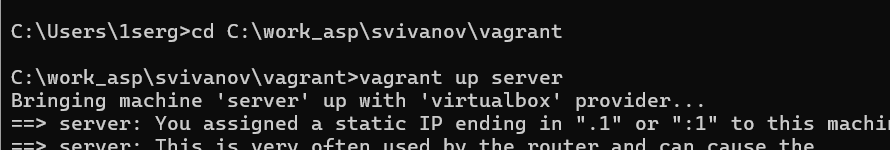{#fig:001 width=70%}

На виртуальной машине server войдем под пользователем и откроем терминал. Перейдем в режим суперпользователя. В каталоге /etc/ssl создадим каталог private:

mkdir -p /etc/pki/tls/private

ln -s /etc/pki/tls/private /etc/ssl/private

cd /etc/pki/tls/private (рис. 2).

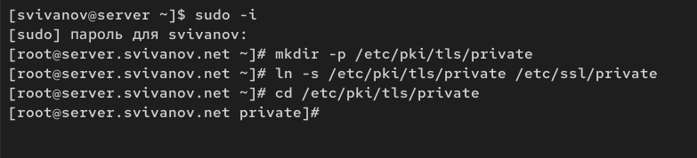{#fig:002 width=70%}

Сгенерируем ключ и сертификат, используя следующую команду:

openssl req -x509 -nodes -newkey rsa:2048 -keyout www.svivanov.net.key -out www.svivanov.net.crt

mv www.svivanov.net.crt /etc/pki/tls/certs (рис. 3)

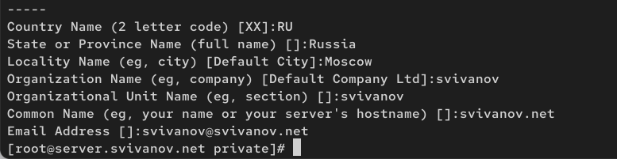{#fig:003 width=70%}

Сгенерированные ключ и сертификат появятся в соответствующем каталоге
/etc/ssl/private. Скопируем сертификат в каталог /etc/ssl/certs: cp /etc/ssl/private/www.svivanov.net.crt /etc/ssl/cert/ (рис. 4) 

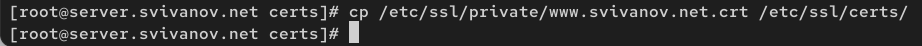{#fig:004 width=70%}

Для перехода веб-сервера www.svivanov.net на функционирование через протокол
HTTPS требуется изменить его конфигурационный файл. Перейдем в каталог
с конфигурационными файлами: cd /etc/httpd/conf.d. Откроем на редактирование файл /etc/httpd/conf.d/www.svivanov.net.conf и заменим его содержимое на следующее: (рис. 5)

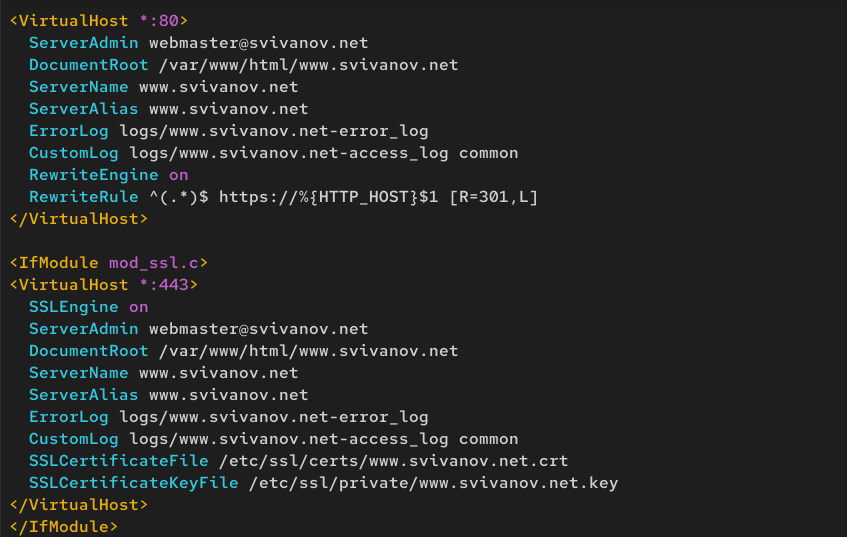{#fig:005 width=70%}

Внесем изменения в настройки межсетевого экрана на сервере, разрешив работу
с https:

firewall-cmd --list-services

firewall-cmd --get-services

firewall-cmd --add-service=https

firewall-cmd --add-service=https --permanent

firewall-cmd --reload (рис. 6)

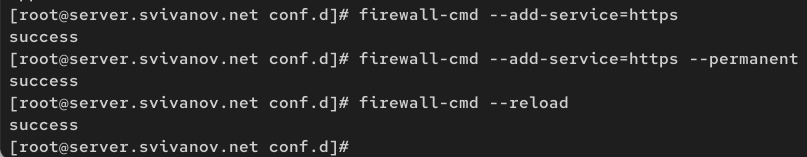{#fig:006 width=70%}

Перезапустим веб-сервер: systemctl restart httpd (рис. 7)

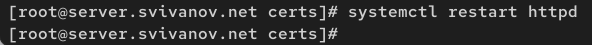{#fig:007 width=70%}

На виртуальной машине client в строке браузера введем название веб-сервера
www.svivanov.net и убедимся, что произойдёт автоматическое переключение на работу по протоколу HTTPS. (рис. 8)

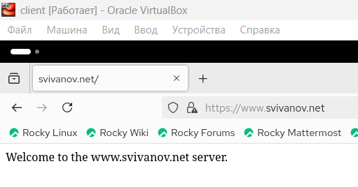{#fig:008 width=70%}

На открывшейся странице с сообщением о незащищённости соединения нажмем кнопку «Дополнительно»,
затем добавим адрес вашего сервера в постоянные исключения. (рис. 9)

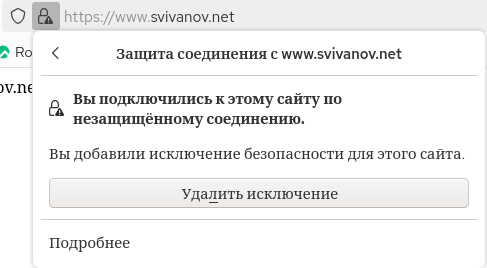{#fig:009 width=70%}

Затем просмотрим содержание сертификата. (рис. 10)

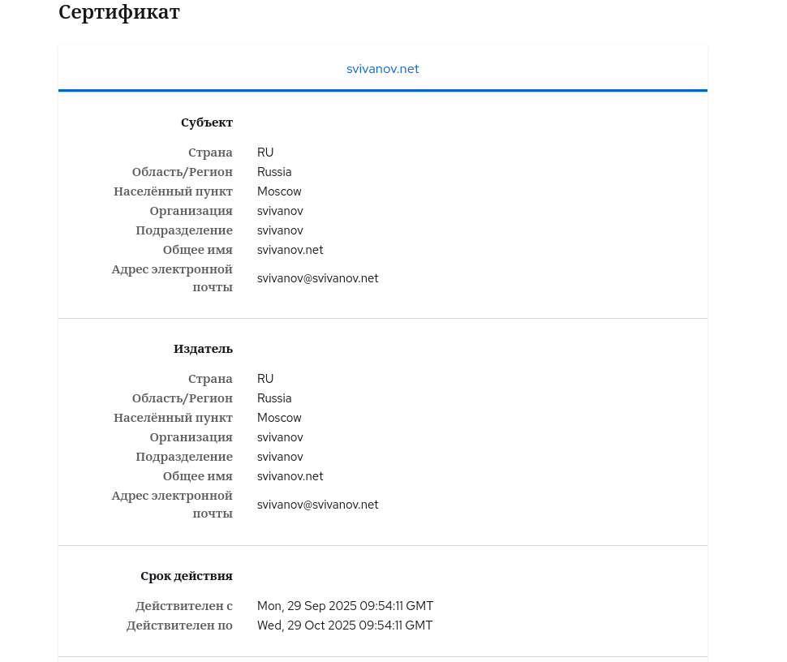{#fig:010 width=70%}

## Конфигурирование HTTP-сервера для работы с PHP

Установим пакеты для работы с PHP: dnf -y install php. (рис. 11)

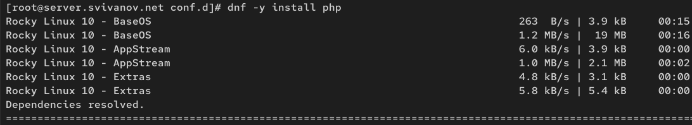{#fig:011 width=70%}

В каталоге /var/www/html/www.svivanov.net заменим файл index.html на index.php следующего содержания: (рис. 12)

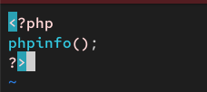{#fig:012 width=70%}

Скорректируем права доступа в каталог с веб-контентом:

chown -R apache:apache /var/www

Восстановим контекст безопасности в SELinux:

restorecon -vR /etc

restorecon -vR /var/www

Перезапустим HTTP-сервер:

systemctl restart httpd (рис. 13)

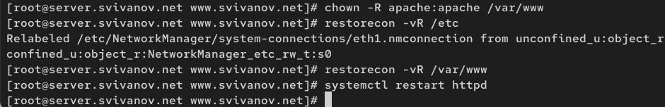{#fig:013 width=70%}
 
## Внесение изменений в настройки внутреннего окружения виртуальной машины

На виртуальной машине client в строке браузера введем название веб-сервера
www.svivanov.net и убедимся, что будет выведена
страница с информацией об используемой на веб-сервере версии PHP. (рис. 14)

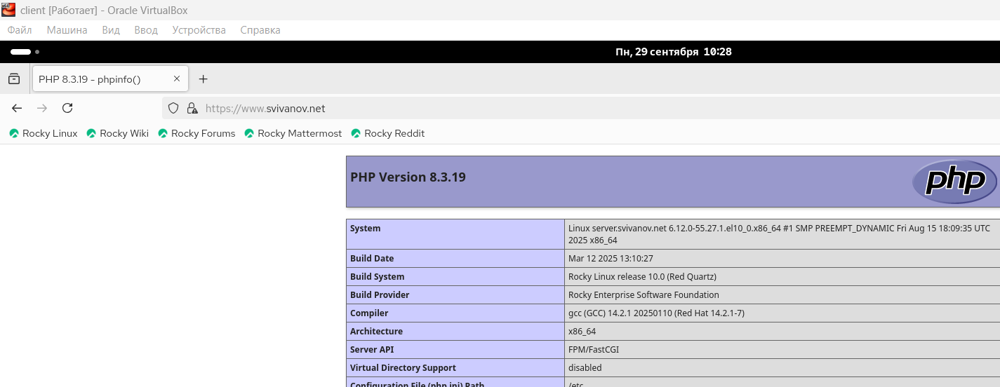{#fig:014 width=70%}

На виртуальной машине server перейдем в каталог для внесения изменений
в настройки внутреннего окружения /vagrant/provision/server/http и в соответствующие каталоги скопируем конфигурационные файлы:

cp -R /etc/httpd/conf.d/* /vagrant/provision/server/http/etc/httpd/conf.d

cp -R /var/www/html/* /vagrant/provision/server/http/var/www/html

mkdir -p /vagrant/provision/server/http/etc/pki/tls/private

mkdir -p /vagrant/provision/server/http/etc/pki/tls/certs

cp -R /etc/pki/tls/private/www.svivanov.net.key /vagrant/provision/server/http/etc/pki/tls/private

cp -R /etc/pki/tls/certs/www.svivanov.net.crt /vagrant/provision/server/http/etc/pki/tls/certs (рис. 15)

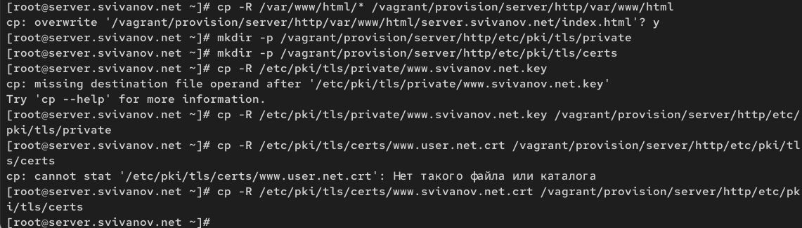{#fig:015 width=70%}

В имеющийся скрипт /vagrant/provision/server/http.sh внесем изменения, добавив установку PHP и настройку межсетевого экрана, разрешающую работать
с https. (рис. 16)

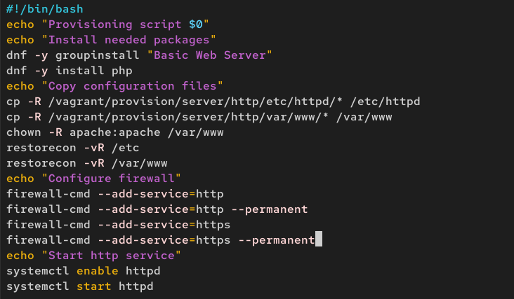{#fig:016 width=70%}

# Ответы на контрольные вопросы

**1. В чём отличие HTTP от HTTPS?**

HTTP - это стандартный протокол для передачи данных, который не использует шифрование. Все данные (логины, пароли) передаются в открытом виде.

HTTPS - это безопасная версия HTTP, которая шифрует весь трафик между браузером и сервером с помощью протокола SSL/TLS.

Отличие в том, что HTTPS обеспечивает конфиденциальность и целостность данных, а HTTP - нет.

**2. Каким образом обеспечивается безопасность контента веб-сервера при работе через HTTPS?**

Безопасность обеспечивается протоколом SSL/TLS по трем направлениям:

1. Шифрование: Все данные передаются в зашифрованном виде, что защищает их от перехвата.

2. Аутентификация: Сервер предъявляет браузеру цифровой сертификат, подтверждающий его подлинность.

3. Целостность: Специальные механизмы гарантируют, что данные не были изменены при передаче.

**3. Что такое сертификационный центр? Приведите пример.**

Сертификационный центр (Certificate Authority, CA) - это доверенная организация, которая выпускает цифровые сертификаты для веб-сайтов.

Он проверяет владельца домена и digitally подписывает сертификат. Браузеры доверяют сертификатам от известных ЦС, чьи корневые сертификаты в них предустановлены.

Примеры: Let's Encrypt (бесплатный), DigiCert, Sectigo.

# Выводы

В ходе выполнения лабораторной работы мы приобрели практические навыков по расширенному конфигурированию HTTPсервера Apache в части безопасности и возможности использования PHP.