---
## Front matter
lang: ru-RU
title: Лабораторная работа №6
subtitle: Администрирование сетевых подсистем
author:
  - Иванов Сергей Владимирович, НПИбд-01-23
institute:
  - Российский университет дружбы народов, Москва, Россия
date: 09 октября 2025

## i18n babel
babel-lang: russian
babel-otherlangs: english

## Formatting pdf
toc: false
slide_level: 2
aspectratio: 169
section-titles: true
theme: metropolis
header-includes:
 - \metroset{progressbar=frametitle,sectionpage=progressbar,numbering=fraction}
 - '\makeatletter'
 - '\beamer@ignorenonframefalse'
 - '\makeatother'

 ## Fonts
mainfont: PT Serif
romanfont: PT Serif
sansfont: PT Sans
monofont: PT Mono
mainfontoptions: Ligatures=TeX
romanfontoptions: Ligatures=TeX
sansfontoptions: Ligatures=TeX,Scale=MatchLowercase
monofontoptions: Scale=MatchLowercase,Scale=0.9
---

## Цель работы

Целью этой работы является приобретение практических навыков по установке и конфигурированию системы
управления базами данных на примере программного обеспечения MariaDB.

## Задание

1. Установите необходимые для работы MariaDB пакеты (см. раздел 6.4.1).
2. Настройте в качестве кодировки символов по умолчанию utf8 в базах данных.
3. В базе данных MariaDB создайте тестовую базу addressbook, содержащую таблицу
city с полями name и city, т.е., например, для некоторого сотрудника указан город,
в котором он работает (см. раздел 6.4.1).
4. Создайте резервную копию базы данных addressbook и восстановите из неё данные
(см. раздел 6.4.1).
5. Напишите скрипт для Vagrant, фиксирующий действия по установке и настройке
базы данных MariaDB во внутреннем окружении виртуальной машины server. Соответствующим образом следует внести изменения в Vagrantfile (см. раздел 6.4.5).

# Выполнение работы

## Установка MariaDB

Загрузим операционную систему и перейдем в рабочий каталог с проектом: cd /var/tmp/user_name/vagrant .
Запустим виртуальную машину server: vagrant up server. (рис. 1).

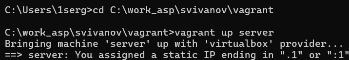{#fig:001 width=70%}

## Установка MariaDB

Войдем под пользователем и откроем терминал. Перейдем в режим суперпользователя. Установим необходимые для работы с базами данных пакеты (рис. 2).

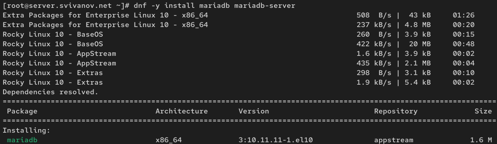{#fig:002 width=70%}

## Установка MariaDB

Просмотрим конфигурационные файлы mariadb в каталоге /etc/my.cnf.d и в файле
/etc/my.cnf. 

Файл auth_gssapi.conf (рис. 3)

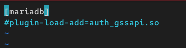{#fig:003 width=70%}

## Установка MariaDB

Файл client.cnf. (рис. 4) 

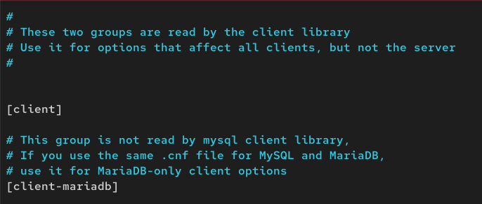{#fig:004 width=70%}

## Установка MariaDB

Файл mariadb-server.cnf. (рис. 5)

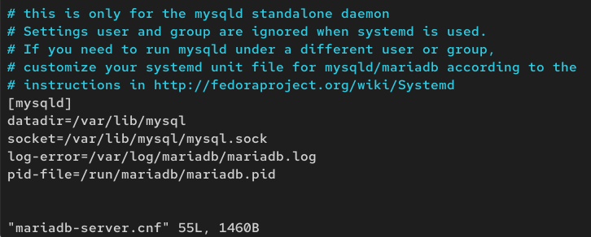{#fig:005 width=70%}

## Установка MariaDB

Файл mysql-clients.cnf. (рис. 6)

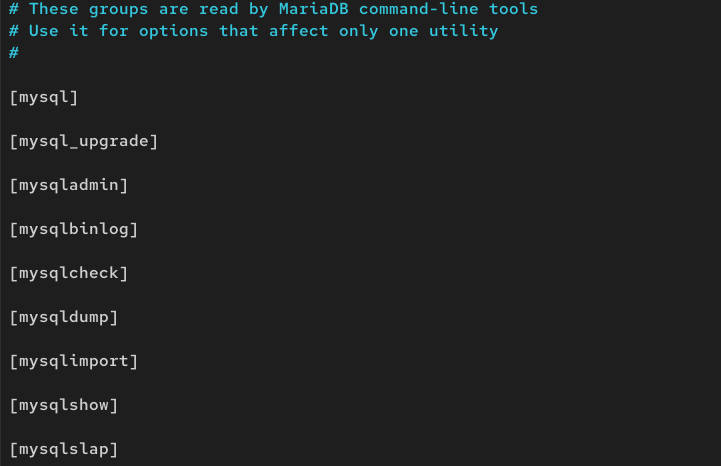{#fig:006 width=70%}

## Установка MariaDB

Файл provider_bzip2.cnf. (рис. 7)

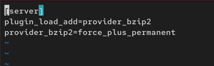{#fig:007 width=70%}

## Установка MariaDB

Файл provider_lz4.cnf. (рис. 8)

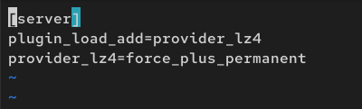{#fig:008 width=70%}

## Установка MariaDB

Файл provider_lzo.cnf. (рис. 9)

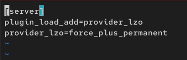{#fig:009 width=70%}

## Установка MariaDB

Файл provider_snappy.cnf. (рис. 10)

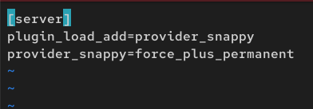{#fig:010 width=70%}

## Установка MariaDB

Файл spider.cnf. (рис. 11)

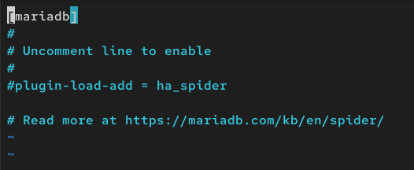{#fig:011 width=70%}

## Установка MariaDB

Файл my.cnf. (рис. 12)

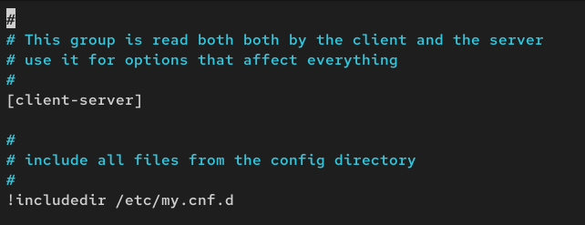{#fig:012 width=70%}

## Установка MariaDB

Запускаем и включаем программное обеспечение mariadb (рис. 13)

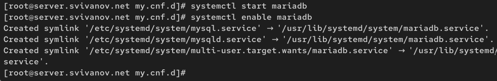{#fig:013 width=70%}
 
## Установка MariaDB

Убедимся, что mariadb прослушивает порт 3306 (рис. 14)

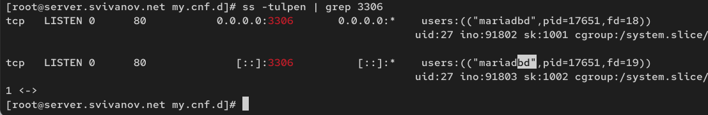{#fig:014 width=70%}

## Установка MariaDB

Запустим скрипт конфигурации безопасности mariadb. С помощью запустившегося диалога и путём выбора Y/n установим пароль для
пользователя root, отключим удалённый корневой доступ и удалим тестовую базу данных и любых анонимных пользователей. (рис. 15)

## Установка MariaDB

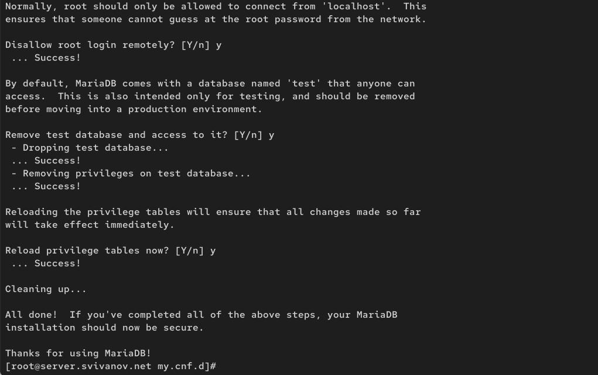{#fig:015 width=70%}

## Установка MariaDB

Для входа в базу данных с правами администратора базы данных введем mysql -u root -p. (рис. 16)

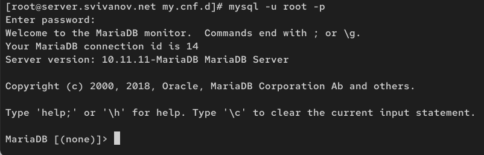{#fig:016 width=70%}

## Установка MariaDB

Просмотрим список команд MySQL, введя h. (рис. 17)

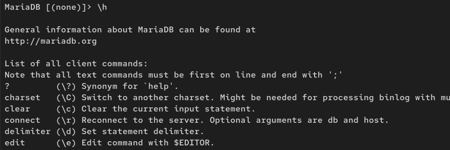{#fig:017 width=70%}

## Установка MariaDB

Из приглашения интерактивной оболочки MariaDB для отображения доступных
в настоящее время баз данных введем MySQL-запрос SHOW DATABASES; 

Были обнаружены четыре системные базы данных (рис. 18)

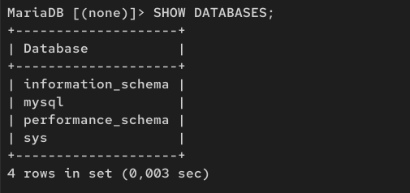{#fig:018 width=70%}

## Конфигурация кодировки символов

Войдем в базу данных с правами администратора. Для отображения статуса MariaDB введем: status (рис. 19)

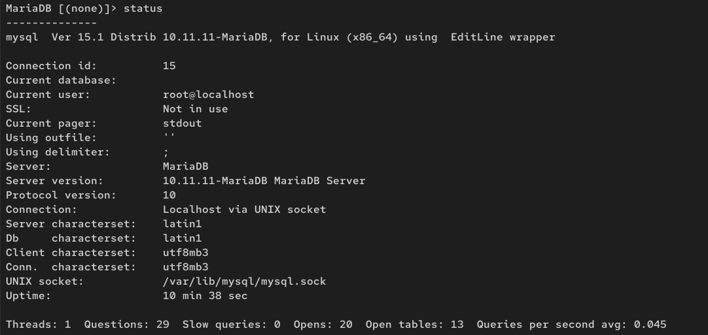{#fig:019 width=70%}

## Конфигурация кодировки символов

В каталоге /etc/my.cnf.d создадим файл utf8.cnf: (рис. 20)

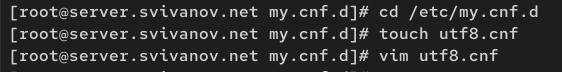{#fig:020 width=70%}

## Конфигурация кодировки символов

Откроем его на редактирование и укажем в нём следующую конфигурацию: (рис. 21)

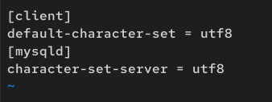{#fig:021 width=70%}

## Конфигурация кодировки символов

Перезапустим MariaDB: systemctl restart mariadb. (рис. 22)

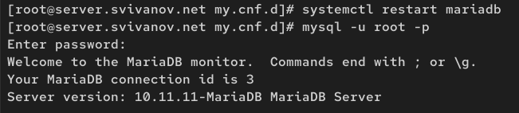{#fig:022 width=70%}

## Конфигурация кодировки символов

Войдем в базу данных с правами администратора и посмотрим статус MariaDB. (рис. 23)

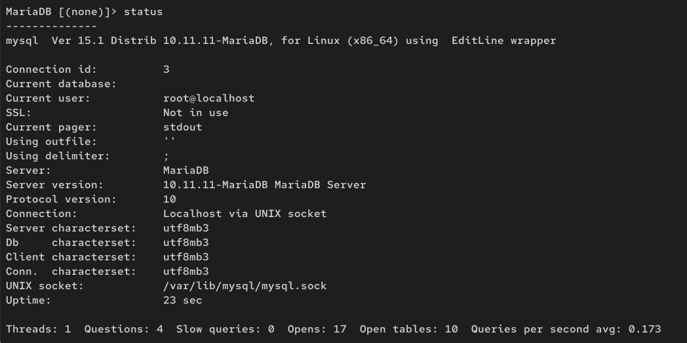{#fig:023 width=70%}

## Создание базы данных

Войдем в базу данных с правами администратора, Создадим базу данных с именем addressbook и отобразим имеющиеся в базе данных addressbook таблицы  (рис. 24)

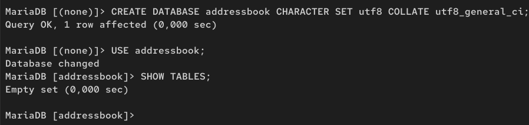{#fig:024 width=70%}

## Создание базы данных

Создадим таблицу city с полями name и city. Заполним несколько строк таблицы (рис. 25)

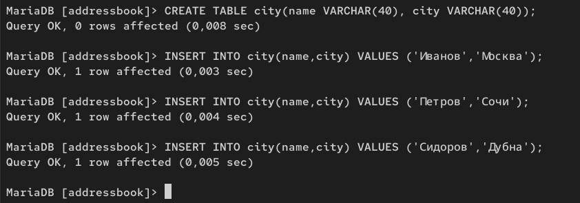{#fig:025 width=70%}

## Создание базы данных

Сделаем следующий MySQL-запрос: SELECT * FROM city; Запрос успешно выполнен и показал содержимое таблицы city из базы данных addressbook. (рис. 26)

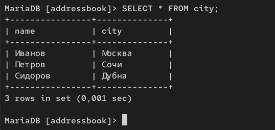{#fig:026 width=70%}

## Создание базы данных

Создадим пользователя для работы с базой данных addressbook и зададим для него пароль. Предоставим права доступа созданному пользователю на действия с базой данных addressbook (рис. 27)

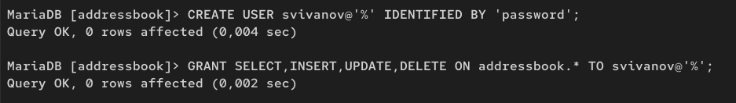{#fig:027 width=70%}

## Создание базы данных

Обновим привилегии базы данных. Посмотрим общую информацию о таблице city базы данных addressbook (рис. 28)

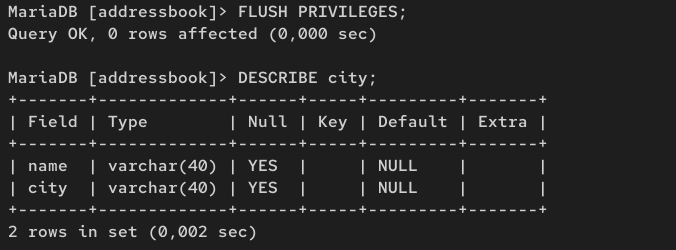{#fig:028 width=70%}

## Создание базы данных

Просмотрим список баз данных. Просмотрим список таблиц базы данных addressbook (рис. 29)

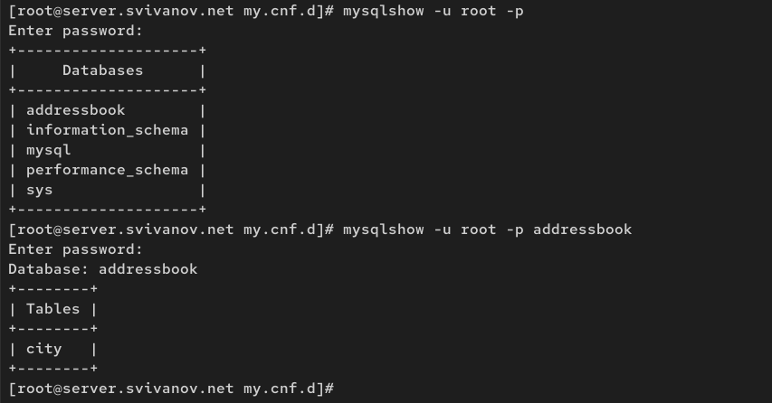{#fig:029 width=70%}

## Резервные копии

На виртуальной машине server создадим каталог для резервных копий. Сделаем резервную копию базы данных addressbook. Сделаем сжатую резервную копию базы данных addressbook, сжатую резервную копию базы данных addressbook с указанием даты создания копии (рис. 30)

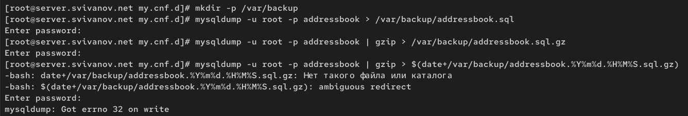{#fig:030 width=70%}

## Резервные копии

Восстановим базу данных addressbook из резервной копии. Восстановим базу данных addressbook из сжатой резервной копии (рис. 31)

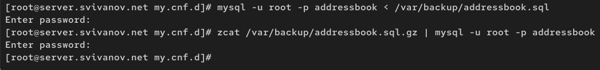{#fig:031 width=70%}

## Резервные копии

На виртуальной машине server перейдем в каталог для внесения изменений
в настройки внутреннего окружения, создадим в нём
каталог mysql, в который поместим в соответствующие подкаталоги конфигурационные файлы MariaDB и резервную копию базы данных addressbook (рис. 32)

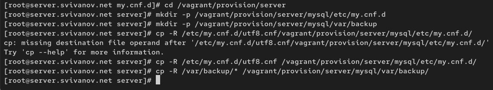{#fig:032 width=70%}

## Резервные копии

В каталоге /vagrant/provision/server создадим исполняемый файл mysql.sh., пропишем в нём скрипт: (рис. 33)

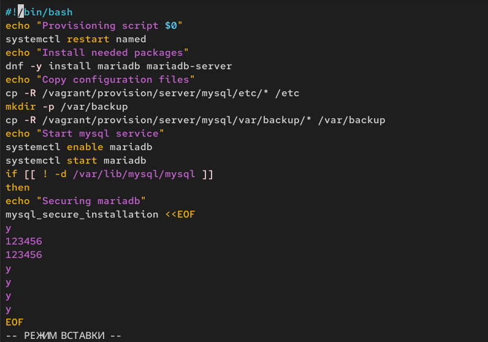{#fig:033 width=70%}

## Резервные копии

Для отработки созданного скрипта во время загрузки виртуальных машин в конфигурационном файле Vagrantfile необходимо добавить в конфигурации сервера запись (рис. 34)

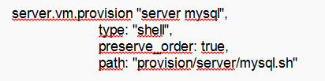{#fig:034 width=70%}

# Вывод

## Вывод 

В ходе выполнения лабораторной работы мы приобрели практические навыков по установке и конфигурированию системы
управления базами данных на примере программного обеспечения MariaDB.

 
