---
## Front matter
title: "Отчет по лабораторной работе №6"
subtitle: "Дисциплина: Администрирование сетевых подсистем"
author: "Иванов Сергей Владимирович"

## Generic otions
lang: ru-RU
toc-title: "Содержание"

## Bibliography
bibliography: bib/cite.bib
csl: pandoc/csl/gost-r-7-0-5-2008-numeric.csl

## Pdf output format
toc: true # Table of contents
toc-depth: 2
lof: true # List of figures
fontsize: 12pt
linestretch: 1.5
papersize: a4
documentclass: scrreprt
## I18n polyglossia
polyglossia-lang:
  name: russian
  options:
	- spelling=modern
	- babelshorthands=true
polyglossia-otherlangs:
  name: english
## I18n babel
babel-lang: russian
babel-otherlangs: english
## Fonts
mainfont: PT Serif
romanfont: PT Serif
sansfont: PT Sans
monofont: PT Mono
mainfontoptions: Ligatures=TeX
romanfontoptions: Ligatures=TeX
sansfontoptions: Ligatures=TeX,Scale=MatchLowercase
monofontoptions: Scale=MatchLowercase,Scale=0.9
## Biblatex
biblatex: true
biblio-style: "gost-numeric"
biblatexoptions:
  - parentracker=true
  - backend=biber
  - hyperref=auto
  - language=auto
  - autolang=other*
  - citestyle=gost-numeric
## Pandoc-crossref LaTeX customization
figureTitle: "Рис."
listingTitle: "Листинг"
lofTitle: "Список иллюстраций"
lolTitle: "Листинги"
## Misc options
indent: true
header-includes:
  - \usepackage{indentfirst}
  - \usepackage{float} # keep figures where there are in the text
  - \floatplacement{figure}{H} # keep figures where there are in the text
---

# Цель работы

Целью этой работы является приобретение практических навыков по установке и конфигурированию системы
управления базами данных на примере программного обеспечения MariaDB.

# Задание

1. Установите необходимые для работы MariaDB пакеты (см. раздел 6.4.1).
2. Настройте в качестве кодировки символов по умолчанию utf8 в базах данных.
3. В базе данных MariaDB создайте тестовую базу addressbook, содержащую таблицу
city с полями name и city, т.е., например, для некоторого сотрудника указан город,
в котором он работает (см. раздел 6.4.1).
4. Создайте резервную копию базы данных addressbook и восстановите из неё данные
(см. раздел 6.4.1).
5. Напишите скрипт для Vagrant, фиксирующий действия по установке и настройке
базы данных MariaDB во внутреннем окружении виртуальной машины server. Соответствующим образом следует внести изменения в Vagrantfile (см. раздел 6.4.5).

# Выполнение лабораторной работы

## Установка MariaDB

Загрузим операционную систему и перейдем в рабочий каталог с проектом: cd /var/tmp/user_name/vagrant .
Запустим виртуальную машину server: vagrant up server. (рис. 1).

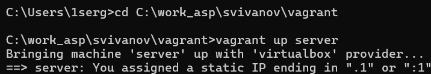{#fig:001 width=70%}

На виртуальной машине server войдем под пользователем и откроем терминал. Перейдем в режим суперпользователя. Установим необходимые для работы с базами данных пакеты:
dnf -y install mariadb mariadb-server (рис. 2).

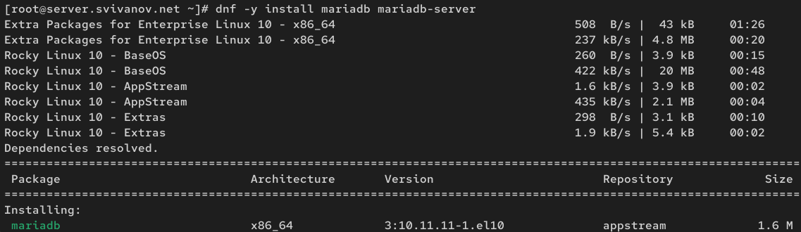{#fig:002 width=70%}

Просмотрим конфигурационные файлы mariadb в каталоге /etc/my.cnf.d и в файле
/etc/my.cnf. 

Файл auth_gssapi.conf. В данном конфигурационном файле auth_gssapi.conf директива, отвечающая за загрузку плагина аутентификации через Kerberos (auth_gssapi.so), закомментирована. Это означает, что на данном сервере MariaDB механизм аутентификации GSSAPI отключен и не используется. Сервер будет работать со стандартными методами аутентификации (рис. 3)

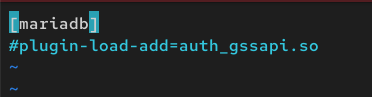{#fig:003 width=70%}

Файл client.cnf. Данный конфигурационный файл является заготовкой для настройки клиентских подключений. В его текущем состоянии он не содержит активных параметров (таких как хост, пользователь, пароль и т.д.), а лишь определяет логическую структуру:

Секция client предназначена для универсальных настроек, которые применяются ко всем клиентским программам (как MySQL, так и MariaDB).

Секция client-mariadb предназначена для специфичных настроек, которые будут применены только к клиентским утилитам MariaDB, что обеспечивает гибкость и совместимость.

Файл подготовлен для добавления конкретных параметров подключения, но в настоящее время он пуст от активных директив. Его функция — организовать будущие настройки клиентской части СУБД. (рис. 4) 

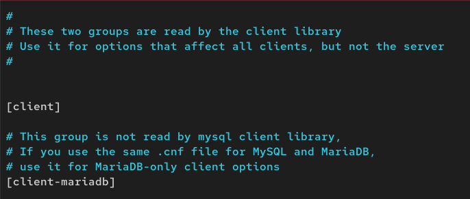{#fig:004 width=70%}

Файл mariadb-server.cnf. Конфигурационный файл содержит базовые, но критически важные настройки сервера MariaDB. Он определяет "рабочее пространство" сервера: Расположение данных (datadir), Точку для локальных подключений (socket), Файл для диагностики ошибок (log-error), Файл идентификации процесса (pid-file).

Файл задает стандартную конфигурацию, которая обеспечивает базовую функциональность сервера, определяя правильные и общепринятые пути для его ключевых компонентов. (рис. 5)

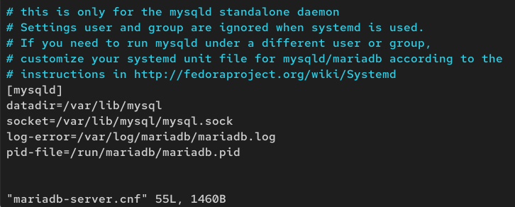{#fig:005 width=70%}

Файл mysql-clients.cnf. Конфигурационный файл представляет собой структурированную заготовку для тонкой настройки клиентских утилит MariaDB. В его текущем состоянии он не содержит активных параметров, а лишь определяет логические секции для различных программ.

Файл демонстрирует модульный подход к конфигурации MariaDB, где разные аспекты системы настраиваются в отдельных специализированных файлах. В данном случае этот файл отвечает исключительно за настройку поведения клиентских утилит командной строки. (рис. 6)

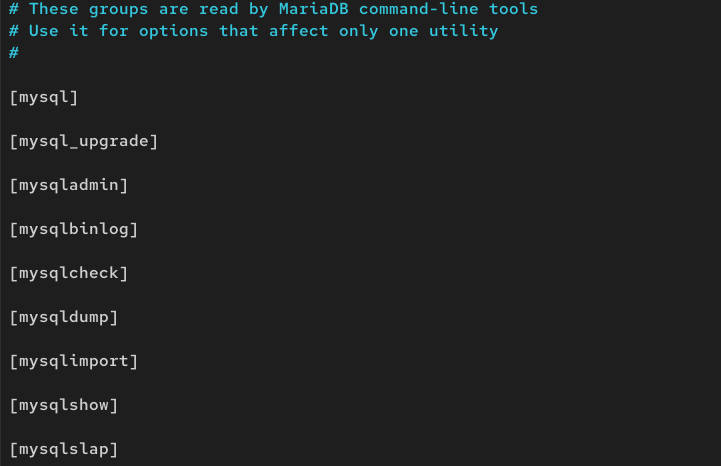{#fig:006 width=70%}

Файл provider_bzip2.cnf. Конфигурационный файл отвечает за подключение и настройку плагина сжатия bzip2 в сервере MariaDB.

Загрузка плагина: Директива plugin_load_add гарантирует, что плагин provider_bzip2 будет загружен при каждом запуске сервера.

Параметр force_plus_permanent обеспечивает отказоустойчивость (сервер не "упадет" из-за отсутствия плагина) и сохраняет настройку постоянной.

После загрузки этого плагина MariaDB получает возможность использовать алгоритм bzip2 для операций сжатия. Это может быть полезно в различных сценариях, например: Сжатие данных при использовании функций типа COMPRESS(), Настройка сжатия для механизма хранения InnoDB (если плагин это поддерживает). (рис. 7)

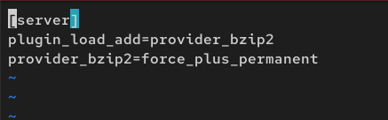{#fig:007 width=70%}

Файл provider_lz4.cnf. Конфигурационный файл предназначен для подключения и настройки плагина сжатия LZ4 в сервере MariaDB.

Загрузка плагина: Директива plugin_load_add должна гарантировать, что плагин provider_lz4 будет загружен при каждом запуске сервера.

Параметр force_plus_permanent обеспечивает отказоустойчивость (сервер не "упадет" из-за отсутствия плагина) и сохраняет настройку постоянной.

Практическое применение: После загрузки этого плагина MariaDB получает возможность использовать алгоритм LZ4 для операций сжатия. LZ4 известен своим очень высоким скоростью сжатия и распаковки, что делает его особенно полезным для: Сжатия данных в реальном времени, в приложениях, где важна низкая задержка (low latency, использования в функциях сжатия MariaDB и различных механизмах хранения (рис. 8)

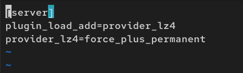{#fig:008 width=70%}

Файл provider_lzo.cnf. Конфигурационный файл отвечает за подключение и настройку плагина сжатия LZO в сервере MariaDB.

Загрузка плагина: Директива plugin_load_add гарантирует, что плагин provider_lzo будет загружен при каждом запуске сервера.

Параметр force_plus_permanent обеспечивает отказоустойчивость (сервер не "упадет" из-за отсутствия плагина) и сохраняет настройку постоянной.

Практическое применение: После загрузки этого плагина MariaDB получает возможность использовать алгоритм LZO для операций сжатия. LZO — это алгоритм сжатия, который обеспечивает хороший баланс между скоростью и степенью сжатия. Он может использоваться для: Сжатия данных в функциях типа COMPRESS(), настройки сжатия для различных механизмов хранения, операций бэкапа и восстановления данных, любых других сценариев, где требуется эффективное сжатие данных (рис. 9)

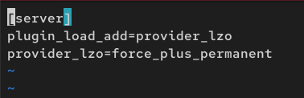{#fig:009 width=70%}

Файл provider_snappy.cnf. Конфигурационный файл предназначен для подключения и настройки плагина сжатия Snappy в сервере MariaDB.

Загрузка плагина: Директива plugin_load_add должна гарантировать, что плагин provider_snappy будет загружен при каждом запуске сервера.

Параметр force_plus_permanent обеспечивает отказоустойчивость (сервер не "упадет" из-за отсутствия плагина) и сохраняет настройку постоянной.

Практическое применение: после загрузки этого плагина MariaDB получает возможность использовать алгоритм Snappy для операций сжатия. Snappy — это алгоритм сжатия, разработанный Google, который характеризуется:

- Очень высокой скоростью сжатия и распаковки

- Умеренной степенью сжатия

- Оптимизацией для 64-битных систем

Snappy особенно полезен для:

- Сжатия данных в реальном времени

- Приложений, где критична скорость обработки данных

- Распределенных систем и баз данных

- Использования в различных механизмах хранения MariaDB (рис. 10)

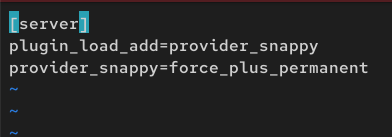{#fig:010 width=70%}

Файл spider.cnf. Конфигурационный файл содержит закомментированную директиву для загрузки плагина распределенного механизма хранения Spider. В текущем состоянии плагин отключен и не загружается сервером MariaDB. Для его активации необходимо раскомментировать строку plugin-load-add = ha_spider и перезапустить сервер. Spider предоставляет возможности для создания шардированных и распределенных баз данных, что полезно для масштабирования систем (рис. 11)

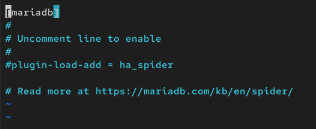{#fig:011 width=70%}

Файл my.cnf. Главный конфигурационный файл my.cnf в его текущем состоянии не функционален. Критически важная директива includedir /etc/my.cnf.d закомментирована, что предотвращает загрузку всех модульных конфигурационных файлов из каталога /etc/my.cnf.d. Это означает, что настройки сервера, клиентов и плагинов, определенные в отдельных файлах, не будут применены. Для нормальной работы MariaDB необходимо раскомментировать строку includedir /etc/my.cnf.d. Файл демонстрирует структуру для централизованных настроек через секцию client-server, но в текущем виде не содержит активных конфигурационных параметров (рис. 12)

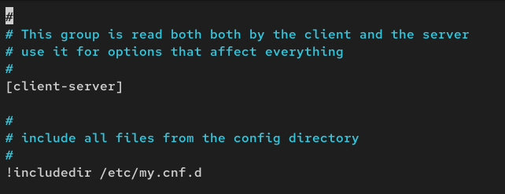{#fig:012 width=70%}

Для запуска и включения программного обеспечения mariadb используем:

systemctl start mariadb

systemctl enable mariadb (рис. 13)

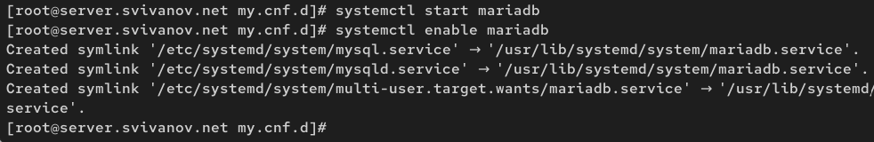{#fig:013 width=70%}
 
Убедимся, что mariadb прослушивает порт, используя
ss -tulpen | grep 3306 (рис. 14)

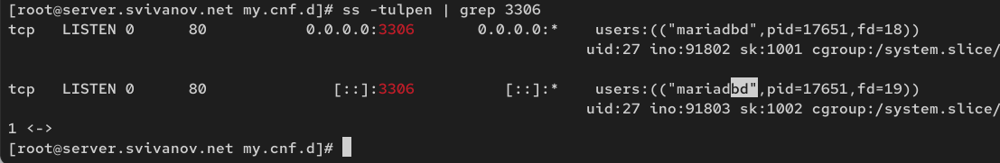{#fig:014 width=70%}

Запустим скрипт конфигурации безопасности mariadb, используя:
mysql_secure_installation. С помощью запустившегося диалога и путём выбора Y/n установим пароль для
пользователя root базы данных (обратите внимание, что это не пользователь root
операционной системы), отключим удалённый корневой доступ и удалим тестовую базу данных и любых анонимных пользователей. (рис. 15)

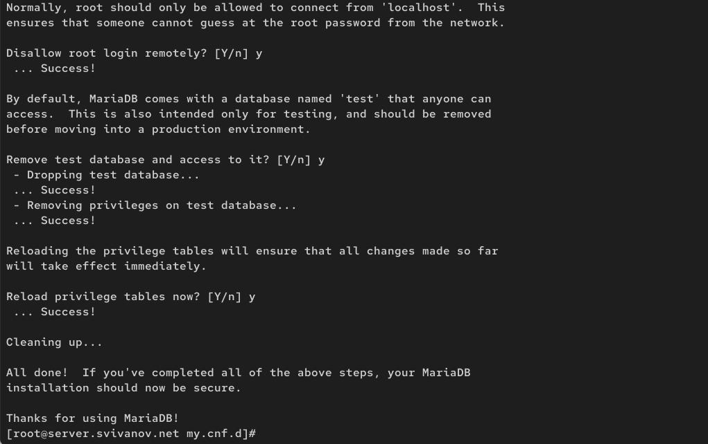{#fig:015 width=70%}

Для входа в базу данных с правами администратора базы данных введем mysql -u root -p. (рис. 16)

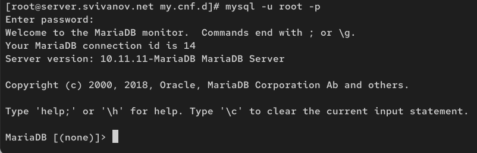{#fig:016 width=70%}

Просмотрим список команд MySQL, введя h. (рис. 17)

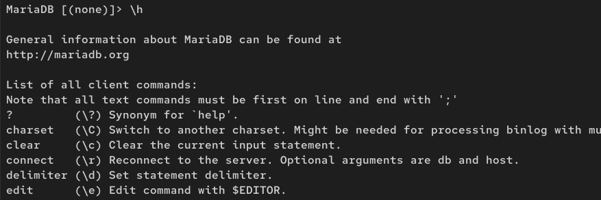{#fig:017 width=70%}

Из приглашения интерактивной оболочки MariaDB для отображения доступных
в настоящее время баз данных введем MySQL-запрос SHOW DATABASES; 

Были обнаружены четыре системные базы данных:

- information_schema - содержит метаданные всех объектов СУБД

- mysql - хранит информацию о пользователях, привилегиях и системных настройках

- performance_schema - предоставляет инструменты для мониторинга производительности

- sys - содержит упрощенные представления для анализа метрик производительности

Все перечисленные базы данных являются служебными и создаются автоматически при установке MariaDB. Пользовательских баз данных в системе не существует. (рис. 18)

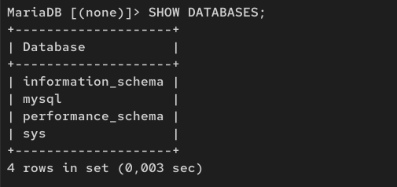{#fig:018 width=70%}

## Конфигурация кодировки символов

Войдем в базу данных с правами администратора: mysql -u root -p. Для отображения статуса MariaDB введем из приглашения интерактивной оболочки
MariaDB: status 

Команда status предоставляет информацию о текущем состоянии соединения и сервера MariaDB. Из вывода видно, что:

- Используется MariaDB версии 10.11.11

- Подключение выполнено локально через UNIX-сокет

- Сервер работает 10 минут 38 секунд

- Наблюдается несоответствие кодировок (сервер использует latin1, а клиент - utf8mb3)

- Нагрузка на сервер минимальная (в среднем 0.045 запросов в секунду) (рис. 19)

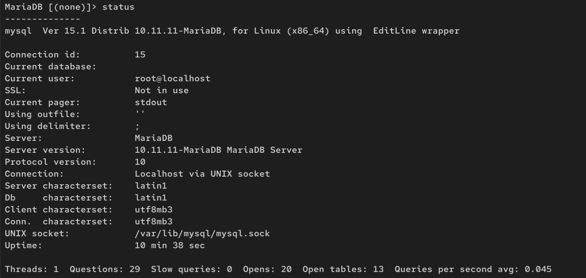{#fig:019 width=70%}

В каталоге /etc/my.cnf.d создадим файл utf8.cnf:

cd /etc/my.cnf.d

touch utf8.cnf (рис. 20)

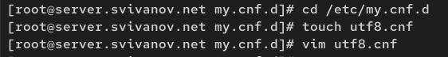{#fig:020 width=70%}

Откроем его на редактирование и укажем в нём следующую конфигурацию: (рис. 21)

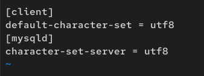{#fig:021 width=70%}

Перезапустим MariaDB: systemctl restart mariadb. (рис. 22)

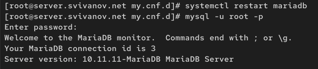{#fig:022 width=70%}

Войдем в базу данных с правами администратора и посмотрим статус MariaDB. 

Изменение конфигурации:

- Кодировка сервера изменилась с latin1 на utf8mb3 - это указывает на то, что после перезапуска сервер начал использовать корректные настройки кодировки из конфигурационных файлов

- Сервер работает стабильно, время работы - 23 секунды

- Активно 1 подключение

- Медленных запросов не зафиксировано

- Нагрузка на сервер минимальная

- Перезапуск службы успешно применен и сервер MariaDB работает с обновленными настройками, включая корректную UTF-8 кодировку. (рис. 23)

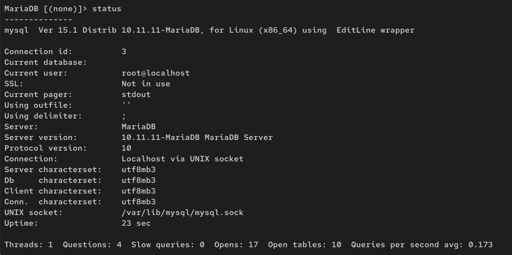{#fig:023 width=70%}

## Создание базы данных

Войдем в базу данных с правами администратора, Создадим базу данных с именем addressbook:

CREATE DATABASE addressbook CHARACTER SET utf8 COLLATE utf8_general_ci;

Перейдем к базе данных addressbook

USE addressbook;

Отобразим имеющиеся в базе данных addressbook таблицы:

SHOW TABLES;(рис. 24)

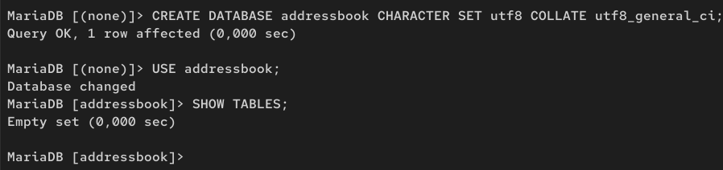{#fig:024 width=70%}

Создадим таблицу city с полями name и city:

CREATE TABLE city(name VARCHAR(40), city VARCHAR(40));

Заполним несколько строк таблицы некоторыми данными по аналогии в соответствии с синтаксисом MySQL:

INSERT INTO city(name,city) VALUES ('Иванов','Москва');

В частности, добавим в базу сведения о Петрове и Сидорове: (Петров, Сочи), (Сидоров, Дубна) (рис. 25)

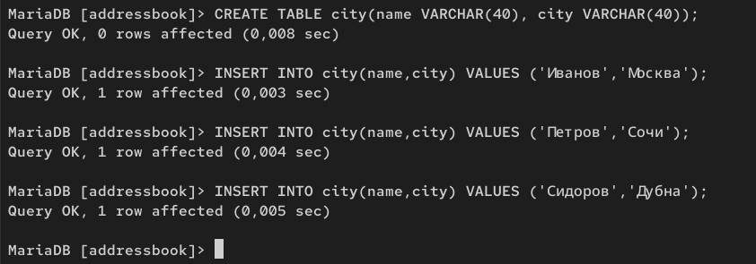{#fig:025 width=70%}

Сделаем следующий MySQL-запрос: SELECT * FROM city;

Запрос SELECT * FROM city успешно выполнен и показал содержимое таблицы city из базы данных addressbook.

Результат демонстрирует:

- Таблица содержит справочник "Фамилия - Город проживания"

- В текущий момент в таблице зарегистрировано 3 человека

- Все данные отображаются корректно, включая кириллические символы (что подтверждает правильную настройку кодировки UTF-8 после перезапуска сервера) (рис. 26)

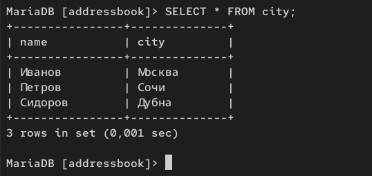{#fig:026 width=70%}

Создадим пользователя для работы с базой данных addressbook и зададим для него пароль:

CREATE USER user@'%' IDENTIFIED BY 'password';

Предоставим права доступа созданному пользователю user на действия с базой
данных addressbook (просмотр, добавление, обновление, удаление данных):

GRANT SELECT,INSERT,UPDATE,DELETE ON addressbook.* TO user@'%'; (рис. 27)

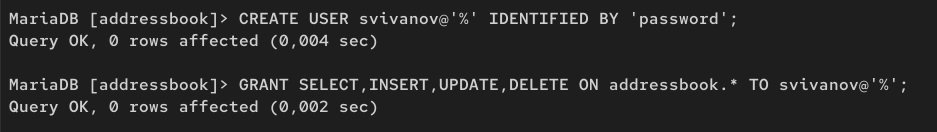{#fig:027 width=70%}

Обновим привилегии (права доступа) базы данных addressbook: FLUSH PRIVILEGES; Посмотрим общую информацию о таблице city базы данных addressbook:
DESCRIBE city; (рис. 28)

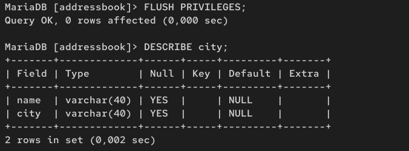{#fig:028 width=70%}

Просмотрим список баз данных: mysqlshow -u root -p. Просмотрим список таблиц базы данных addressbook: mysqlshow -u root -p addressbook (рис. 29)

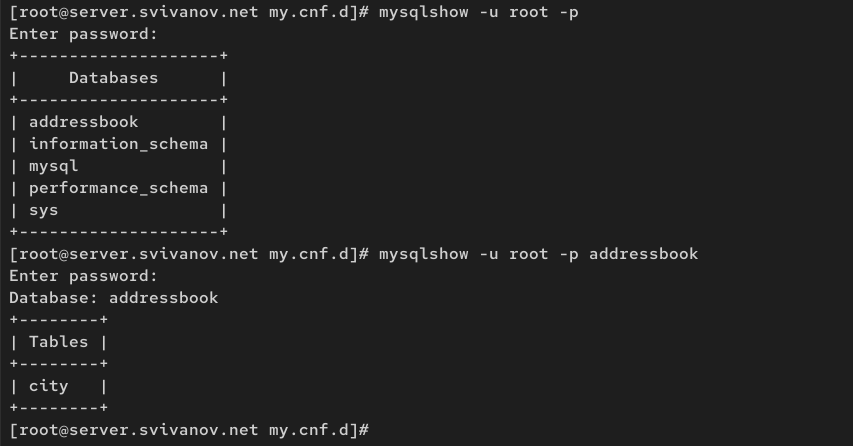{#fig:029 width=70%}

## Резервные копии

На виртуальной машине server создадим каталог для резервных копий:

mkdir -p /var/backup

Сделаем резервную копию базы данных addressbook:

mysqldump -u root -p addressbook > /var/backup/addressbook.sql

Сделаем сжатую резервную копию базы данных addressbook:

mysqldump -u root -p addressbook | gzip > /var/backup/addressbook.sql.gz

Сделаем сжатую резервную копию базы данных addressbook с указанием даты
создания копии:

mysqldump -u root -p addressbook | gzip > $(date+/var/backup/addressbook.%Y%m%d.%H%M%S.sql.gz) (рис. 30)

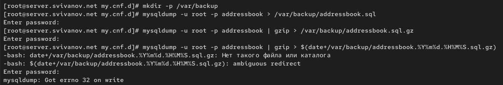{#fig:030 width=70%}

Восстановим базу данных addressbook из резервной копии:

mysql -u root -p addressbook < /var/backup/addressbook.sql

Восстановим базу данных addressbook из сжатой резервной копии:

zcat /var/backup/addressbook.sql.gz | mysql -u root -p addressbook (рис. 31)

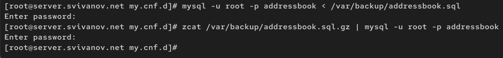{#fig:031 width=70%}

На виртуальной машине server перейдем в каталог для внесения изменений
в настройки внутреннего окружения /vagrant/provision/server/, создадим в нём
каталог mysql, в который поместим в соответствующие подкаталоги конфигурационные файлы MariaDB и резервную копию базы данных addressbook:

cd /vagrant/provision/server

mkdir -p /vagrant/provision/server/mysql/etc/my.cnf.d

mkdir -p /vagrant/provision/server/mysql/var/backup

cp -R /etc/my.cnf.d/utf8.cnf /vagrant/provision/server/mysql/etc/my.cnf.d/

cp -R /var/backup/* /vagrant/provision/server/mysql/var/backup/ (рис. 32)

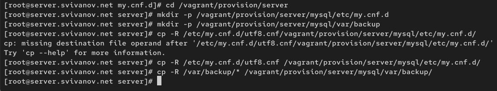{#fig:032 width=70%}

В каталоге /vagrant/provision/server создадим исполняемый файл mysql.sh:

cd /vagrant/provision/server

touch mysql.sh

chmod +x mysql.sh

Открыв его на редактирование, пропишем в нём следующий скрипт: (рис. 33)

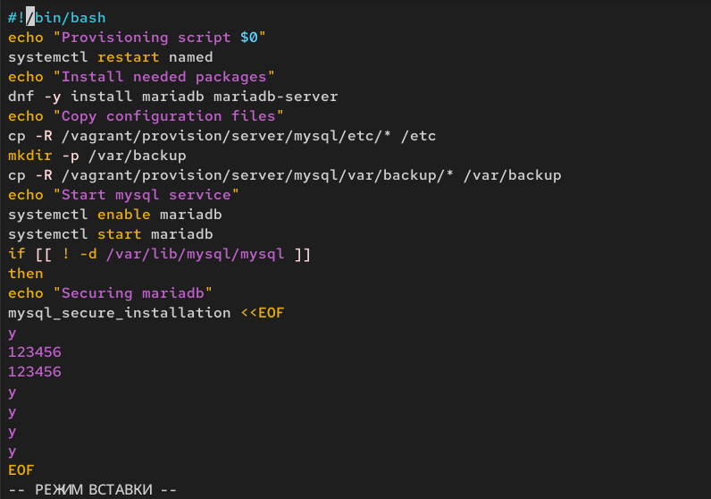{#fig:033 width=70%}

Для отработки созданного скрипта во время загрузки виртуальных машин в конфигурационном файле Vagrantfile необходимо добавить в конфигурации сервера
следующую запись (рис. 34)

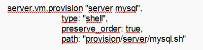{#fig:034 width=70%}

# Ответы на контрольные вопросы

**1. Какая команда отвечает за настройки безопасности в MariaDB?**

mysql_secure_installation

**2. Как настроить MariaDB для доступа через сеть?**

В конфигурационном файле /etc/my.cnf.d/mariadb-server.cnf:

**3. Какая команда позволяет получить обзор доступных баз данных после входа в среду оболочки MariaDB?**

SHOW DATABASES;

**4. Какая команда позволяет узнать, какие таблицы доступны в базе данных?**

USE database_name;

SHOW TABLES;

**5. Какая команда позволяет узнать, какие поля доступны в таблице?**

DESCRIBE table_name;

**6. Какая команда позволяет узнать, какие записи доступны в таблице?**

SELECT * FROM table_name;

**7. Как удалить запись из таблицы?**

DELETE FROM table_name WHERE condition;

**8. Где расположены файлы конфигурации MariaDB? Что можно настроить с их помощью?**

/etc/my.cnf - главный конфигурационный файл

/etc/my.cnf.d/ - каталог с модульными конфигурационными файлами

**9. Где располагаются файлы с базами данных MariaDB?**

/var/lib/mysql/

**10. Как сделать резервную копию базы данных и затем её восстановить?**

Создание резервной копии:

mysqldump -u username -p database_name > backup.sql

mysqldump -u username -p --all-databases > full_backup.sql

Восстановление из резервной копии:

mysql -u username -p database_name < backup.sql

mysql -u username -p < full_backup.sql

# Выводы

В ходе выполнения лабораторной работы мы приобрели практические навыков по установке и конфигурированию системы
управления базами данных на примере программного обеспечения MariaDB.
