---
## Front matter
lang: ru-RU
title: Лабораторная работа №7
subtitle: Администрирование сетевых подсистем
author:
  - Иванов Сергей Владимирович, НПИбд-01-23
institute:
  - Российский университет дружбы народов, Москва, Россия
date: 09 октября 2025

## i18n babel
babel-lang: russian
babel-otherlangs: english

## Formatting pdf
toc: false
slide_level: 2
aspectratio: 169
section-titles: true
theme: metropolis
header-includes:
 - \metroset{progressbar=frametitle,sectionpage=progressbar,numbering=fraction}
 - '\makeatletter'
 - '\beamer@ignorenonframefalse'
 - '\makeatother'

 ## Fonts
mainfont: PT Serif
romanfont: PT Serif
sansfont: PT Sans
monofont: PT Mono
mainfontoptions: Ligatures=TeX
romanfontoptions: Ligatures=TeX
sansfontoptions: Ligatures=TeX,Scale=MatchLowercase
monofontoptions: Scale=MatchLowercase,Scale=0.9
---

## Цель работы

Получить навыки настройки межсетевого экрана в Linux в части переадресации
портов и настройки Masquerading.

## Задание

1. Настройте межсетевой экран виртуальной машины server для доступа к серверу
по протоколу SSH не через 22-й порт, а через порт 2022 (см. разделы 7.4.1 и 7.4.2).
2. Настройте Port Forwarding на виртуальной машине server (см. разделы 7.4.3).
3. Настройте маскарадинг на виртуальной машине server для организации доступа
клиента к сети Интернет (см. раздел 7.4.3).
4. Напишите скрипт для Vagrant, фиксирующий действия по расширенной настройке
межсетевого экрана. Соответствующим образом внести изменения в Vagrantfile
(см. раздел 7.4.4).

# Выполнение работы

## Создание пользовательской службы firewalld

Загрузим операционную систему и перейдем в рабочий каталог с проектом.
Запустим виртуальную машину server. (рис. 1).

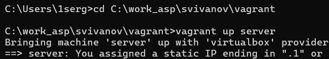{#fig:001 width=70%}

## Создание пользовательской службы firewalld

На виртуальной машине server войдем под пользователем и откроем терминал. Перейдем в режим суперпользователя. На основе существующего файла описания службы ssh создадим файл с собственным описанием (рис. 2).

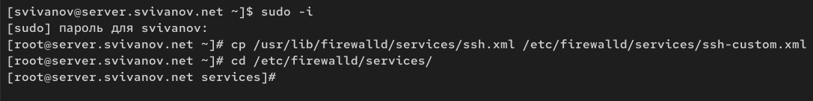{#fig:002 width=70%}

## Создание пользовательской службы firewalld

Посмотрим содержимое файла службы: cat /etc/firewalld/services/ssh-custom.xml (рис. 3)

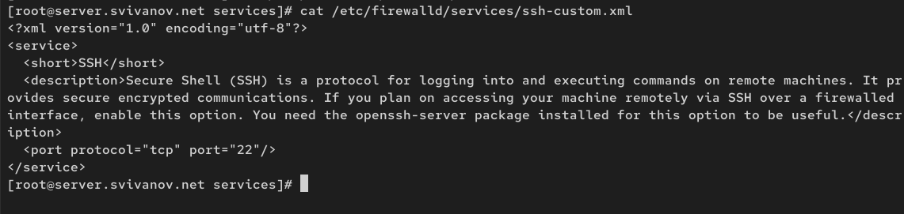{#fig:003 width=70%}

## Создание пользовательской службы firewalld

Откроем файл описания службы на редактирование и заменим порт 22 на
порт (2022). Скорректируем описание службы для демонстрации, укажем, что это модифицированный файл службы. (рис. 4) 

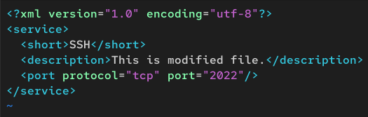{#fig:004 width=70%}

## Создание пользовательской службы firewalld

Просмотрим список доступных FirewallD служб. Обратим внимание, что новая служба ещё не отображается в списке. (рис. 5)

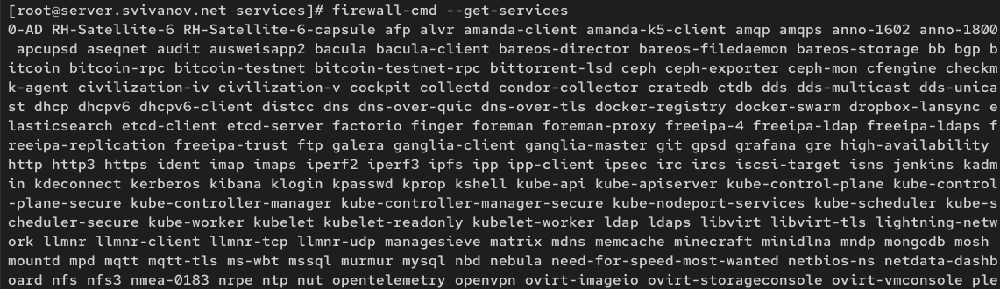{#fig:005 width=70%}

## Создание пользовательской службы firewalld

Перегрузим правила межсетевого экрана с сохранением информации о состоянии
и вновь выведем на экран список служб, а также список активных служб (рис. 6)

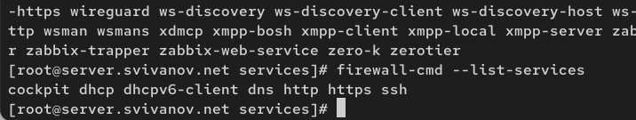{#fig:006 width=70%}

## Создание пользовательской службы firewalld

Добавим новую службу в FirewallD и выведем на экран список активных служб (рис. 7)

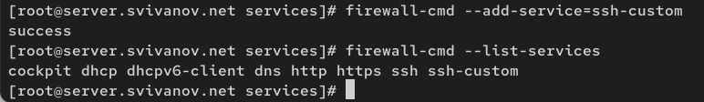{#fig:007 width=70%}

## Создание пользовательской службы firewalld

Перегрузим правила межсетевого
экрана с сохранением информации о состоянии (рис. 8)

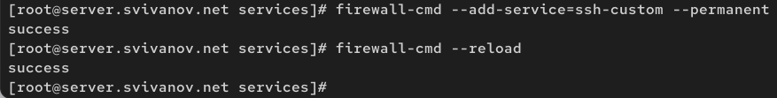{#fig:008 width=70%}

## Перенаправление портов

Организуем на сервере переадресацию с порта 2022 на порт 22 (рис. 9)

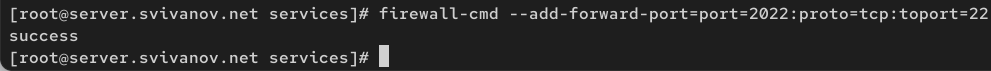{#fig:009 width=70%}

## Перенаправление портов

На клиенте попробуем получить доступ по SSH к серверу через порт 2022 (рис. 10)

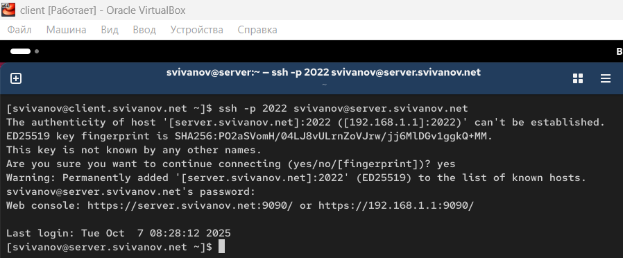{#fig:010 width=70%}

## Настройка Port Forwarding и Masquerading

На сервере посмотрим, активирована ли в ядре системы возможность перенаправления IPv4-пакетов пакетов. (рис. 11)

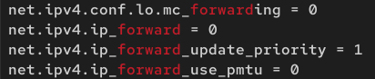{#fig:011 width=70%}

## Настройка Port Forwarding и Masquerading

Включим перенаправление IPv4-пакетов на сервере (рис. 12)

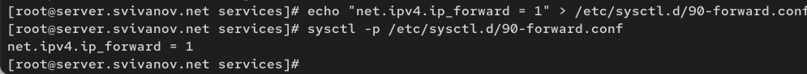{#fig:012 width=70%}

## Настройка Port Forwarding и Masquerading

Включим маскарадинг на сервере (рис. 13)

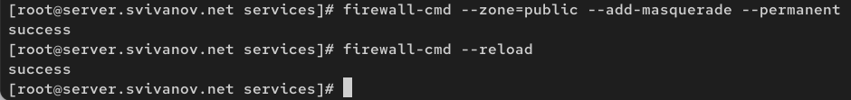{#fig:013 width=70%}
 
## Настройка Port Forwarding и Masquerading

На клиенте проверим доступность выхода в Интернет. (рис. 14)

{#fig:014 width=70%}

## Внесение изменений в настройки внутреннего окружения виртуальной машины

На виртуальной машине server перейдем в каталог для внесения изменений
в настройки внутреннего окружения /vagrant/provision/server/, создадим в нём
каталог firewall, в который поместим в соответствующие подкаталоги конфигурационные файлы FirewallD (рис. 15)

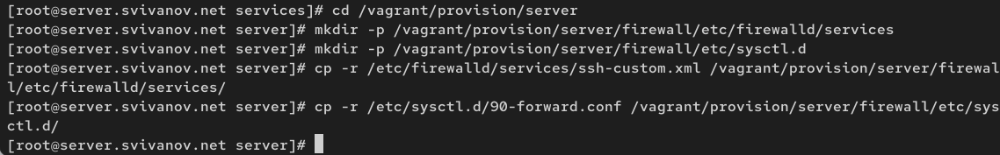{#fig:015 width=70%}

## Внесение изменений в настройки внутреннего окружения виртуальной машины

В каталоге /vagrant/provision/server создадим файл firewall.sh. Открыв его на редактирование, пропишем в нём следующий скрипт. (рис. 16)

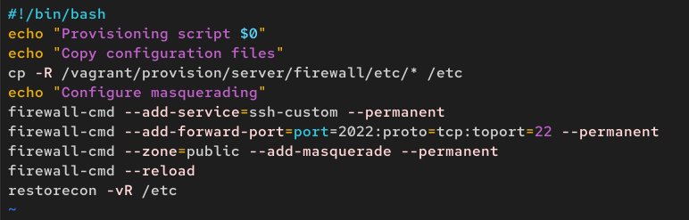{#fig:016 width=70%}

## Внесение изменений в настройки внутреннего окружения виртуальной машины

Для отработки созданного скрипта во время загрузки виртуальной машины server
в конфигурационном файле Vagrantfile необходимо добавить в разделе конфигурации для сервера: (рис. 17)

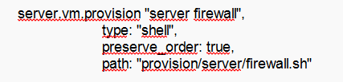{#fig:017 width=70%}

# Вывод

## Вывод 

В ходе выполнения лабораторной работы мы приобрели навыки настройки межсетевого экрана в Linux в части переадресации
портов и настройки Masquerading.

 
