---
## Front matter
title: "Отчет по лабораторной работе №7"
subtitle: "Дисциплина: Администрирование сетевых подсистем"
author: "Иванов Сергей Владимирович"

## Generic otions
lang: ru-RU
toc-title: "Содержание"

## Bibliography
bibliography: bib/cite.bib
csl: pandoc/csl/gost-r-7-0-5-2008-numeric.csl

## Pdf output format
toc: true # Table of contents
toc-depth: 2
lof: true # List of figures
fontsize: 12pt
linestretch: 1.5
papersize: a4
documentclass: scrreprt
## I18n polyglossia
polyglossia-lang:
  name: russian
  options:
	- spelling=modern
	- babelshorthands=true
polyglossia-otherlangs:
  name: english
## I18n babel
babel-lang: russian
babel-otherlangs: english
## Fonts
mainfont: PT Serif
romanfont: PT Serif
sansfont: PT Sans
monofont: PT Mono
mainfontoptions: Ligatures=TeX
romanfontoptions: Ligatures=TeX
sansfontoptions: Ligatures=TeX,Scale=MatchLowercase
monofontoptions: Scale=MatchLowercase,Scale=0.9
## Biblatex
biblatex: true
biblio-style: "gost-numeric"
biblatexoptions:
  - parentracker=true
  - backend=biber
  - hyperref=auto
  - language=auto
  - autolang=other*
  - citestyle=gost-numeric
## Pandoc-crossref LaTeX customization
figureTitle: "Рис."
listingTitle: "Листинг"
lofTitle: "Список иллюстраций"
lolTitle: "Листинги"
## Misc options
indent: true
header-includes:
  - \usepackage{indentfirst}
  - \usepackage{float} # keep figures where there are in the text
  - \floatplacement{figure}{H} # keep figures where there are in the text
---

# Цель работы

Получить навыки настройки межсетевого экрана в Linux в части переадресации
портов и настройки Masquerading.

# Задание

1. Настройте межсетевой экран виртуальной машины server для доступа к серверу
по протоколу SSH не через 22-й порт, а через порт 2022 (см. разделы 7.4.1 и 7.4.2).
2. Настройте Port Forwarding на виртуальной машине server (см. разделы 7.4.3).
3. Настройте маскарадинг на виртуальной машине server для организации доступа
клиента к сети Интернет (см. раздел 7.4.3).
4. Напишите скрипт для Vagrant, фиксирующий действия по расширенной настройке
межсетевого экрана. Соответствующим образом внести изменения в Vagrantfile
(см. раздел 7.4.4).

# Выполнение лабораторной работы

## Создание пользовательской службы firewalld

Загрузим операционную систему и перейдем в рабочий каталог с проектом: cd /var/tmp/user_name/vagrant .
Запустим виртуальную машину server: vagrant up server. (рис. 1).

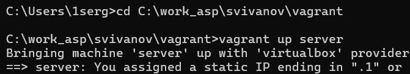{#fig:001 width=70%}

На виртуальной машине server войдем под пользователем и откроем терминал. Перейдем в режим суперпользователя. На основе существующего файла описания службы ssh создадим файл с собственным описанием:

cp /usr/lib/firewalld/services/ssh.xml /etc/firewalld/services/ssh-custom.xml

cd /etc/firewalld/services/ (рис. 2).

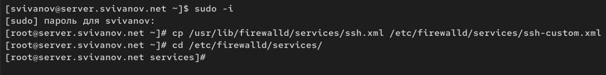{#fig:002 width=70%}

Посмотрим содержимое файла службы: cat /etc/firewalld/services/ssh-custom.xml 

Строка 1: Объявление XML-документа. Указывает версию XML (1.0) и кодировку (UTF-8).

Строка 2: Открывающий тег корневого элемента service. Все параметры службы определяются внутри этого тега.

Строка 3: Тег short содержит краткое имя службы (например, "SSH"), которое может использоваться в инструментах управления firewall.

Строка 4: Тег description содержит подробное описание службы, её назначения и условий использования.

Строка 5: Тег port определяет сетевой порт и протокол, связанные со службой.

Строка 6: Закрывающий тег корневого элемента service. Завершает определение службы. (рис. 3)

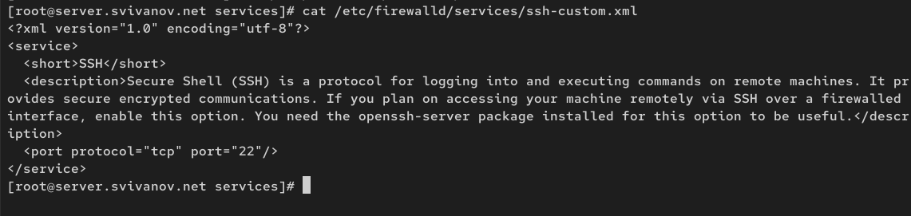{#fig:003 width=70%}

Откроем файл описания службы на редактирование и заменим порт 22 на новый
порт (2022). В этом же файле скорректируем описание службы для демонстрации, укажем, что
это модифицированный файл службы. (рис. 4) 

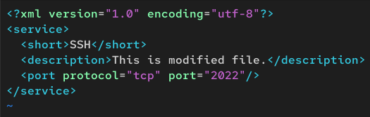{#fig:004 width=70%}

Просмотрим список доступных FirewallD служб: firewall-cmd --get-services. Обратим внимание, что новая служба ещё не отображается в списке. (рис. 5)

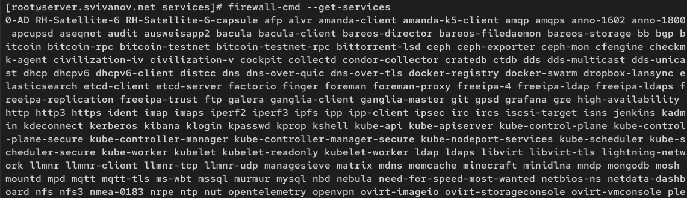{#fig:005 width=70%}

Перегрузим правила межсетевого экрана с сохранением информации о состоянии
и вновь выведем на экран список служб, а также список активных служб:

firewall-cmd --reload

firewall-cmd --get-services

firewall-cmd --list-services

Убедимся, что созданная служба отображается в списке доступных для
FirewallD служб, но не активирована. (рис. 6)

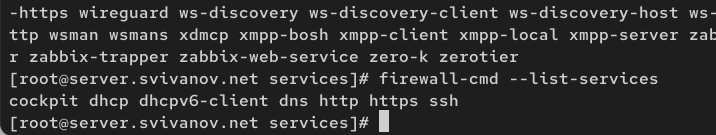{#fig:006 width=70%}

Добавим новую службу в FirewallD и выведем на экран список активных служб:

firewall-cmd --add-service=ssh-custom

firewall-cmd --list-services (рис. 7)

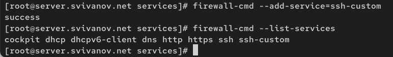{#fig:007 width=70%}

Перегрузим правила межсетевого
экрана с сохранением информации о состоянии:

firewall-cmd --add-service=ssh-custom --permanent

firewall-cmd --reload (рис. 8)

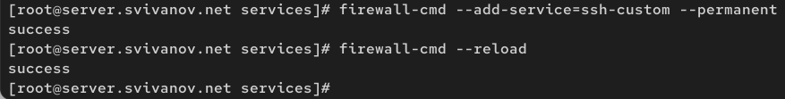{#fig:008 width=70%}

## Перенаправление портов

Организуем на сервере переадресацию с порта 2022 на порт 22: firewall-cmd --add-forward-port=port=2022:proto=tcp:toport=22 (рис. 9)

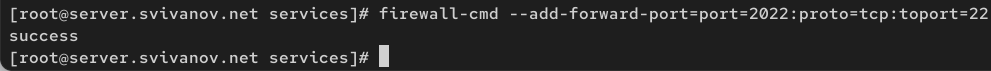{#fig:009 width=70%}

На клиенте попробуем получить доступ по SSH к серверу через порт 2022:
ssh -p 2022 user@server.user.net (рис. 10)

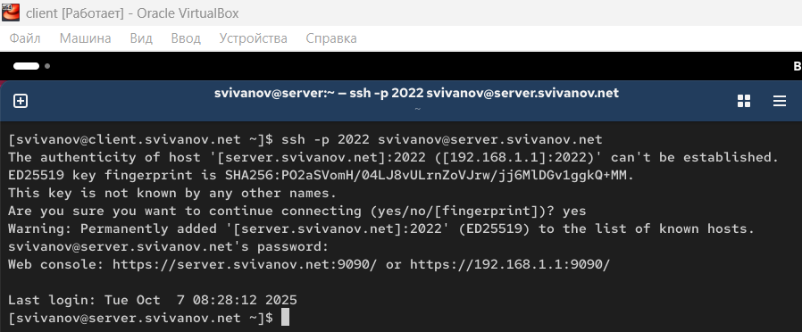{#fig:010 width=70%}

## Настройка Port Forwarding и Masquerading

На сервере посмотрим, активирована ли в ядре системы возможность перенаправления IPv4-пакетов пакетов:
sysctl -a | grep forward. Видим что выключена. (рис. 11)

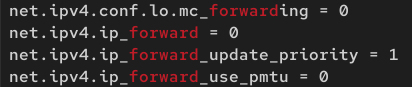{#fig:011 width=70%}

Включим перенаправление IPv4-пакетов на сервере:

echo "net.ipv4.ip_forward = 1" > /etc/sysctl.d/90-forward.conf

sysctl -p /etc/sysctl.d/90-forward.conf (рис. 12)

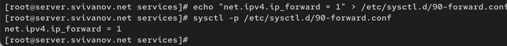{#fig:012 width=70%}

Включим маскарадинг на сервере:

firewall-cmd --zone=public --add-masquerade --permanent

firewall-cmd --reload (рис. 13)

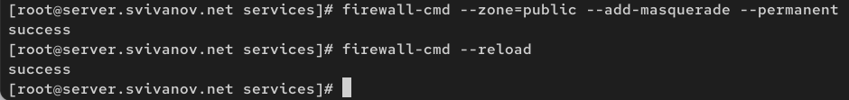{#fig:013 width=70%}
 
На клиенте проверим доступность выхода в Интернет. (рис. 14)

{#fig:014 width=70%}

## Внесение изменений в настройки внутреннего окружения виртуальной машины

На виртуальной машине server перейдем в каталог для внесения изменений
в настройки внутреннего окружения /vagrant/provision/server/, создадим в нём
каталог firewall, в который поместим в соответствующие подкаталоги конфигурационные файлы FirewallD:

cd /vagrant/provision/server

mkdir -p /vagrant/provision/server/firewall/etc/firewalld/services

mkdir -p /vagrant/provision/server/firewall/etc/sysctl.d

cp -r /etc/firewalld/services/ssh-custom.xml /vagrant/provision/server/firewall/etc/firewalld/services/

cp -r /etc/sysctl.d/90-forward.conf /vagrant/provision/server/firewall/etc/sysctl.d/. (рис. 15)

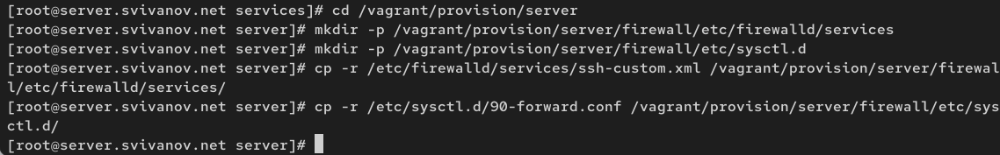{#fig:015 width=70%}

В каталоге /vagrant/provision/server создадим файл firewall.sh:

cd /vagrant/provision/server

touch firewall.sh

chmod +x firewall.sh

Открыв его на редактирование, пропишем в нём следующий скрипт. (рис. 16)

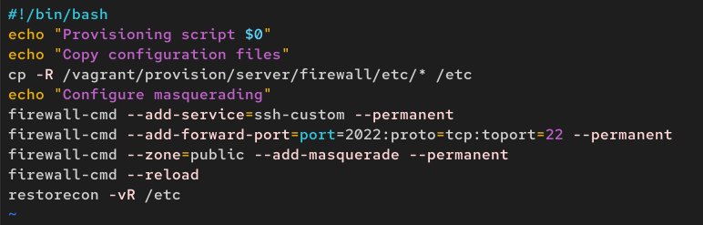{#fig:016 width=70%}

Для отработки созданного скрипта во время загрузки виртуальной машины server
в конфигурационном файле Vagrantfile необходимо добавить в разделе конфигурации для сервера: (рис. 17)

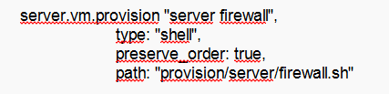{#fig:017 width=70%}

# Ответы на контрольные вопросы

**1. Где хранятся пользовательские файлы firewalld?**

Пользовательские файлы firewalld хранятся в:

/etc/firewalld/ - для пользовательских конфигураций (сервисы, зоны и т.д.)

Конкретно для служб:

/etc/firewalld/services/ - пользовательские файлы служб

/usr/lib/firewalld/services/ - системные файлы служб (предустановленные)

**2. Какую строку надо включить в пользовательский файл службы, чтобы указать порт TCP 2022?**

```
<port protocol="tcp" port="2022"/>
```

**3. Какая команда позволяет вам перечислить все службы, доступные в настоящее время на вашем сервере?**

firewall-cmd --list-services

Или для получения более подробной информации со всеми предустановленными службами:

firewall-cmd --get-services

**4. В чем разница между трансляцией сетевых адресов (NAT) и маскарадингом (masquerading)?**

NAT (Network Address Translation):

- Статическое преобразование адресов

- Постоянное соответствие между внутренними и внешними адресами

- Используется когда есть выделенные внешние IP-адреса

Masquerading:

- Динамический NAT

- Использует IP-адрес интерфейса шлюза

- Автоматически подстраивается при изменении IP-адреса интерфейса

- Чаще используется при динамических IP-адресах (например, DHCP)

**5. Какая команда разрешает входящий трафик на порт 4404 и перенаправляет его в службу ssh по IP-адресу 10.0.0.10?**

firewall-cmd --add-forward-port=port=4404:proto=tcp:toport=22:toaddr=10.0.0.10

**6. Какая команда используется для включения маcкарадинга IP-пакетов для всех пакетов, выходящих в зону public?**

firewall-cmd --zone=public --add-masquerade

# Выводы

В ходе выполнения лабораторной работы мы приобрели навыки настройки межсетевого экрана в Linux в части переадресации
портов и настройки Masquerading.
