---
## Front matter
lang: ru-RU
title: Лабораторная работа №8
subtitle: Администрирование сетевых подсистем
author:
  - Иванов Сергей Владимирович, НПИбд-01-23
institute:
  - Российский университет дружбы народов, Москва, Россия
date: 13 октября 2025

## i18n babel
babel-lang: russian
babel-otherlangs: english

## Formatting pdf
toc: false
slide_level: 2
aspectratio: 169
section-titles: true
theme: metropolis
header-includes:
 - \metroset{progressbar=frametitle,sectionpage=progressbar,numbering=fraction}
 - '\makeatletter'
 - '\beamer@ignorenonframefalse'
 - '\makeatother'

 ## Fonts
mainfont: PT Serif
romanfont: PT Serif
sansfont: PT Sans
monofont: PT Mono
mainfontoptions: Ligatures=TeX
romanfontoptions: Ligatures=TeX
sansfontoptions: Ligatures=TeX,Scale=MatchLowercase
monofontoptions: Scale=MatchLowercase,Scale=0.9
---

## Цель работы

Приобретение практических навыков по установке и конфигурированию SMTP-сервера.

## Задание

1. Установите на виртуальной машине server SMTP-сервер postfix
2. Сделайте первоначальную настройку postfix при помощи утилиты postconf, задав отправку писем не на локальный хост, а на сервер в домене 
3. Проверьте отправку почты с сервера и клиента 
4. Сконфигурируйте Postfix для работы в домене. Проверьте отправку почты с сервера и клиента
5. Напишите скрипт для Vagrant, фиксирующий действия по установке и настройке Postfix во внутреннем окружении виртуальной машины server.

# Выполнение работы

## Установка Postfix

На виртуальной машине server войдем под пользователем и откроем терминал. Перейдем в режим суперпользователя. Установим необходимые для работы пакеты: (рис. 1).

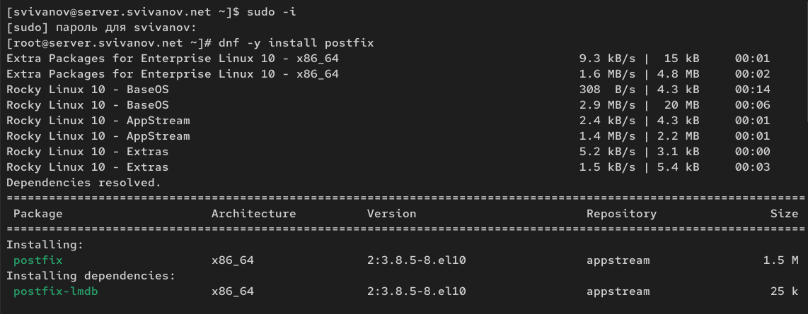{#fig:001 width=70%}

## Установка Postfix

Сконфигурируем межсетевой экран, разрешив работать службе протокола SMTP: (рис. 2).

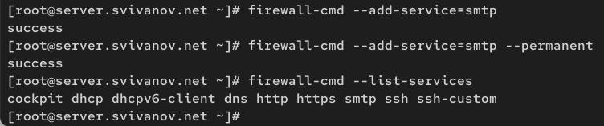{#fig:002 width=70%}

## Установка Postfix

Восстановим контекст безопасности в SELinux. (рис. 3)

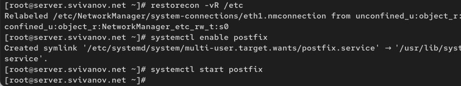{#fig:003 width=70%}

## Изменение параметров Postfix с помощью postconf

Первоначальную настройку Postfix осуществим, используя postconf. Просмотрим список текущих настроек. (рис. 4) 

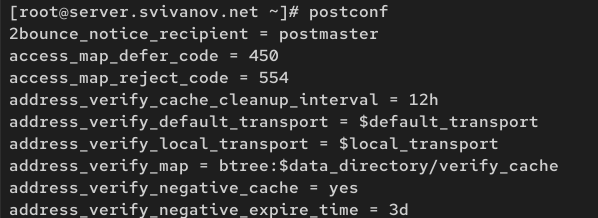{#fig:004 width=70%}

## Изменение параметров Postfix с помощью postconf

Посмотрим текущее значение параметра myorigin: (рис. 5)

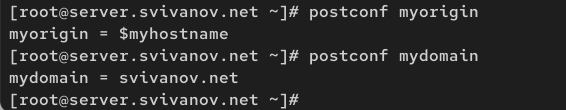{#fig:005 width=70%}

## Изменение параметров Postfix с помощью postconf

Заменим значение параметра myorigin на значение параметра mydomain. Повторим команду postconf myorigin. Убедимся, что замена параметра была произведена. (рис. 6)

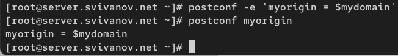{#fig:006 width=70%}

## Изменение параметров Postfix с помощью postconf

Проверим корректность содержания конфигурационного файла main.cf.
Перезагрузим конфигурационные файлы Postfix: (рис. 7)

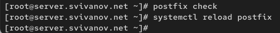{#fig:007 width=70%}

## Изменение параметров Postfix с помощью postconf

Просмотрим все параметры с значением, отличным от значения по умолчанию: (рис. 8)

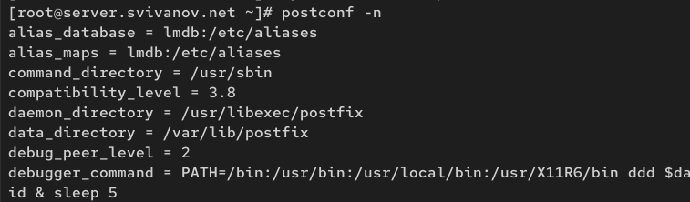{#fig:008 width=70%}

## Изменение параметров Postfix с помощью postconf

Зададим жёстко значение домена: (рис. 9)

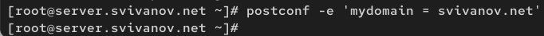{#fig:009 width=70%}

## Изменение параметров Postfix с помощью postconf

Отключим IPv6 в списке разрешённых в работе Postfix протоколов и оставим только IPv4: (рис. 10)

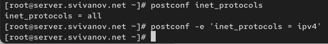{#fig:010 width=70%}

## Изменение параметров Postfix с помощью postconf

Перезагрузим конфигурацию Postfix: (рис. 11)

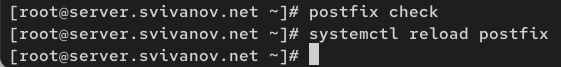{#fig:011 width=70%}

##  Проверка работы Postfix

На сервере под учётной записью пользователя отправим себе письмо, используя
утилиту mail: (рис. 12)

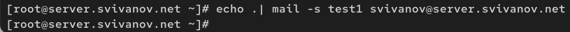{#fig:012 width=70%}

##  Проверка работы Postfix

На втором терминале запустим мониторинг работы почтовой службы и посмотрим,
что произошло с сообщением: (рис. 13)

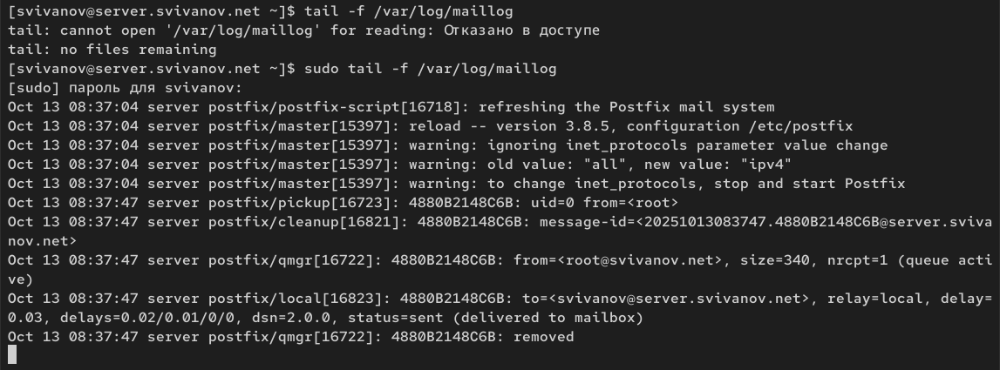{#fig:013 width=70%}
 
##  Проверка работы Postfix

Посмотрим содержание каталога /var/spool/mail на предмет того, появился ли там каталог моего пользователя с отправленным письмом. (рис. 14)

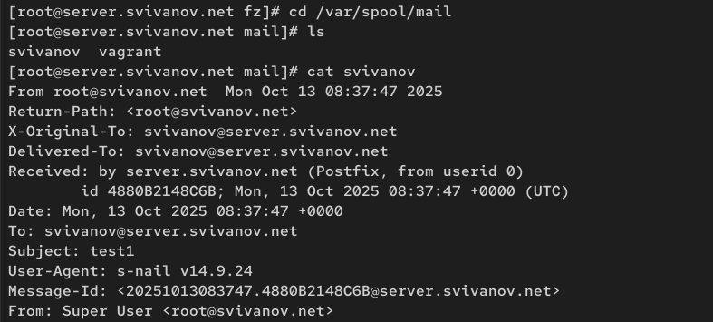{#fig:014 width=70%}

##  Проверка работы Postfix

На виртуальной машине client войдем под пользователем и откроем терминал. Установим необходимые для работы пакеты: (рис. 15)

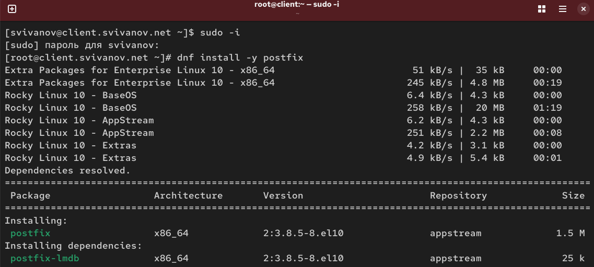{#fig:015 width=70%}

##  Проверка работы Postfix

Отключим IPv6 в списке разрешённых в работе Postfix протоколов и оставим только IPv4: (рис. 16)

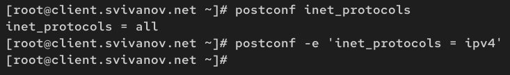{#fig:016 width=70%}

##  Проверка работы Postfix

На клиенте запустим Postfix: (рис. 17)

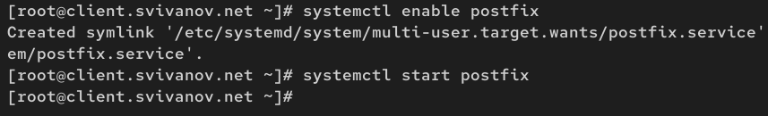{#fig:017 width=70%}

##  Проверка работы Postfix

На клиенте под учётной записью пользователя аналогичным образом отправим
себе второе письмо, используя утилиту mail. (рис. 18)

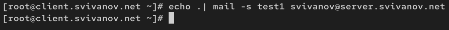{#fig:018 width=70%}

##  Проверка работы Postfix

Сравним результат мониторинга почтовой службы на сервере при отправке сообщения с сервера и с клиента. В данном случае сообщение не доставлено. (рис. 19)

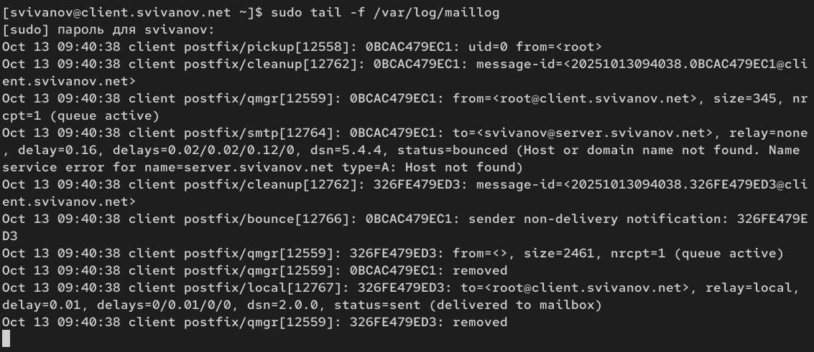{#fig:019 width=70%}

##  Проверка работы Postfix

На сервере в конфигурации Postfix посмотрим значения параметров сетевых интерфейсов inet_interfaces и сетевых адресов mynetworks, разрешим Postfix прослушивать соединения с других интерфейсов сети: (рис. 20)

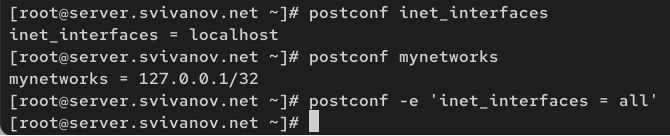{#fig:020 width=70%}

##  Проверка работы Postfix

Добавим адрес внутренней сети, разрешив таким образом пересылку сообщений
между узлами сети. Перезагрузим конфигурацию Postfix и перезапустите Postfix: (рис. 21)

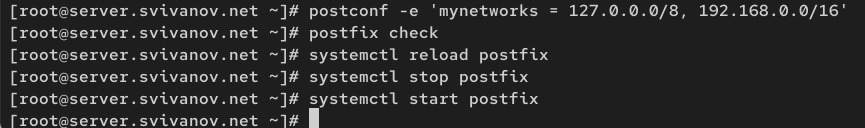{#fig:021 width=70%}

##  Проверка работы Postfix

Повторим отправку сообщения с клиента. (рис. 22)

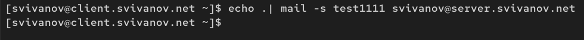{#fig:022 width=70%}

##  Проверка работы Postfix

Видим, что теперь сообщение успешно доставлено серверу от клиента. status = sent (отправлено) (рис. 23)

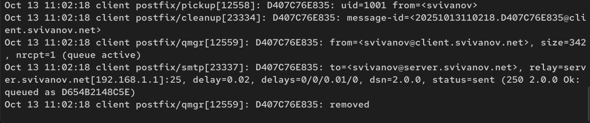{#fig:023 width=70%}

## Конфигурация Postfix для домена

С клиента отправим письмо на свой доменный адрес: (рис. 24)

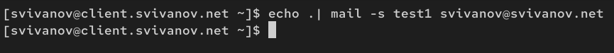{#fig:024 width=70%}

## Конфигурация Postfix для домена

Запустим мониторинг работы почтовой службы и посмотрим, что произошло
с сообщением. (рис. 25)

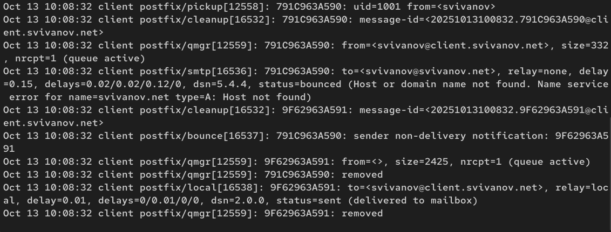{#fig:025 width=70%}

## Конфигурация Postfix для домена

Дополнительно посмотрим, какие сообщения ожидают в очереди на отправление. Вижу, что очередь пустая (рис. 26)

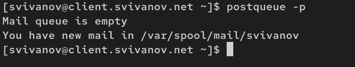{#fig:026 width=70%}

## Конфигурация Postfix для домена

Для настройки возможности отправки сообщений на доменный адрес пропишем MX-запись с указанием имени почтового сервера
mail.user.net в файле прямой DNS-зоны: (рис. 27)

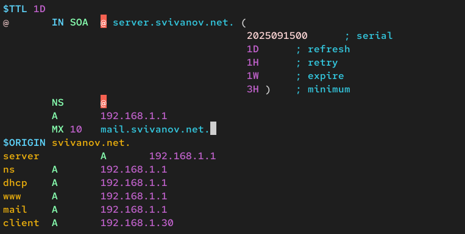{#fig:027 width=70%}

## Конфигурация Postfix для домена

И в файле обратной DNS-зоны: (рис. 28)

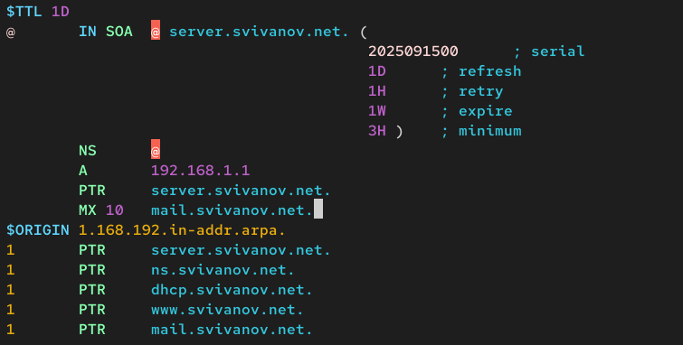{#fig:028 width=70%}

## Конфигурация Postfix для домена

В конфигурации Postfix добавим домен в список элементов сети, для которых данный сервер является конечной точкой доставки почты: (рис. 29)

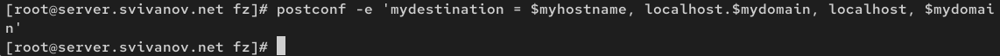{#fig:029 width=70%}

## Конфигурация Postfix для домена

Перезагрузим конфигурацию Postfix. Восстановим контекст безопасности в SELinux. Перезапустим DNS (рис. 30)

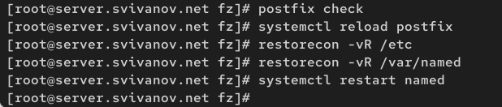{#fig:030 width=70%}

## Конфигурация Postfix для домена

Проверим отправку почты с клиента на доменный адрес. Видим, что в этот раз письмо успешно отправилось. status = sent (рис. 31, 32)

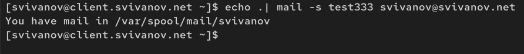{#fig:031 width=70%}

## Конфигурация Postfix для домена

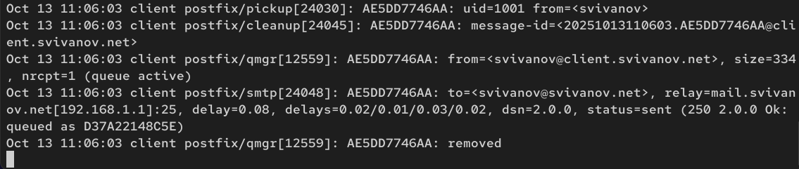{#fig:032 width=70%}

## Внесение изменений в настройки внутреннего окружения виртуальной машины

На машине server перейдем в каталог для внесения изменений /vagrant/provision/server/. Заменим конфигурационные файлы DNS-сервера: (рис. 33)

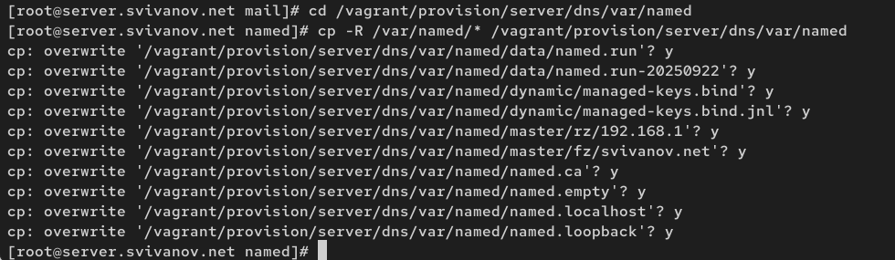{#fig:033 width=70%}

## Внесение изменений в настройки внутреннего окружения виртуальной машины

В каталоге /vagrant/provision/server создадим исполняемый файл mail.sh. Открыв его на редактирование, пропишем в нём следующий скрипт: (рис. 34)

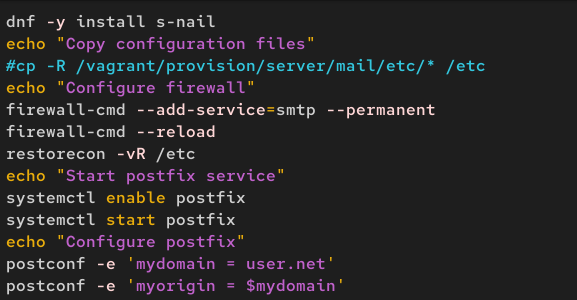{#fig:034 width=70%}

## Внесение изменений в настройки внутреннего окружения виртуальной машины

На машине client перейдем в каталог для внесения изменений /vagrant/provision/client/ и создадим исполняемый файл mail.sh: (рис. 35)

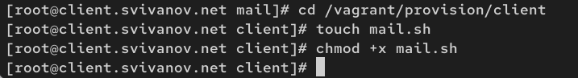{#fig:035 width=70%}
 
## Внесение изменений в настройки внутреннего окружения виртуальной машины

Открыв его на редактирование, пропишем в нём следующий скрипт: (рис. 36)

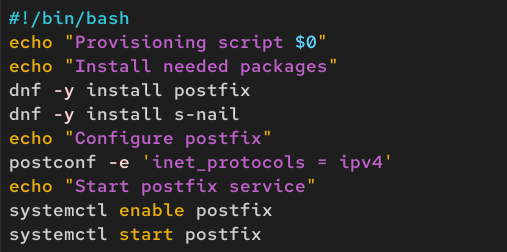{#fig:036 width=70%}

## Внесение изменений в настройки внутреннего окружения виртуальной машины

Для отработки скрипта во время загрузки машины server
в файле Vagrantfile необходимо добавить: (рис. 37)

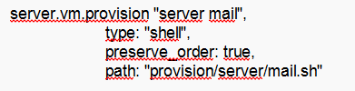{#fig:037 width=70%}

## Внесение изменений в настройки внутреннего окружения виртуальной машины

Для отработки скрипта во время загрузки машины client
в файле Vagrantfile необходимо добавить: (рис. 38)

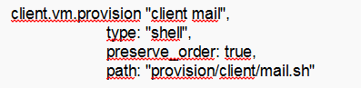{#fig:038 width=70%}

# Вывод

## Вывод 

В ходе выполнения лабораторной работы мы приобрели практические навыки по установке и конфигурированию SMTP-сервера.

 
