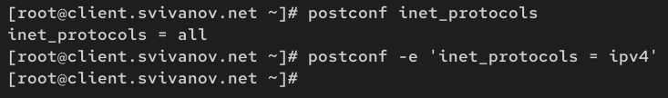

---
## Front matter
title: "Отчет по лабораторной работе №8"
subtitle: "Дисциплина: Администрирование сетевых подсистем"
author: "Иванов Сергей Владимирович"

## Generic otions
lang: ru-RU
toc-title: "Содержание"

## Bibliography
bibliography: bib/cite.bib
csl: pandoc/csl/gost-r-7-0-5-2008-numeric.csl

## Pdf output format
toc: true # Table of contents
toc-depth: 2
lof: true # List of figures
fontsize: 12pt
linestretch: 1.5
papersize: a4
documentclass: scrreprt
## I18n polyglossia
polyglossia-lang:
  name: russian
  options:
	- spelling=modern
	- babelshorthands=true
polyglossia-otherlangs:
  name: english
## I18n babel
babel-lang: russian
babel-otherlangs: english
## Fonts
mainfont: PT Serif
romanfont: PT Serif
sansfont: PT Sans
monofont: PT Mono
mainfontoptions: Ligatures=TeX
romanfontoptions: Ligatures=TeX
sansfontoptions: Ligatures=TeX,Scale=MatchLowercase
monofontoptions: Scale=MatchLowercase,Scale=0.9
## Biblatex
biblatex: true
biblio-style: "gost-numeric"
biblatexoptions:
  - parentracker=true
  - backend=biber
  - hyperref=auto
  - language=auto
  - autolang=other*
  - citestyle=gost-numeric
## Pandoc-crossref LaTeX customization
figureTitle: "Рис."
listingTitle: "Листинг"
lofTitle: "Список иллюстраций"
lolTitle: "Листинги"
## Misc options
indent: true
header-includes:
  - \usepackage{indentfirst}
  - \usepackage{float} # keep figures where there are in the text
  - \floatplacement{figure}{H} # keep figures where there are in the text
---

# Цель работы

Приобретение практических навыков по установке и конфигурированию SMTP-сервера.

# Задание

1. Установите на виртуальной машине server SMTP-сервер postfix (см. раздел 8.4.1).
2. Сделайте первоначальную настройку postfix при помощи утилиты postconf, задав
отправку писем не на локальный хост, а на сервер в домене (см. раздел 8.4.2).
3. Проверьте отправку почты с сервера и клиента (см. раздел 8.4.3).
4. Сконфигурируйте Postfix для работы в домене. Проверьте отправку почты с сервера
и клиента (см. раздел 8.4.4).
5. Напишите скрипт для Vagrant, фиксирующий действия по установке и настройке
Postfix во внутреннем окружении виртуальной машины server. Соответствующим
образом внесите изменения в Vagrantfile (см. раздел 8.4.5).

# Выполнение лабораторной работы

## Установка Postfix

На виртуальной машине server войдем под пользователем и откроем терминал. Перейдем в режим суперпользователя: sudo -i. Установим необходимые для работы пакеты:

dnf -y install postfix

dnf -y install s-nail. (рис. 1).

{#fig:001 width=70%}

Сконфигурируем межсетевой экран, разрешив работать службе протокола SMTP:

firewall-cmd --add-service=smtp

firewall-cmd --add-service=smtp --permanent

firewall-cmd --list-services (рис. 2).

{#fig:002 width=70%}

Восстановим контекст безопасности в SELinux:

restorecon -vR /etc

Запустим Postfix:

systemctl enable postfix

systemctl start postfix. (рис. 3)

{#fig:003 width=70%}

## Изменение параметров Postfix с помощью postconf

Первоначальную настройку Postfix осуществим, используя postconf. Для просмотра списка текущих настроек Postfix введем:
postconf. (рис. 4) 

{#fig:004 width=70%}

Посмотрим текущее значение параметра myorigin:

postconf myorigin

Посмотрим текущее значение параметра mydomain:

postconf mydomain. (рис. 5)

{#fig:005 width=70%}

Заменим значение параметра myorigin на значение параметра mydomain: postconf -e ‘myorigin = $mydomain’. Повторим команду postconf myorigin. Убедимся, что замена параметра была произведена. (рис. 6)

{#fig:006 width=70%}

Проверим корректность содержания конфигурационного файла main.cf: postfix check.
Перезагрузим конфигурационные файлы Postfix: systemctl reload postfix (рис. 7)

{#fig:007 width=70%}

Просмотрим все параметры с значением, отличным от значения по умолчанию: postconf -n (рис. 8)

{#fig:008 width=70%}

Зададим жёстко значение домена:
postconf -e 'mydomain = user.net' (рис. 9)

{#fig:009 width=70%}

Отключим IPv6 в списке разрешённых в работе Postfix протоколов и оставим только
IPv4:

postconf inet_protocols

postconf -e 'inet_protocols = ipv4' (рис. 10)

{#fig:010 width=70%}

Перезагрузим конфигурацию Postfix:

postfix check

systemctl reload postfix (рис. 11)

{#fig:011 width=70%}

##  Проверка работы Postfix

На сервере под учётной записью пользователя отправим себе письмо, используя
утилиту mail: echo .| mail -s test1 svivanov@server.svivanov.net (рис. 12)

{#fig:012 width=70%}

На втором терминале запустим мониторинг работы почтовой службы и посмотрим,
что произошло с сообщением: tail -f /var/log/maillog 

Прием письма:

- Письмо принято в систему с ID 4880B21480GB. Отправитель: root

Обработка:

- message-id=<20251013083747.4880B21480GB@server.svivanov.net>. Письму присвоен уникальный message-id

Постановка в очередь:

- 4880B21480GB: from<root@svivanov.net>, size=340, nrcpt=1 (queue active). Письмо помещено в активную очередь. Размер: 340 байт. 1 получатель

Успешная доставка:

- 4880B21480GB: to=<svivanov@server.svivanov.net>, relay=local, delay=0.03, delays=0.02/0.01/0/0, dsn=2.0.0, status=sent (delivered to mailbox). Статус: отправлено. Получатель: svivanov@server.svivanov.net. DSN код: 2.0.0 (успешная доставка). Сообщение: "delivered to mailbox" (доставлено в почтовый ящик) (рис. 13)

{#fig:013 width=70%}
 
Дополнительно посмотрим содержание каталога /var/spool/mail на предмет того, появился ли там каталог моего пользователя
с отправленным письмом. Видим, что появился. (рис. 14)

{#fig:014 width=70%}

На виртуальной машине client войдем под пользователем и откроем терминал. Перейдем в режим суперпользователя: sudo -i. На клиенте установим необходимые для работы пакеты:

dnf -y install postfix

dnf -y install s-nail (рис. 15)

{#fig:015 width=70%}

Отключим IPv6 в списке разрешённых в работе Postfix протоколов и оставим только
IPv4:

postconf inet_protocols

postconf -e 'inet_protocols = ipv4'. (рис. 16)

{#fig:016 width=70%}

На клиенте запустим Postfix:

systemctl enable postfix

systemctl start postfix (рис. 17)

{#fig:017 width=70%}

На клиенте под учётной записью пользователя аналогичным образом отправим
себе второе письмо, используя утилиту mail. (рис. 18)

{#fig:018 width=70%}

Сравним результат мониторинга почтовой службы на сервере при отправке сообщения с сервера и с клиента. В данном случае сообщение не доставлено.

Неудачная доставка:

- status=bounced (Host or domain name not found. Name service error for name=server.svivanov.net type=A: Host not found) dsn=5.4.4. Результат: Сообщение возвращено (bounce). Получатель: svivanov@server.svivanov.net. Причина ошибки: Доменное имя server.svivanov.net не найдено DNS сервисом

Проблема на клиенте:

- Name service error for name=server.svivanov.net type=A: Host not found. Клиент не может найти IP-адрес для домена server.svivanov.net через DNS. (рис. 19)

{#fig:019 width=70%}

На сервере в конфигурации Postfix посмотрим значения параметров сетевых интерфейсов inet_interfaces и сетевых адресов mynetworks:

postconf inet_interfaces

postconf mynetworks

Разрешим Postfix прослушивать соединения не только с локального узла, но и с других интерфейсов сети:

postconf -e 'inet_interfaces = all'(рис. 20)

{#fig:020 width=70%}

Добавим адрес внутренней сети, разрешив таким образом пересылку сообщений
между узлами сети:

postconf -e 'mynetworks = 127.0.0.0/8, 192.168.0.0/16'

Перезагрузим конфигурацию Postfix и перезапустите Postfix:

postfix check

systemctl reload postfix

systemctl stop postfix

systemctl start postfix (рис. 21)

{#fig:021 width=70%}

Повторим отправку сообщения с клиента. (рис. 22)

{#fig:022 width=70%}

Видим, что теперь сообщение успешно доставлено серверу от клиента. status = sent (отправлено) (рис. 23)

{#fig:023 width=70%}

## Конфигурация Postfix для домена

С клиента отправим письмо на свой доменный адрес:
echo .| mail -s test2 svivanov@svivanov.net (рис. 24)

{#fig:024 width=70%}

Запустим мониторинг работы почтовой службы и посмотрим, что произошло
с сообщением: tail -f /var/log/maillog 

Сообщение не доставлено получателю svivanov@svivanov.net

Причина: Ошибка DNS разрешения - домен svivanov.net не найден в DNS системе. Почтовый сервер на клиенте не может установить SMTP соединение с сервером, так как не может определить IP-адрес для домена svivanov.net.

Результат: Сообщение возвращено отправителю с уведомлением о невозможности доставки (bounce). (рис. 25)

{#fig:025 width=70%}

Дополнительно посмотрим, какие сообщения ожидают в очереди на отправление:
postqueue -p. Вижу, что очередь пустая (рис. 26)

{#fig:026 width=70%}

Для настройки возможности отправки сообщений не на конкретный узел сети,
а на доменный адрес пропишем MX-запись с указанием имени почтового сервера
mail.user.net в файле прямой DNS-зоны: (рис. 27)

{#fig:027 width=70%}

И в файле обратной DNS-зоны: (рис. 28)

{#fig:028 width=70%}

В конфигурации Postfix добавим домен в список элементов сети, для которых данный сервер является конечной точкой доставки почты:
postconf -e 'mydestination = $myhostname, localhost.$mydomain, localhost, $mydomain' (рис. 29)

{#fig:029 width=70%}

Перезагрузим конфигурацию Postfix:

postfix check

systemctl reload postfix

Восстановим контекст безопасности в SELinux:

restorecon -vR /etc

restorecon -vR /var/named

Перезапустим DNS: systemctl restart named (рис. 30)

{#fig:030 width=70%}

Проверим отправку почты с клиента на доменный адрес. Видим, что в этот раз письмо успешно отправилось. status = sent (рис. 31, 32)

{#fig:031 width=70%}

{#fig:032 width=70%}

## Внесение изменений в настройки внутреннего окружения виртуальной машины

На виртуальной машине server перейдем в каталог для внесения изменений в настройки внутреннего окружения /vagrant/provision/server/.
Заменим конфигурационные файлы DNS-сервера: (рис. 33)

{#fig:033 width=70%}

В каталоге /vagrant/provision/server создадим исполняемый файл mail.sh:

cd /vagrant/provision/server

touch mail.sh

chmod +x mail.sh

Открыв его на редактирование, пропишем в нём следующий скрипт: (рис. 34)

{#fig:034 width=70%}

На виртуальной машине client перейдем в каталог для внесения изменений в настройки внутреннего окружения /vagrant/provision/client/.
В каталоге /vagrant/provision/client создадим исполняемый файл mail.sh:

touch mail.sh

chmod +x mail.sh (рис. 35)

{#fig:035 width=70%}
 
Открыв его на редактирование, пропишем в нём следующий скрипт: (рис. 36)

{#fig:036 width=70%}

Для отработки созданного скрипта во время загрузки виртуальной машины server
в конфигурационном файле Vagrantfile необходимо добавить в разделе конфигурации для сервера: (рис. 37)

{#fig:037 width=70%}

Для отработки созданного скрипта во время загрузки виртуальной машины client
в конфигурационном файле Vagrantfile необходимо добавить в разделе конфигурации для клиента: (рис. 38)

{#fig:038 width=70%}

# Ответы на контрольные вопросы

**1. В каком каталоге и в каком файле следует смотреть конфигурацию Postfix?**

Каталог: /etc/postfix/. Основной конфигурационный файл: main.cf

**2. Каким образом можно проверить корректность синтаксиса в конфигурационном файле Postfix?**

Командой postfix check

**3. В каких параметрах конфигурации Postfix требуется внести изменения в значениях для настройки возможности отправки писем не на локальный хост, а на доменные адреса?**

Домен сервера postconf -e 'mydomain = user.net'

Домен отправителя postconf -e 'myorigin = $mydomain'

Домены для конечной доставки postconf -e 'mydestination = $myhostname, localhost.$mydomain, localhost, $mydomain'

Сетевые интерфейсы postconf -e 'inet_interfaces = all'

Доверенные сети postconf -e 'mynetworks = 127.0.0.0/8, 192.168.0.0/16'

Протоколы postconf -e 'inet_protocols = ipv4'

**4. Приведите примеры работы с утилитой mail по отправке письма, просмотру имеющихся писем, удалению письма.**

Отправка письма: echo "Текст сообщения" | mail -s "Тема письма" user@domain.net

Просмотр: каталог /var/spool/mail/user

Удаление письма: В режиме mail:

d - удалить текущее письмо, d 2 - удалить письмо №2

**5. Приведите примеры работы с утилитой postqueue. Как посмотреть очередь сообщений? Как определить число сообщений в очереди? Как отправить все сообщения, находящиеся в очереди? Как удалить письмо из очереди?**

Просмотр очереди сообщений: postqueue -p

Определение числа сообщений в очереди: postqueue -p | grep -c ""

Отправка всех сообщений в очереди: postqueue -f

Удаление письма из очереди: postsuper -d A1B2C3D4, удаление ВСЕХ писем из очереди postsuper -d ALL

# Выводы

В ходе выполнения лабораторной работы мы приобрели практические навыки по установке и конфигурированию SMTP-сервера.
