---
## Front matter
lang: ru-RU
title: Лабораторная работа №9
subtitle: Администрирование сетевых подсистем
author:
  - Иванов Сергей Владимирович, НПИбд-01-23
institute:
  - Российский университет дружбы народов, Москва, Россия
date: 18 октября 2025

## i18n babel
babel-lang: russian
babel-otherlangs: english

## Formatting pdf
toc: false
slide_level: 2
aspectratio: 169
section-titles: true
theme: metropolis
header-includes:
 - \metroset{progressbar=frametitle,sectionpage=progressbar,numbering=fraction}
 - '\makeatletter'
 - '\beamer@ignorenonframefalse'
 - '\makeatother'

 ## Fonts
mainfont: PT Serif
romanfont: PT Serif
sansfont: PT Sans
monofont: PT Mono
mainfontoptions: Ligatures=TeX
romanfontoptions: Ligatures=TeX
sansfontoptions: Ligatures=TeX,Scale=MatchLowercase
monofontoptions: Scale=MatchLowercase,Scale=0.9
---

## Цель работы

Приобретение практических навыков по установке и простейшему конфигурированию POP3/IMAP-сервера.

## Задание

1. Установите на виртуальной машине server Dovecot и Telnet для дальнейшей проверки корректности работы почтового сервера 
2. Настройте Dovecot 
3. Установите на виртуальной машине client программу для чтения почты Evolution
и настройте её для манипуляций с почтой вашего пользователя. Проверьте корректность работы почтового сервера как с виртуальной машины server, так
и с виртуальной машины client 
4. Измените скрипт для Vagrant, фиксирующий действия по установке и настройке
Postfix и Dovecote в виртуальной машине server, создайте
скрипт, фиксирующий действия по установке Evolution в виртуальной машине client. 

# Выполнение работы

## Установка Dovecot

На виртуальной машине server войдем под пользователем и откроем терминал. Перейдем в режим суперпользователя. Установим необходимые для работы пакеты. (рис. 1).

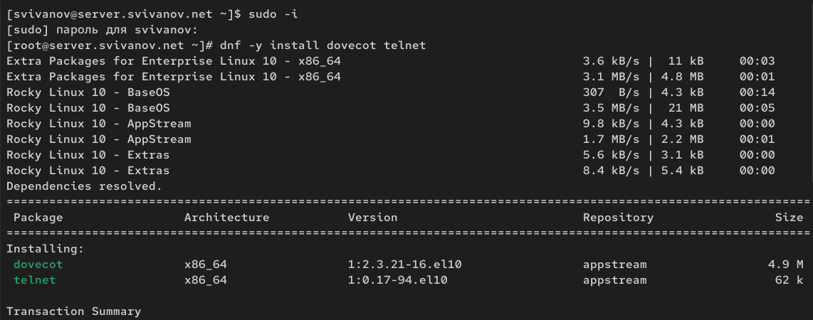{#fig:001 width=70%}

## Настройка dovecot

В конфигурационном файле /etc/dovecot/dovecot.conf пропишем список почтовых протоколов, по которым разрешено работать Dovecot (рис. 2).

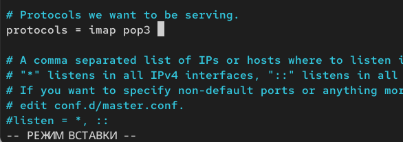{#fig:002 width=70%}

## Настройка dovecot

В конфигурационном файле /etc/dovecot/conf.d/10-auth.conf проверим, что указан метод аутентификации plain. (рис. 3)

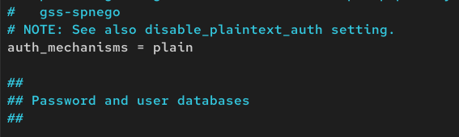{#fig:003 width=70%}

## Настройка dovecot

В конфигурационном файле /etc/dovecot/conf.d/auth-system.conf.ext проверим,
что для поиска пользователей и их паролей используется pam и файл passwd. (рис. 4, 5) 

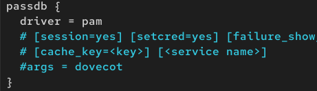{#fig:004 width=70%}

## Настройка dovecot

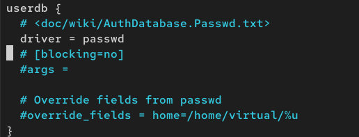{#fig:005 width=70%}

## Настройка dovecot

В конфигурационном файле /etc/dovecot/conf.d/10-mail.conf настроим месторасположение почтовых ящиков пользователей. (рис. 6)

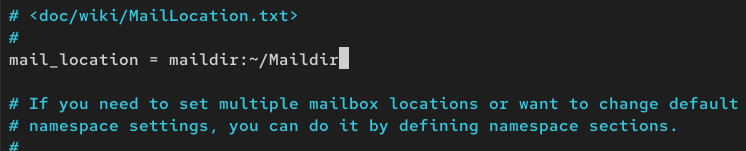{#fig:006 width=70%}

## Настройка dovecot

В Postfix зададим каталог для доставки почты: (рис. 7)

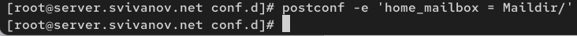{#fig:007 width=70%}

## Настройка dovecot

Сконфигурируем межсетевой экран, разрешив работать службам протоколов POP3
и IMAP: (рис. 8)

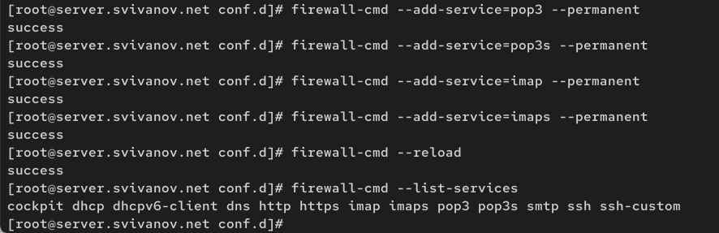{#fig:008 width=70%}

## Настройка dovecot

Восстановим контекст безопасности в SELinux: (рис. 9)

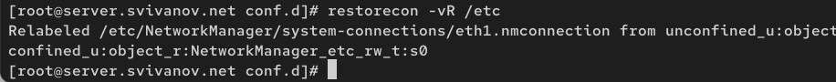{#fig:009 width=70%}

## Настройка dovecot

Перезапустим Postfix и запустим Dovecot: (рис. 10)

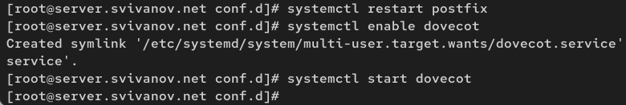{#fig:010 width=70%}

## Проверка работы Dovecot

На дополнительном терминале виртуальной машины server запустим мониторинг
работы почтовой службы: (рис. 11)

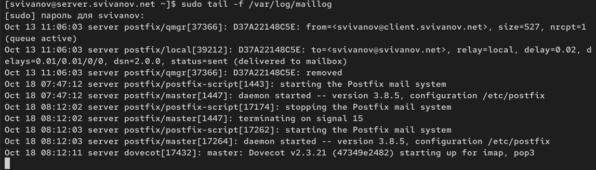{#fig:011 width=70%}

## Проверка работы Dovecot

На терминале сервера для просмотра имеющейся почты используем MAIL=~/Maildir mail. Писем нет (рис. 12)

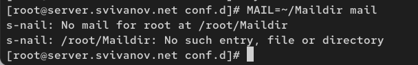{#fig:012 width=70%}

## Проверка работы Dovecot

Для просмотра mailbox пользователя на сервере на терминале с правами суперпользователя используем команду (рис. 13)

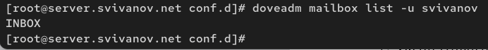{#fig:013 width=70%}
 
## Проверка работы Dovecot

На виртуальной машине client войдем под пользователем и откроем терминал. Перейдем в режим суперпользователя. Установим почтовый клиент. (рис. 14)

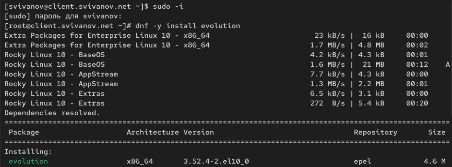{#fig:014 width=70%}

## Проверка работы Dovecot

Запустим и настроим почтовый клиент Evolution: в окне настройки учётной записи почты укажем имя, адрес почты (рис. 15)

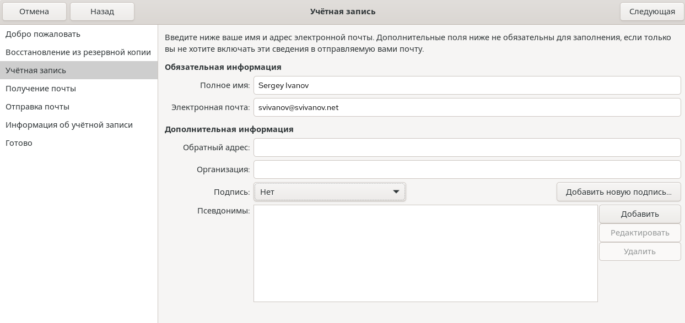{#fig:015 width=70%}

## Проверка работы Dovecot

В качестве IMAP-сервера для входящих сообщений пропишем mail.svivanov.net, пользователя укажем svivanov. Проверим номер порта (143). Проверим настройки SSL и метод аутентификации: STARTTLS,
аутентификация по обычному паролю. (рис. 16)

{#fig:016 width=70%}

## Проверка работы Dovecot

В качестве SMTP-сервера для исходящих сообщений пропишем mail.svivanov.net, пользователя укажем svivanov. Проверим номер порта (25).
Проверим настройки SSL и метод аутентификации: без аутентификации (рис. 17)

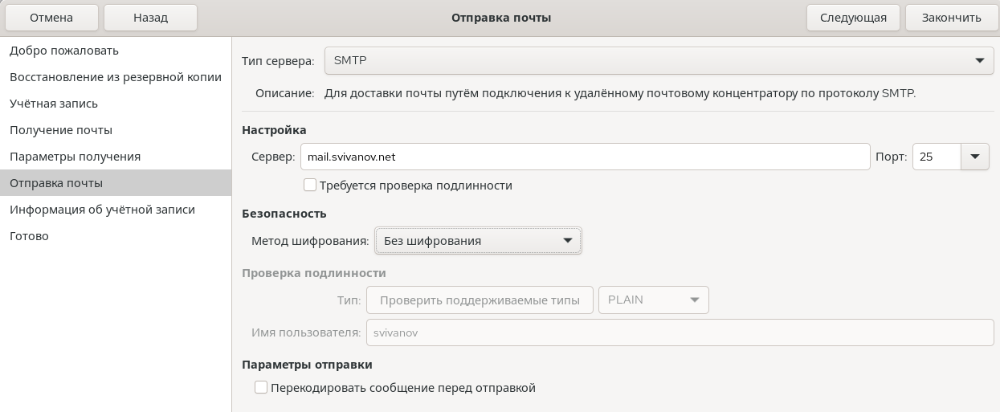{#fig:017 width=70%}

## Проверка работы Dovecot

Из почтового клиента отправим себе несколько тестовых писем. (рис. 18, 19)

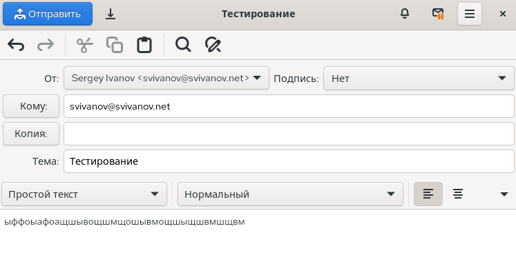{#fig:018 width=70%}

## Проверка работы Dovecot

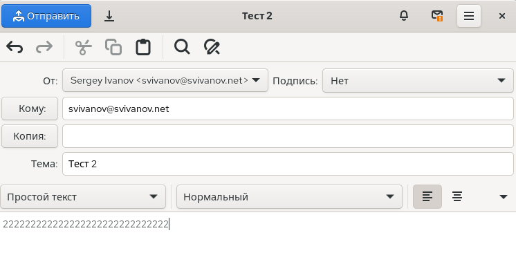{#fig:019 width=70%}

## Проверка работы Dovecot

Убедимся, что они доставлены. Видим, что это так. (рис. 20)

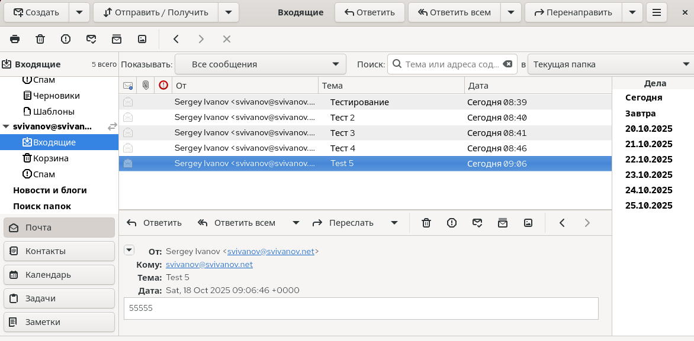{#fig:020 width=70%}

## Проверка работы Dovecot

Посмотрим, какие сообщения выдаются при мониторинге почтовой
службы на сервере. Видим, что все письма доставлены. status = sent. (рис. 21)

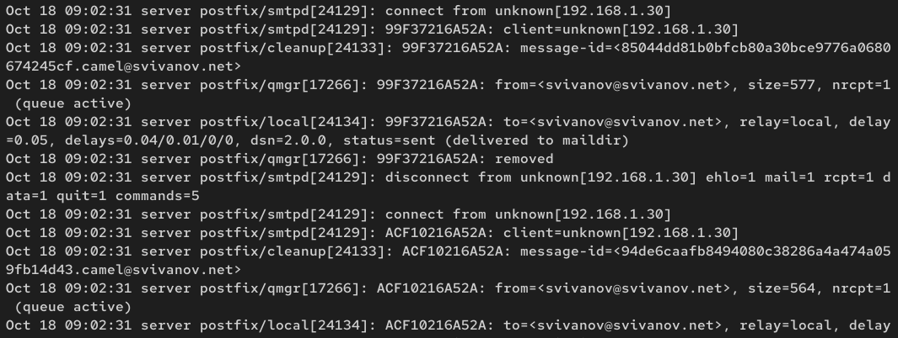{#fig:021 width=70%}

## Проверка работы Dovecot

Посмотрим, какие сообщения выдаются при использовании mail. mail показывает все 5 писем, их можно прямо там же просмотреть (рис. 22)

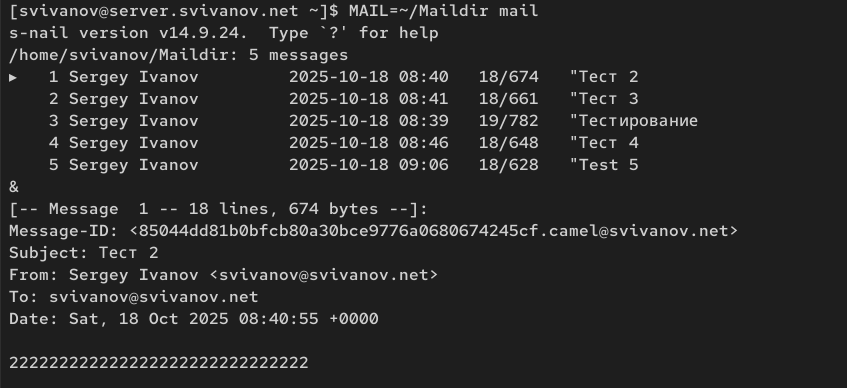{#fig:022 width=70%}

## Проверка работы Dovecot

Посмотрим, какие сообщения выдаются при использовании doveadm. Результат тот же, INBOX. (рис. 23)

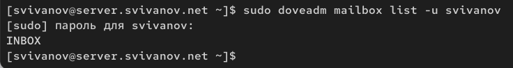{#fig:023 width=70%}

## Проверка работы Dovecot

Проверим работу почтовой службы, используя на сервере протокол Telnet: подключимся с помощью протокола Telnet к почтовому серверу по протоколу
POP3, введем свой логин для подключения и пароль: (рис. 24)

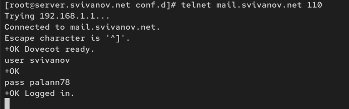{#fig:024 width=70%}

## Проверка работы Dovecot

С помощью команды list получим список писем (рис. 25)

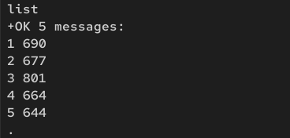{#fig:025 width=70%}

## Проверка работы Dovecot

С помощью команды retr 1 получим первое письмо из списка (рис. 26)

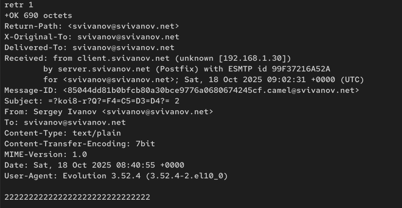{#fig:026 width=70%}

## Проверка работы Dovecot

С помощью команды dele 2 удалим второе письмо из списка (рис. 27)

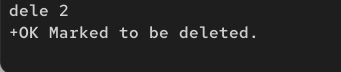{#fig:027 width=70%}

## Проверка работы Dovecot

С помощью команды quit завершим сеанс работы с telnet (рис. 28)

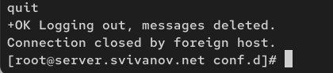{#fig:028 width=70%}

## Внесение изменений в настройки внутреннего окружения виртуальной машины

На машине server перейдем в каталог для внесения изменений в настройки внутреннего окружения. В соответствующие подкаталоги поместим конф. файлы Dovecot: (рис. 29)

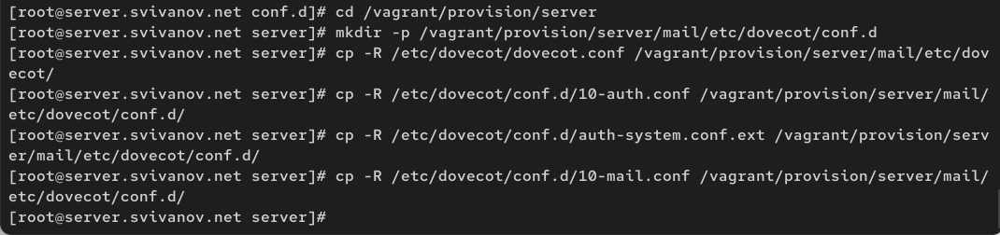{#fig:029 width=70%}

## Внесение изменений в настройки внутреннего окружения виртуальной машины

Внесем изменения в серипт mail.sh, добавив в него
строки: по установке Dovecot и Telnet; по настройке межсетевого экрана; по настройке Postfix в части задания месторасположения почтового ящика; по перезапуску Postfix и запуску Dovecot. (рис. 30)

## Внесение изменений в настройки внутреннего окружения виртуальной машины

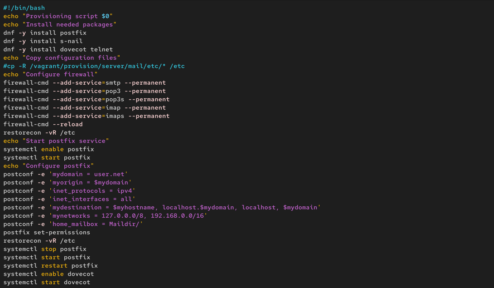{#fig:030 width=70%}

## Внесение изменений в настройки внутреннего окружения виртуальной машины

На виртуальной машине client в каталоге /vagrant/provision/client скорректируем файл mail.sh, прописав в нём (рис. 31)

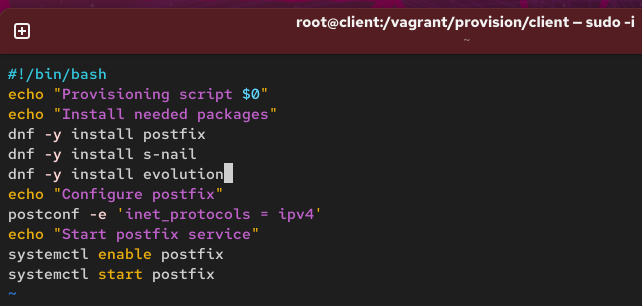{#fig:031 width=70%}

# Вывод

## Вывод 

В ходе выполнения лабораторной работы мы приобрели приобрели практические навыки по установке и простейшему конфигурированию POP3/IMAP-сервера.

 
