---
## Front matter
title: "Отчет по лабораторной работе №9"
subtitle: "Дисциплина: Администрирование сетевых подсистем"
author: "Иванов Сергей Владимирович"

## Generic otions
lang: ru-RU
toc-title: "Содержание"

## Bibliography
bibliography: bib/cite.bib
csl: pandoc/csl/gost-r-7-0-5-2008-numeric.csl

## Pdf output format
toc: true # Table of contents
toc-depth: 2
lof: true # List of figures
fontsize: 12pt
linestretch: 1.5
papersize: a4
documentclass: scrreprt
## I18n polyglossia
polyglossia-lang:
  name: russian
  options:
	- spelling=modern
	- babelshorthands=true
polyglossia-otherlangs:
  name: english
## I18n babel
babel-lang: russian
babel-otherlangs: english
## Fonts
mainfont: PT Serif
romanfont: PT Serif
sansfont: PT Sans
monofont: PT Mono
mainfontoptions: Ligatures=TeX
romanfontoptions: Ligatures=TeX
sansfontoptions: Ligatures=TeX,Scale=MatchLowercase
monofontoptions: Scale=MatchLowercase,Scale=0.9
## Biblatex
biblatex: true
biblio-style: "gost-numeric"
biblatexoptions:
  - parentracker=true
  - backend=biber
  - hyperref=auto
  - language=auto
  - autolang=other*
  - citestyle=gost-numeric
## Pandoc-crossref LaTeX customization
figureTitle: "Рис."
listingTitle: "Листинг"
lofTitle: "Список иллюстраций"
lolTitle: "Листинги"
## Misc options
indent: true
header-includes:
  - \usepackage{indentfirst}
  - \usepackage{float} # keep figures where there are in the text
  - \floatplacement{figure}{H} # keep figures where there are in the text
---

# Цель работы

Приобретение практических навыков по установке и простейшему конфигурированию POP3/IMAP-сервера.

# Задание

1. Установите на виртуальной машине server Dovecot и Telnet для дальнейшей проверки корректности работы почтового сервера (см. раздел 9.4.1).
2. Настройте Dovecot (см. раздел 9.4.2).
3. Установите на виртуальной машине client программу для чтения почты Evolution
и настройте её для манипуляций с почтой вашего пользователя. Проверьте корректность работы почтового сервера как с виртуальной машины server, так
и с виртуальной машины client (см. раздел 9.4.3).
4. Измените скрипт для Vagrant, фиксирующий действия по установке и настройке
Postfix и Dovecote во внутреннем окружении виртуальной машины server, создайте
скрипт для Vagrant, фиксирующий действия по установке Evolution во внутреннем окружении виртуальной машины client. Соответствующим образом внесите
изменения в Vagrantfile (см. раздел 9.4.4).

# Выполнение лабораторной работы

## Установка Dovecot

На виртуальной машине server войдем под пользователем и откроем терминал. Перейдем в режим суперпользователя: sudo -i. Установим необходимые для работы пакеты:
dnf -y install dovecot telnet. (рис. 1).

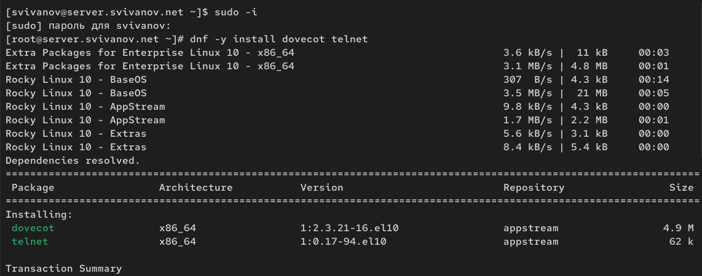{#fig:001 width=70%}

## Настройка dovecot

В конфигурационном файле /etc/dovecot/dovecot.conf пропишем список почтовых протоколов, по которым разрешено работать Dovecot:
protocols = imap pop3 (рис. 2).

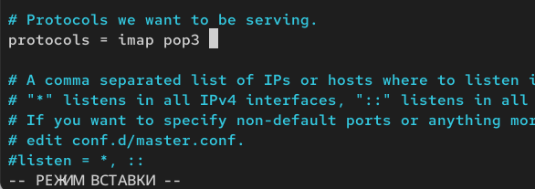{#fig:002 width=70%}

В конфигурационном файле /etc/dovecot/conf.d/10-auth.conf проверим, что указан метод аутентификации plain:
auth_mechanisms = plain. (рис. 3)

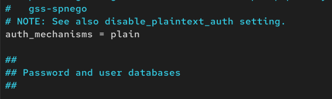{#fig:003 width=70%}

В конфигурационном файле /etc/dovecot/conf.d/auth-system.conf.ext проверим,
что для поиска пользователей и их паролей используется pam и файл passwd:

passdb {

driver = pam

}

userdb {

driver = passwd

}. (рис. 4, 5) 

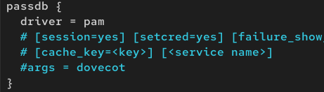{#fig:004 width=70%}

{#fig:005 width=70%}

В конфигурационном файле /etc/dovecot/conf.d/10-mail.conf настроим месторасположение почтовых ящиков пользователей:
mail_location = maildir:~/Maildir. (рис. 6)

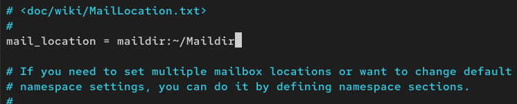{#fig:006 width=70%}

В Postfix зададим каталог для доставки почты: postconf -e 'home_mailbox = Maildir/' (рис. 7)

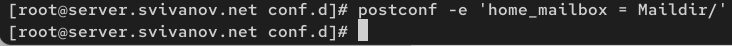{#fig:007 width=70%}

Сконфигурируем межсетевой экран, разрешив работать службам протоколов POP3
и IMAP:

firewall-cmd --get-services

firewall-cmd --add-service=pop3 --permanent

firewall-cmd --add-service=pop3s --permanent

firewall-cmd --add-service=imap --permanent

firewall-cmd --add-service=imaps --permanent

firewall-cmd --reload

firewall-cmd --list-services (рис. 8)

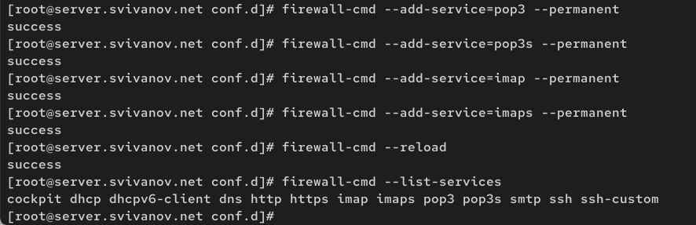{#fig:008 width=70%}

Восстановим контекст безопасности в SELinux:
restorecon -vR /etc (рис. 9)

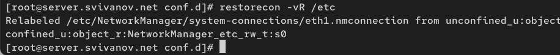{#fig:009 width=70%}

Перезапустим Postfix и запустим Dovecot:

systemctl restart postfix

systemctl enable dovecot

systemctl start dovecot (рис. 10)

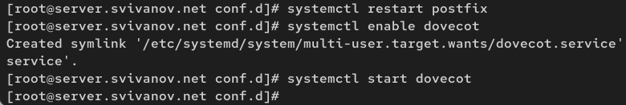{#fig:010 width=70%}

## Проверка работы Dovecot

На дополнительном терминале виртуальной машины server запустим мониторинг
работы почтовой службы:
tail -f /var/log/maillog (рис. 11)

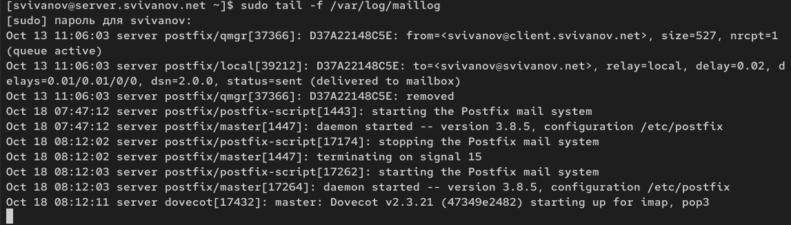{#fig:011 width=70%}

На терминале сервера для просмотра имеющейся почты используем MAIL=~/Maildir mail. Писем нет (рис. 12)

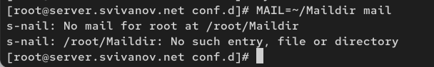{#fig:012 width=70%}

Для просмотра mailbox пользователя на сервере на терминале с правами суперпользователя используем команду
doveadm mailbox list -u svivanov (рис. 13)

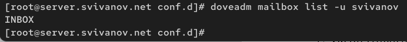{#fig:013 width=70%}
 
На виртуальной машине client войдем под пользователем и откроем терминал. Перейдем в режим суперпользователя: sudo -i. Установим почтовый клиент:
dnf -y install evolution. (рис. 14)

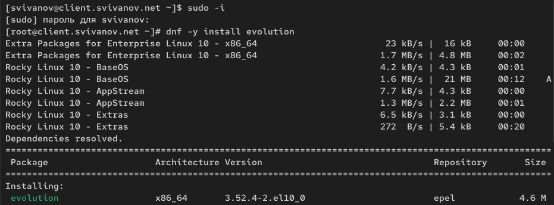{#fig:014 width=70%}

Запустим и настроим почтовый клиент Evolution: в окне настройки учётной записи почты укажем имя, адрес почты в виде
user@user.net (рис. 15)

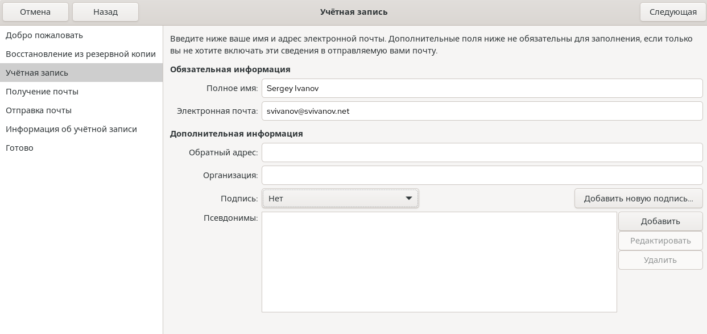{#fig:015 width=70%}

В качестве IMAP-сервера для входящих сообщений пропишем mail.svivanov.net, в качестве пользователя укажем svivanov. Проверим номера портов: для IMAP — порт 143. Проверим настройки SSL и метода аутентификации: для IMAP — STARTTLS,
аутентификация по обычному паролю. (рис. 16)

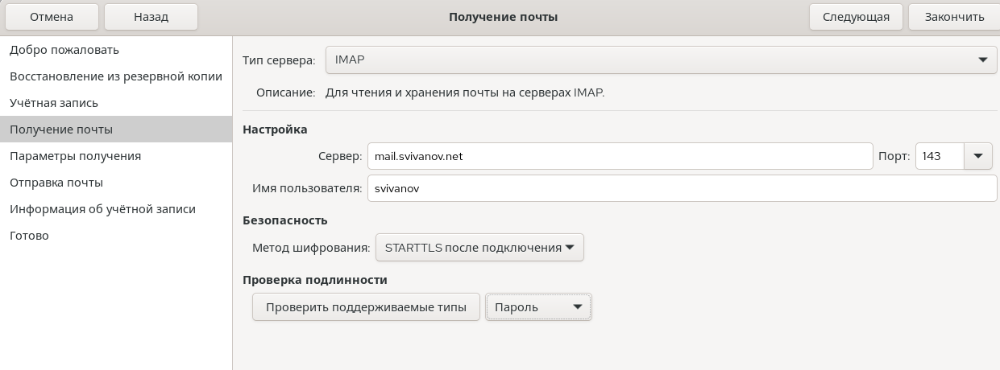{#fig:016 width=70%}

В качестве SMTP-сервера для исходящих сообщений пропишем mail.svivanov.net, в качестве пользователя укажем svivanov. Проверим номера портов: для SMTP — порт 25.
Проверим настройки SSL и метода аутентификации: для SMTP — без аутентификации, аутентификация — «Без аутентификации» (рис. 17)

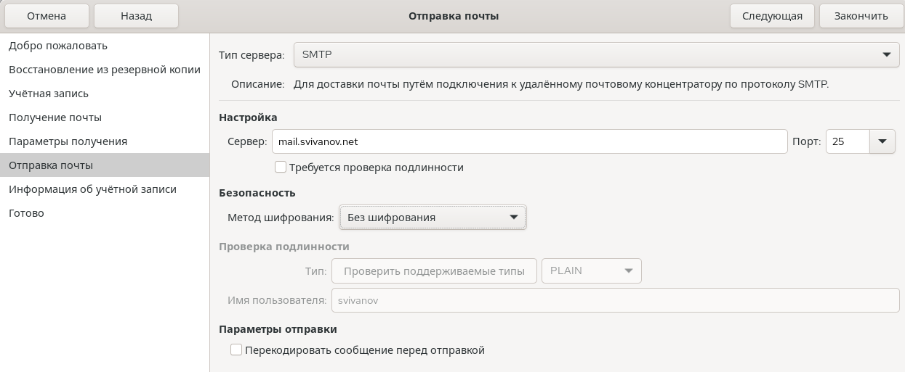{#fig:017 width=70%}

Из почтового клиента отправим себе несколько тестовых писем. (рис. 18, 19)

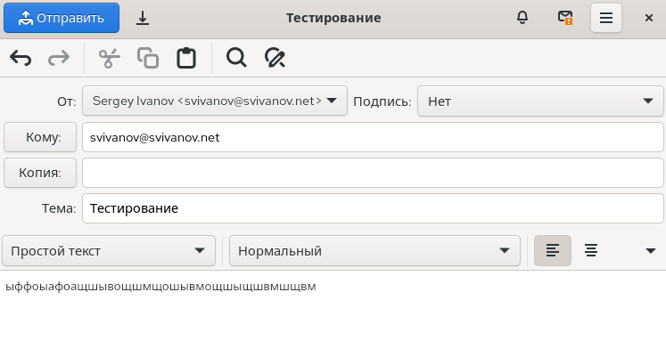{#fig:018 width=70%}

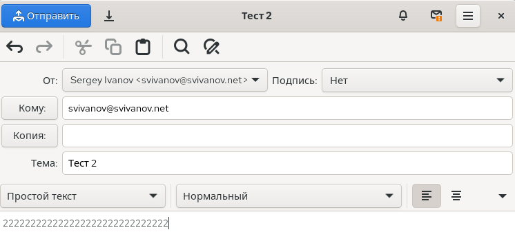{#fig:019 width=70%}

Убедимся, что они доставлены. Видим, что это так. (рис. 20)

{#fig:020 width=70%}

Параллельно посмотрим, какие сообщения выдаются при мониторинге почтовой
службы на сервере. Видим, что все письма доставлены с svivanov@svivanov.net к svivanov@svivanov.net, о чем нам говорит status = sent (delivered to maildir). (рис. 21)

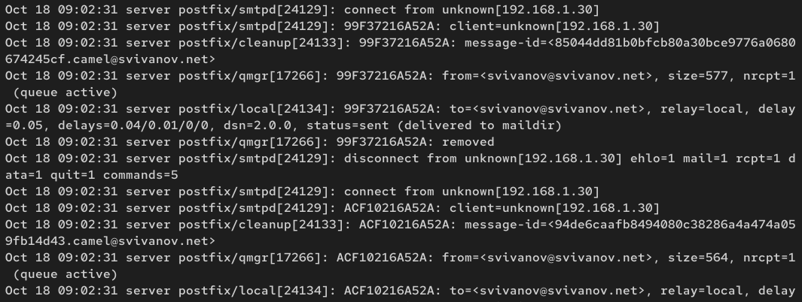{#fig:021 width=70%}

Посмотрим, какие сообщения выдаются при использовании mail. mail показывает все 5 писем, их можно прямо там же просмотреть (рис. 22)

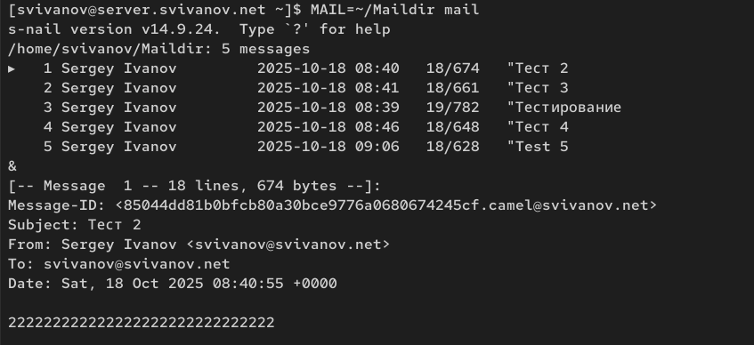{#fig:022 width=70%}

Посмотрим, какие сообщения выдаются при использовании doveadm. Результат тот же, INBOX. (рис. 23)

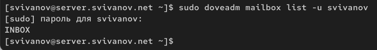{#fig:023 width=70%}

Проверим работу почтовой службы, используя на сервере протокол Telnet: подключимся с помощью протокола Telnet к почтовому серверу по протоколу
POP3 (через порт 110), введем свой логин для подключения и пароль:

telnet mail.user.net 110

user имя_пользователя

pass ваш_пароль (рис. 24)

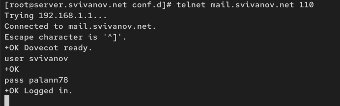{#fig:024 width=70%}

С помощью команды list получим список писем (рис. 25)

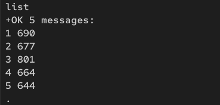{#fig:025 width=70%}

С помощью команды retr 1 получим первое письмо из списка (рис. 26)

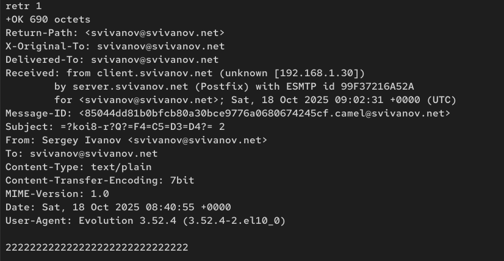{#fig:026 width=70%}

С помощью команды dele 2 удалим второе письмо из списка (рис. 27)

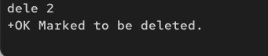{#fig:027 width=70%}

С помощью команды quit завершим сеанс работы с telnet (рис. 28)

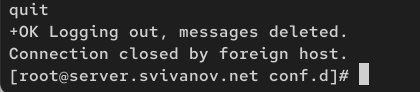{#fig:028 width=70%}

## Внесение изменений в настройки внутреннего окружения виртуальной машины

На виртуальной машине server перейдем в каталог для внесения изменений в настройки внутреннего окружения /vagrant/provision/server/. В соответствующие
подкаталоги поместим конфигурационные файлы Dovecot: (рис. 29)

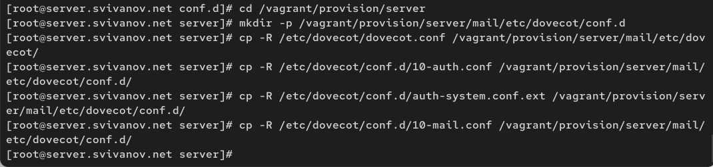{#fig:029 width=70%}

Внесем изменения в файл /vagrant/provision/server/mail.sh, добавив в него
строки:

– по установке Dovecot и Telnet;

– по настройке межсетевого экрана;

– по настройке Postfix в части задания месторасположения почтового ящика;

– по перезапуску Postfix и запуску Dovecot. (рис. 30)

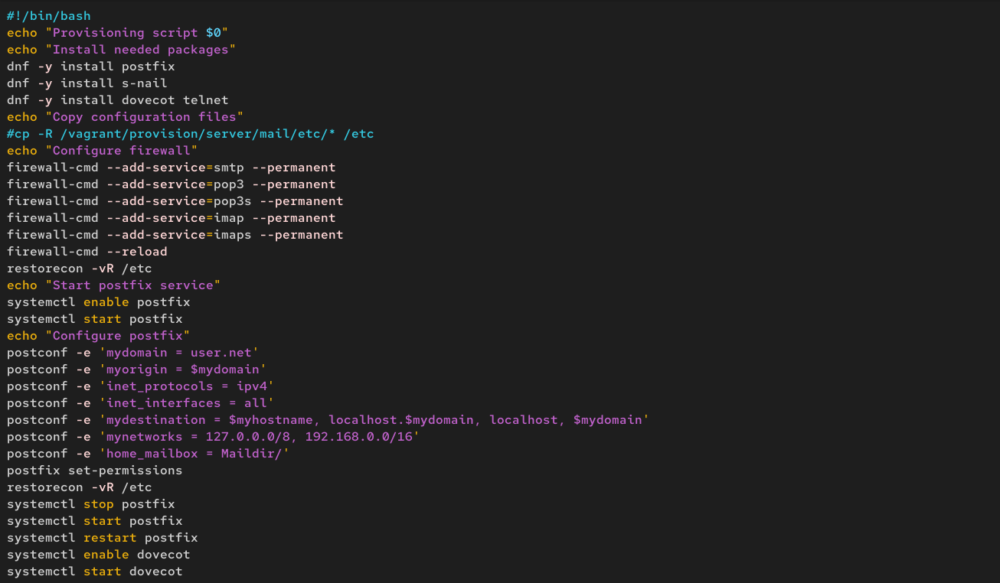{#fig:030 width=70%}

На виртуальной машине client в каталоге /vagrant/provision/client скорректируем файл mail.sh, прописав в нём:
dnf -y install evolution (рис. 31)

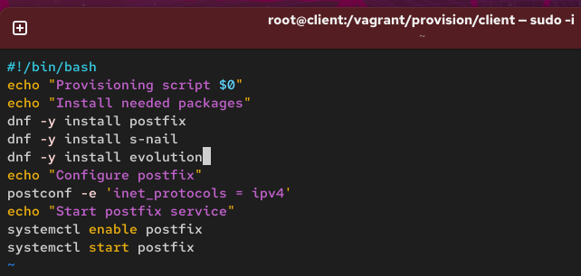{#fig:031 width=70%}

# Ответы на контрольные вопросы

**1. За что отвечает протокол SMTP?**

SMTP (Simple Mail Transfer Protocol) — это протокол для отправки и ретрансляции электронной почты. Он отвечает за передачу сообщений от почтового клиента на почтовый сервер, а также за пересылку почты между разными почтовыми серверами.

**2. За что отвечает протокол IMAP?**

IMAP (Internet Message Access Protocol) — это протокол для доступа к электронной почте, хранящейся на почтовом сервере. Его основное назначение — управление почтовым ящиком непосредственно на сервере. Письма остаются на сервере, что позволяет синхронизировать состояние почтового ящика между несколькими клиентами.

**3. За что отвечает протокол POP3?**

POP3 (Post Office Protocol version 3) — это более старый протокол для загрузки почты с сервера на локальный компьютер. Обычно после загрузки письма удаляются с сервера. В отличие от IMAP, POP3 не предназначен для синхронизации состояния почтового ящика между разными устройствами.

**4. В чём назначение Dovecot?**

Dovecot — это почтовый агент доставки, который реализует протоколы POP3 и IMAP. Его назначение — предоставлять пользователям безопасный и надежный доступ к их почтовым ящикам, хранящимся на сервере. Dovecot занимается аутентификацией пользователей и предоставлением им доступа к их письмам.

**5. В каких файлах обычно находятся настройки работы Dovecot? За что отвечает каждый из файлов?**

/etc/dovecot/dovecot.conf: Главный конфигурационный файл. В нем задаются базовые параметры, такие как список поддерживаемых протоколов (protocols = imap pop3).

/etc/dovecot/conf.d/10-auth.conf: Отвечает за настройки аутентификации. В нем указываются разрешенные механизмы аутентификации (auth_mechanisms = plain).

/etc/dovecot/conf.d/auth-system.conf.ext: Определяет, где искать учетные данные пользователей (например, с помощью PAM или файла /etc/passwd).

/etc/dovecot/conf.d/10-mail.conf: Задает параметры, связанные с хранением почты, например, формат и расположение почтовых ящиков (mail_location = maildir:~/Maildir).

**6. В чём назначение Postfix?**

Postfix — это агент пересылки почты. Его основное назначение — принимать почту от клиентов и других серверов, а также отправлять ее до конечных почтовых серверов получателей. В связке с Dovecot, Postfix занимается "доставкой" почты в почтовые ящики пользователей, а Dovecot — предоставлением доступа к этим ящикам.

**7. Какие методы аутентификации пользователей можно использовать в Dovecot и в чём их отличие?**

plain: Простая аутентификация по логину и паролю. Пароль передается в открытом виде, поэтому для безопасности должен использоваться вместе с шифрованием (TLS/SSL).

login: Похож на plain, но исторически используется в некоторых старых клиентах.

**8. Приведите пример заголовка письма с пояснениями его полей.**

```
Received: from mail.user.net (localhost [IPv6:::1])
    by server.user.net (Postfix) with ESMTP id A1B2C3D4E5
    for <user@user.net>; Mon, 23 Oct 2023 15:30:45 +0300 (MSK)
From: user@user.net
To: user@user.net
Subject: тестовое письмо
Date: Mon, 18 Oct 2025 15:30:45 +0300
Message-ID: <1234567890@server.user.net>
MIME-Version: 1.0
Content-Type: text/plain; charset="utf-8"

```

Received: Цепочка серверов, через которые прошло письмо, с временными метками.

From: Адрес отправителя. To: Адрес получателя.

Subject: Тема письма.

Date: Дата и время отправки.

Message-ID: Уникальный идентификатор письма.

MIME-Version: Версия стандарта для передачи нетекстовых вложений.

Content-Type: Тип содержимого письма и кодировка.

**9. Приведите примеры использования команд для работы с почтовыми протоколами через терминал (например через telnet).**

USER и PASS: Аутентификация.

LIST: Получить список писем и их размеры.

RETR 1: Получить содержимое письма номер 1.

DELE 2: Пометить письмо номер 2 для удаления (удаляется после QUIT).

QUIT: Завершить сеанс.

**10. Приведите примеры с пояснениями по работе с doveadm.**

Просмотр списка почтовых ящиков пользователя: doveadm mailbox list -u user. Команда выводит все папки (например, INBOX, Sent, Drafts) пользователя user.

Поиск писем: doveadm search -u user mailbox INBOX subject "тест". Находит все письма в папке "INBOX" пользователя user, в теме которых есть слово "тест".

Вывод информации о письме: doveadm fetch -u user "body" mailbox INBOX uid 1. Извлекает и выводит тело письма с uid=1 из папки "INBOX" пользователя user.

# Выводы

В ходе выполнения лабораторной работы мы приобрели приобрели практические навыки по установке и простейшему конфигурированию POP3/IMAP-сервера.
