---
## Front matter
lang: ru-RU
title: Лабораторная работа №10
subtitle: Администрирование сетевых подсистем
author:
  - Иванов Сергей Владимирович, НПИбд-01-23
institute:
  - Российский университет дружбы народов, Москва, Россия
date: 27 октября 2025

## i18n babel
babel-lang: russian
babel-otherlangs: english

## Formatting pdf
toc: false
slide_level: 2
aspectratio: 169
section-titles: true
theme: metropolis
header-includes:
 - \metroset{progressbar=frametitle,sectionpage=progressbar,numbering=fraction}
 - '\makeatletter'
 - '\beamer@ignorenonframefalse'
 - '\makeatother'

 ## Fonts
mainfont: PT Serif
romanfont: PT Serif
sansfont: PT Sans
monofont: PT Mono
mainfontoptions: Ligatures=TeX
romanfontoptions: Ligatures=TeX
sansfontoptions: Ligatures=TeX,Scale=MatchLowercase
monofontoptions: Scale=MatchLowercase,Scale=0.9
---

# Цель работы

Приобретение практических навыков по конфигурированию SMTP-сервера в части
настройки аутентификации.

# Задание

1. Настройте Dovecot для работы с LMTP 
2. Настройте аутентификацию посредством SASL на SMTP-сервере 
3. Настройте работу SMTP-сервера поверх TLS 
4. Скорректируйте скрипт для Vagrant, фиксирующий действия расширенной настройки SMTP-сервера во внутреннем окружении виртуальной машины server 

# Выполнение лабораторной работы

## Настройка LMTP в Dovecote

На машине server войдем под пользователем и перейдем в режим суперпользователя. В дополнительном терминале запустим мониторинг работы почтовой службы (рис. 1).

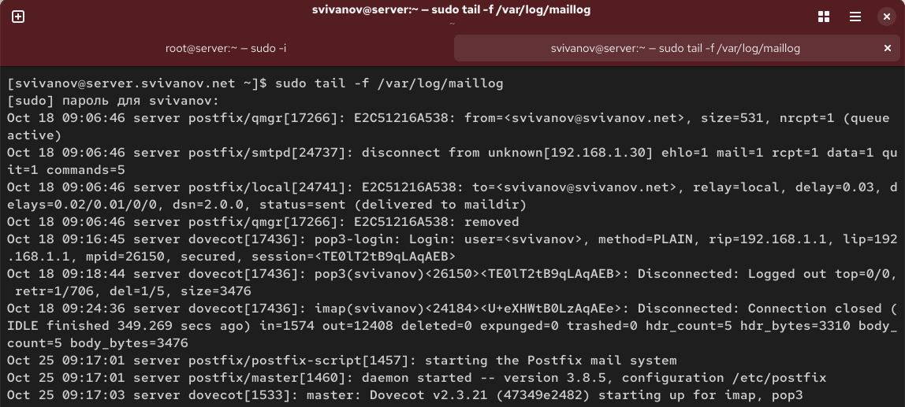{#fig:001 width=70%}

## Настройка LMTP в Dovecote

Добавим в список протоколов, с которыми может работать Dovecot, протокол LMTP. (рис. 2).

{#fig:002 width=70%}

## Настройка LMTP в Dovecote

Настроим в Dovecot сервис lmtp для связи с Postfix в файле
/etc/dovecot/conf.d/10-master.conf. (рис. 3)

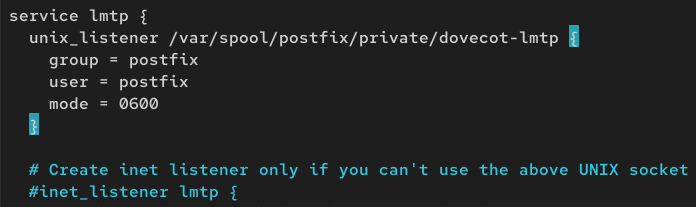{#fig:003 width=70%}

## Настройка LMTP в Dovecote

Переопределим в Postfix с помощью postconf передачу сообщений не на прямую,
а через заданный unix-сокет (рис. 4) 

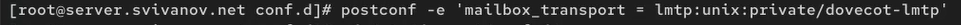{#fig:004 width=70%}

## Настройка LMTP в Dovecote

В файле /etc/dovecot/conf.d/10-auth.conf зададим формат имени пользователя
для аутентификации в форме логина пользователя без указания домена (рис. 5) 

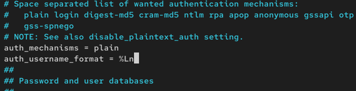{#fig:005 width=70%}

## Настройка LMTP в Dovecote

Перезапустим Postfix и Dovecot. Из-под учётной записи пользователя отправим письмо с клиента: (рис. 6)

{#fig:006 width=70%}

## Настройка LMTP в Dovecote

Просмотрим мониторинг почты. (рис. 7)

{#fig:007 width=70%}

## Настройка LMTP в Dovecote

На сервере просмотрим почтовый ящик пользователя: (рис. 8)

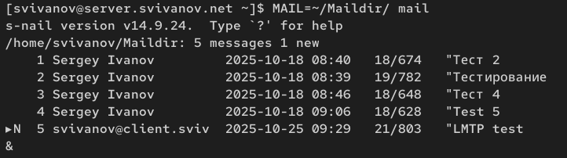{#fig:008 width=70%}

## Настройка SMTP-аутентификации

В файле /etc/dovecot/conf.d/10-master.conf определим службу аутентификации
пользователей: (рис. 9)

{#fig:009 width=70%}

## Настройка SMTP-аутентификации

Для Postfix зададим тип аутентификации SASL для smtpd и путь к соответствующему unix-сокету: (рис. 10)

{#fig:010 width=70%}

## Настройка SMTP-аутентификации

Настроим Postfix для приёма почты из Интернета только для обслуживаемых нашим сервером пользователей или для произвольных пользователей локальной
машины. (рис. 11)

{#fig:011 width=70%}

## Настройка SMTP-аутентификации

В настройках Postfix ограничим приём почты только локальным адресом SMTPсервера сети: (рис. 12)

{#fig:012 width=70%}

## Настройка SMTP-аутентификации

Для проверки работы аутентификации временно запустим SMTP-сервер
(порт 25) с возможностью аутентификации. (рис. 13)

{#fig:013 width=70%}
 
## Настройка SMTP-аутентификации

Перезапустим Postfix и Dovecot (рис. 14)

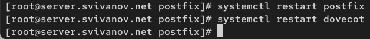{#fig:014 width=70%}

## Настройка SMTP-аутентификации

На клиенте установим telnet: (рис. 15)

{#fig:015 width=70%}

## Настройка SMTP-аутентификации

На клиенте получим строку для аутентификации (рис. 16)

{#fig:016 width=70%}

## Настройка SMTP-аутентификации

Подключимся на клиенте к SMTP-серверу посредством telnet: (рис. 17)

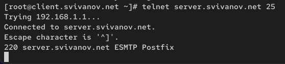{#fig:017 width=70%}

## Настройка SMTP-аутентификации

Протестируем соединение, введя. (рис. 18)

{#fig:018 width=70%}

## Настройка SMTP-аутентификации

Проверим авторизацию, задав: (рис. 19)

{#fig:019 width=70%}

## Настройка SMTP over TLS

Настроим на сервере TLS, воспользовавшись временным сертификатом Dovecot. (рис. 20)

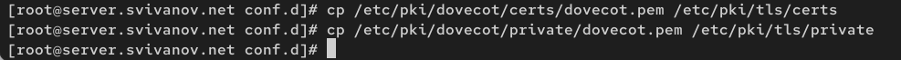{#fig:020 width=70%}

## Настройка SMTP over TLS

Сконфигурируем Postfix, указав пути к сертификату и ключу, а также к каталогу для хранения TLS-сессий и уровень безопасности: (рис. 21)

{#fig:021 width=70%}

## Настройка SMTP over TLS

Редактируем master.cf для того чтобы запустить SMTP-сервер на 587-м порту (рис. 22)

{#fig:022 width=70%}

## Настройка SMTP over TLS

Настроим межсетевой экран, разрешив работать службе smtp-submission: (рис. 23)

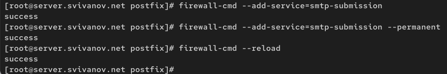{#fig:023 width=70%}

## Настройка SMTP over TLS

Перезапустим Postfix: (рис. 24)

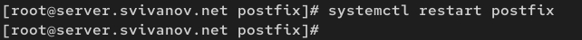{#fig:024 width=70%}

## Настройка SMTP over TLS

На клиенте подключимся к SMTP-серверу через 587-й порт посредством openssl (рис. 25)

{#fig:025 width=70%}

## Настройка SMTP over TLS

Протестируем подключение по telnet: (рис. 26)

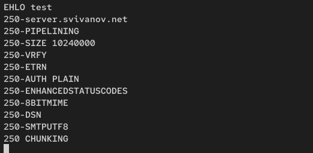{#fig:026 width=70%}

## Настройка SMTP over TLS

Проверим аутентификацию: (рис. 27)

{#fig:027 width=70%}

## Настройка SMTP over TLS

Проверим корректность отправки почтовых сообщений с клиента (рис. 28)

{#fig:028 width=70%}

## Настройка SMTP over TLS

Отправим письмо. (рис. 29)

{#fig:029 width=70%}

## Настройка SMTP over TLS

Видим, что письмо доставлено. (рис. 30)

{#fig:030 width=70%}

## Внесение изменений в настройки внутреннего окружения виртуальной машины

На машине server перейдем в каталог для внесения изменений. В соответствующие подкаталоги поместим конфигурационные файлы Dovecot и Postfix: (рис. 31)

{#fig:031 width=70%}

## Внесение изменений в настройки внутреннего окружения виртуальной машины

Внесем соответствующие изменения по расширенной конфигурации SMTPсервера в файл (рис. 32)

{#fig:032 width=70%}

## Внесение изменений в настройки внутреннего окружения виртуальной машины

Внесем изменения в файл /vagrant/provision/client/mail.sh, добавив установку
telnet. (рис. 33)

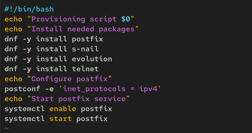{#fig:033 width=70%}

## Вывод 

В ходе выполнения лабораторной работы мы приобрели приобрели практические навыки по конфигурированию SMTP-сервера в части
настройки аутентификации.

 
