---
## Front matter
title: "Отчет по лабораторной работе №10"
subtitle: "Дисциплина: Администрирование сетевых подсистем"
author: "Иванов Сергей Владимирович"

## Generic otions
lang: ru-RU
toc-title: "Содержание"

## Bibliography
bibliography: bib/cite.bib
csl: pandoc/csl/gost-r-7-0-5-2008-numeric.csl

## Pdf output format
toc: true # Table of contents
toc-depth: 2
lof: true # List of figures
fontsize: 12pt
linestretch: 1.5
papersize: a4
documentclass: scrreprt
## I18n polyglossia
polyglossia-lang:
  name: russian
  options:
	- spelling=modern
	- babelshorthands=true
polyglossia-otherlangs:
  name: english
## I18n babel
babel-lang: russian
babel-otherlangs: english
## Fonts
mainfont: PT Serif
romanfont: PT Serif
sansfont: PT Sans
monofont: PT Mono
mainfontoptions: Ligatures=TeX
romanfontoptions: Ligatures=TeX
sansfontoptions: Ligatures=TeX,Scale=MatchLowercase
monofontoptions: Scale=MatchLowercase,Scale=0.9
## Biblatex
biblatex: true
biblio-style: "gost-numeric"
biblatexoptions:
  - parentracker=true
  - backend=biber
  - hyperref=auto
  - language=auto
  - autolang=other*
  - citestyle=gost-numeric
## Pandoc-crossref LaTeX customization
figureTitle: "Рис."
listingTitle: "Листинг"
lofTitle: "Список иллюстраций"
lolTitle: "Листинги"
## Misc options
indent: true
header-includes:
  - \usepackage{indentfirst}
  - \usepackage{float} # keep figures where there are in the text
  - \floatplacement{figure}{H} # keep figures where there are in the text
---

# Цель работы

Приобретение практических навыков по конфигурированию SMTP-сервера в части
настройки аутентификации.

# Задание

1. Настройте Dovecot для работы с LMTP (см. раздел 10.4.1).
2. Настройте аутентификацию посредством SASL на SMTP-сервере (см. раздел 10.4.2).
3. Настройте работу SMTP-сервера поверх TLS (см. раздел 10.4.3).
4. Скорректируйте скрипт для Vagrant, фиксирующий действия расширенной настройки SMTP-сервера во внутреннем окружении виртуальной машины server (см.
раздел 10.4.4).

# Выполнение лабораторной работы

## Настройка LMTP в Dovecote

На виртуальной машине server войдем под пользователем и откроем терминал. Перейдем в режим суперпользователя: sudo -i. В дополнительном терминале запустим мониторинг работы почтовой службы: tail -f /var/log/maillog (рис. 1).

{#fig:001 width=70%}

Добавим в список протоколов, с которыми может работать Dovecot, протокол LMTP. Для этого в файле /etc/dovecot/dovecot.conf укажем 
protocols = imap pop3 lmtp (рис. 2).

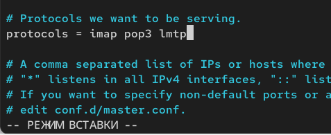{#fig:002 width=70%}

Настроим в Dovecot сервис lmtp для связи с Postfix. Для этого в файле
/etc/dovecot/conf.d/10-master.conf заменим определение сервиса lmtp на следующую запись: (рис. 3)

{#fig:003 width=70%}

Переопределим в Postfix с помощью postconf передачу сообщений не на прямую,
а через заданный unix-сокет:
postconf -e 'mailbox_transport = lmtp:unix:private/dovecot-lmtp' (рис. 4) 

{#fig:004 width=70%}

В файле /etc/dovecot/conf.d/10-auth.conf зададим формат имени пользователя
для аутентификации в форме логина пользователя без указания домена:
auth_username_format = %Ln (рис. 5) 

{#fig:005 width=70%}

Перезапустим Postfix и Dovecot:

systemctl restart postfix

systemctl restart dovecot

Из-под учётной записи пользователя отправим письмо с клиента:
echo .| mail -s "LMTP test" svivanov@svivanov.net (рис. 6)

{#fig:006 width=70%}

Просмотрим мониторинг почты. Вижу что Postfix и Dovecot запущены и работают. Postfix передает письсмо Dovecot по протоколу LMTP 
и сохраняет его в почтовый язик (INBOX). Письмо успешно передано, статус status = sent (отправлено). (рис. 7)

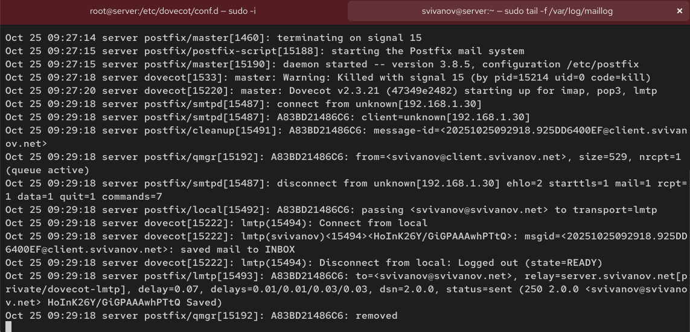{#fig:007 width=70%}

На сервере просмотрим почтовый ящик пользователя:
MAIL=~/Maildir/ mail. Убеждаюсь, что отправленное письмо с клиента доставлено в почтовый ящик на сервере. (рис. 8)

{#fig:008 width=70%}

## Настройка SMTP-аутентификации

В файле /etc/dovecot/conf.d/10-master.conf определим службу аутентификации
пользователей:

- service auth: объявляет конфигурацию для службы аутентификации Dovecot

- unix_listener /var/spool/postfix/private/auth: создает unix сокет для взаимодействия с Postfix

- group = postfix: устанавливает владельца сокета

- user = postfix: устаналивает пользователя владельца сокета

- mode = 0660: устанавливает права доступа

- unix_listener auth-userdb: создает сокет для доступа к базе данных пользователей 

- mode = 0600: устанавливает права доступа 

- user = dovecot: устанавливает пользователя владельца сокета (рис. 9)

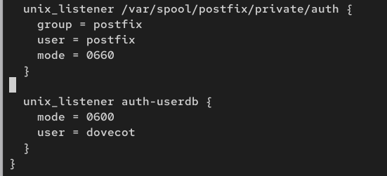{#fig:009 width=70%}

Для Postfix зададим тип аутентификации SASL для smtpd и путь к соответствующему
unix-сокету:

postconf -e 'smtpd_sasl_type = dovecot'

postconf -e 'smtpd_sasl_path = private/auth' (рис. 10)

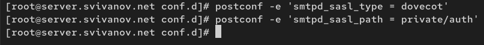{#fig:010 width=70%}

Настроим Postfix для приёма почты из Интернета только для обслуживаемых нашим сервером пользователей или для произвольных пользователей локальной
машины (имеется в виду локальных пользователей сервера), обеспечивая тем
самым запрет на использование почтового сервера в качестве SMTP relay для спамрассылок (порядок указания опций имеет значение):

postconf -e 'smtpd_recipient_restrictions = reject_unknown_recipient_domain, permit_mynetworks, reject_non_fqdn_recipient, reject_unauth_destination, reject_unverified_recipient, permit' 

- reject_unknown_recipient_domain: отклонить письмо, адресованное в домен неизвестного получателя

- permit_mynetworks: разрешить принимать письма от клиентов из доверенных сетей

- reject_non_fqdn_recipient: отклонить получателя, не являющегося получателем полного доменного имени

- reject_unauth_destination: отклонить неавторизованный пункт назначения 

- reject_unverified_recipient: отклонить письма несуществующим пользователям 

- permit: разрешить все остальное (рис. 11)

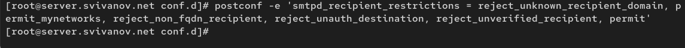{#fig:011 width=70%}

В настройках Postfix ограничим приём почты только локальным адресом SMTPсервера сети:
postconf -e 'mynetworks = 127.0.0.0/8' (рис. 12)

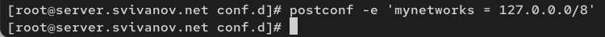{#fig:012 width=70%}

Для проверки работы аутентификации временно запустим SMTP-сервер
(порт 25) с возможностью аутентификации. Для этого необходимо в файле
/etc/postfix/master.cf заменить строку: 

smtp inet n - n - - smtpd

на строку 

smtp inet n - n - - smtpd

-o smtpd_sasl_auth_enable=yes

-o smtpd_recipient_restrictions=reject_non_fqdn_recipient,reject_unknow,n_recipient_domain,permit_sasl_authenticated,reject. (рис. 13)

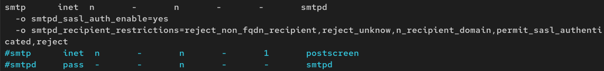{#fig:013 width=70%}
 
Перезапустим Postfix и Dovecot:

systemctl restart postfix

systemctl restart dovecot (рис. 14)

{#fig:014 width=70%}

На клиенте установим telnet:

sudo -i

dnf -y install telnet (рис. 15)

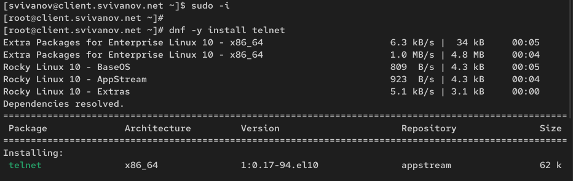{#fig:015 width=70%}

На клиенте получим строку для аутентификации, вместо username указав логин пользователя, а вместо password указав пароль этого пользователя:
printf `username\x00username\x00password | base64` (рис. 16)

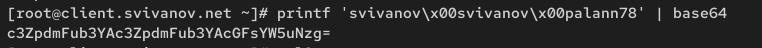{#fig:016 width=70%}

Подключимся на клиенте к SMTP-серверу посредством telnet:
telnet server.user.net 25 (рис. 17)

{#fig:017 width=70%}

Протестируем соединение, введя
EHLO test. (рис. 18)

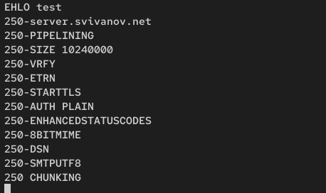{#fig:018 width=70%}

Проверьте авторизацию, задав:
AUTH PLAIN <строка для аутентификации>. Завершаем сессию telnet на клиенте. (рис. 19)

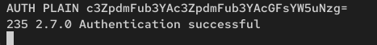{#fig:019 width=70%}

## Настройка SMTP over TLS

Настроим на сервере TLS, воспользовавшись временным сертификатом Dovecot.
Предварительно скопируем необходимые файлы сертификата и ключа из каталога
/etc/pki/dovecot в каталог /etc/pki/tls/ в соответствующие подкаталоги (чтобы
не было проблем с SELinux):

cp /etc/pki/dovecot/certs/dovecot.pem /etc/pki/tls/certs

cp /etc/pki/dovecot/private/dovecot.pem /etc/pki/tls/private. (рис. 20)

{#fig:020 width=70%}

Сконфигурируем Postfix, указав пути к сертификату и ключу, а также к каталогу
для хранения TLS-сессий и уровень безопасности:

postconf -e 'smtpd_tls_cert_file=/etc/pki/tls/certs/dovecot.pem'

postconf -e 'smtpd_tls_key_file=/etc/pki/tls/private/dovecot.pem'

postconf -e 'smtpd_tls_session_cache_database = btree:/var/lib/postfix/smtpd_scache'

postconf -e 'smtpd_tls_security_level = may'

postconf -e 'smtp_tls_security_level = may' (рис. 21)

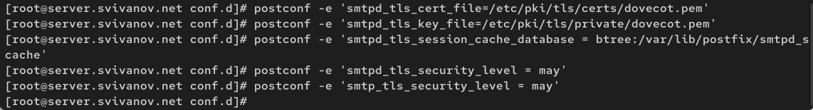{#fig:021 width=70%}

Для того чтобы запустить SMTP-сервер на 587-м порту, в файле
/etc/postfix/master.cf заменим строки

smtp inet n - n - - smtpd

-o smtpd_sasl_auth_enable=yes

-o smtpd_recipient_restrictions=reject_non_fqdn_recipient,reject_unknow,n_recipient_domain,permit_sasl_authenticated,reject

на следующую запись:

smtp inet n - n - - smtpd

и добавим следующие строки:

submission inet n - n - - smtpd

-o smtpd_tls_security_level=encrypt

-o smtpd_sasl_auth_enable=yes

-o smtpd_recipient_restrictions=reject_non_fqdn_recipient,reject_unknow,n_recipient_domain,permit_sasl_authenticated,reject. (рис. 22)

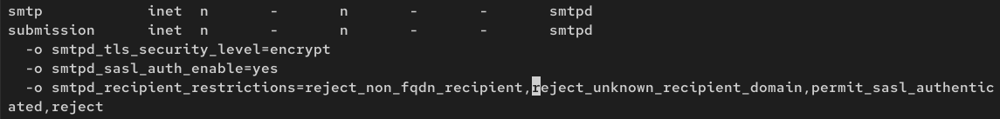{#fig:022 width=70%}

Настроим межсетевой экран, разрешив работать службе smtp-submission:

firewall-cmd --get-services

firewall-cmd --add-service=smtp-submission

firewall-cmd --add-service=smtp-submission --permanent

firewall-cmd --reload (рис. 23)

{#fig:023 width=70%}

Перезапустим Postfix:
systemctl restart postfix (рис. 24)

{#fig:024 width=70%}

На клиенте подключимся к SMTP-серверу через 587-й порт посредством openssl:
openssl s_client -starttls smtp -crlf -connect server.user.net:587 (рис. 25)

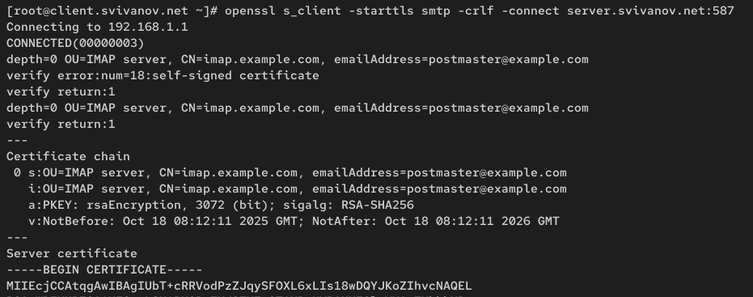{#fig:025 width=70%}

Протестируем подключение по telnet:
EHLO test (рис. 26)

{#fig:026 width=70%}

Проверим аутентификацию:
AUTH PLAIN <строка для аутентификации> (рис. 27)

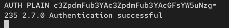{#fig:027 width=70%}

Проверим корректность отправки почтовых сообщений с клиента посредством
почтового клиента Evolution, предварительно скорректировав настройки учётной
записи, а именно для SMTP-сервера порт 587, STARTTLS и обычный пароль. (рис. 28)

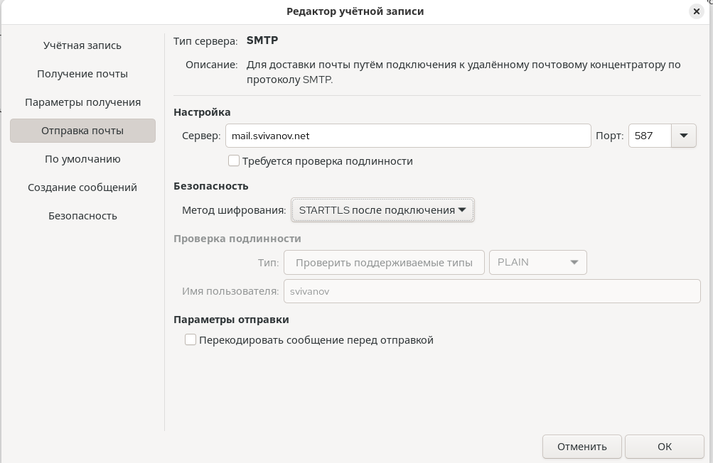{#fig:028 width=70%}

Отправим письмо. (рис. 29)

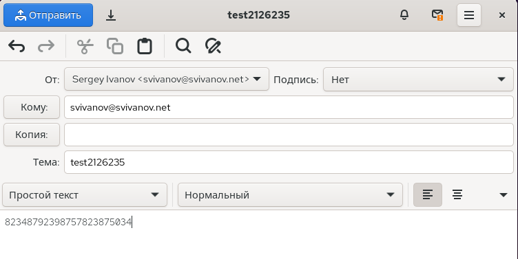{#fig:029 width=70%}

Видим, что письмо доставлено. (рис. 30)

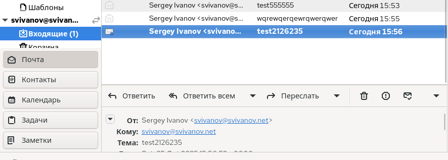{#fig:030 width=70%}

## Внесение изменений в настройки внутреннего окружения виртуальной машины

На виртуальной машине server перейдем в каталог для внесения изменений в настройки внутреннего окружения /vagrant/provision/server/. В соответствующие
подкаталоги поместим конфигурационные файлы Dovecot и Postfix: (рис. 31)

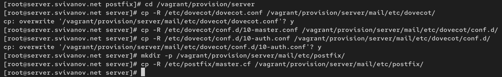{#fig:031 width=70%}

Внесем соответствующие изменения по расширенной конфигурации SMTPсервера в файл /vagrant/provision/server/mail.sh: (рис. 32)

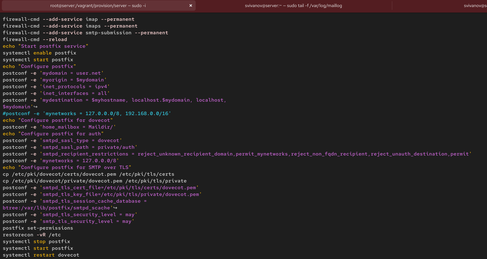{#fig:032 width=70%}

Внесем изменения в файл /vagrant/provision/client/mail.sh, добавив установку
telnet. (рис. 33)

{#fig:033 width=70%}

# Ответы на контрольные вопросы

**1. Приведите пример задания формата аутентификации пользователя в Dovecot в форме логина с указанием домена.**

В файле /etc/dovecot/conf.d/10-auth.conf можно задать различные форматы имен пользователей:

auth_username_format = %Ln

**2. Какие функции выполняет почтовый Relay-сервер?**

Почтовый Relay-сервер выполняет такие функции как:

- Пересылка почты между доменами - принимает почту от одних доменов и пересылает ее другим

- Кэширование сообщений - временно хранит почту при невозможности немедленной доставки

- Балансировка нагрузки - распределяет почтовый трафик между несколькими серверами

- Фильтрация спама - проверяет входящую почту на спам перед пересылкой

- Сканирование на вирусы - проверяет вложения на наличие вредоносного ПО

- Анонимизация отправителя - скрывает реальный источник отправки

- Преобразование протоколов - конвертирует между различными почтовыми протоколами

**3. Какие угрозы безопасности могут возникнуть в случае настройки почтового сервера как Relay-сервера?**

Рассылка спама - злоумышленники могут использовать сервер для массовой рассылки нежелательной почты

Черные списки - IP-адрес сервера попадет в DNSBL (DNS Blackhole Lists), что заблокирует всю исходящую почту

Репутационные потери - домен и IP-адрес будут помечены как ненадежные источника почты

Перегрузка ресурсов - сервер будет потреблять ресурсов процессора, памяти и канала связи

Атаки на отказ в обслуживании (DDoS) - злоумышленники могут перегрузить сервер большим объемом почтового трафика

# Выводы

В ходе выполнения лабораторной работы мы приобрели приобрели практические навыки по конфигурированию SMTP-сервера в части
настройки аутентификации.
