---
## Front matter
lang: ru-RU
title: Лабораторная работа №11
subtitle: Администрирование сетевых подсистем
author:
  - Иванов Сергей Владимирович, НПИбд-01-23
institute:
  - Российский университет дружбы народов, Москва, Россия
date: 5 ноября 2025

## i18n babel
babel-lang: russian
babel-otherlangs: english

## Formatting pdf
toc: false
slide_level: 2
aspectratio: 169
section-titles: true
theme: metropolis
header-includes:
 - \metroset{progressbar=frametitle,sectionpage=progressbar,numbering=fraction}
 - '\makeatletter'
 - '\beamer@ignorenonframefalse'
 - '\makeatother'

 ## Fonts
mainfont: PT Serif
romanfont: PT Serif
sansfont: PT Sans
monofont: PT Mono
mainfontoptions: Ligatures=TeX
romanfontoptions: Ligatures=TeX
sansfontoptions: Ligatures=TeX,Scale=MatchLowercase
monofontoptions: Scale=MatchLowercase,Scale=0.9
---

# Цель работы

Приобретение практических навыков по настройке удалённого доступа к серверу
с помощью SSH.

# Задание

1. Настройте запрет удалённого доступа на сервер по SSH для пользователя root 
2. Настройте разрешение удалённого доступа к серверу по SSH только для пользователей группы vagrant и вашего пользователя
3. Настройте удалённый доступ к серверу по SSH через порт 2022 
4. Настройте удалённый доступ к серверу по SSH по ключу 
5. Организуйте SSH-туннель с клиента на сервер, перенаправив локальное соединение с TCP-порта 80 на порт 8080 
6. Используя удалённое SSH-соединение, выполните с клиента несколько команд на сервере 
7. Используя удалённое SSH-соединение, запустите с клиента графическое приложение на сервере 

# Выполнение лабораторной работы

## Запрет удалённого доступа по SSH для пользователя root

На сервере в дополнительном терминале запустим мониторинг системных событий: (рис. 1).

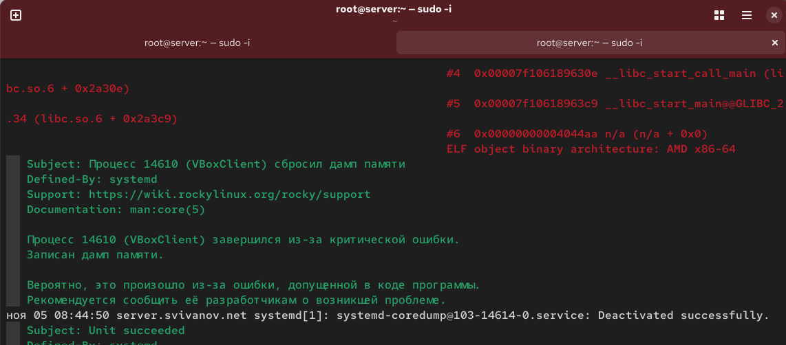{#fig:001 width=70%}

## Запрет удалённого доступа по SSH для пользователя root

С клиента попытаемся получить доступ к серверу через пользователя root: (рис. 2).

{#fig:002 width=70%}

## Запрет удалённого доступа по SSH для пользователя root

На сервере откроем файл /etc/ssh/sshd_config для редактирования и запретим вход пользователю root (рис. 3)

{#fig:003 width=70%}

## Запрет удалённого доступа по SSH для пользователя root

Перезапустим sshd (рис. 4) 

{#fig:004 width=70%}

## Запрет удалённого доступа по SSH для пользователя root

Повторим попытку получения доступа с клиента к серверу (рис. 5) 

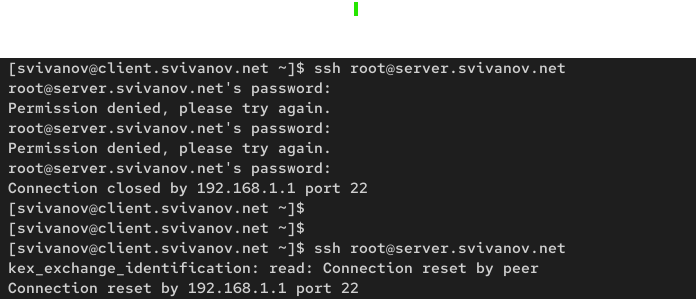{#fig:005 width=70%}

##  Ограничение списка пользователей для удалённого доступа по SSH

С клиента попытаемся получить доступ к серверу через пользователя user (рис. 6)

{#fig:006 width=70%}

##  Ограничение списка пользователей для удалённого доступа по SSH

На сервере откроем файл /etc/ssh/sshd_config и добавим строку AllowUsers vagrant (рис. 7)

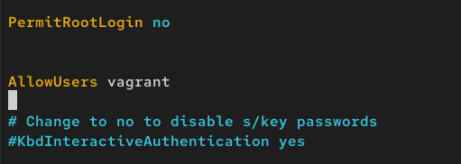{#fig:007 width=70%}

##  Ограничение списка пользователей для удалённого доступа по SSH

Перезапустим sshd. Повторим попытку получения доступа с клиента к серверу. (рис. 8)

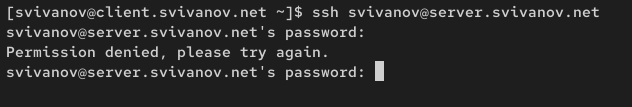{#fig:008 width=70%}

##  Ограничение списка пользователей для удалённого доступа по SSH

В файле /etc/ssh/sshd_config внесем следующее изменение: (рис. 9)

{#fig:009 width=70%}

##  Ограничение списка пользователей для удалённого доступа по SSH

Перезапустим sshd и попытаемся получить доступ с клиента к серверу (рис. 10)

{#fig:010 width=70%}

## Настройка дополнительных портов для удалённого доступа по SSH

На сервере в файле sshd /etc/ssh/sshd_config найдем строку Port и добавим (рис. 11)

{#fig:011 width=70%}

## Настройка дополнительных портов для удалённого доступа по SSH

Перезапустим sshd. Посмотрим расширенный статус работы sshd. (рис. 12)

{#fig:012 width=70%}

## Настройка дополнительных портов для удалённого доступа по SSH

Дополнительно посмотрим сообщения в терминале с мониторингом системных событий. (рис. 13)

{#fig:013 width=70%}
 
## Настройка дополнительных портов для удалённого доступа по SSH

Исправим на сервере метки SELinux к порту 2022: (рис. 14)

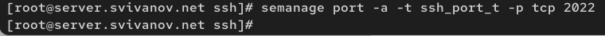{#fig:014 width=70%}

## Настройка дополнительных портов для удалённого доступа по SSH

В настройках межсетевого экрана откроем порт 2022 протокола TCP (рис. 15)

{#fig:015 width=70%}

## Настройка дополнительных портов для удалённого доступа по SSH

Перезапустим sshd и посмотрим расширенный статус его работы. (рис. 16)

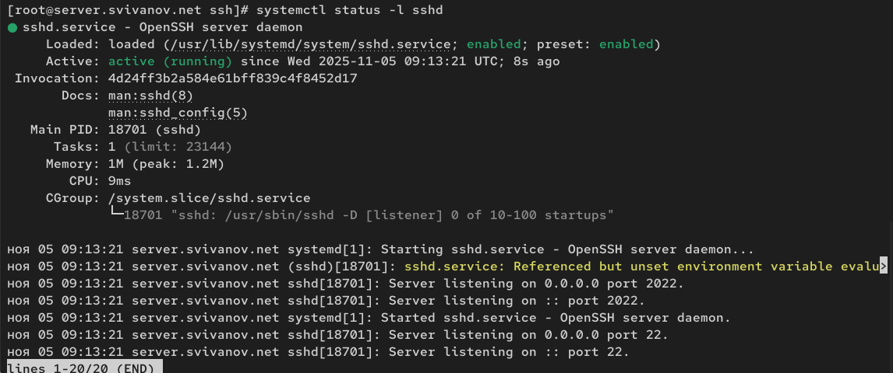{#fig:016 width=70%}

## Настройка дополнительных портов для удалённого доступа по SSH

С клиента попытаемся получить доступ к серверу через пользователя (рис. 17)

{#fig:017 width=70%}

## Настройка дополнительных портов для удалённого доступа по SSH

С клиента попытаемся получить доступ к серверу через пользователя, указав порт 2022 (рис. 18)

{#fig:018 width=70%}

## Настройка удалённого доступа по SSH по ключу

На сервере в файле /etc/ssh/sshd_config зададим параметр,
разрешающий аутентификацию по ключу. (рис. 19)

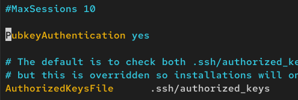{#fig:019 width=70%}

## Настройка удалённого доступа по SSH по ключу

На клиенте сформируем SSH-ключ (рис. 20)

{#fig:020 width=70%}

## Настройка удалённого доступа по SSH по ключу

Скопируем открытый ключ на сервер (рис. 21)

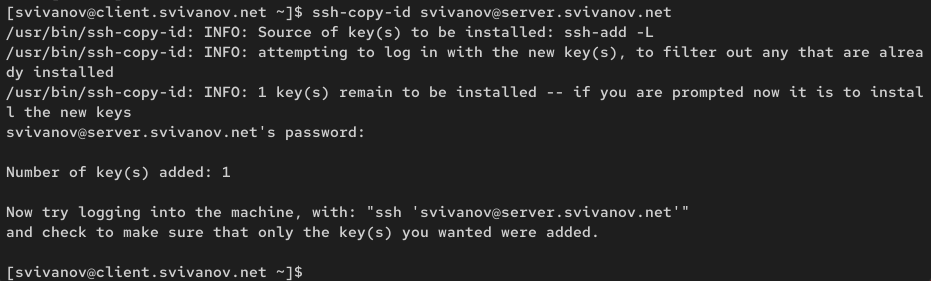{#fig:021 width=70%}

## Настройка удалённого доступа по SSH по ключу

Попробуем получить доступ с клиента к серверу: (рис. 22)

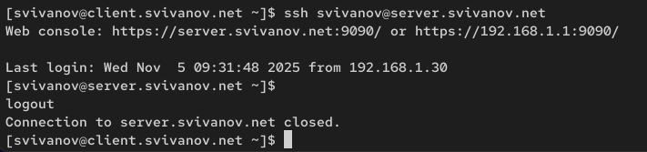{#fig:022 width=70%}

##  Организация туннелей SSH, перенаправление TCP-портов

На клиенте посмотрим, запущены ли какие-то службы с протоколом TCP (рис. 23)

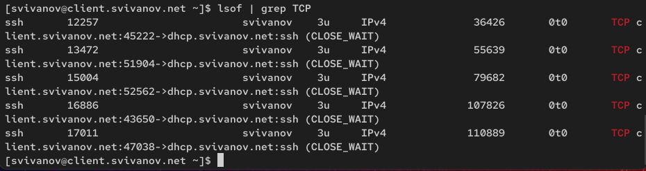{#fig:023 width=70%}

##  Организация туннелей SSH, перенаправление TCP-портов

Перенаправим порт 80 на server.user.net на порт 8080 на локальной машине (рис. 24)

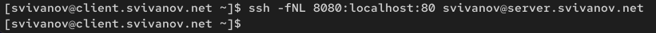{#fig:024 width=70%}

##  Организация туннелей SSH, перенаправление TCP-портов

Вновь на клиенте посмотрим, запущены ли какие-то службы с протоколом TCP (рис. 25)

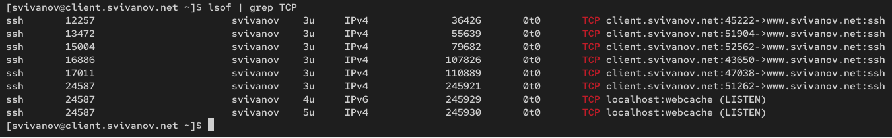{#fig:025 width=70%}

##  Организация туннелей SSH, перенаправление TCP-портов

На клиенте запустим браузер и в адресной строке введем localhost:8080. (рис. 26)

{#fig:026 width=70%}

## Запуск консольных приложений через SSH

Посмотрим с клиента имя узла сервера и список файлов на сервере: (рис. 27)

{#fig:027 width=70%}

## Запуск консольных приложений через SSH

Посмотрим с клиента почту на сервере (рис. 28)

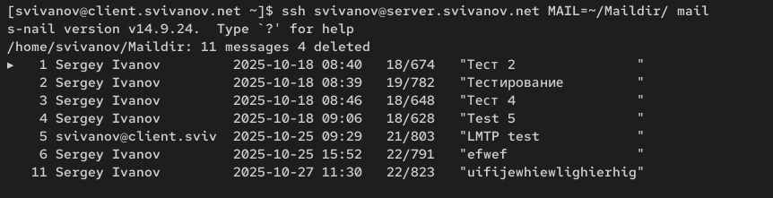{#fig:028 width=70%}

## Запуск графических приложений через SSH (X11Forwarding)

На сервере в файле /etc/ssh/sshd_config разрешим отображать на клиентском компьютере графические интерфейсы X11. (рис. 29)

{#fig:029 width=70%}

## Запуск графических приложений через SSH (X11Forwarding)

Перезапустим sshd. Попробуем с клиента удалённо подключиться к серверу и запустить firefox. (рис. 30)

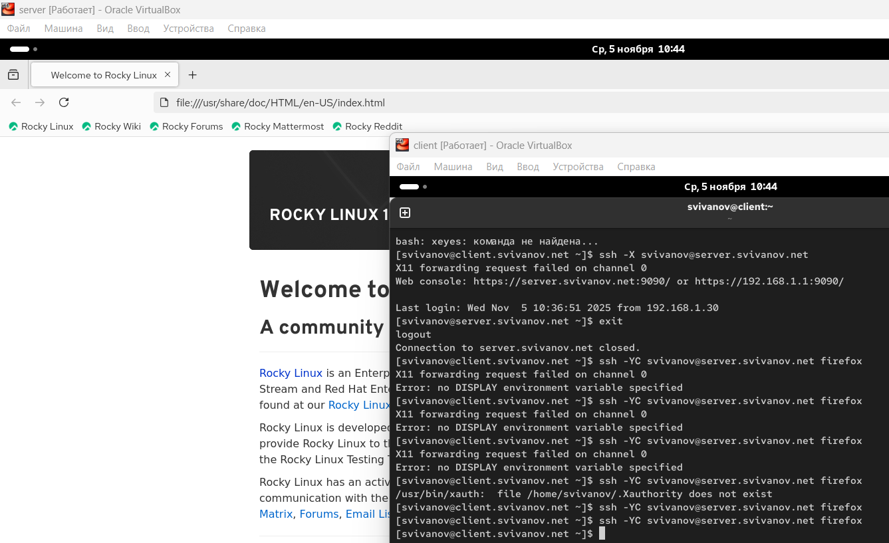{#fig:030 width=70%}

## Внесение изменений в настройки внутреннего окружения виртуальной машины

На машине server перейдем в каталог для внесения изменений в настройки внутреннего окружения. В соответствующие
подкаталоги поместим конф. файлы sshd_config: (рис. 31)

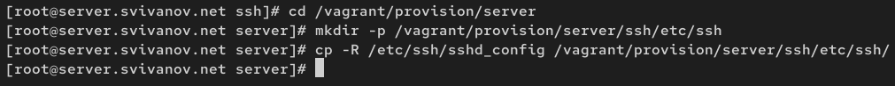{#fig:031 width=70%}

## Внесение изменений в настройки внутреннего окружения виртуальной машины

В каталоге /vagrant/provision/server создадим исполняемый файл ssh.sh и  пропишем в нём следующий скрипт: (рис. 32)

{#fig:032 width=70%}

## Внесение изменений в настройки внутреннего окружения виртуальной машины

Для отработки скрипта во время загрузки виртуальной машины server
в Vagrantfile необходимо добавить: (рис. 33)

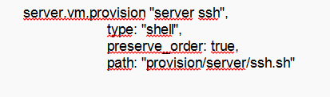{#fig:033 width=70%}

## Вывод 

В ходе выполнения лабораторной работы мы приобрели практические навыки по настройке удалённого доступа к серверу
с помощью SSH.

 
