---
## Front matter
title: "Отчет по лабораторной работе №11"
subtitle: "Дисциплина: Администрирование сетевых подсистем"
author: "Иванов Сергей Владимирович"

## Generic otions
lang: ru-RU
toc-title: "Содержание"

## Bibliography
bibliography: bib/cite.bib
csl: pandoc/csl/gost-r-7-0-5-2008-numeric.csl

## Pdf output format
toc: true # Table of contents
toc-depth: 2
lof: true # List of figures
fontsize: 12pt
linestretch: 1.5
papersize: a4
documentclass: scrreprt
## I18n polyglossia
polyglossia-lang:
  name: russian
  options:
	- spelling=modern
	- babelshorthands=true
polyglossia-otherlangs:
  name: english
## I18n babel
babel-lang: russian
babel-otherlangs: english
## Fonts
mainfont: PT Serif
romanfont: PT Serif
sansfont: PT Sans
monofont: PT Mono
mainfontoptions: Ligatures=TeX
romanfontoptions: Ligatures=TeX
sansfontoptions: Ligatures=TeX,Scale=MatchLowercase
monofontoptions: Scale=MatchLowercase,Scale=0.9
## Biblatex
biblatex: true
biblio-style: "gost-numeric"
biblatexoptions:
  - parentracker=true
  - backend=biber
  - hyperref=auto
  - language=auto
  - autolang=other*
  - citestyle=gost-numeric
## Pandoc-crossref LaTeX customization
figureTitle: "Рис."
listingTitle: "Листинг"
lofTitle: "Список иллюстраций"
lolTitle: "Листинги"
## Misc options
indent: true
header-includes:
  - \usepackage{indentfirst}
  - \usepackage{float} # keep figures where there are in the text
  - \floatplacement{figure}{H} # keep figures where there are in the text
---

# Цель работы

Приобретение практических навыков по настройке удалённого доступа к серверу
с помощью SSH.

# Задание

1. Настройте запрет удалённого доступа на сервер по SSH для пользователя root (см.
раздел 11.4.1).
2. Настройте разрешение удалённого доступа к серверу по SSH только для пользователей группы vagrant и вашего пользователя (см. раздел 11.4.2).
3. Настройте удалённый доступ к серверу по SSH через порт 2022 (см. раздел 11.4.3).
4. Настройте удалённый доступ к серверу по SSH по ключу (см. раздел 11.4.4).
5. Организуйте SSH-туннель с клиента на сервер, перенаправив локальное соединение с TCP-порта 80 на порт 8080 (см. раздел 11.4.5).
6. Используя удалённое SSH-соединение, выполните с клиента несколько команд на
сервере (см. раздел 11.4.6).
7. Используя удалённое SSH-соединение, запустите с клиента графическое приложение на сервере (см. раздел 11.4.7).
8. Напишите скрипт для Vagrant, фиксирующий действия по настройке SSH-сервера
во внутреннем окружении виртуальной машины server. Соответствующим образом
внесите изменения в Vagrantfile (см. раздел 11.4.8).

# Выполнение лабораторной работы

## Запрет удалённого доступа по SSH для пользователя root

На сервере в дополнительном терминале запустим мониторинг системных событий:

sudo -i

journalctl -x -f (рис. 1).

{#fig:001 width=70%}

С клиента попытаемся получить доступ к серверу посредством SSH-соединения
через пользователя root: ssh root@server.user.net. 

Подключение не удалось. Это может быть связано с тем, что вход под root уже был где-то запрещен. (рис. 2).

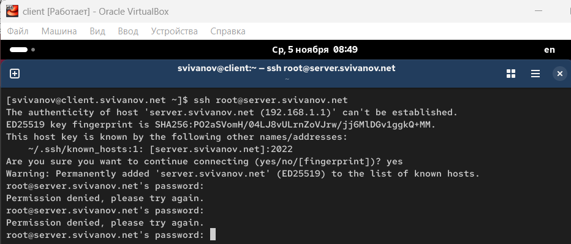{#fig:002 width=70%}

На сервере откроем файл /etc/ssh/sshd_config конфигурации sshd для редактирования и запретим вход на сервер пользователю root, установив:
PermitRootLogin no (рис. 3)

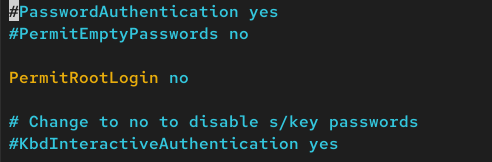{#fig:003 width=70%}

После сохранения изменений в файле конфигурации перезапустим sshd:
systemctl restart sshd (рис. 4) 

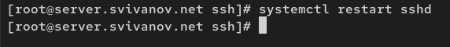{#fig:004 width=70%}

Повторим попытку получения доступа с клиента к серверу посредством SSH-соединения через пользователя root:
ssh root@server. Подключение не удалось. Теперь точно знаем, что это из-за того, что мы запретили доступ пользователю root. (рис. 5) 

{#fig:005 width=70%}

##  Ограничение списка пользователей для удалённого доступа по SSH

С клиента попытаемся получить доступ к серверу посредством SSH-соединения
через пользователя user: ssh user@server.user.net.

Подключение удалось, нам вывелось дата и время последнего захода и консоль сервера. (рис. 6)

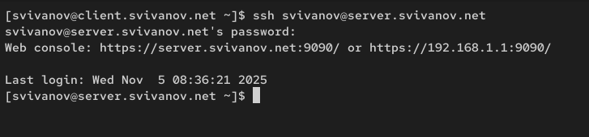{#fig:006 width=70%}

На сервере откроем файл /etc/ssh/sshd_config конфигурации sshd на редактирование и добавим строку AllowUsers vagrant (рис. 7)

{#fig:007 width=70%}

После сохранения изменений в файле конфигурации перезапустим sshd: systemctl restart sshd. Повторим попытку получения доступа с клиента к серверу посредством
SSH-соединения через пользователя user: ssh user@server.user.net. 

Подключение не удалось, так как мы разрешили подключаться только пользователю vagrant в конф. файле. (рис. 8)

{#fig:008 width=70%}

В файле /etc/ssh/sshd_config конфигурации sshd внесем следующее изменение:
AllowUsers vagrant svivanov (рис. 9)

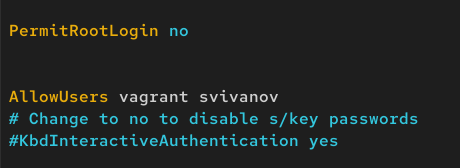{#fig:009 width=70%}

После сохранения изменений в файле конфигурации перезапустим sshd и вновь
попытаемся получить доступ с клиента к серверу посредством SSH-соединения
через пользователя svivanov. 

Подключение удалось, так как мы разрешили подключение пользователю svivanov в кофн. файле. (рис. 10)

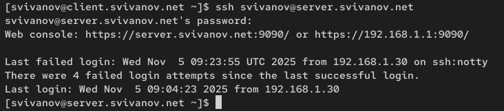{#fig:010 width=70%}

## Настройка дополнительных портов для удалённого доступа по SSH

На сервере в файле конфигурации sshd /etc/ssh/sshd_config найдем строку Port и ниже этой строки добавим:

Port 22

Port 2022 (рис. 11)

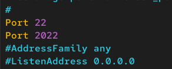{#fig:011 width=70%}

После сохранения изменений в файле конфигурации перезапустим sshd:
systemctl restart sshd. Посмотрим расширенный статус работы sshd: systemctl status -l sshd. Система сообщает об отказе в работе sshd через порт 2022. (рис. 12)

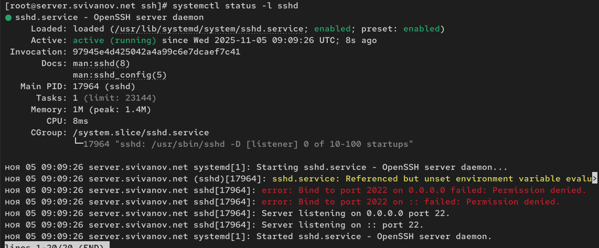{#fig:012 width=70%}

Дополнительно посмотрим сообщения в терминале с мониторингом системных событий. 

На терминале с мониторингом системных событий я нашел только сообщения, связанные с службой named (DNS-сервер). Скорее всего я пролистал необходимые сообщения связанные с SSH-сервером, так как сообщения в мониторинге выходят очень быстро и часто. Там должно было быть что-то вроде error: Bind to port 2022 failed. Permission denied; как на предыдущем скриншоте (рис. 12), где видно часть мониторинга связанного со службой sshd. (рис. 13)

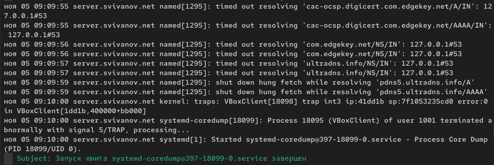{#fig:013 width=70%}
 
Исправим на сервере метки SELinux к порту 2022: semanage port -a -t ssh_port_t -p tcp 2022 (рис. 14)

{#fig:014 width=70%}

В настройках межсетевого экрана откроем порт 2022 протокола TCP:

firewall-cmd --add-port=2022/tcp

firewall-cmd --add-port=2022/tcp --permanent (рис. 15)

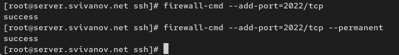{#fig:015 width=70%}

Вновь перезапустим sshd и посмотрим расширенный статус его работы. Статус
показывает, что процесс sshd теперь прослушивает два порта (22 и 2022). (рис. 16)

{#fig:016 width=70%}

С клиента попытаемся получить доступ к серверу посредством SSH-соединения
через пользователя: 

ssh user@server.user.net. 

После открытия оболочки пользователя введем sudo -i для получения доступа
root. Отлогинимся от root и пользователя на сервере, введя дважды logout. (рис. 17)

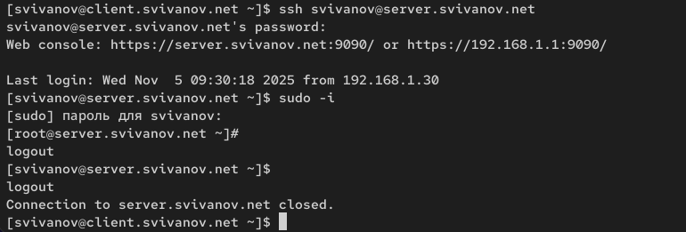{#fig:017 width=70%}

С клиента попытаемся получить доступ к серверу посредством SSH-соединения
через пользователя, указав порт 2022: 

ssh user@server.user.net. 

После открытия оболочки пользователя введем sudo -i для получения доступа
root. Отлогинимся от root и пользователя на сервере, введя дважды logout. (рис. 18)

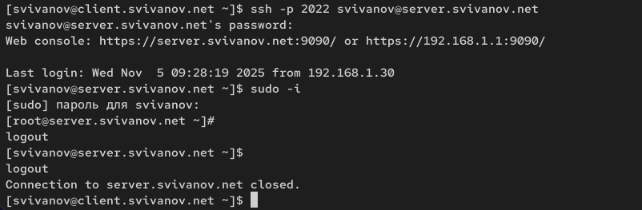{#fig:018 width=70%}

## Настройка удалённого доступа по SSH по ключу

На сервере в конфигурационном файле /etc/ssh/sshd_config зададим параметр,
разрешающий аутентификацию по ключу: PubkeyAuthentication yes. (рис. 19)

{#fig:019 width=70%}

После сохранения изменений в файле конфигурации перезапустим sshd.
На клиенте сформируем SSH-ключ, введя в терминале под пользователем: ssh-keygen (рис. 20)

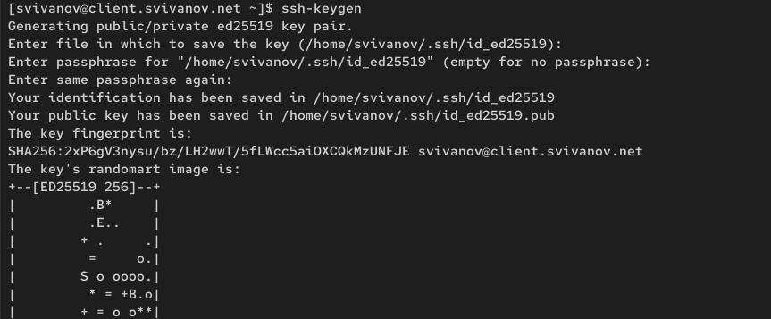{#fig:020 width=70%}

Скопируем открытый ключ на сервер, введя на клиенте:
ssh-copy-id user@server.user.net (рис. 21)

{#fig:021 width=70%}

Попробуем получить доступ с клиента к серверу посредством SSH-соединения:

ssh user@server.user.net

Теперь мы прошли аутентификацию без ввода пароля для учётной записи
удалённого пользователя. Отлогимся с сервера, используя комбинацию клавиш Ctrl + d. (рис. 22)

{#fig:022 width=70%}

##  Организация туннелей SSH, перенаправление TCP-портов

На клиенте посмотрим, запущены ли какие-то службы с протоколом TCP:
lsof | grep TCP. Видим, что запущены. (рис. 23)

{#fig:023 width=70%}

Перенаправим порт 80 на server.user.net на порт 8080 на локальной машине: ssh -fNL 8080:localhost:80 user@server.user.net (рис. 24)

{#fig:024 width=70%}

Вновь на клиенте посмотрим, запущены ли какие-то службы с протоколом TCP:
lsof | grep TCP.

Вижу, что появилось 2 новых процесса, которые слушают на localhost:webcache. (рис. 25)

{#fig:025 width=70%}

На клиенте запустим браузер и в адресной строке введем localhost:8080. Убедимся, что отобразится страница с приветствием «Welcome to the server.user.net
server». (рис. 26)

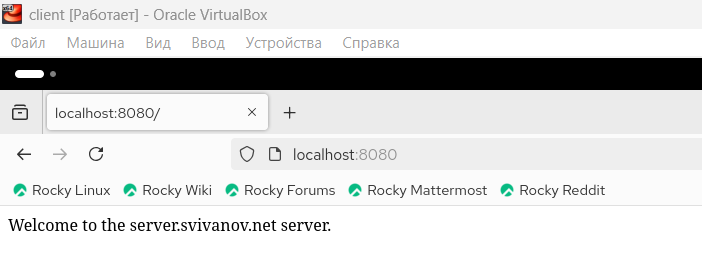{#fig:026 width=70%}

## Запуск консольных приложений через SSH

На клиенте откроем терминал под пользователем. Посмотрим с клиента имя узла сервера:

ssh user@server.user.net hostname

Посмотрим с клиента список файлов на сервере:

ssh user@server.user.net ls -Al (рис. 27)

{#fig:027 width=70%}

Посмотрим с клиента почту на сервере: ssh user@server.user.net MAIL=~/Maildir/ mail. (рис. 28)

{#fig:028 width=70%}

## Запуск графических приложений через SSH (X11Forwarding)

На сервере в конфигурационном файле /etc/ssh/sshd_config разрешим отображать на локальном клиентском компьютере графические интерфейсы X11:
X11Forwarding yes. (рис. 29)

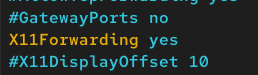{#fig:029 width=70%}

После сохранения изменения в конфигурационном файле перезапустим sshd. Попробуем с клиента удалённо подключиться к серверу и запустить графическое
приложение, например firefox: ssh -YC user@server.user.net firefox. (рис. 30)

{#fig:030 width=70%}

## Внесение изменений в настройки внутреннего окружения виртуальной машины

На виртуальной машине server перейдем в каталог для внесения изменений в настройки внутреннего окружения /vagrant/provision/server/. В соответствующие
подкаталоги поместим конфигурационные файлы sshd_config: (рис. 31)

{#fig:031 width=70%}

В каталоге /vagrant/provision/server создадим исполняемый файл ssh.sh:

cd /vagrant/provision/server

touch ssh.sh

chmod +x ssh.sh

Открыв его на редактирование, пропишем в нём следующий скрипт: (рис. 32)

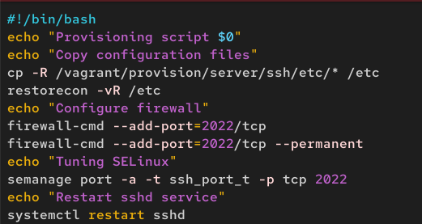{#fig:032 width=70%}

Для отработки созданного скрипта во время загрузки виртуальной машины server
в конфигурационном файле Vagrantfile необходимо добавить в разделе конфигурации для сервера. (рис. 33)

{#fig:033 width=70%}

# Ответы на контрольные вопросы

**1. Вы хотите запретить удалённый доступ по SSH на сервер пользователю root и разрешить доступ пользователю alice. Как это сделать?**

В файле /etc/ssh/sshd_config:

PermitRootLogin no

AllowUsers alice

После изменений выполнить:

systemctl restart sshd

**2. Как настроить удалённый доступ по SSH через несколько портов? Для чего это может потребоваться?**

В файле /etc/ssh/sshd_config:

Port 22
Port 2022

**3. Какие параметры используются для создания туннеля SSH, когда команда ssh устанавливает фоновое соединение и не ожидает какой-либо конкретной команды?**

ssh -f -N -L локальный_порт:целевой_хост:целевой_порт пользователь@ssh_сервер

Опции:

-f — переход в фоновый режим

-N — не выполнять удалённую команду

-L — локальное перенаправление портов

**4. Как настроить локальную переадресацию с локального порта 5555 на порт 80 сервера server2.example.com?**

ssh -L 5555:server2.example.com:80 пользователь@ssh_шлюз

Или если server2 доступен напрямую:

ssh -L 5555:localhost:80 пользователь@server2.example.com

**5. Как настроить SELinux, чтобы позволить SSH связываться с портом 2022?**

semanage port -a -t ssh_port_t -p tcp 2022

Проверка текущих разрешённых портов

semanage port -l | grep ssh

**6. Как настроить межсетевой экран на сервере, чтобы разрешить входящие подключения по SSH через порт 2022?**

firewall-cmd --add-port=2022/tcp

firewall-cmd --add-port=2022/tcp --permanent

firewall-cmd --reload

# Выводы

В ходе выполнения лабораторной работы мы приобрели практические навыки по настройке удалённого доступа к серверу
с помощью SSH.
