---
## Front matter
lang: ru-RU
title: Лабораторная работа №12
subtitle: Администрирование сетевых подсистем
author:
  - Иванов Сергей Владимирович, НПИбд-01-23
institute:
  - Российский университет дружбы народов, Москва, Россия
date: 10 ноября 2025

## i18n babel
babel-lang: russian
babel-otherlangs: english

## Formatting pdf
toc: false
slide_level: 2
aspectratio: 169
section-titles: true
theme: metropolis
header-includes:
 - \metroset{progressbar=frametitle,sectionpage=progressbar,numbering=fraction}
 - '\makeatletter'
 - '\beamer@ignorenonframefalse'
 - '\makeatother'

 ## Fonts
mainfont: PT Serif
romanfont: PT Serif
sansfont: PT Sans
monofont: PT Mono
mainfontoptions: Ligatures=TeX
romanfontoptions: Ligatures=TeX
sansfontoptions: Ligatures=TeX,Scale=MatchLowercase
monofontoptions: Scale=MatchLowercase,Scale=0.9
---

# Цель работы

Получение навыков по управлению системным временем и настройке синхронизации времени.

# Задание

1. Изучите команды по настройке параметров времени 
2. Настройте сервер в качестве сервера синхронизации времени для локальной сети
3. Напишите скрипты для Vagrant, фиксирующие действия по установке и настройке
NTP-сервера и клиента

# Выполнение лабораторной работы

## Настройка параметров времени

На сервере и клиенте посмотрим параметры настройки даты и времени: (рис. 1, 2).

{#fig:001 width=70%}

## Настройка параметров времени

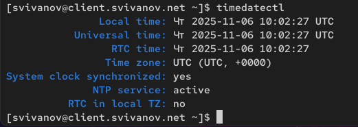{#fig:002 width=70%}

## Настройка параметров времени

Поэкспериментируем с параметрами этой команды. (рис. 3)

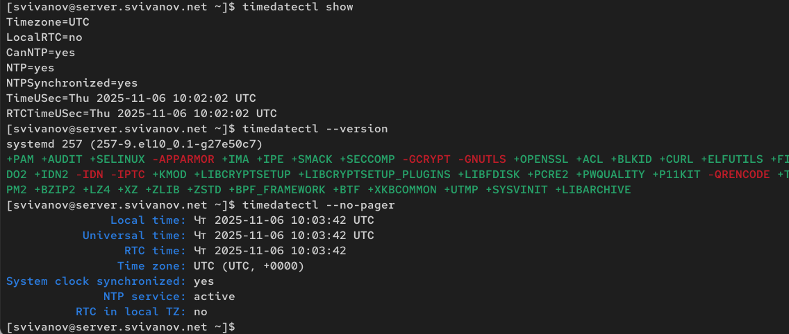{#fig:003 width=70%}

## Настройка параметров времени

На сервере и клиенте посмотрим текущее системное время (рис. 4) 

{#fig:004 width=70%}

## Настройка параметров времени

Поэкспериментируем с параметрами этой команды. (рис. 5) 

{#fig:005 width=70%}

## Настройка параметров времени

На сервере и клиенте посмотрим аппаратное время: (рис. 6)

{#fig:006 width=70%}

## Управление синхронизацией времени

Проверим источники времени на клиенте и на сервере: (рис. 7)

{#fig:007 width=70%}

## Управление синхронизацией времени

Клиент синхронизирован с источником vigil.intelfx.name. (рис. 8)

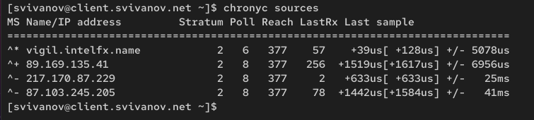{#fig:008 width=70%}

## Управление синхронизацией времени

На сервере откроем на редактирование файл /etc/chrony.conf и добавим строку: (рис. 9)

{#fig:009 width=70%}

## Управление синхронизацией времени

На сервере перезапустим службу chronyd: systemctl restart chronyd (рис. 10)

{#fig:010 width=70%}

## Управление синхронизацией времени

Настроим межсетевой экран на сервере: (рис. 11)

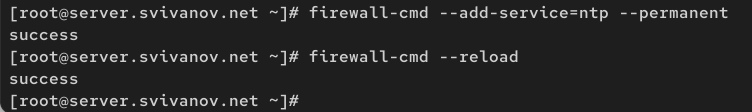{#fig:011 width=70%}

## Управление синхронизацией времени

На клиенте откроем файл /etc/chrony.conf и добавим строку: (рис. 12)

{#fig:012 width=70%}

## Управление синхронизацией времени

На клиенте перезапустим службу chronyd: (рис. 13)

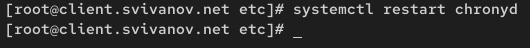{#fig:013 width=70%}
 
## Управление синхронизацией времени

Проверим источники времени на клиенте и на сервере: (рис. 14)

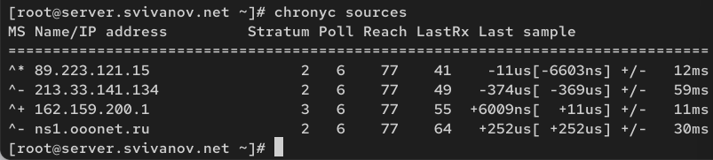{#fig:014 width=70%}

## Управление синхронизацией времени

{#fig:015 width=70%}

## Управление синхронизацией времени

Посмотрим подробную информацию о синхронизации. (рис. 16)

{#fig:016 width=70%}

## Управление синхронизацией времени

Посмотрим информацию на клиенте.  (рис. 17)

{#fig:017 width=70%}

## Внесение изменений в настройки внутреннего окружения виртуальных машин

На машине server перейдем в каталог для внесения изменений, создадим в нём
каталог ntp, в который поместим конфигурационные файлы: (рис. 18)

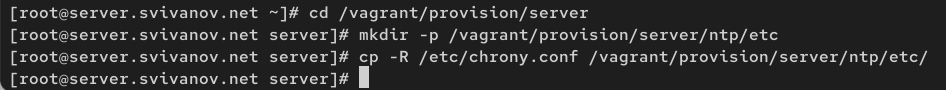{#fig:018 width=70%}

## Внесение изменений в настройки внутреннего окружения виртуальных машин

В каталоге /vagrant/provision/server создадим скрипт ntp.sh: (рис. 19)

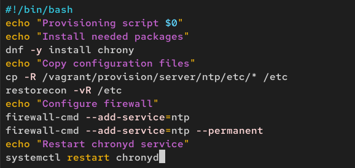{#fig:019 width=70%}

## Внесение изменений в настройки внутреннего окружения виртуальных машин

На машине client перейдем в каталог для внесения изменений, создадим в нём
каталог ntp, в который поместим конфигурационные файлы: (рис. 20)

{#fig:020 width=70%}

## Внесение изменений в настройки внутреннего окружения виртуальных машин

В каталоге /vagrant/provision/client создадим скрипт ntp.sh: (рис. 21)

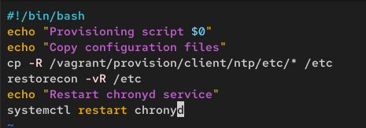{#fig:021 width=70%}

## Внесение изменений в настройки внутреннего окружения виртуальных машин

Для отработки скриптов во время загрузки виртуальных машин server
и client в конфигурационном файле Vagrantfile необходимо добавить: (рис. 22, 23)

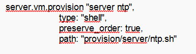{#fig:022 width=70%}

## Внесение изменений в настройки внутреннего окружения виртуальных машин

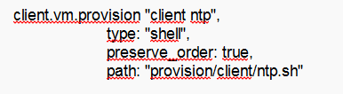{#fig:023 width=70%}

## Вывод 

В ходе выполнения лабораторной работы мы получили навыки по управлению системным временем и настройке синхронизации времени.

 
