---
## Front matter
title: "Отчет по лабораторной работе №12"
subtitle: "Дисциплина: Администрирование сетевых подсистем"
author: "Иванов Сергей Владимирович"

## Generic otions
lang: ru-RU
toc-title: "Содержание"

## Bibliography
bibliography: bib/cite.bib
csl: pandoc/csl/gost-r-7-0-5-2008-numeric.csl

## Pdf output format
toc: true # Table of contents
toc-depth: 2
lof: true # List of figures
fontsize: 12pt
linestretch: 1.5
papersize: a4
documentclass: scrreprt
## I18n polyglossia
polyglossia-lang:
  name: russian
  options:
	- spelling=modern
	- babelshorthands=true
polyglossia-otherlangs:
  name: english
## I18n babel
babel-lang: russian
babel-otherlangs: english
## Fonts
mainfont: PT Serif
romanfont: PT Serif
sansfont: PT Sans
monofont: PT Mono
mainfontoptions: Ligatures=TeX
romanfontoptions: Ligatures=TeX
sansfontoptions: Ligatures=TeX,Scale=MatchLowercase
monofontoptions: Scale=MatchLowercase,Scale=0.9
## Biblatex
biblatex: true
biblio-style: "gost-numeric"
biblatexoptions:
  - parentracker=true
  - backend=biber
  - hyperref=auto
  - language=auto
  - autolang=other*
  - citestyle=gost-numeric
## Pandoc-crossref LaTeX customization
figureTitle: "Рис."
listingTitle: "Листинг"
lofTitle: "Список иллюстраций"
lolTitle: "Листинги"
## Misc options
indent: true
header-includes:
  - \usepackage{indentfirst}
  - \usepackage{float} # keep figures where there are in the text
  - \floatplacement{figure}{H} # keep figures where there are in the text
---

# Цель работы

Получение навыков по управлению системным временем и настройке синхронизации времени.

# Задание

1. Изучите команды по настройке параметров времени (см. раздел 12.4.1).
2. Настройте сервер в качестве сервера синхронизации времени для локальной сети
(см. раздел 12.4.2).
3. Напишите скрипты для Vagrant, фиксирующие действия по установке и настройке
NTP-сервера и клиента (см. раздел 12.4.3).

# Выполнение лабораторной работы

## Настройка параметров времени

На сервере и клиенте посмотрим параметры настройки даты и времени:
timedatectl. 

Локальное время: 2025-11-06 09:54 UTC

Временная зона: UTC

Сетевая синхронизация времени: включена

NTP: работает

Аппаратные часы (RTC) настроены на UTC а не на локальную временную зону.

На клиенте настройки все те же самые. (рис. 1, 2).

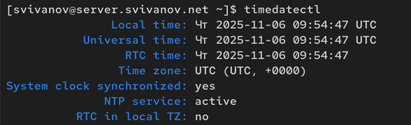{#fig:001 width=70%}

{#fig:002 width=70%}

Поэкспериментируем с параметрами этой команды. 

timedatectl show выводит свойства в формате ключ-значения (машинный формат). 

timedatectl --version показывает версию systemd и список скомпилированных функций. 

timedatectl --no-pager отключает постраничный вывод (аналогичен обычному timedatectl) (рис. 3)

{#fig:003 width=70%}

На сервере и клиенте посмотрим текущее системное время: date (рис. 4) 

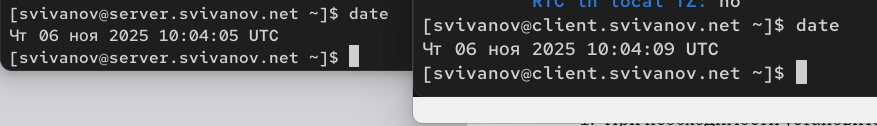{#fig:004 width=70%}

Поэкспериментируем с параметрами этой команды. 

date --debug показывает информацию о формате вывода.

date --resolution показывает разрешение системных часов (в нашем случае 1 наносекунда) 

date --date='@2147483647' показывает какая будет дата, когда пройдет 2147483647 секунд с 1 января 1970г. (это будет максимальное значение 32 битного формата времени) 

TZ="America/Los Angeles" date показывает время в Лос Анджелесе. (рис. 5) 

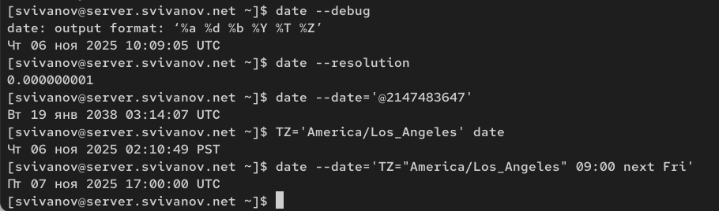{#fig:005 width=70%}

На сервере и клиенте посмотрим аппаратное время: hwclock. (рис. 6)

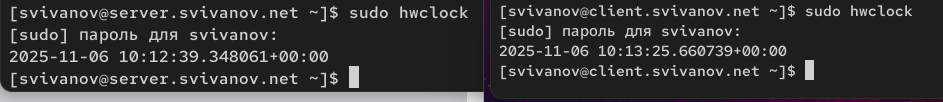{#fig:006 width=70%}

## Управление синхронизацией времени

Проверим источники времени на клиенте и на сервере: chronyc sources 

Проанализируем на примере первого источника сервера:

1) 151.0.2.54 Stratum=2 (вторичный источник), Poll=8 интервал опроса (256 секунд), Reach=377 все последние 8 опросов успешны (т.к 377 в 8-ми ричной системе=11111111 в двоичной). LastRx время с последнего получения ответа. Last (смещение) ~3,7мс. 

Сервер синхронизирован с источником, который помечен ^* (89.169.135.41) (рис. 7)

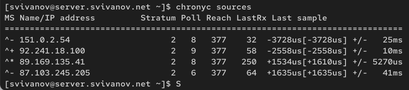{#fig:007 width=70%}

Клиент синхронизирован с источником vigil.intelfx.name. (рис. 8)

{#fig:008 width=70%}

На сервере откроем на редактирование файл /etc/chrony.conf и добавим строку:
allow 192.168.0.0/16 (рис. 9)

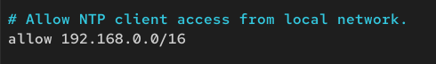{#fig:009 width=70%}

На сервере перезапустим службу chronyd: systemctl restart chronyd (рис. 10)

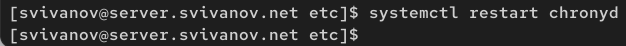{#fig:010 width=70%}

Настроим межсетевой экран на сервере:

firewall-cmd --add-service=ntp --permanent

firewall-cmd --reload (рис. 11)

{#fig:011 width=70%}

На клиенте откроем файл /etc/chrony.conf и добавим строку:
server server.svivanov.net iburst (рис. 12)

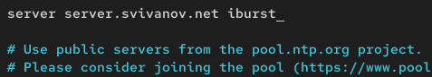{#fig:012 width=70%}

На клиенте перезапустим службу chronyd:
systemctl restart chronyd. (рис. 13)

{#fig:013 width=70%}
 
Проверим источники времени на клиенте и на сервере:
chronyc sources.

По сравнению с предыдущим выводом, один источник изменился. Но главный, с которым синхронизируется сервер, остался неизменным. (рис. 14)

{#fig:014 width=70%}

На клиенте теперь только один источник времени, это сервер (www.svivanov.net). Это говорит о том, что синхронизация с сервером сделана корректно. (рис. 15)

{#fig:015 width=70%}

Посмотрим подробную информацию о синхронизации.

Reference ID показывает текущий источник синхронизации

Strtatum: 2. Сервер синхронизирован с источником страты 2.

Ref time: время последнего обновления. 

Параметры System time, Last offset и RMS offset показывают точность времени.

Параметры Frequency, Residual freq и Skew отвечают за стабильность часов, показывают погрешности и отставание. (рис. 16)

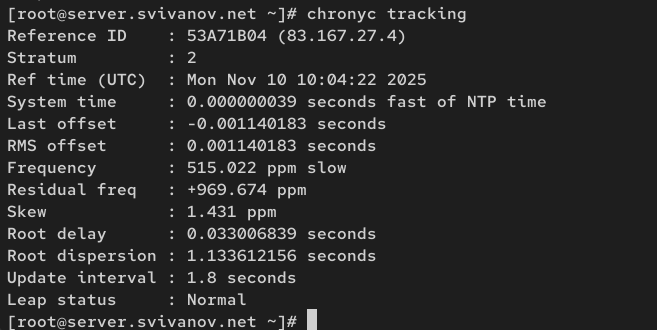{#fig:016 width=70%}

Посмотрим информацию на клиенте. Из отличий то, что Reference ID: dhcp.client.net, так как мы настроили синхронизацию с сервером. (рис. 17)

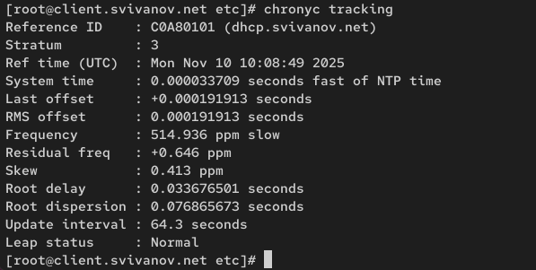{#fig:017 width=70%}

## Внесение изменений в настройки внутреннего окружения виртуальных машин

На виртуальной машине server перейдем в каталог для внесения изменений
в настройки внутреннего окружения /vagrant/provision/server/, создадим в нём
каталог ntp, в который поместим в соответствующие подкаталоги конфигурационные файлы:

cd /vagrant/provision/server

mkdir -p /vagrant/provision/server/ntp/etc

cp -R /etc/chrony.conf /vagrant/provision/server/ntp/etc/ (рис. 18)

{#fig:018 width=70%}

В каталоге /vagrant/provision/server создадим исполняемый файл ntp.sh:

cd /vagrant/provision/server

touch ntp.sh

chmod +x ntp.sh

Открыв его на редактирование, пропишем в нём следующий скрипт: (рис. 19)

{#fig:019 width=70%}

На виртуальной машине client перейдем в каталог для внесения изменений
в настройки внутреннего окружения /vagrant/provision/client/, создадим в нём
каталог ntp, в который поместим в соответствующие подкаталоги конфигурационные файлы:

cd /vagrant/provision/client

mkdir -p /vagrant/provision/client/ntp/etc

cp -R /etc/chrony.conf /vagrant/provision/client/ntp/etc/ (рис. 20)

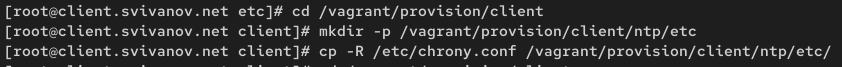{#fig:020 width=70%}

В каталоге /vagrant/provision/client создадим исполняемый файл ntp.sh:

cd /vagrant/provision/client

touch ntp.sh

chmod +x ntp.sh

Открыв его на редактирование, пропишем в нём следующий скрипт: (рис. 21)

{#fig:021 width=70%}

Для отработки созданных скриптов во время загрузки виртуальных машин server
и client в конфигурационном файле Vagrantfile необходимо добавить в соответствующих разделах конфигураций для сервера и клиента: (рис. 22, 23)

{#fig:022 width=70%}

{#fig:023 width=70%}

# Ответы на контрольные вопросы

**1. Почему важна точная синхронизация времени для служб баз данных?**

Точная синхронизация времени критически важна для: Транзакций - корректное упорядочивание операций в распределенных системах, Point-in-time recovery - точное восстановление данных на определенный момент, Аудит и логирование - корректная временная последовательность событий, Распределенных блокировок - избежание конфликтов из-за расхождения времени.

**2. Почему служба проверки подлинности Kerberos сильно зависит от правильной синхронизации времени?**

Kerberos использует временные метки (timestamps) в билетах аутентификации: Защита от replay-атак - билеты действительны ограниченное время (обычно 5 минут), Проверка срока действия - расхождение времени более чем на 5 минут приводит к отказу в аутентификации, Синхронизация между KDC и клиентами - необходимо для корректной работы протокола

**3. Какая служба используется по умолчанию для синхронизации времени на RHEL 7?**

На RHEL 7 по умолчанию используется chronyd (реализация chrony)

**4. Какова страта по умолчанию для локальных часов?**

Локальные часы имеют страту 10 по умолчанию, когда нет синхронизации с внешними источниками.

**5. Какой порт брандмауэра должен быть открыт, если вы настраиваете свой сервер как одноранговый узел NTP?**

Для NTP-сервера должен быть открыт UDP-порт 123

**6. Какую строку вам нужно включить в конфигурационный файл chrony, если вы хотите быть сервером времени, даже если внешние серверы NTP недоступны?**

В файл /etc/chrony.conf нужно добавить:

local stratum 10

**7. Какую страту имеет хост, если нет текущей синхронизации времени NTP?**

Хост имеет страту 0 (ноль), что означает отсутствие синхронизации и недостоверное время.

**8. Какую команду вы бы использовали на сервере с chrony, чтобы узнать, с какими серверами он синхронизируется?**

chronyc sources

**9. Как вы можете получить подробную статистику текущих настроек времени для процесса chrony вашего сервера?**

chronyc tracking

# Выводы

В ходе выполнения лабораторной работы мы получили навыки по управлению системным временем и настройке синхронизации времени.
