---
## Front matter
lang: ru-RU
title: Лабораторная работа №13
subtitle: Администрирование сетевых подсистем
author:
  - Иванов Сергей Владимирович, НПИбд-01-23
institute:
  - Российский университет дружбы народов, Москва, Россия
date: 13 ноября 2025

## i18n babel
babel-lang: russian
babel-otherlangs: english

## Formatting pdf
toc: false
slide_level: 2
aspectratio: 169
section-titles: true
theme: metropolis
header-includes:
 - \metroset{progressbar=frametitle,sectionpage=progressbar,numbering=fraction}
 - '\makeatletter'
 - '\beamer@ignorenonframefalse'
 - '\makeatother'

 ## Fonts
mainfont: PT Serif
romanfont: PT Serif
sansfont: PT Sans
monofont: PT Mono
mainfontoptions: Ligatures=TeX
romanfontoptions: Ligatures=TeX
sansfontoptions: Ligatures=TeX,Scale=MatchLowercase
monofontoptions: Scale=MatchLowercase,Scale=0.9
---

# Цель работы

Приобретение навыков настройки сервера NFS для удалённого доступа к ресурсам.

# Задание

1. Установите и настройте сервер NFSv4 
2. Подмонтируйте удалённый ресурс на клиенте 
3. Подключите каталог с контентом веб-сервера к дереву NFS 
4. Подключите каталог для удалённой работы вашего пользователя к дереву NFS 
5. Напишите скрипты для Vagrant, фиксирующие действия по установке и настройке сервера NFSv4 во внутреннем окружении виртуальных машин server и client.
Соответствующим образом внесите изменения в Vagrantfile 

# Выполнение лабораторной работы

## Настройка сервера NFSv4

На сервере установим необходимое программное обеспечение: (рис. 1)

{#fig:001 width=70%}

## Настройка сервера NFSv4

На сервере создадим каталог, который предполагается сделать доступным всем
пользователям сети (рис. 2)

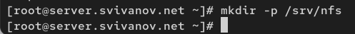{#fig:002 width=70%}

## Настройка сервера NFSv4

В файле /etc/exports пропишем подключаемый через NFS общий каталог с доступом только на чтение: (рис. 3)

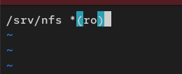{#fig:003 width=70%}

## Настройка сервера NFSv4

Для общего каталога зададим контекст безопасности NFS. Применим изменённую настройку SELinux к файловой системе: (рис. 4) 

{#fig:004 width=70%}

## Настройка сервера NFSv4

Запустим сервер NFS (рис. 5) 

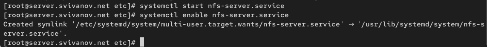{#fig:005 width=70%}

## Настройка сервера NFSv4

Настроим межсетевой экран для работы сервера NFS: (рис. 6)

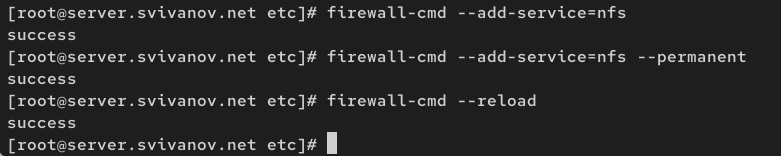{#fig:006 width=70%}

## Настройка сервера NFSv4

На клиенте установим необходимое для работы NFS программное обеспечение (рис. 7)

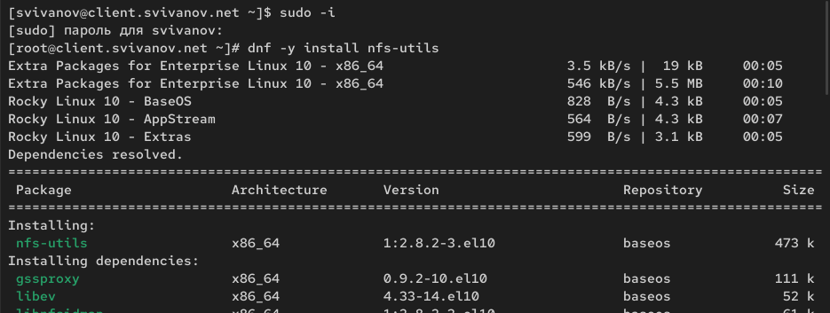{#fig:007 width=70%}

## Настройка сервера NFSv4

На клиенте попробуем посмотреть имеющиеся подмонтированные удалённые
ресурсы (рис. 8)

{#fig:008 width=70%}

## Настройка сервера NFSv4

Попробуем на сервере остановить сервис межсетевого экрана: (рис. 9)

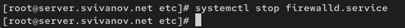{#fig:009 width=70%}

## Настройка сервера NFSv4

На клиенте вновь попробуем подключиться к удалённо смонтированному
ресурсу (рис. 10)

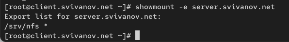{#fig:010 width=70%}

## Настройка сервера NFSv4

На сервере запустим сервис межсетевого экрана (рис. 11)

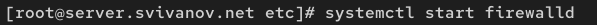{#fig:011 width=70%}

## Настройка сервера NFSv4

На сервере посмотрим, какие службы задействованы при удалённом монтировании: (рис. 12, 13)

{#fig:012 width=70%}

## Настройка сервера NFSv4

{#fig:013 width=70%}
 
## Настройка сервера NFSv4

Добавим службы rpc-bind и mountd в настройки межсетевого экрана на сервере (рис. 14)

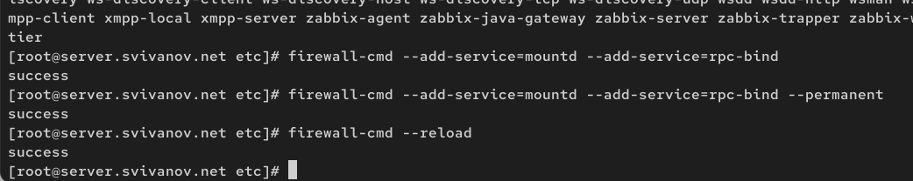{#fig:014 width=70%}

## Настройка сервера NFSv4

На клиенте проверим подключение удалённого ресурса (рис. 15)

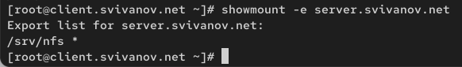{#fig:015 width=70%}

## Монтирование NFS на клиенте

На клиенте создадим каталог, в который будет монтироваться удалённый ресурс,
и подмонтируем дерево NFS (рис. 16)

{#fig:016 width=70%}

## Монтирование NFS на клиенте

Проверим, что общий ресурс NFS подключён правильно (рис. 17)

{#fig:017 width=70%}

## Монтирование NFS на клиенте

На клиенте в конце файла /etc/fstab добавим следующую запись: (рис. 18)

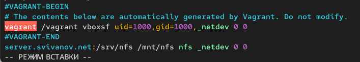{#fig:018 width=70%}

## Монтирование NFS на клиенте

На клиенте проверим наличие автоматического монтирования удалённых ресурсов при запуске ОС: (рис. 19)

{#fig:019 width=70%}

## Монтирование NFS на клиенте

Перезапустим клиента и убедимся, что удалённый ресурс подключается автоматически. (рис. 20, 21)

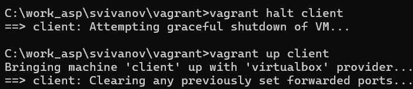{#fig:020 width=70%}

## Монтирование NFS на клиенте

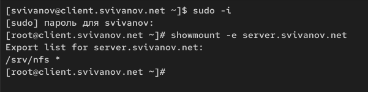{#fig:021 width=70%}

## Подключение каталогов к дереву NFS

На сервере создадим общий каталог, в который будет подмонтирован каталог с контентом веб-сервера и подмонтируем его (рис. 22)

{#fig:022 width=70%}

## Подключение каталогов к дереву NFS

На сервере проверим, что отображается в каталоге /srv/nfs. (рис. 23)

{#fig:023 width=70%}

## Подключение каталогов к дереву NFS

На клиенте посмотрим, что отображается в каталоге /mnt/nfs. (рис. 24)

{#fig:024 width=70%}

## Подключение каталогов к дереву NFS

На сервере в файле /etc/exports добавим экспорт каталога веб-сервера с удалённого ресурса (рис. 25)

{#fig:025 width=70%}

## Подключение каталогов к дереву NFS

Экспортируем все каталоги, упомянутые в файле /etc/exports: exportfs -r (рис. 26)

{#fig:026 width=70%}

## Подключение каталогов к дереву NFS

Проверим на клиенте каталог /mnt/nfs. (рис. 27)

{#fig:027 width=70%}

## Подключение каталогов к дереву NFS

На сервере в конце файла /etc/fstab добавим следующую запись: (рис. 28)

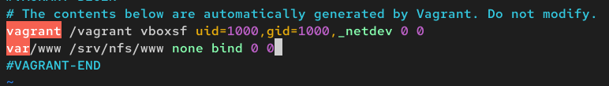{#fig:028 width=70%}

## Подключение каталогов к дереву NFS

Повторно экспортируем каталоги, указанные в файле /etc/exports и на клиенте проверим каталог /mnt/nfs. (рис. 29)

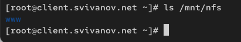{#fig:029 width=70%}

## Подключение каталогов для работы пользователей

На сервере под пользователем в его домашнем каталоге создадим каталог
common с полными правами доступа только для этого пользователя, а в нём файл
user@server.txt: (рис. 30)

{#fig:030 width=70%}

## Подключение каталогов для работы пользователей

На сервере создадим общий каталог для работы пользователя по сети: (рис. 31)

{#fig:031 width=70%}

## Подключение каталогов для работы пользователей

Подмонтируем каталог common пользователя user в NFS: (рис. 32)

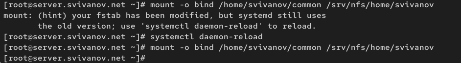{#fig:032 width=70%}

## Подключение каталогов для работы пользователей

Подключим каталог пользователя в файле /etc/exports (рис. 33)

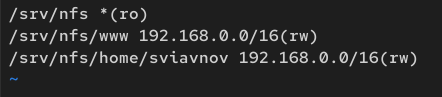{#fig:033 width=70%}

## Подключение каталогов для работы пользователей

Внесем изменения в файл /etc/fstab: (рис. 34)

{#fig:034 width=70%}

## Подключение каталогов для работы пользователей

Повторно экспортируем каталоги. На клиенте проверим каталог /mnt/nfs. (рис. 35)

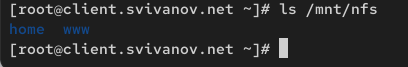{#fig:035 width=70%}

## Подключение каталогов для работы пользователей

На клиенте под пользователем перейдем в каталог /mnt/nfs/home/user
и попробуем создать в нём файл user@client.txt и внести в него какие-либо изменения: (рис. 36)

{#fig:036 width=70%}

## Подключение каталогов для работы пользователей

Попробуем проделать это под пользователем root. (рис. 37)

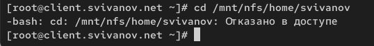{#fig:037 width=70%}

## Подключение каталогов для работы пользователей

На сервере посмотрим, появились ли изменения в каталоге пользователя
/home/user/common. (рис. 38)

{#fig:038 width=70%}

## Внесение изменений в настройки внутреннего окружения виртуальных машин

На машине server перейдем в каталог для внесения изменений, создадим в нём
каталог nfs, в который поместим конфигурационные файлы: (рис. 39)

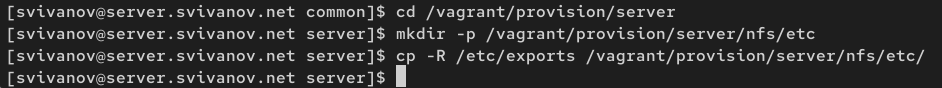{#fig:039 width=70%}

## Внесение изменений в настройки внутреннего окружения виртуальных машин

В каталоге /vagrant/provision/server создадим скрипт nfs.sh: (рис. 40)

{#fig:040 width=70%}

## Внесение изменений в настройки внутреннего окружения виртуальных машин

На машине client перейдем в каталог для внесения изменений и создадим скрипт (рис. 41)

{#fig:041 width=70%}

## Внесение изменений в настройки внутреннего окружения виртуальных машин

{#fig:042 width=70%}

## Внесение изменений в настройки внутреннего окружения виртуальных машин

Для отработки скриптов во время загрузки виртуальных машин в конфигурационном файле Vagrantfile необходимо добавить: (рис. 43, 44)

{#fig:043 width=70%}

## Внесение изменений в настройки внутреннего окружения виртуальных машин

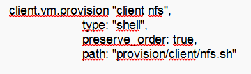{#fig:044 width=70%}

## Вывод 

В ходе выполнения лабораторной работы мы приобрели навыки настройки сервера NFS для удалённого доступа к ресурсам.

 
