---
## Front matter
title: "Отчет по лабораторной работе №13"
subtitle: "Дисциплина: Администрирование сетевых подсистем"
author: "Иванов Сергей Владимирович"

## Generic otions
lang: ru-RU
toc-title: "Содержание"

## Bibliography
bibliography: bib/cite.bib
csl: pandoc/csl/gost-r-7-0-5-2008-numeric.csl

## Pdf output format
toc: true # Table of contents
toc-depth: 2
lof: true # List of figures
fontsize: 12pt
linestretch: 1.5
papersize: a4
documentclass: scrreprt
## I18n polyglossia
polyglossia-lang:
  name: russian
  options:
	- spelling=modern
	- babelshorthands=true
polyglossia-otherlangs:
  name: english
## I18n babel
babel-lang: russian
babel-otherlangs: english
## Fonts
mainfont: PT Serif
romanfont: PT Serif
sansfont: PT Sans
monofont: PT Mono
mainfontoptions: Ligatures=TeX
romanfontoptions: Ligatures=TeX
sansfontoptions: Ligatures=TeX,Scale=MatchLowercase
monofontoptions: Scale=MatchLowercase,Scale=0.9
## Biblatex
biblatex: true
biblio-style: "gost-numeric"
biblatexoptions:
  - parentracker=true
  - backend=biber
  - hyperref=auto
  - language=auto
  - autolang=other*
  - citestyle=gost-numeric
## Pandoc-crossref LaTeX customization
figureTitle: "Рис."
listingTitle: "Листинг"
lofTitle: "Список иллюстраций"
lolTitle: "Листинги"
## Misc options
indent: true
header-includes:
  - \usepackage{indentfirst}
  - \usepackage{float} # keep figures where there are in the text
  - \floatplacement{figure}{H} # keep figures where there are in the text
---

# Цель работы

Приобретение навыков настройки сервера NFS для удалённого доступа к ресурсам.

# Задание

1. Установите и настройте сервер NFSv4 (см. раздел 13.4.1).
2. Подмонтируйте удалённый ресурс на клиенте (см. раздел 13.4.2).
3. Подключите каталог с контентом веб-сервера к дереву NFS (см. раздел 13.4.3).
4. Подключите каталог для удалённой работы вашего пользователя к дереву NFS (см.
раздел 13.4.4).
5. Напишите скрипты для Vagrant, фиксирующие действия по установке и настройке сервера NFSv4 во внутреннем окружении виртуальных машин server и client.
Соответствующим образом внесите изменения в Vagrantfile (см. раздел 13.4.5).

# Выполнение лабораторной работы

## Настройка сервера NFSv4

На сервере установим необходимое программное обеспечение:
dnf -y install nfs-utils. (рис. 1)

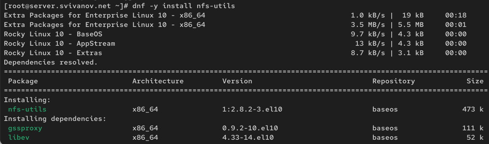{#fig:001 width=70%}

На сервере создадим каталог, который предполагается сделать доступным всем
пользователям сети (корень дерева NFS):
mkdir -p /srv/nfs (рис. 2)

{#fig:002 width=70%}

В файле /etc/exports пропишем подключаемый через NFS общий каталог с доступом только на чтение:
/srv/nfs *(ro) (рис. 3)

{#fig:003 width=70%}

Для общего каталога зададим контекст безопасности NFS:

semanage fcontext -a -t nfs_t "/srv/nfs(/.*)?"

Применим изменённую настройку SELinux к файловой системе:

restorecon -vR /srv/nfs (рис. 4) 

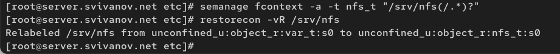{#fig:004 width=70%}

Запустим сервер NFS:

systemctl start nfs-server.service

systemctl enable nfs-server.service. (рис. 5) 

{#fig:005 width=70%}

Настроим межсетевой экран для работы сервера NFS:

firewall-cmd --add-service=nfs

firewall-cmd --add-service=nfs --permanent

firewall-cmd --reload. (рис. 6)

{#fig:006 width=70%}

На клиенте установим необходимое для работы NFS программное обеспечение:
dnf -y install nfs-utils (рис. 7)

{#fig:007 width=70%}

На клиенте попробуем посмотреть имеющиеся подмонтированные удалённые
ресурсы: showmount -e server.user.net. 

Ошибка Unable to receive говорит о том, что клиент не может связаться с NFS сервером. (рис. 8)

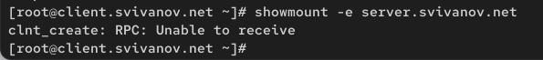{#fig:008 width=70%}

Попробуем на сервере остановить сервис межсетевого экрана:
systemctl stop firewalld.service (рис. 9)

{#fig:009 width=70%}

Затем на клиенте вновь попробуем подключиться к удалённо смонтированному
ресурсу:
showmount -e server.user.net.

В этот раз мы смогли подключиться. Похоже проблема была в том, что firewall мешал нам это сделать, но отключив его, все получилось. (рис. 10)

{#fig:010 width=70%}

На сервере запустите сервис межсетевого экрана: systemctl start firewalld (рис. 11)

{#fig:011 width=70%}

На сервере посмотрим, какие службы задействованы при удалённом монтировании:

lsof | grep TCP

lsof | grep UDP (рис. 12, 13)

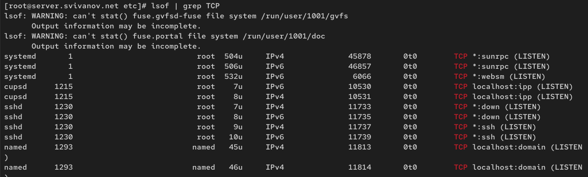{#fig:012 width=70%}

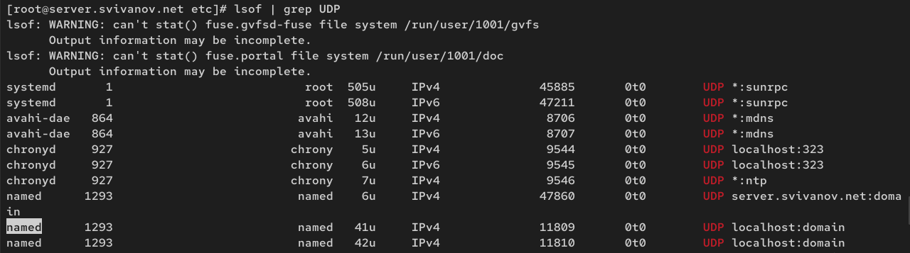{#fig:013 width=70%}
 
Добавим службы rpc-bind и mountd в настройки межсетевого экрана на сервере:

firewall-cmd --get-services

firewall-cmd --add-service=mountd --add-service=rpc-bind

firewall-cmd --add-service=mountd --add-service=rpc-bind --permanent

firewall-cmd --reload. (рис. 14)

{#fig:014 width=70%}

На клиенте проверим подключение удалённого ресурса: showmount -e server.user.net. (рис. 15)

{#fig:015 width=70%}

## Монтирование NFS на клиенте

На клиенте создадим каталог, в который будет монтироваться удалённый ресурс,
и подмонтируем дерево NFS:

mkdir -p /mnt/nfs

mount server.user.net:/srv/nfs /mnt/nfs. (рис. 16)

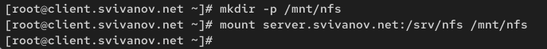{#fig:016 width=70%}

Проверим, что общий ресурс NFS подключён правильно: mount. 

Тут мы видим что удаленный ресурс NFS успешно подключен. /srv/nfs - это удаленный ресурс, /mnt/nfs - точка монитрования на клиенте. (рис. 17)

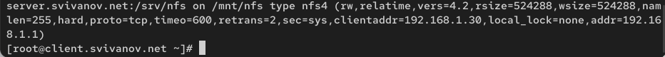{#fig:017 width=70%}

На клиенте в конце файла /etc/fstab добавим следующую запись: server.user.net:/srv/nfs /mnt/nfs nfs _netdev 0 0 

server.svivanov.net:/srv/nfs - ресурс монтирования. 

/mnt/nfs - точка монтирования на клиенте. 

nfs - тип файловой системы.

_netdev - указывает на то, что ресурс должен монтироваться только после загрузки сети. 0 - указыает, нужно ди делать резервную копию файловой системы (0 = не нужно), 0 - порядок проверки файловой системы (0 = не проверять). (рис. 18)

{#fig:018 width=70%}

На клиенте проверим наличие автоматического монтирования удалённых ресурсов при запуске операционной системы:
systemctl status remote-fs.target. Сервис запущени и работает. (рис. 19)

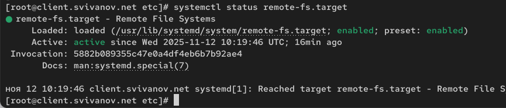{#fig:019 width=70%}

Перезапустим клиента и убедимся, что удалённый ресурс подключается автоматически. Убеждаемся, что все работает корректно. (рис. 20, 21)

{#fig:020 width=70%}

{#fig:021 width=70%}

## Подключение каталогов к дереву NFS

На сервере создадим общий каталог, в который затем будет подмонтирован каталог
с контентом веб-сервера: mkdir -p /srv/nfs/www. Подмонтируем каталог web-сервера:
mount -o bind /var/www/ /srv/nfs/www/ (рис. 22)

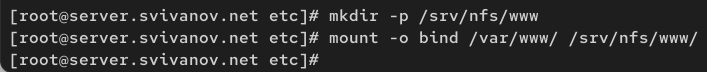{#fig:022 width=70%}

На сервере проверим, что отображается в каталоге /srv/nfs. Отображается каталог www. (рис. 23)

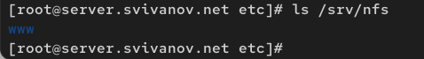{#fig:023 width=70%}

На клиенте посмотрим, что отображается в каталоге /mnt/nfs. Отображается каталог www. (рис. 24)

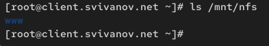{#fig:024 width=70%}

На сервере в файле /etc/exports добавим экспорт каталога веб-сервера с удалённого ресурса: /srv/nfs/www 192.168.0.0/16(rw) (рис. 25)

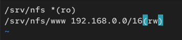{#fig:025 width=70%}

Экспортируем все каталоги, упомянутые в файле /etc/exports: exportfs -r (рис. 26)

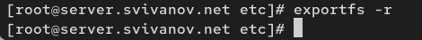{#fig:026 width=70%}

Проверим на клиенте каталог /mnt/nfs. Там у нас отображается каталог www. (рис. 27)

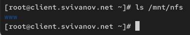{#fig:027 width=70%}

На сервере в конце файла /etc/fstab добавим следующую запись: /var/www /srv/nfs/www none bind 0 0 (рис. 28)

{#fig:028 width=70%}

Повторно экспортируем каталоги, указанные в файле /etc/exports и на клиенте проверим каталог /mnt/nfs. (рис. 29)

{#fig:029 width=70%}

## Подключение каталогов для работы пользователей

На сервере под пользователем svivanov в его домашнем каталоге создадим каталог
common с полными правами доступа только для этого пользователя, а в нём файл
user@server.txt:

mkdir -p -m 700 ~/common

cd ~/common

touch user@server.txt (рис. 30)

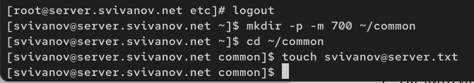{#fig:030 width=70%}

На сервере создадим общий каталог для работы пользователя по сети: mkdir -p /srv/nfs/home/user (рис. 31)

{#fig:031 width=70%}

Подмонтируем каталог common пользователя user в NFS: mount -o bind /home/user/common /srv/nfs/home/user.

Мы устанавливали права 700 - это все права (чтение, запись, выполнение) для пользователя (svivanov). Остальные пользователи, в том числе root не имеют прав. (рис. 32)

{#fig:032 width=70%}

Подключим каталог пользователя в файле /etc/exports, прописав в нём: /srv/nfs/home/user 192.168.0.0/16(rw) (рис. 33)

{#fig:033 width=70%}

Внесем изменения в файл /etc/fstab: /home/user/common /srv/nfs/home/user none bind 0 0 (рис. 34)

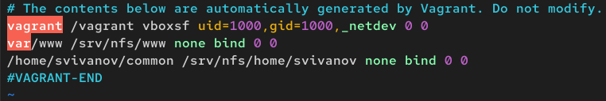{#fig:034 width=70%}

Повторно экспортируем каталоги. На клиенте проверим каталог /mnt/nfs. Теперь тут появился каталог home. (рис. 35)

{#fig:035 width=70%}

На клиенте под пользователем user перейдем в каталог /mnt/nfs/home/user
и попробуем создать в нём файл user@client.txt и внести в него какие-либо изменения:

cd /mnt/nfs/home/user

touch user@client.txt (рис. 36)

{#fig:036 width=70%}

Попробуем проделать это под пользователем root. Ничего не получилось, т.к у root нет прав на это. (рис. 37)

{#fig:037 width=70%}

На сервере посмотрим, появились ли изменения в каталоге пользователя
/home/user/common. Да, теперь тут файлы и с клиента, и с сервера. (рис. 38)

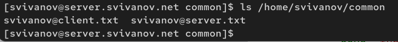{#fig:038 width=70%}

## Внесение изменений в настройки внутреннего окружения виртуальных машин

На виртуальной машине server перейдем в каталог для внесения изменений
в настройки внутреннего окружения /vagrant/provision/server/, создадим в нём
каталог nfs, в который поместим в соответствующие подкаталоги конфигурационные файлы:

cd /vagrant/provision/server

mkdir -p /vagrant/provision/server/nfs/etc

cp -R /etc/exports /vagrant/provision/server/nfs/etc/ (рис. 39)

{#fig:039 width=70%}

В каталоге /vagrant/provision/server создадим исполняемый файл nfs.sh:

cd /vagrant/provision/server

touch nfs.sh

chmod +x nfs.sh

Открыв его на редактирование, пропишем в нём следующий скрипт (рис. 40)

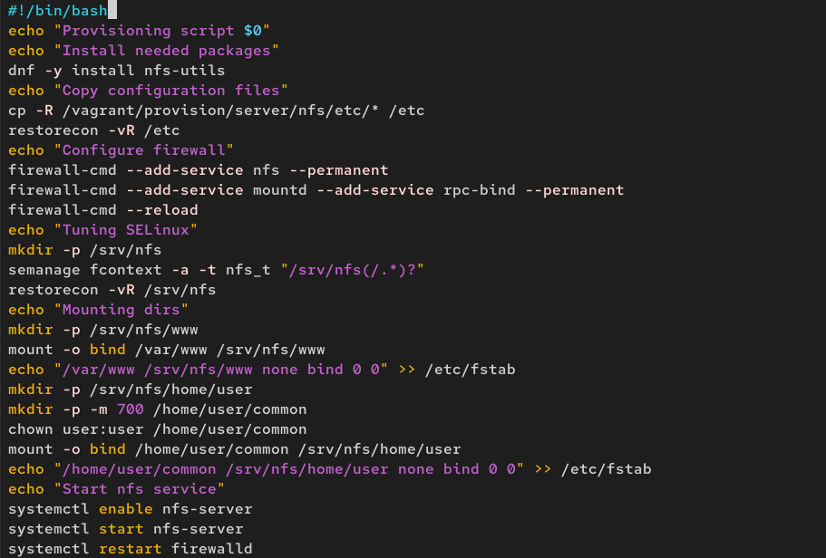{#fig:040 width=70%}

На виртуальной машине client перейдем в каталог для внесения изменений в настройки внутреннего окружения /vagrant/provision/client/:
cd /vagrant/provision/client. В каталоге /vagrant/provision/client создадим исполняемый файл nfs.sh:

cd /vagrant/provision/client

touch nfs.sh

chmod +x nfs.sh (рис. 41)

{#fig:041 width=70%}

Открыв его на редактирование, пропишем в нём следующий скрипт: (рис. 42)

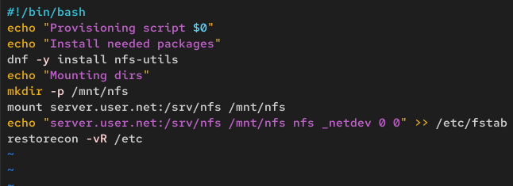{#fig:042 width=70%}

Для отработки созданных скриптов во время загрузки виртуальных машин server
и client в конфигурационном файле Vagrantfile необходимо добавить в соответствующих разделах конфигураций для сервера и клиента: (рис. 43, 44)

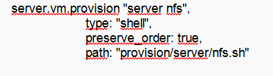{#fig:043 width=70%}

{#fig:044 width=70%}

# Ответы на контрольные вопросы

**1. Как называется файл конфигурации, содержащий общие ресурсы NFS?**

Файл конфигурации, содержащий общие ресурсы NFS, называется /etc/exports.

**2. Какие порты должны быть открыты в брандмауэре, чтобы обеспечить полный доступ к серверу NFS?**

Для доступа к серверу NFSv4 должны быть открыты:

nfs - основной сервис NFS (порт 2049)

rpc-bind (portmapper) - служба RPC-привязки (порт 111)

mountd - служба монтирования NFS

**3. Какую опцию следует использовать в /etc/fstab, чтобы убедиться, что общие ресурсы NFS могут быть установлены автоматически при перезагрузке?**

В файле /etc/fstab для NFS-ресурсов следует использовать опцию _netdev.

# Выводы

В ходе выполнения лабораторной работы мы приобрели навыки настройки сервера NFS для удалённого доступа к ресурсам.
