---
## Front matter
lang: ru-RU
title: Лабораторная работа №14
subtitle: Администрирование сетевых подсистем
author:
  - Иванов Сергей Владимирович, НПИбд-01-23
institute:
  - Российский университет дружбы народов, Москва, Россия
date: 26 ноября 2025

## i18n babel
babel-lang: russian
babel-otherlangs: english

## Formatting pdf
toc: false
slide_level: 2
aspectratio: 169
section-titles: true
theme: metropolis
header-includes:
 - \metroset{progressbar=frametitle,sectionpage=progressbar,numbering=fraction}
 - '\makeatletter'
 - '\beamer@ignorenonframefalse'
 - '\makeatother'

 ## Fonts
mainfont: PT Serif
romanfont: PT Serif
sansfont: PT Sans
monofont: PT Mono
mainfontoptions: Ligatures=TeX
romanfontoptions: Ligatures=TeX
sansfontoptions: Ligatures=TeX,Scale=MatchLowercase
monofontoptions: Scale=MatchLowercase,Scale=0.9
---

# Цель работы

Приобретение навыков настройки доступа групп пользователей к общим ресурсам
по протоколу SMB.

# Задание

1. Установите и настройте сервер Samba
2. Настройте на клиенте доступ к разделяемым ресурсам 
3. Напишите скрипты для Vagrant, фиксирующие действия по установке и настройке
сервера Samba для доступа к разделяемым ресурсам во внутреннем окружении
виртуальных машин server и client. Соответствующим образом необходимо внести
изменения в Vagrantfile 

# Выполнение лабораторной работы

## Настройка сервера Samba

Запускаю виртуальную машину Server. (рис. 1)

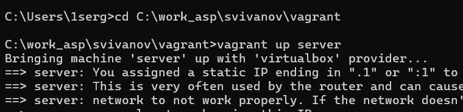{#fig:001 width=70%}

## Настройка сервера Samba

На сервере установим необходимые пакеты: (рис. 2)

{#fig:002 width=70%}

## Настройка сервера Samba

Создадим группу sambagroup для пользователей, которые будут работать с Sambaсервером (рис. 3)

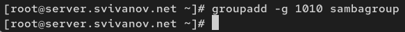{#fig:003 width=70%}

## Настройка сервера Samba

Добавим пользователя к группе sambagroup (рис. 4) 

{#fig:004 width=70%}

## Настройка сервера Samba

Создадим общий каталог, в который будем
монтировать разделяемые ресурсы (рис. 5) 

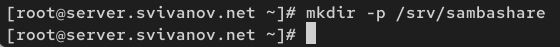{#fig:005 width=70%}

## Настройка сервера Samba

В файле /etc/samba/smb.conf: изменим параметр рабочей группы (рис. 6)

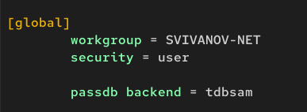{#fig:006 width=70%}

## Настройка сервера Samba

В конце файла добавим раздел с описанием общего доступа к разделяемому
ресурсу /srv/sambashare: (рис. 7)

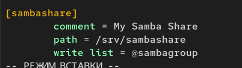{#fig:007 width=70%}

## Настройка сервера Samba

Убедимся, что не сделали синтаксических ошибок в файле (рис. 8)

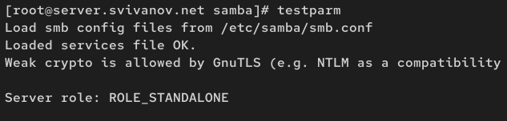{#fig:008 width=70%}

## Настройка сервера Samba

Запустим демон Samba и посмотрим его статус: (рис. 9)

{#fig:009 width=70%}

## Настройка сервера Samba

Для проверки наличия общего доступа попробуем подключиться к серверу с помощью smbclient: (рис. 10)

{#fig:010 width=70%}

## Настройка сервера Samba

Посмотрим файл конфигурации межсетевого экрана для Samba (рис. 11)

{#fig:011 width=70%}

## Настройка сервера Samba

Настроим межсетевой экран: (рис. 12)

{#fig:012 width=70%}

## Настройка сервера Samba

Настроим права доступа для каталога с разделяемым ресурсом: (рис. 13)

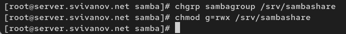{#fig:013 width=70%}
 
## Настройка сервера Samba

Посмотрим контекст безопасности SELinux: (рис. 14)

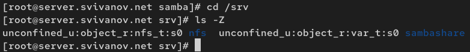{#fig:014 width=70%}

## Настройка сервера Samba

Настроим контекст безопасности SELinux для каталога с разделяемым ресурсом: (рис. 15)

{#fig:015 width=70%}

## Настройка сервера Samba

Проверим, что контекст безопасности изменился: (рис. 16)

{#fig:016 width=70%}

## Настройка сервера Samba

Разрешим экспортировать разделяемые ресурсы для чтения и записи: (рис. 17)

{#fig:017 width=70%}

## Настройка сервера Samba

Посмотрим UID пользователя и в какие группы он включён (рис. 18)

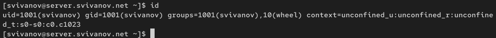{#fig:018 width=70%}

## Настройка сервера Samba

Под пользователем попробуем создать файл на разделяемом ресурсе: (рис. 19)

{#fig:019 width=70%}

## Настройка сервера Samba

Добавим пользователя в базу пользователей Samba: (рис. 20)

{#fig:020 width=70%}

## Монтирование файловой системы Samba на клиенте

Запускаю машину Client (рис. 21)

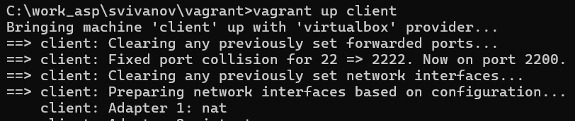{#fig:021 width=70%}

## Монтирование файловой системы Samba на клиенте

На клиенте установим необходимые пакеты: (рис. 22)

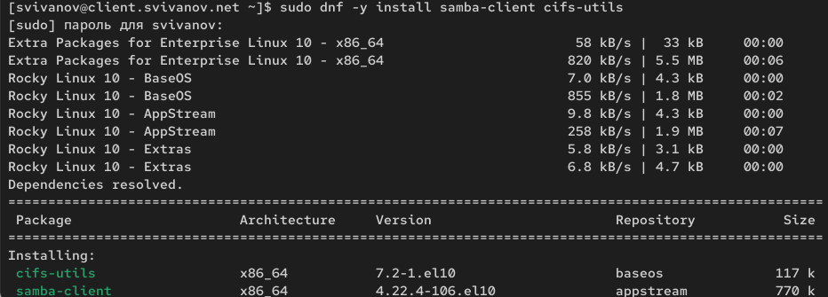{#fig:022 width=70%}

## Монтирование файловой системы Samba на клиенте

На клиенте посмотрим файл конфигурации межсетевого экрана для клиента
Samba: (рис. 23)

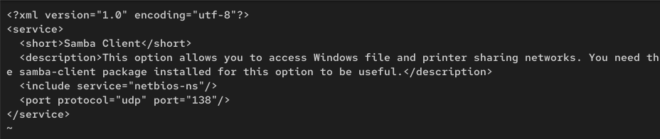{#fig:023 width=70%}

## Монтирование файловой системы Samba на клиенте

На клиенте настроим межсетевой экран: (рис. 24) 

{#fig:024 width=70%}

## Монтирование файловой системы Samba на клиенте

На клиенте создадим группу sambagroup и добавим в неё пользователя: (рис. 25)

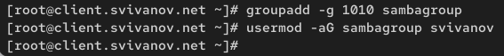{#fig:025 width=70%}

## Монтирование файловой системы Samba на клиенте

На клиенте в файле конфигурации /etc/samba/smb.conf изменим параметр рабочей группы: (рис. 26)

{#fig:026 width=70%}

## Монтирование файловой системы Samba на клиенте

Для проверки наличия общего доступа попробуем подключиться с клиента к серверу (рис. 27)

{#fig:027 width=70%}

## Монтирование файловой системы Samba на клиенте

{#fig:028 width=70%}

## Монтирование файловой системы Samba на клиенте

На клиенте создадим точку монтирования и получим доступ к общему ресурсу: (рис. 29)

{#fig:029 width=70%}

## Монтирование файловой системы Samba на клиенте

Убедимся, что svivanov может записывать файлы на разделяемом ресурсе: (рис. 30)

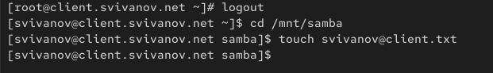{#fig:030 width=70%}

## Монтирование файловой системы Samba на клиенте

Отмонтируем каталог /mnt/samba: (рис. 31)

{#fig:031 width=70%}

## Настройка работы с Samba с помощью файла учётных данных

Для настройки работы с Samba с помощью файла учётных данных: (a) создадим файл smbusers в каталоге /etc/samba/ (рис. 32)

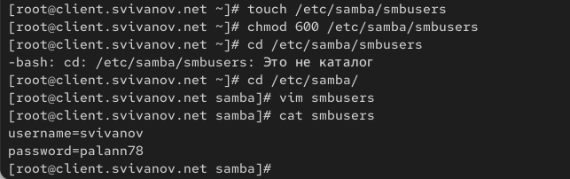{#fig:032 width=70%}

## Монтирование файловой системы Samba на клиенте

(b) в файле /etc/fstab добавим следующую строку: (рис. 33)

{#fig:033 width=70%}

## Монтирование файловой системы Samba на клиенте

(c) Подмонтируем общий ресурс: mount -a (рис. 34)

{#fig:034 width=70%}

## Монтирование файловой системы Samba на клиенте

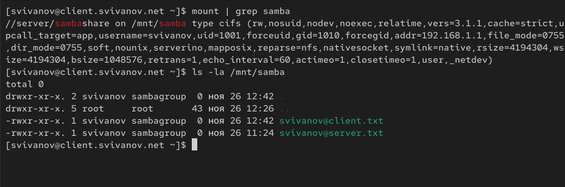{#fig:035 width=70%}

## Внесение изменений в настройки внутреннего окружения виртуальных машин

На машине server перейдем в каталог для внесения изменений, создадим в нём
каталог smb, в который поместим конфигурационные файлы: (рис. 36)

{#fig:036 width=70%}

## Внесение изменений в настройки внутреннего окружения виртуальных машин

Создадим скрипт (рис. 37)

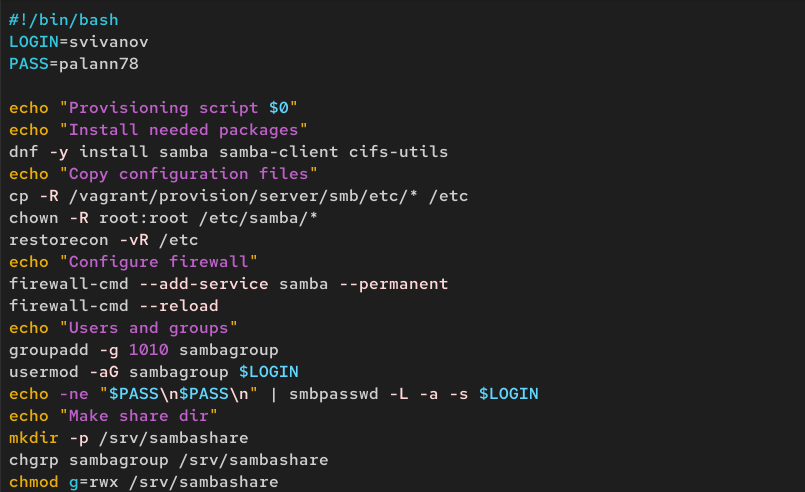{#fig:037 width=70%}

## Внесение изменений в настройки внутреннего окружения виртуальных машин

На машине client перейдем в каталог для внесения изменений, создадим в нём
каталог smb, в который поместим конфигурационные файлы: (рис. 38)

{#fig:038 width=70%}

## Внесение изменений в настройки внутреннего окружения виртуальных машин

Создадим скрипт

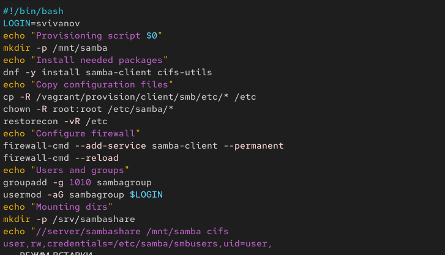{#fig:039 width=70%}

## Внесение изменений в настройки внутреннего окружения виртуальных машин

Для отработки скриптов во время загрузки машин server
и client в файле Vagrantfile необходимо добавить: (рис. 40)

{#fig:040 width=70%}

## Внесение изменений в настройки внутреннего окружения виртуальных машин

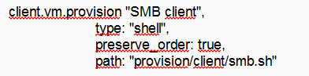{#fig:041 width=70%}

## Вывод 

В ходе выполнения лабораторной работы мы приобрели навыки настройки доступа групп пользователей к общим ресурсам
по протоколу SMB.

 
