---
## Front matter
title: "Отчет по лабораторной работе №14"
subtitle: "Дисциплина: Администрирование сетевых подсистем"
author: "Иванов Сергей Владимирович"

## Generic otions
lang: ru-RU
toc-title: "Содержание"

## Bibliography
bibliography: bib/cite.bib
csl: pandoc/csl/gost-r-7-0-5-2008-numeric.csl

## Pdf output format
toc: true # Table of contents
toc-depth: 2
lof: true # List of figures
fontsize: 12pt
linestretch: 1.5
papersize: a4
documentclass: scrreprt
## I18n polyglossia
polyglossia-lang:
  name: russian
  options:
	- spelling=modern
	- babelshorthands=true
polyglossia-otherlangs:
  name: english
## I18n babel
babel-lang: russian
babel-otherlangs: english
## Fonts
mainfont: PT Serif
romanfont: PT Serif
sansfont: PT Sans
monofont: PT Mono
mainfontoptions: Ligatures=TeX
romanfontoptions: Ligatures=TeX
sansfontoptions: Ligatures=TeX,Scale=MatchLowercase
monofontoptions: Scale=MatchLowercase,Scale=0.9
## Biblatex
biblatex: true
biblio-style: "gost-numeric"
biblatexoptions:
  - parentracker=true
  - backend=biber
  - hyperref=auto
  - language=auto
  - autolang=other*
  - citestyle=gost-numeric
## Pandoc-crossref LaTeX customization
figureTitle: "Рис."
listingTitle: "Листинг"
lofTitle: "Список иллюстраций"
lolTitle: "Листинги"
## Misc options
indent: true
header-includes:
  - \usepackage{indentfirst}
  - \usepackage{float} # keep figures where there are in the text
  - \floatplacement{figure}{H} # keep figures where there are in the text
---

# Цель работы

Приобретение навыков настройки доступа групп пользователей к общим ресурсам
по протоколу SMB.

# Задание

1. Установите и настройте сервер Samba (см. раздел 14.4.1).
2. Настройте на клиенте доступ к разделяемым ресурсам (см. раздел 14.4.2).
3. Напишите скрипты для Vagrant, фиксирующие действия по установке и настройке
сервера Samba для доступа к разделяемым ресурсам во внутреннем окружении
виртуальных машин server и client. Соответствующим образом необходимо внести
изменения в Vagrantfile (см. раздел 14.4.3).

# Выполнение лабораторной работы

## Настройка сервера Samba

Запускаю виртуальную машину Server. (рис. 1)

{#fig:001 width=70%}

На сервере установим необходимые пакеты:
dnf -y install samba samba-client cifs-utils (рис. 2)

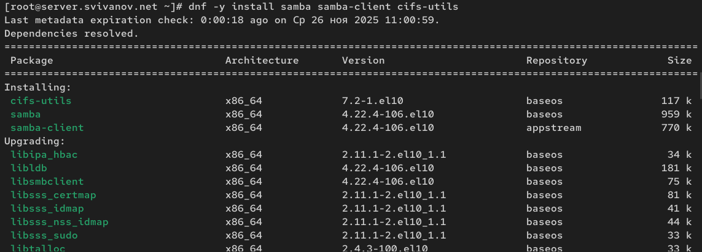{#fig:002 width=70%}

Создадим группу sambagroup для пользователей, которые будут работать с Sambaсервером, и присвоим ей GID 1010:
groupadd -g 1010 sambagroup (рис. 3)

{#fig:003 width=70%}

Добавим пользователя user к группе sambagroup: usermod -aG sambagroup user (рис. 4) 

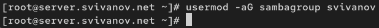{#fig:004 width=70%}

Создадим общий каталог в файловой системе Linux, в который предполагается
монтировать разделяемые ресурсы: mkdir -p /srv/sambashare (рис. 5) 

{#fig:005 width=70%}

В файле конфигурации /etc/samba/smb.conf: изменим параметр рабочей группы: (рис. 6)

```
[global]
workgroup = USER-NET
```

{#fig:006 width=70%}

В конце файла добавим раздел с описанием общего доступа к разделяемому
ресурсу /srv/sambashare: (рис. 7)

```
[sambashare]
comment = My Samba Share
path = /srv/sambashare
write list = @sambagroup
```

{#fig:007 width=70%}

Убедимся, что не сделали синтаксических ошибок в файле smb.conf, используя команду: testparm (рис. 8)

{#fig:008 width=70%}

Запустим демон Samba и посмотрим его статус: (рис. 9)

```
systemctl start smb
systemctl enable smb
systemctl status smb
``` 

{#fig:009 width=70%}

Для проверки наличия общего доступа попробуем подключиться к серверу с помощью smbclient:
smbclient -L //server. Видим, что получилось подключиться (рис. 10)

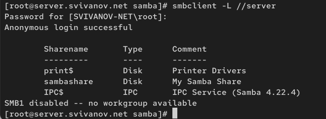{#fig:010 width=70%}

Посмотрим файл конфигурации межсетевого экрана для Samba: less /usr/lib/firewalld/services/samba.xml (рис. 11)

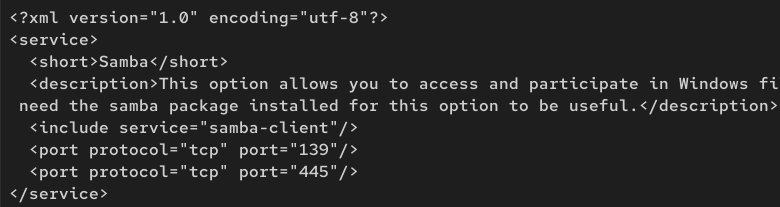{#fig:011 width=70%}

Настроим межсетевой экран: (рис. 12)

```
firewall-cmd --add-service=samba
firewall-cmd --add-service=samba --permanent
firewall-cmd --reload 
```

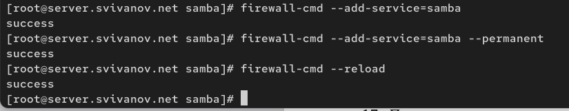{#fig:012 width=70%}

Настроим права доступа для каталога с разделяемым ресурсом: (рис. 13)

```
chgrp sambagroup /srv/sambashare
chmod g=rwx /srv/sambashare
```

{#fig:013 width=70%}
 
Посмотрим контекст безопасности SELinux: (рис. 14)

```
cd /srv
ls -Z
```

{#fig:014 width=70%}

Настроим контекст безопасности SELinux для каталога с разделяемым ресурсом: (рис. 15)

```
semanage fcontext -a -t samba_share_t "/srv/sambashare(/.*)?"
restorecon -vR /srv/sambashare
```

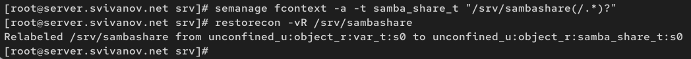{#fig:015 width=70%}

Проверьте, что контекст безопасности изменился: (рис. 16)

```
cd /srv
ls -Z 
```

{#fig:016 width=70%}

Разрешим экспортировать разделяемые ресурсы для чтения и записи: (рис. 17)

```
setsebool samba_export_all_rw 1
setsebool samba_export_all_rw 1 -P
```

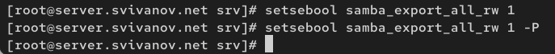{#fig:017 width=70%}

Посмотрим UID пользователя и в какие группы он включён: id (рис. 18)

{#fig:018 width=70%}

Под пользователем попробуем создать файл на разделяемом ресурсе: (рис. 19)

```
cd /srv/sambashare
touch user@server.txt
```

Видим, что можем создавать файл.

{#fig:019 width=70%}

Добавим пользователя в базу пользователей Samba: smbpasswd -L -a user. (рис. 20)

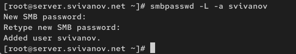{#fig:020 width=70%}

## Монтирование файловой системы Samba на клиенте

Запускаю машину Client (рис. 21)

{#fig:021 width=70%}

На клиенте установимнеобходимые пакеты: dnf -y install samba-client cifs-utils (рис. 22)

{#fig:022 width=70%}

На клиенте посмотрим файл конфигурации межсетевого экрана для клиента
Samba: less /usr/lib/firewalld/services/samba-client.xml (рис. 23)

{#fig:023 width=70%}

На клиенте настроим межсетевой экран: (рис. 24)

```
firewall-cmd --add-service=samba-client
firewall-cmd --add-service=samba-client --permanent
firewall-cmd --reload
``` 

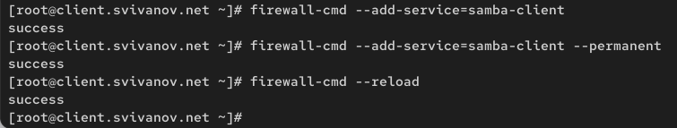{#fig:024 width=70%}

На клиенте создадим группу sambagroup и добавим в неё пользователя: (рис. 25)

```
groupadd -g 1010 sambagroup
usermod -aG sambagroup user 
```

{#fig:025 width=70%}

На клиенте в файле конфигурации /etc/samba/smb.conf изменим параметр рабочей группы: (рис. 26)

```
[global]
workgroup = USER-NET 
```

{#fig:026 width=70%}

Для проверки наличия общего доступа попробуем подключиться с клиента к серверу с помощью smbclient:
smbclient -L //server. 

В данном случае мы просматриваем ресурсы с сервера под учетной записью root (SVIVANOV-NET/root) (рис. 27)

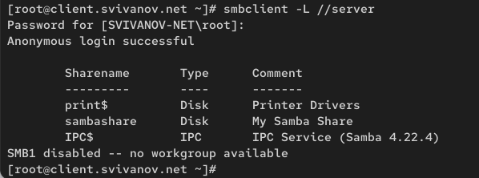{#fig:027 width=70%}

Подключимся с клиента к серверу с помощью smbclient под учётной записью пользователя:
smbclient -L //server -U user. В этом случае мы просматриваем ресурсы с сервера под учетной записью svivanov (SVIVANOV-NET/svivanov) (рис. 28)

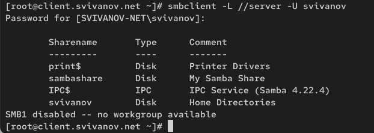{#fig:028 width=70%}

На клиенте создадим точку монтирования и получим доступ к общему ресурсу с помощью mount: (рис. 29)

```
mkdir /mnt/samba
mount -o username=user_name,user,rw,uid=user_name,gid=sambagroup //server/sambashare /mnt/samba
``` 

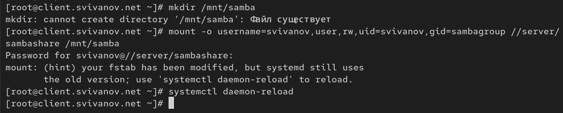{#fig:029 width=70%}

Убедимся, что svivanov может записывать файлы на разделяемом ресурсе: (рис. 30)

```
cd /mnt/samba
touch user@client.txt 
```

Видим, что может.

{#fig:030 width=70%}

Отмонтируем каталог /mnt/samba: umount /mnt/samba (рис. 31)

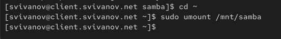{#fig:031 width=70%}

Для настройки работы с Samba с помощью файла учётных данных:

(a) на клиенте создадим файл smbusers в каталоге /etc/samba/: (рис. 32)

```
touch /etc/samba/smbusers
chmod 600 /etc/samba/smbusers
```
с содержанием следующего формата:
```
username=<svianov>
password=<palann78> 
```

{#fig:032 width=70%}

(b) На клиенте в файле /etc/fstab добавим следующую строку: //server/sambashare /mnt/samba cifs user,rw,uid=user_name,gid=sambagroup,credentials=/etc/samba/smbusers,_netdev 0 0 (рис. 33)

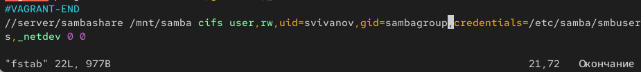{#fig:033 width=70%}

(c) Подмонтируем общий ресурс: mount -a (рис. 34)

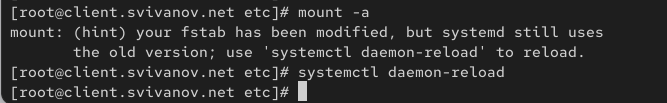{#fig:034 width=70%}

Убедившись, что ресурс монтируется, перезагрузим клиента для проверки, что ресурс монтируется и после перезагрузки, а у пользователя есть доступ
к разделяемым ресурсам. Видим, что все корректно (рис. 35)

{#fig:035 width=70%}

## Внесение изменений в настройки внутреннего окружения виртуальных машин

На виртуальной машине server перейдем в каталог для внесения изменений
в настройки внутреннего окружения /vagrant/provision/server/, создадим в нём
каталог smb, в который поместим в соответствующие подкаталоги конфигурационные файлы: (рис. 36)

```
cd /vagrant/provision/server
mkdir -p /vagrant/provision/server/smb/etc/samba
cp -R /etc/samba/smb.conf /vagrant/provision/server/smb/etc/samba/ 
```

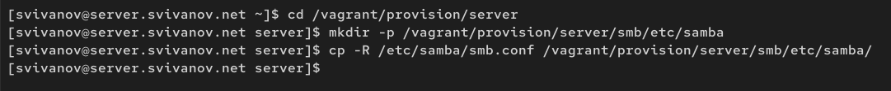{#fig:036 width=70%}

В каталоге /vagrant/provision/server создадим исполняемый файл smb.sh:

```
cd /vagrant/provision/server
touch smb.sh
chmod +x smb.sh
```

Открыв его на редактирование, пропишем в нём следующий скрипт. (рис. 37)

{#fig:037 width=70%}

На виртуальной машине client перейдем в каталог для внесения изменений
в настройки внутреннего окружения /vagrant/provision/client/, создадим в нём
каталог smb, в который поместим в соответствующие подкаталоги конфигурационные файлы: (рис. 38)

```
cd /vagrant/provision/client
mkdir -p /vagrant/provision/client/smb/etc/samba
cp -R /etc/samba/smb.conf /vagrant/provision/client/smb/etc/samba/
cp -R /etc/samba/smbusers /vagrant/provision/client/smb/etc/samba/ 
```

{#fig:038 width=70%}

В каталоге /vagrant/provision/client создадим исполняемый файл smb.sh:

```
cd /vagrant/provision/client
touch smb.sh
chmod +x smb.sh
```

Открыв его на редактирование, пропишем в нём следующий скрипт: (рис. 39)

{#fig:039 width=70%}

Для отработки созданных скриптов во время загрузки виртуальных машин server
и client в конфигурационном файле Vagrantfile необходимо добавить в соответствующих разделах конфигураций для сервера и клиента: (рис. 40)

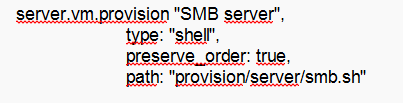{#fig:040 width=70%}

{#fig:041 width=70%}

# Ответы на контрольные вопросы

**1. Какова минимальная конфигурация для smb.conf для создания общего ресурса, который предоставляет доступ к каталогу /data?**
```
[datashare]
path = /data
browseable = yes
read only = no
guest ok = yes
```
**2. Как настроить общий ресурс, который даёт доступ на запись всем пользователям, имеющим права на запись в файловой системе Linux?**
```
[shared]
path = /path/to/share
browseable = yes
read only = no
guest ok = no
writeable = yes
```

Доступ на запись будут иметь пользователи, имеющие соответствующие права в файловой системе Linux.

**3. Как ограничить доступ на запись к ресурсу только членам определённой группы?**
```
[restricted]
path = /path/to/share
browseable = yes
read only = yes
write list = @groupname
valid users = @groupname
```
**4. Какой переключатель SELinux нужно использовать, чтобы позволить пользователям получать доступ к домашним каталогам на сервере через SMB?**
```
setsebool -P samba_enable_home_dirs on
```
**5. Как ограничить доступ к определённому ресурсу только узлам из сети 192.168.10.0/24?**
```
[secured]
path = /path/to/share
browseable = yes
read only = no
hosts allow = 192.168.10.0/24
hosts deny = 0.0.0.0/0
```
**6. Какую команду можно использовать, чтобы отобразить список всех пользователей Samba на сервере?**
```
pdbedit -L
```
**7. Что нужно сделать пользователю для доступа к ресурсу, который настроен как многопользовательский ресурс?**

Пользователь должен быть добавлен в базу Samba и иметь соответствующие права доступа к файловой системе:

```
smbpasswd -a username
```
**8. Как установить общий ресурс Samba в качестве многопользовательской учётной записи, где пользователь alice используется как минимальная учётная запись пользователя?**
```
[multiuser]
path = /path/to/share
browseable = yes
read only = no
guest ok = no
force user = alice
```
**9. Как можно запретить пользователям просматривать учётные данные монтирования Samba в файле /etc/fstab?**

Использовать файл с учетными данными с правами 600:

```
chmod 600 /etc/samba/credentials
```

**10. Какая команда позволяет перечислить все экспортируемые ресурсы Samba, доступные на определённом сервере?**

smbclient -L servername -U username

# Выводы

В ходе выполнения лабораторной работы мы приобрели навыки настройки доступа групп пользователей к общим ресурсам
по протоколу SMB.
