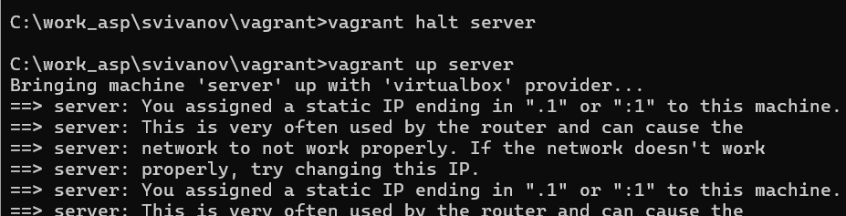
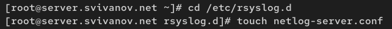
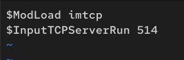
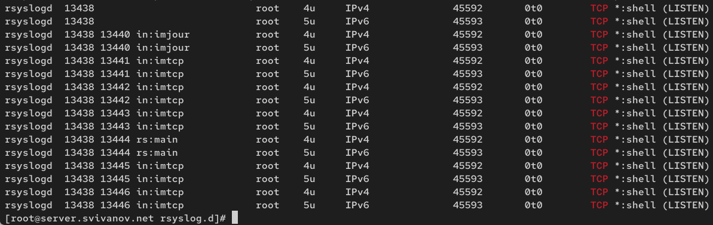
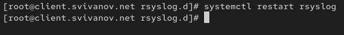
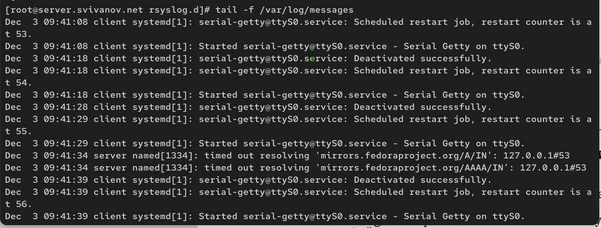
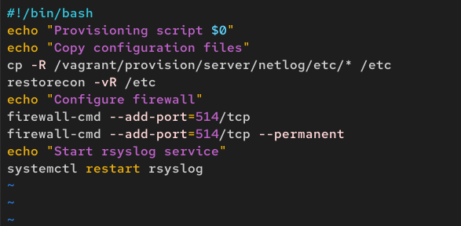

---
## Front matter
lang: ru-RU
title: Лабораторная работа №15
subtitle: Администрирование сетевых подсистем
author:
  - Иванов Сергей Владимирович, НПИбд-01-23
institute:
  - Российский университет дружбы народов, Москва, Россия
date: 03 декабря 2025

## i18n babel
babel-lang: russian
babel-otherlangs: english

## Formatting pdf
toc: false
slide_level: 2
aspectratio: 169
section-titles: true
theme: metropolis
header-includes:
 - \metroset{progressbar=frametitle,sectionpage=progressbar,numbering=fraction}
 - '\makeatletter'
 - '\beamer@ignorenonframefalse'
 - '\makeatother'

 ## Fonts
mainfont: PT Serif
romanfont: PT Serif
sansfont: PT Sans
monofont: PT Mono
mainfontoptions: Ligatures=TeX
romanfontoptions: Ligatures=TeX
sansfontoptions: Ligatures=TeX,Scale=MatchLowercase
monofontoptions: Scale=MatchLowercase,Scale=0.9
---

# Цель работы

Получение навыков по работе с журналами системных событий.

# Задание

1. Настройте сервер сетевого журналирования событий
2. Настройте клиент для передачи системных сообщений в сетевой журнал на сервере
3. Просмотрите журналы системных событий с помощью нескольких программ. При наличии сообщений о некорректной работе сервисов исправьте
ошибки в настройках соответствующих служб.
4. Напишите скрипты для Vagrant, фиксирующие действия по установке и настройке
сетевого сервера журналирования

# Выполнение лабораторной работы

## Настройка сервера сетевого журнала

Запускаю виртуальную машину Server. (рис. 1)

{#fig:001 width=70%}

## Настройка сервера сетевого журнала

На сервере создадим файл конфигурации сетевого хранения журналов:

{#fig:002 width=70%}

## Настройка сервера сетевого журнала

В файле конфигурации включим приём записей журнала по TCP-порту 514:

{#fig:003 width=70%}

## Настройка сервера сетевого журнала

Перезапустим службу rsyslog и посмотрим, какие порты, связанные с rsyslog,
прослушиваются:

{#fig:004 width=70%}

## Настройка сервера сетевого журнала

{#fig:005 width=70%}

## Настройка клиента сетевого журнала

Запускаю виртуальную машину Client. (рис. 6)

{#fig:006 width=70%}

## Настройка клиента сетевого журнала

{#fig:007 width=70%}

## Настройка клиента сетевого журнала

На клиенте в файле конфигурации включим
перенаправление сообщений на 514 сервера:

{#fig:008 width=70%}

## Настройка клиента сетевого журнала

{#fig:009 width=70%}

## Просмотр журнала

На сервере просмотрим один из файлов журнала

{#fig:010 width=70%}

## Просмотр журнала

На сервере под запустим
графическую программу для просмотра журналов 

{#fig:011 width=70%}

## Просмотр журнала

На сервере установим просмотрщик журналов системных сообщений lnav: 

{#fig:012 width=70%}

## Просмотр журнала

Просмотр логов с помощью lnav на сервере:

{#fig:013 width=70%}

## Просмотр журнала

На клиенте установим просмотрщик журналов системных сообщений lnav: 

{#fig:014 width=70%}

## Просмотр журнала

Просмотр логов с помощью lnav на клиенте: (рис. 15)

{#fig:015 width=70%}

## Внесение изменений в настройки внутреннего окружения виртуальных машин

На машине server перейдем в каталог для внесения изменений, в который поместим конфигурационные файлы:

{#fig:016 width=70%}

## Внесение изменений в настройки внутреннего окружения виртуальных машин

Создадм скрипт

{#fig:017 width=70%}

## Внесение изменений в настройки внутреннего окружения виртуальных машин

На машине client перейдем в каталог для внесения изменений, в который поместим конфигурационные файлы:

{#fig:018 width=70%}

## Внесение изменений в настройки внутреннего окружения виртуальных машин

Создадм скрипт

{#fig:019 width=70%}

## Внесение изменений в настройки внутреннего окружения виртуальных машин

{#fig:020 width=70%}

## Внесение изменений в настройки внутреннего окружения виртуальных машин

{#fig:021 width=70%}

## Вывод 

В ходе выполнения лабораторной работы мы получили навыки по работе с журналами системных событий.

 
