---
## Front matter
title: "Отчет по лабораторной работе №15"
subtitle: "Дисциплина: Администрирование сетевых подсистем"
author: "Иванов Сергей Владимирович"

## Generic otions
lang: ru-RU
toc-title: "Содержание"

## Bibliography
bibliography: bib/cite.bib
csl: pandoc/csl/gost-r-7-0-5-2008-numeric.csl

## Pdf output format
toc: true # Table of contents
toc-depth: 2
lof: true # List of figures
fontsize: 12pt
linestretch: 1.5
papersize: a4
documentclass: scrreprt
## I18n polyglossia
polyglossia-lang:
  name: russian
  options:
	- spelling=modern
	- babelshorthands=true
polyglossia-otherlangs:
  name: english
## I18n babel
babel-lang: russian
babel-otherlangs: english
## Fonts
mainfont: PT Serif
romanfont: PT Serif
sansfont: PT Sans
monofont: PT Mono
mainfontoptions: Ligatures=TeX
romanfontoptions: Ligatures=TeX
sansfontoptions: Ligatures=TeX,Scale=MatchLowercase
monofontoptions: Scale=MatchLowercase,Scale=0.9
## Biblatex
biblatex: true
biblio-style: "gost-numeric"
biblatexoptions:
  - parentracker=true
  - backend=biber
  - hyperref=auto
  - language=auto
  - autolang=other*
  - citestyle=gost-numeric
## Pandoc-crossref LaTeX customization
figureTitle: "Рис."
listingTitle: "Листинг"
lofTitle: "Список иллюстраций"
lolTitle: "Листинги"
## Misc options
indent: true
header-includes:
  - \usepackage{indentfirst}
  - \usepackage{float} # keep figures where there are in the text
  - \floatplacement{figure}{H} # keep figures where there are in the text
---

# Цель работы

Получение навыков по работе с журналами системных событий.

# Задание

1. Настройте сервер сетевого журналирования событий
2. Настройте клиент для передачи системных сообщений в сетевой журнал на сервере
3. Просмотрите журналы системных событий с помощью нескольких программ. При наличии сообщений о некорректной работе сервисов исправьте
ошибки в настройках соответствующих служб.
4. Напишите скрипты для Vagrant, фиксирующие действия по установке и настройке
сетевого сервера журналирования

# Выполнение лабораторной работы

## Настройка сервера сетевого журнала

Запускаю виртуальную машину Server. (рис. 1)

{#fig:001 width=70%}

На сервере создадим файл конфигурации сетевого хранения журналов:

cd /etc/rsyslog.d

touch netlog-server.conf (рис. 2)

{#fig:002 width=70%}

В файле конфигурации /etc/rsyslog.d/netlog-server.conf включим приём записей журнала по TCP-порту 514:

$ModLoad imtcp

$InputTCPServerRun 514 (рис. 3)

{#fig:003 width=70%}

Перезапустим службу rsyslog и посмотрим, какие порты, связанные с rsyslog,
прослушиваются:

systemctl restart rsyslog

lsof | grep TCP (рис. 4) 

{#fig:004 width=70%}

На сервере настроим межсетевой экран для приёма сообщений по TCP-порту 514:

firewall-cmd --add-port=514/tcp

firewall-cmd --add-port=514/tcp --permanent (рис. 5) 

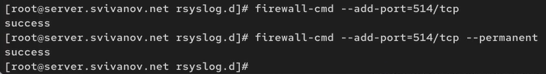{#fig:005 width=70%}

## Настройка клиента сетевого журнала

Запускаю виртуальную машину Client. (рис. 6)

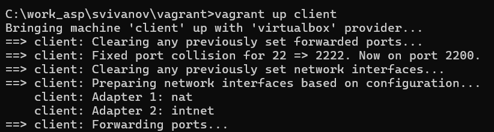{#fig:006 width=70%}

На клиенте создадим файл конфигурации сетевого хранения журналов:

cd /etc/rsyslog.d

touch netlog-client.conf (рис. 7)

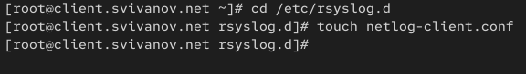{#fig:007 width=70%}

На клиенте в файле конфигурации /etc/rsyslog.d/netlog-client.conf включим
перенаправление сообщений журнала на 514 TCP-порт сервера: *.* @@server.user.net:514 (рис. 8)

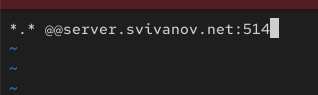{#fig:008 width=70%}

Перезапустим службу rsyslog: systemctl restart rsyslog (рис. 9)

{#fig:009 width=70%}

## Просмотр журнала

На сервере просмотрим один из файлов журнала: tail -f /var/log/messages (рис. 10)

{#fig:010 width=70%}

На сервере под пользователем user запустим
графическую программу для просмотра журналов: gnome-system-monitor (рис. 11)

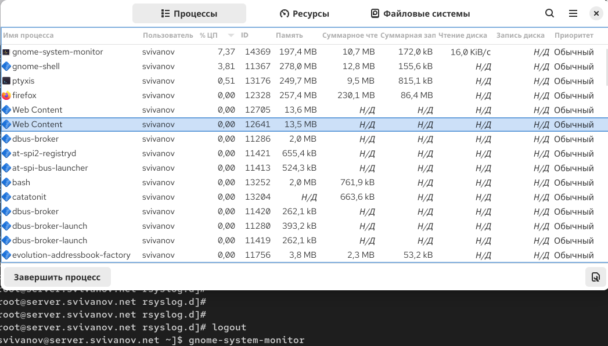{#fig:011 width=70%}

На сервере установим просмотрщик журналов системных сообщений lnav: dnf -y install lnav (рис. 12)

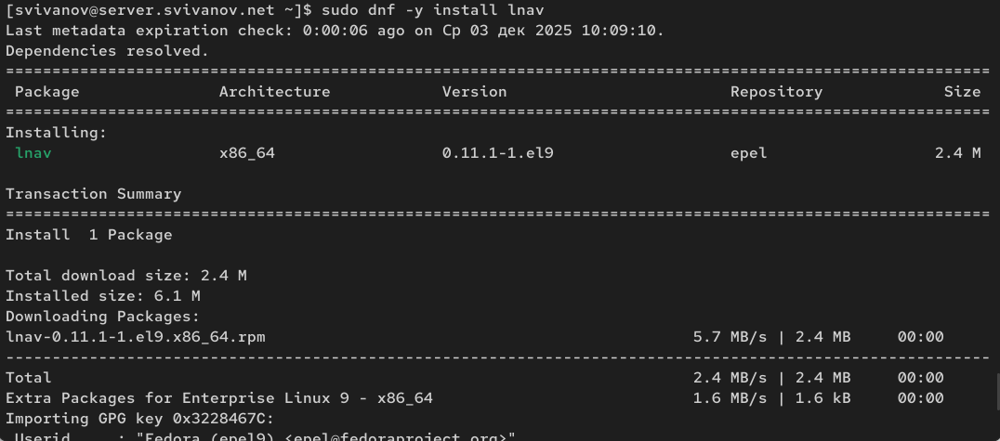{#fig:012 width=70%}

Просмотр логов с помощью lnav на сервере: (рис. 13)

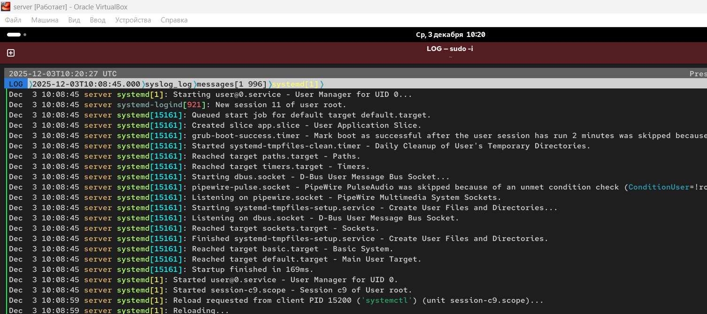{#fig:013 width=70%}
 
На клиенте установим просмотрщик журналов системных сообщений lnav: dnf -y install lnav (рис. 14)

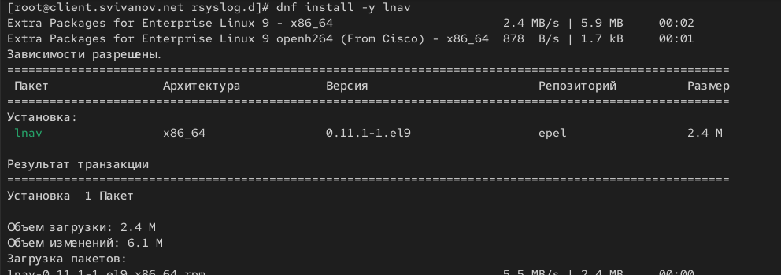{#fig:014 width=70%}

Просмотр логов с помощью lnav на клиенте: (рис. 15)

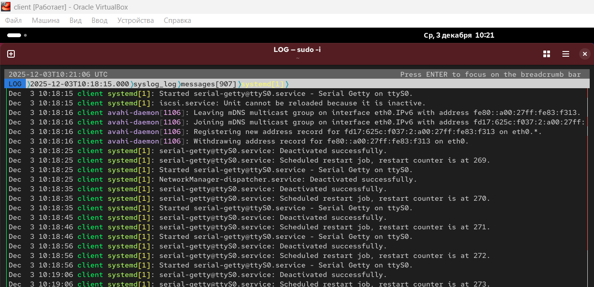{#fig:015 width=70%}

## Внесение изменений в настройки внутреннего окружения виртуальных машин

На виртуальной машине server перейдем в каталог для внесения изменений
в настройки внутреннего окружения /vagrant/provision/server/, создадим в нём
каталог netlog, в который поместим в соответствующие подкаталоги конфигурационные файлы: (рис. 16)

```
cd /vagrant/provision/server
mkdir -p /vagrant/provision/server/netlog/etc/rsyslog.d
cp -R /etc/rsyslog.d/netlog-server.conf
-> /vagrant/provision/server/netlog/etc/rsyslog.d
```

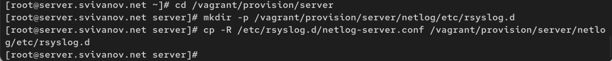{#fig:016 width=70%}

В каталоге /vagrant/provision/server создайте исполняемый файл netlog.sh: (рис. 17)

```
cd /vagrant/provision/server
touch netlog.sh
chmod +x netlog.sh
```

Открыв его на редактирование, пропишем в нём следующий скрипт:

{#fig:017 width=70%}

На виртуальной машине client перейдем в каталог для внесения изменений
в настройки внутреннего окружения /vagrant/provision/client/, создадим в нём
каталог nentlog, в который поместим в соответствующие подкаталоги конфигурационные файлы: (рис. 18)

```
cd /vagrant/provision/client
mkdir -p /vagrant/provision/client/netlog/etc/rsyslog.d
cp -R /etc/rsyslog.d/netlog-client.conf
-> /vagrant/provision/client/netlog/etc/rsyslog.d/ 
```

{#fig:018 width=70%}

В каталоге /vagrant/provision/client создадим исполняемый файл netlog.sh:

```
cd /vagrant/provision/client
touch netlog.sh
chmod +x netlog.sh
```

Открыв его на редактирование, пропишем в нём следующий скрипт: (рис. 19)

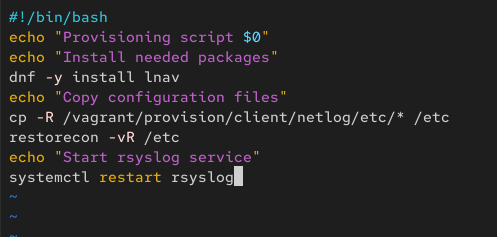{#fig:019 width=70%}

Для отработки созданных скриптов во время загрузки виртуальных машин server
и client в конфигурационном файле Vagrantfile необходимо добавить в соответствующих разделах конфигураций для сервера и клиента: (рис. 20, 21)

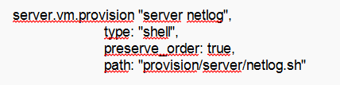{#fig:020 width=70%}

{#fig:021 width=70%}

# Ответы на контрольные вопросы

**1. Какой модуль rsyslog вы должны использовать для приёма сообщений от journald?**

Для приёма сообщений от journald в rsyslog используется модуль imjournal.

**2. Как называется устаревший модуль, который можно использовать для включения приёма сообщений журнала в rsyslog?**

Устаревший модуль для приёма сообщений журнала — imuxsock (хотя он всё ещё используется для приёма сообщений через сокет, но для интеграции с journald лучше использовать imjournal).

**3. Чтобы убедиться, что устаревший метод приёма сообщений из journald в rsyslog не используется, какой дополнительный параметр следует использовать?**

Чтобы отключить устаревший метод, в файле конфигурации rsyslog следует добавить параметр:

```
$OmitLocalLogging off
```

Или явно отключить imuxsock, если он не требуется.

**4. В каком конфигурационном файле содержатся настройки, которые позволяют вам настраивать работу журнала?**

Основной конфигурационный файл rsyslog — /etc/rsyslog.conf, а также дополнительные файлы в директории /etc/rsyslog.d/.

**5. Каким параметром управляется пересылка сообщений из journald в rsyslog?**

Пересылка сообщений из journald в rsyslog управляется параметром ForwardToSyslog= в файле /etc/systemd/journald.conf.

**6. Какой модуль rsyslog вы можете использовать для включения сообщений из файла журнала, не созданного rsyslog?**

Для чтения сообщений из внешних файлов журнала используется модуль imfile.

**7. Какой модуль rsyslog вам нужно использовать для пересылки сообщений в базу данных MariaDB?**

Для пересылки сообщений в базу данных MariaDB используется модуль ommysql.

**8. Какие две строки вам нужно включить в rsyslog.conf, чтобы позволить текущему журнальному серверу получать сообщения через TCP?**

В файл rsyslog.conf или в файл в /etc/rsyslog.d/ нужно добавить:

```
$ModLoad imtcp
$InputTCPServerRun 514
```

**9. Как настроить локальный брандмауэр, чтобы разрешить приём сообщений журнала через порт TCP 514?**

Для настройки firewalld можно использовать команды:

```
firewall-cmd --add-port=514/tcp
firewall-cmd --add-port=514/tcp --permanent
```

# Выводы

В ходе выполнения лабораторной работы мы получили навыки по работе с журналами системных событий.
