---
## Front matter
lang: ru-RU
title: Лабораторная работа №16
subtitle: Администрирование сетевых подсистем
author:
  - Иванов Сергей Владимирович, НПИбд-01-23
institute:
  - Российский университет дружбы народов, Москва, Россия
date: 07 декабря 2025

## i18n babel
babel-lang: russian
babel-otherlangs: english

## Formatting pdf
toc: false
slide_level: 2
aspectratio: 169
section-titles: true
theme: metropolis
header-includes:
 - \metroset{progressbar=frametitle,sectionpage=progressbar,numbering=fraction}
 - '\makeatletter'
 - '\beamer@ignorenonframefalse'
 - '\makeatother'

 ## Fonts
mainfont: PT Serif
romanfont: PT Serif
sansfont: PT Sans
monofont: PT Mono
mainfontoptions: Ligatures=TeX
romanfontoptions: Ligatures=TeX
sansfontoptions: Ligatures=TeX,Scale=MatchLowercase
monofontoptions: Scale=MatchLowercase,Scale=0.9
---

# Цель работы

Получить навыки работы с программным средством Fail2ban для обеспечения базовой защиты от атак типа «brute force».

# Задание

1. Установите и настройте Fail2ban для отслеживания работы установленных на сервере служб 
2. Проверьте работу Fail2ban посредством попыток несанкционированного доступа
с клиента на сервер через SSH
3. Напишите скрипт для Vagrant, фиксирующий действия по установке и настройке
Fail2ban

# Выполнение лабораторной работы

## Защита с помощью Fail2ban

{#fig:001 width=70%}

## Защита с помощью Fail2ban

На сервере установим fail2ban

{#fig:002 width=70%}

## Защита с помощью Fail2ban

Запустим сервер fail2ban:

{#fig:003 width=70%}

## Защита с помощью Fail2ban

В дополнительном терминале запустим просмотр журнала событий fail2ban:

{#fig:004 width=70%}

## Защита с помощью Fail2ban

Создадим файл с конфигурацией. Зададим время блокирования на 1 час и  включим защиту SSH:

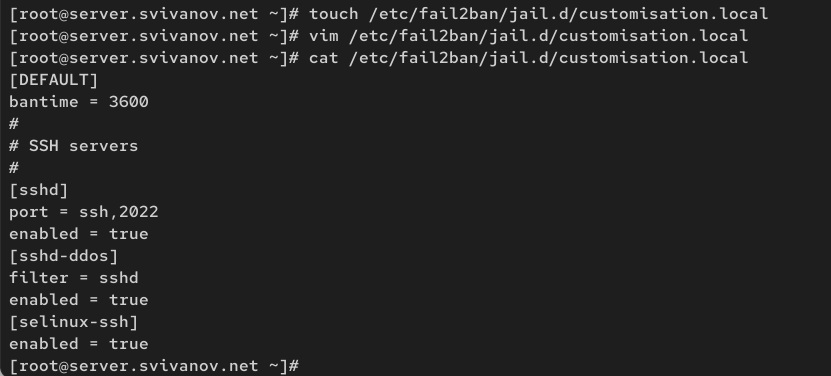{#fig:005 width=70%}

## Защита с помощью Fail2ban

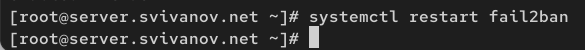{#fig:006 width=70%}

## Защита с помощью Fail2ban

Посмотрим журнал событий:

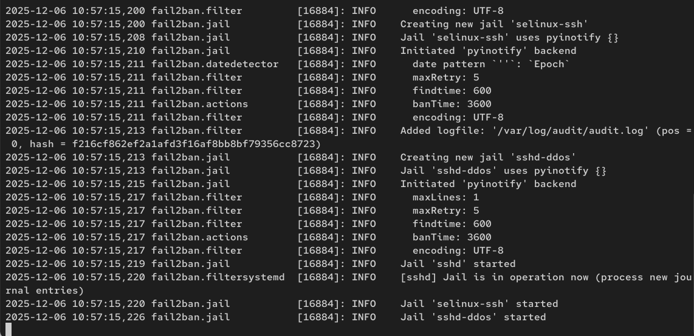{#fig:007 width=70%}

## Защита с помощью Fail2ban

Включим защиту HTTP

{#fig:008 width=70%}

## Защита с помощью Fail2ban

{#fig:009 width=70%}

## Защита с помощью Fail2ban

Включим защиту почты

{#fig:010 width=70%}

## Защита с помощью Fail2ban

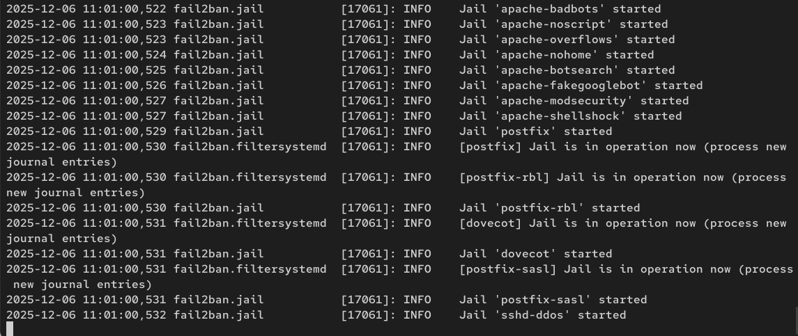{#fig:011 width=70%}

## Проверка работы Fail2ban

На сервере посмотрим статус fail2ban

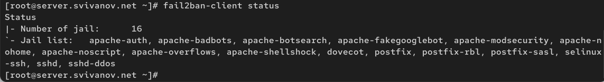{#fig:012 width=70%}

## Проверка работы Fail2ban

Посмотрим статус защиты SSH в fail2ban

{#fig:013 width=70%}
 
## Проверка работы Fail2ban

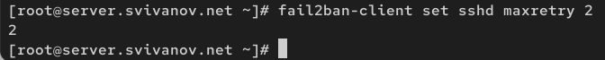{#fig:014 width=70%}

## Проверка работы Fail2ban

Запускаю виртуальную машину Client

{#fig:015 width=70%}

## Проверка работы Fail2ban

С клиента попытаемся зайти по SSH на сервер с неправильным паролем. 

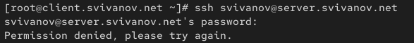{#fig:016 width=70%}

## Проверка работы Fail2ban

На сервере посмотрим статус защиты SSH

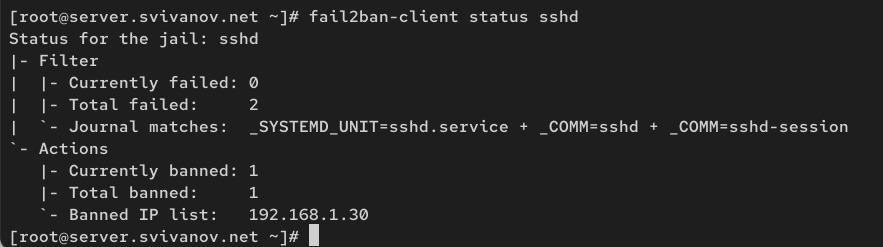{#fig:017 width=70%}

## Проверка работы Fail2ban

Разблокируем IP-адрес клиента:

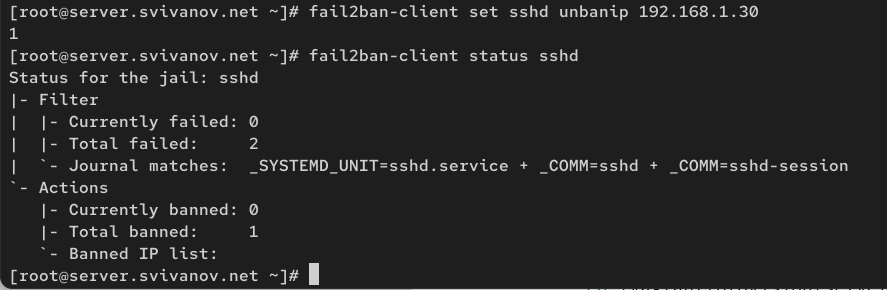{#fig:018 width=70%}

## Проверка работы Fail2ban

Внесем изменение в конфигурационный файл, добавив
игнорирование адреса клиента

{#fig:019 width=70%}

## Проверка работы Fail2ban

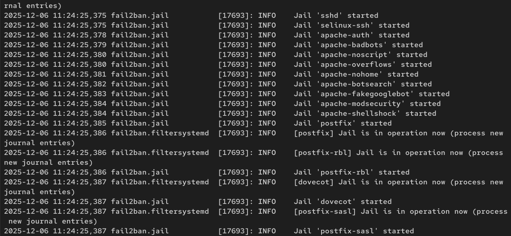{#fig:020 width=70%}

## Проверка работы Fail2ban

{#fig:021 width=70%}

## Проверка работы Fail2ban

{#fig:022 width=70%}

## Внесение изменений в настройки внутреннего окружения виртуальных машин

{#fig:023 width=70%}

## Внесение изменений в настройки внутреннего окружения виртуальных машин

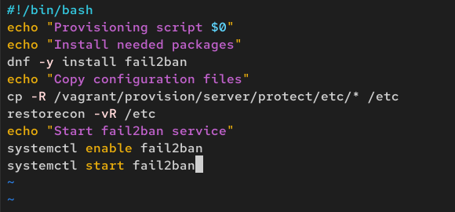{#fig:024 width=70%}

## Внесение изменений в настройки внутреннего окружения виртуальных машин

Для отработки скрипта во время загрузки машины server
в файле Vagrantfile необходимо добавить:

{#fig:025 width=70%}

## Вывод 

В ходе выполнения лабораторной работы мы получили навыки работы с программным средством Fail2ban для обеспечения базовой защиты от атак типа «brute force».

 
