---
## Front matter
title: "Отчет по лабораторной работе №16"
subtitle: "Дисциплина: Администрирование сетевых подсистем"
author: "Иванов Сергей Владимирович"

## Generic otions
lang: ru-RU
toc-title: "Содержание"

## Bibliography
bibliography: bib/cite.bib
csl: pandoc/csl/gost-r-7-0-5-2008-numeric.csl

## Pdf output format
toc: true # Table of contents
toc-depth: 2
lof: true # List of figures
fontsize: 12pt
linestretch: 1.5
papersize: a4
documentclass: scrreprt
## I18n polyglossia
polyglossia-lang:
  name: russian
  options:
	- spelling=modern
	- babelshorthands=true
polyglossia-otherlangs:
  name: english
## I18n babel
babel-lang: russian
babel-otherlangs: english
## Fonts
mainfont: PT Serif
romanfont: PT Serif
sansfont: PT Sans
monofont: PT Mono
mainfontoptions: Ligatures=TeX
romanfontoptions: Ligatures=TeX
sansfontoptions: Ligatures=TeX,Scale=MatchLowercase
monofontoptions: Scale=MatchLowercase,Scale=0.9
## Biblatex
biblatex: true
biblio-style: "gost-numeric"
biblatexoptions:
  - parentracker=true
  - backend=biber
  - hyperref=auto
  - language=auto
  - autolang=other*
  - citestyle=gost-numeric
## Pandoc-crossref LaTeX customization
figureTitle: "Рис."
listingTitle: "Листинг"
lofTitle: "Список иллюстраций"
lolTitle: "Листинги"
## Misc options
indent: true
header-includes:
  - \usepackage{indentfirst}
  - \usepackage{float} # keep figures where there are in the text
  - \floatplacement{figure}{H} # keep figures where there are in the text
---

# Цель работы

Получить навыки работы с программным средством Fail2ban для обеспечения базовой защиты от атак типа «brute force».

# Задание

1. Установите и настройте Fail2ban для отслеживания работы установленных на сервере служб (см. раздел 16.4.1).
2. Проверьте работу Fail2ban посредством попыток несанкционированного доступа
с клиента на сервер через SSH (см. раздел 16.4.2).
3. Напишите скрипт для Vagrant, фиксирующий действия по установке и настройке
Fail2ban (см. раздел 16.4.3).

# Выполнение лабораторной работы

## Защита с помощью Fail2ban

Запускаю виртуальную машину Server. (рис. 1)

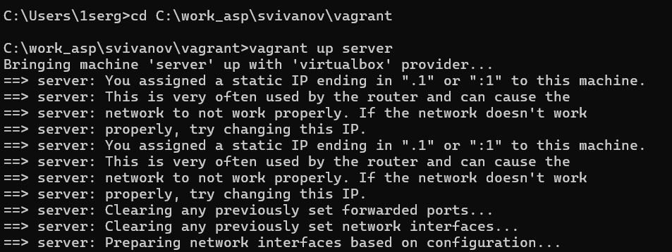{#fig:001 width=70%}

На сервере установим fail2ban:
dnf -y install fail2ban (рис. 2)

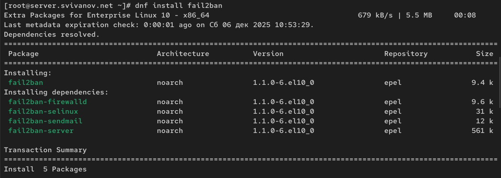{#fig:002 width=70%}

Запустим сервер fail2ban:

systemctl start fail2ban

systemctl enable fail2ban (рис. 3)

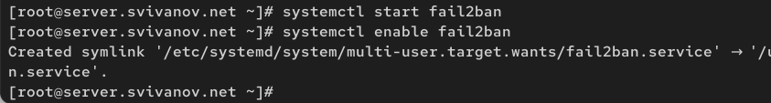{#fig:003 width=70%}

В дополнительном терминале запустим просмотр журнала событий fail2ban:
tail -f /var/log/fail2ban.log (рис. 4) 

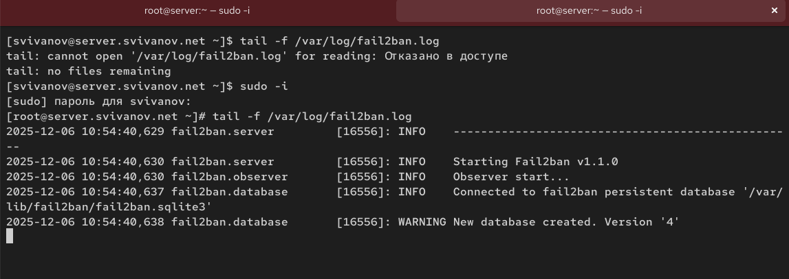{#fig:004 width=70%}

Создадим файл с локальной конфигурацией fail2ban:

touch /etc/fail2ban/jail.d/customisation.local

В файле /etc/fail2ban/jail.d/customisation.local:

(a) зададим время блокирования на 1 час (время задаётся в секундах):  (рис. 5)

```
[DEFAULT]
bantime = 3600
(b) включите защиту SSH:
#
# SSH servers
#
[sshd]
port = ssh,2022
enabled = true
[sshd-ddos]
filter = sshd
enabled = true
[selinux-ssh]
enabled = true
``` 

{#fig:005 width=70%}

Перезапустим fail2ban: systemctl restart fail2ban. (рис. 6)

{#fig:006 width=70%}

Посмотрим журнал событий: tail -f /var/log/fail2ban.log (рис. 7)

{#fig:007 width=70%}

В файле /etc/fail2ban/jail.d/customisation.local включим защиту HTTP: (рис. 8)

```
#
# HTTP servers
#
[apache-auth]
enabled = true
[apache-badbots]
enabled = true
[apache-noscript]
enabled = true
[apache-overflows]
enabled = true
[apache-nohome]
enabled = true
[apache-botsearch]
enabled = true
[apache-fakegooglebot]
enabled = true
[apache-modsecurity]
enabled = true
112 Лабораторная работа № 16
[apache-shellshock]
enabled = true
```

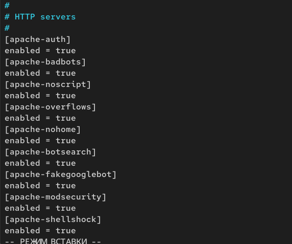{#fig:008 width=70%}

Перезапустим fail2ban: systemctl restart fail2ban. Посмотрим журнал событий:
tail -f /var/log/fail2ban.log (рис. 9)

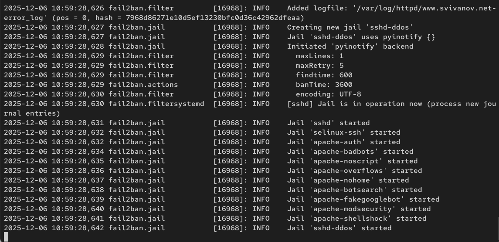{#fig:009 width=70%}

В файле /etc/fail2ban/jail.d/customisation.local включим защиту почты: (рис. 10)

```
#
# Mail servers
#
[postfix]
enabled = true
[postfix-rbl]
enabled = true
[dovecot]
enabled = true
[postfix-sasl]
enabled = true
```

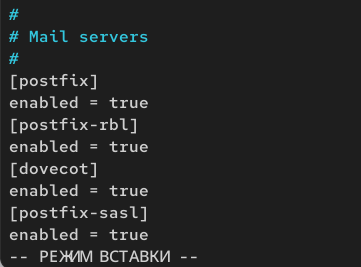{#fig:010 width=70%}

Перезапустим fail2ban: systemctl restart fail2ban. Посмотрим журнал событий:
tail -f /var/log/fail2ban.log (рис. 11)

{#fig:011 width=70%}

## Проверка работы Fail2ban

На сервере посмотрим статус fail2ban:
fail2ban-client status (рис. 12)

{#fig:012 width=70%}

Посмотрим статус защиты SSH в fail2ban: fail2ban-client status sshd (рис. 13)

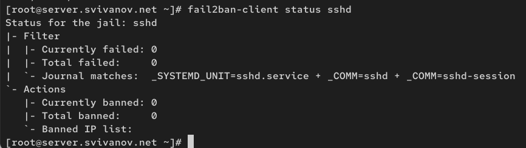{#fig:013 width=70%}
 
Установим максимальное количество ошибок для SSH, равное 2: fail2ban-client set sshd maxretry 2 (рис. 14)

{#fig:014 width=70%}

Запускаю виртуальную машину Client. (рис. 15)

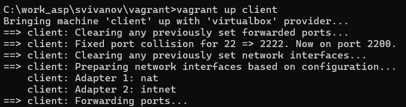{#fig:015 width=70%}

С клиента попытаемся зайти по SSH на сервер с неправильным паролем. (рис. 16)

{#fig:016 width=70%}

На сервере посмотрим статус защиты SSH: fail2ban-client status sshd. Убеждаюсь, что произошла блокировка адреса клиента. (рис. 17)

{#fig:017 width=70%}

Разблокируем IP-адрес клиента: fail2ban-client set sshd unbanip <ip-адрес клиента>. Вновь посмотрим статус защиты SSH:
fail2ban-client status sshd (рис. 18)

{#fig:018 width=70%}

На сервере внесем изменение в конфигурационный файл
/etc/fail2ban/jail.d/customisation.local, добавив в раздел по умолчанию
игнорирование адреса клиента: (рис. 19)

{#fig:019 width=70%}

Перезапустим fail2ban. Посмотрим журнал событий: tail -f /var/log/fail2ban.log (рис. 20)

{#fig:020 width=70%}

Вновь попытаемся войти с клиента на сервер с неправильным паролем и посмотрим статус защиты SSH. Видим, что клиент игнорируется, как и предполагалось. (рис. 21, 22)

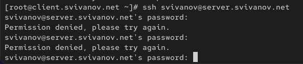{#fig:021 width=70%}

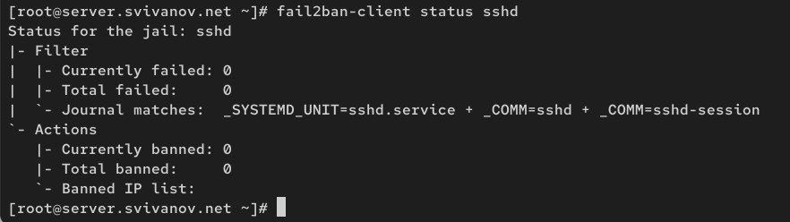{#fig:022 width=70%}

## Внесение изменений в настройки внутреннего окружения виртуальных машин

На виртуальной машине server перейдем в каталог для внесения изменений
в настройки внутреннего окружения /vagrant/provision/server/, создадим в нём
каталог protect, в который поместим соответствующие подкаталоги конфигурационные файлы: (рис. 23)

```
cd /vagrant/provision/server
mkdir -p /vagrant/provision/server/protect/etc/fail2ban/jail.d
cp -R /etc/fail2ban/jail.d/customisation.local
-> /vagrant/provision/server/protect/etc/fail2ban/jail.d/
```

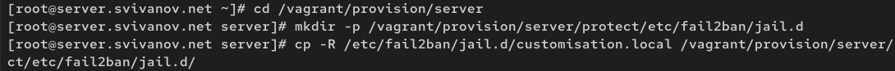{#fig:023 width=70%}

В каталоге /vagrant/provision/server создадим исполняемый файл protect.sh:

```
cd /vagrant/provision/server
touch protect.sh
chmod +x protect.sh
```

Открыв его на редактирование, пропишем в нём следующий скрипт: (рис. 24)

{#fig:024 width=70%}

Для отработки созданного скрипта во время загрузки виртуальной машины server
в конфигурационном файле Vagrantfile необходимо добавить в соответствующем
разделе конфигураций для сервера: (рис. 25)

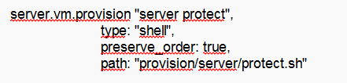{#fig:025 width=70%}

# Ответы на контрольные вопросы

**1. Поясните принцип работы Fail2ban.**

Fail2ban - это система предотвращения атак типа «brute force» путем мониторинга лог-файлов служб (например, SSH, Apache, Postfix). При обнаружении подозрительной активности (например, множественных неудачных попыток входа) система добавляет IP-адрес нарушителя в черный список и блокирует его с помощью правил межсетевого экрана (например, iptables). После истечения заданного времени блокировки адрес автоматически разблокируется.

**2. Настройки какого файла более приоритетны: jail.conf или jail.local?**

Настройки в файле jail.local имеют более высокий приоритет, чем в jail.conf. Это позволяет изменять конфигурацию без редактирования основного файла, что упрощает обновление системы и предотвращает потерю настроек при обновлении пакета Fail2ban.

**3. Как настроить оповещение администратора при срабатывании Fail2ban?**

Для отправки уведомлений администратору при срабатывании Fail2ban необходимо настроить параметры в секции `[DEFAULT]` файла конфигурации (например, /etc/fail2ban/jail.local):

```
[DEFAULT]
destemail = admin@example.com
sender = fail2ban@example.com
mta = sendmail
action = %(action_mwl)s
```

**4. Поясните построчно настройки по умолчанию в конфигурационном файле /etc/fail2ban/jail.conf, относящиеся к веб-службе.**

```
[apache-auth]
enabled  = false
port     = http,https
filter   = apache-auth
logpath  = /var/log/apache2/*error.log
maxretry = 3
```

**5. Поясните построчно настройки по умолчанию в конфигурационном файле /etc/fail2ban/jail.conf, относящиеся к почтовой службе.**

```
[postfix]
enabled  = false
port     = smtp,ssmtp
filter   = postfix
logpath  = /var/log/mail.log
maxretry = 3
```

**6. Какие действия может выполнять Fail2ban при обнаружении атакующего IP-адреса? Где можно посмотреть описание действий для последующего использования в настройках Fail2ban?**

Fail2ban может выполнять:

- Блокировка IP через iptables/nftables.
- Отправка email-уведомления.
- Выполнение пользовательского скрипта.
- Добавление IP в черный список DNSBL.

**7. Как получить список действующих правил Fail2ban?**

Выполнить команду:

fail2ban-client status

Для конкретной службы:

fail2ban-client status sshd

**8. Как получить статистику заблокированных Fail2ban адресов?**

Просмотреть статистику можно в журнале:

tail -f /var/log/fail2ban.log

Или с помощью команды:

fail2ban-client status <service>

**9. Как разблокировать IP-адрес?**

fail2ban-client set <service> unbanip <IP-адрес>

# Выводы

В ходе выполнения лабораторной работы мы получили навыки работы с программным средством Fail2ban для обеспечения базовой защиты от атак типа «brute force».
